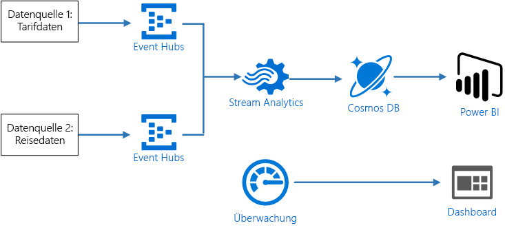
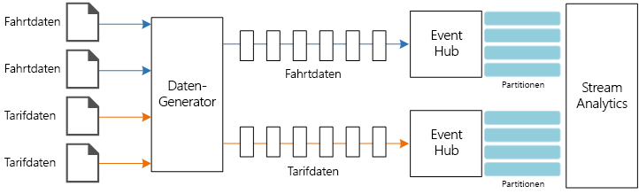
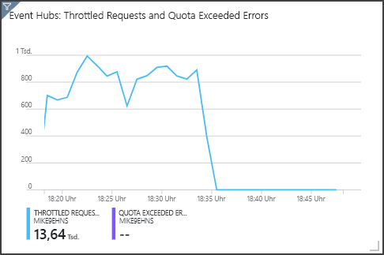

# <a name="stream-processing-with-azure-stream-analytics"></a>Datenstromverarbeitung mit Azure Stream Analytics

Diese Referenzarchitektur zeigt eine End-to-End-Pipeline zur Datenstromverarbeitung. Die Pipeline erfasst Daten aus zwei Quellen, korreliert Datensätze in den beiden Datenströmen und berechnet einen gleitenden Durchschnitt über ein Zeitfenster. Die Ergebnisse werden zur weiteren Analyse gespeichert. 

Eine Referenzimplementierung für diese Architektur ist auf [GitHub][github] verfügbar. 



**Szenario**: Ein Taxiunternehmen erfasst Daten zu jeder Taxifahrt. In diesem Szenario gehen wir davon aus, dass zwei separate Geräte Daten senden. Das Taxi verfügt ein Messgerät, das Informationen zu jeder Fahrt sendet – die Dauer, die Strecke sowie die Abhol- und Zielorte. Ein separates Gerät akzeptiert Zahlungen von Kunden und sendet Daten zu den Fahrpreisen. Das Taxiunternehmen möchte das durchschnittliche Trinkgeld pro gefahrener Meile in Echtzeit berechnen, um Trends zu erkennen.

## <a name="architecture"></a>Architecture

Die Architektur umfasst die folgenden Komponenten.

**Datenquellen:** In dieser Architektur gibt es zwei Datenquellen, die Datenströme in Echtzeit generieren. Der erste Datenstrom enthält Informationen zur Fahrt und der zweite Informationen zum Fahrpreis. Die Referenzarchitektur umfasst einen simulierten Datengenerator, der aus einem Satz von statischen Dateien liest und die Daten an Event Hubs pusht. In einer echten Anwendung würde es sich bei den Datenquellen um Geräte handeln, die in den Taxis installiert sind.

**Azure Event Hubs**: [Event Hubs](/azure/event-hubs/) ist ein Ereigniserfassungsdienst. Die hier gezeigte Architektur verwendet zwei Event Hub-Instanzen, eine für jede Datenquelle. Jede Datenquelle sendet einen Datenstrom an den zugehörigen Event Hub.

**Azure Stream Analytics**: [Stream Analytics](/azure/stream-analytics/) ist ein Ereignisverarbeitungsmodul. Ein Stream Analytics-Auftrag liest die Datenströme aus den beiden Event Hubs und führt die Datenstromverarbeitung durch.

**Cosmos DB**: Die Ausgabe des Stream Analytics-Auftrags ist eine Reihe von Datensätzen, die als JSON-Dokumente in eine Cosmos DB-Dokumentdatenbank geschrieben werden.

**Microsoft Power BI**: Power BI ist eine Suite aus Business Analytics-Tools zum Analysieren von Daten für Einblicke in Geschäftsvorgänge. In dieser Architektur lädt Power BI die Daten aus Cosmos DB. Dadurch können Benutzer den vollständigen Satz von historischen Daten, die gesammelt wurden, analysieren. Sie könnten die Ergebnisse auch direkt von Stream Analytics an Power BI streamen, um die Daten in Echtzeit anzuzeigen. Weitere Informationen finden Sie unter [Echtzeitstreaming in Power BI](/power-bi/service-real-time-streaming).

**Azure Monitor**: [Azure Monitor](/azure/monitoring-and-diagnostics/) erfasst Leistungsmetriken zu den in der Lösung bereitgestellten Azure-Diensten. Durch die Visualisierung dieser Metriken in einem Dashboard können Sie Erkenntnisse über die Integrität der Lösung gewinnen. 

## <a name="data-ingestion"></a>Datenerfassung

Um eine Datenquelle zu simulieren, verwendet die Referenzarchitektur das Dataset [New York City Taxi Data](https://uofi.app.box.com/v/NYCtaxidata/folder/2332218797)<sup>[[1]](#note1)</sup>. Dieses Dataset enthält Daten zu Taxifahrten in New York City für einen Zeitraum von vier Jahren (2010 &ndash; 2013). Es umfasst zwei Datensatztypen: Fahrtdaten und Fahrpreisdaten. Die Fahrtdaten enthalten die Fahrtdauer, die Fahrtstrecke sowie die Abhol- und Zielorte. Die Fahrpreisdaten enthalten die Beträge von Fahrpreis, Steuern und Trinkgeld. Gemeinsame Felder in beiden Datensatztypen sind die Taxinummer (Medallion), die Taxilizenz (Hack license) und die Anbieter-ID (Vendor ID). Anhand dieser drei Felder werden ein Taxi und ein Fahrer eindeutig identifiziert. Die Daten werden im CSV-Format gespeichert. 

[1] <span id="note1">Donovan, Brian; Work, Dan (2016): New York City Taxi Trip Data (2010 – 2013). Universität Illinois in Urbana-Champaign. https://doi.org/10.13012/J8PN93H8

Der Datengenerator ist eine .NET Core-Anwendung, die Datensätze liest und an Azure Event Hubs sendet. Der Generator sendet Fahrtdaten im JSON-Format und Fahrpreisdaten im CSV-Format. 

Event Hubs verwendet [Partitionen](/azure/event-hubs/event-hubs-features#partitions) zum Segmentieren der Daten. Partitionen ermöglichen es einem Consumer, die einzelnen Partitionen gleichzeitig zu lesen. Wenn Sie Daten an Event Hubs senden, können Sie den Partitionsschlüssel explizit angeben. Andernfalls werden Datensätze nach einem Roundrobinverfahren Partitionen zugewiesen. 

In diesem speziellen Szenario sollen Fahrtdaten und Fahrpreisdaten für ein bestimmtes Taxi die gleiche Partitions-ID erhalten. Dadurch kann Stream Analytics beim Korrelieren der beiden Datenströme einen Grad an Parallelität anwenden. Ein Datensatz in der Partition *n* der Fahrtdaten entspricht einem Datensatz in der Partition *n* der Fahrpreisdaten.



Im Datengenerator enthält das gemeinsame Datenmodell für beide Datensatztypen eine `PartitionKey`-Eigenschaft, bei der es sich um die Verkettung von `Medallion`, `HackLicense` und `VendorId` handelt.

```csharp
public abstract class TaxiData
{
    public TaxiData()
    {
    }

    [JsonProperty]
    public long Medallion { get; set; }

    [JsonProperty]
    public long HackLicense { get; set; }

    [JsonProperty]
    public string VendorId { get; set; }

    [JsonProperty]
    public DateTimeOffset PickupTime { get; set; }

    [JsonIgnore]
    public string PartitionKey
    {
        get => $"{Medallion}_{HackLicense}_{VendorId}";
    }
```

Diese Eigenschaft wird verwendet, um beim Senden der Daten an Event Hubs einen expliziten Partitionsschlüssel bereitzustellen:

```csharp
using (var client = pool.GetObject())
{
    return client.Value.SendAsync(new EventData(Encoding.UTF8.GetBytes(
        t.GetData(dataFormat))), t.PartitionKey);
}
```

## <a name="stream-processing"></a>Datenstromverarbeitung

Der Auftrag zur Datenstromverarbeitung wird anhand einer SQL-Abfrage mit mehreren separaten Schritten definiert. In den ersten beiden Schritten werden lediglich Datensätze aus den zwei Eingabedatenströmen ausgewählt.

```sql
WITH
Step1 AS (
    SELECT PartitionId,
           TRY_CAST(Medallion AS nvarchar(max)) AS Medallion,
           TRY_CAST(HackLicense AS nvarchar(max)) AS HackLicense,
           VendorId,
           TRY_CAST(PickupTime AS datetime) AS PickupTime,
           TripDistanceInMiles
    FROM [TaxiRide] PARTITION BY PartitionId
),
Step2 AS (
    SELECT PartitionId,
           medallion AS Medallion,
           hack_license AS HackLicense,
           vendor_id AS VendorId,
           TRY_CAST(pickup_datetime AS datetime) AS PickupTime,
           tip_amount AS TipAmount
    FROM [TaxiFare] PARTITION BY PartitionId
),
```

Im nächsten Schritt werden die beiden Eingabedatenströme verknüpft, um übereinstimmende Datensätze aus jedem Datenstrom auszuwählen.

```sql
Step3 AS (
  SELECT
         tr.Medallion,
         tr.HackLicense,
         tr.VendorId,
         tr.PickupTime,
         tr.TripDistanceInMiles,
         tf.TipAmount
    FROM [Step1] tr
    PARTITION BY PartitionId
    JOIN [Step2] tf PARTITION BY PartitionId
      ON tr.Medallion = tf.Medallion
     AND tr.HackLicense = tf.HackLicense
     AND tr.VendorId = tf.VendorId
     AND tr.PickupTime = tf.PickupTime
     AND tr.PartitionId = tf.PartitionId
     AND DATEDIFF(minute, tr, tf) BETWEEN 0 AND 15
)
```

Diese Abfrage verknüpft Datensätze für eine Gruppe von Feldern, die übereinstimmende Datensätze eindeutig identifizieren („Medallion“, „HackLicense“, „VendorId“ und „PickupTime“). Die `JOIN`-Anweisung enthält auch die Partitions-ID. Wie bereits erwähnt, wird hierbei die Tatsache genutzt, dass übereinstimmende Datensätze in diesem Szenario immer die gleiche Partitions-ID aufweisen.

In Stream Analytics sind Verknüpfungen *temporal*, d. h. Datensätze werden innerhalb eines bestimmten Zeitfensters verknüpft. Andernfalls müsste der Auftrag möglicherweise unbegrenzt auf eine Übereinstimmung warten. Die Funktion [DATEDIFF](https://msdn.microsoft.com/azure/stream-analytics/reference/join-azure-stream-analytics) gibt an, wie weit zwei übereinstimmende Datensätze zeitlich auseinander liegen können, um als Übereinstimmung ermittelt zu werden. 

Im letzten Schritt des Auftrags wird das durchschnittliche Trinkgeld pro Meile gruppiert anhand eines springenden Fensters von fünf Minuten berechnet.

```sql
SELECT System.Timestamp AS WindowTime,
       SUM(tr.TipAmount) / SUM(tr.TripDistanceInMiles) AS AverageTipPerMile
  INTO [TaxiDrain]
  FROM [Step3] tr
  GROUP BY HoppingWindow(Duration(minute, 5), Hop(minute, 1))
```

Stream Analytics bietet mehrere [Windowing-Funktionen](/azure/stream-analytics/stream-analytics-window-functions). Ein springendes Fenster bewegt sich um einen festen Zeitraum vorwärts (in diesem Fall eine Minute pro Sprung). Auf diese Weise wird ein gleitender Durchschnitt für die letzten fünf Minuten berechnet.

In der hier gezeigten Architektur werden nur die Ergebnisse des Stream Analytics-Auftrags in Cosmos DB gespeichert. Für ein Big Data-Szenario sollten Sie auch die Verwendung von [Event Hubs Capture](/azure/event-hubs/event-hubs-capture-overview) zum Speichern der Rohereignisdaten in Azure Blob Storage in Erwägung ziehen. Das Speichern der Rohdaten bietet Ihnen die Möglichkeit, zu einem späteren Zeitpunkt Batchabfragen für Ihre historischen Daten auszuführen, um neue Erkenntnisse aus den Daten zu gewinnen.

## <a name="scalability-considerations"></a>Überlegungen zur Skalierbarkeit

### <a name="event-hubs"></a>Event Hubs

Die Durchsatzkapazität von Event Hubs wird in [Durchsatzeinheiten](/azure/event-hubs/event-hubs-features#throughput-units) gemessen. Sie können einen Event Hub automatisch skalieren, indem Sie die Funktion für [automatische Vergrößerung](/azure/event-hubs/event-hubs-auto-inflate) aktivieren. Dadurch werden die Durchsatzeinheiten basierend auf dem Datenverkehr automatisch bis zu einem konfigurierten Höchstwert hochskaliert. 

### <a name="stream-analytics"></a>Stream Analytics

Für Stream Analytics werden die Computingressourcen, die einem Auftrag zugeordnet sind, in Streamingeinheiten gemessen. Stream Analytics-Aufträge lassen sich am besten skalieren, wenn der Auftrag parallelisiert werden kann. Auf diese Weise kann Stream Analytics den Auftrag auf mehrere Computeknoten verteilen.

Verwenden Sie für die Event Hubs-Eingabe das Schlüsselwort `PARTITION BY`, um den Stream Analytics-Auftrag zu partitionieren. Die Daten werden basierend auf den Event Hubs-Partitionen in Teilmengen aufgeteilt. 

Windowing-Funktionen und temporale Verknüpfungen erfordern zusätzliche Streamingeinheiten (SU). Verwenden Sie nach Möglichkeit `PARTITION BY`, sodass jede Partition separat verarbeitet wird. Weitere Informationen finden Sie unter [Überblick über Streamingeinheiten und Informationen zu Anpassungen](/azure/stream-analytics/stream-analytics-streaming-unit-consumption#windowed-aggregates).

Falls es nicht möglich ist, den gesamten Stream Analytics-Auftrag zu parallelisieren, versuchen Sie, den Auftrag beginnend mit einem oder mehreren parallelen Schritten in mehrere Schritte zu unterteilen. So können die ersten Schritte parallel ausgeführt werden. Für die hier gezeigte Referenzarchitektur gilt beispielsweise Folgendes:

- Die Schritte 1 und 2 sind einfache `SELECT`-Anweisungen, die Datensätze in einer einzelnen Partition auswählen. 
- Schritt 3 führt eine partitionierte Verknüpfung für zwei Eingabedatenströme durch. Dieser Schritt macht sich die Tatsache zu Nutze, dass übereinstimmende Datensätze den gleichen Partitionsschlüssel aufweisen und daher immer in jedem Eingabedatenstrom die gleiche Partitions-ID haben.
- Schritt 4 aggregiert Daten über alle Partitionen hinweg. Dieser Schritt kann nicht parallelisiert werden.

Verwenden Sie das Stream Analytics-[Auftragsdiagramm](/azure/stream-analytics/stream-analytics-job-diagram-with-metrics), um festzustellen, wie viele Partitionen den einzelnen Schritten im Auftrag zugewiesen sind. Das folgende Diagramm zeigt das Auftragsdiagramm für diese Referenzarchitektur:


### <a name="cosmos-db"></a>Cosmos DB

Die Durchsatzkapazität für Cosmos DB wird in [Anforderungseinheiten](/azure/cosmos-db/request-units) (RU) gemessen. Um einen Cosmos DB-Container auf eine Kapazität über 10.000 RU zu skalieren, müssen Sie beim Erstellen des Containers einen [Partitionsschlüssel](/azure/cosmos-db/partition-data) angeben und den Partitionsschlüssel in jedem Dokument hinzufügen. 

In dieser Referenzarchitektur werden neue Dokumente nur einmal pro Minute (Intervall des springenden Fensters) erstellt, sodass die Durchsatzanforderungen relativ gering sind. In diesem Szenario ist es daher nicht erforderlich, einen Partitionsschlüssel zuzuweisen.

## <a name="monitoring-considerations"></a>Aspekte der Überwachung

Bei jeder Lösung zur Verarbeitung von Datenströmen ist es wichtig, die Leistung und Integrität des Systems zu überwachen. [Azure Monitor](/azure/monitoring-and-diagnostics/) erfasst Metriken und Diagnoseprotokolle für die in der Architektur verwendeten Azure-Dienste. Azure Monitor ist in die Azure-Plattform integriert und erfordert keinen zusätzlichen Code in Ihrer Anwendung.

Jedes der folgenden Warnsignale weist darauf hin, dass Sie die jeweilige Azure-Ressource horizontal hochskalieren sollten:

- Event Hubs drosselt Anforderungen oder nähert sich dem täglichen Nachrichtenkontingent.
- Der Stream Analytics-Auftrag nutzt regelmäßig mehr als 80 % der zugeordneten Streamingeinheiten (SU).
- Cosmos DB beginnt, Anforderungen zu drosseln.

Die Referenzarchitektur enthält ein im Azure-Portal bereitgestelltes benutzerdefiniertes Dashboard. Nachdem Sie die Architektur bereitgestellt haben, können Sie das Dashboard anzeigen, indem Sie das [Azure-Portal](https://portal.azure.com) öffnen und `TaxiRidesDashboard` in der Liste der Dashboards auswählen. Weitere Informationen zum Erstellen und Bereitstellen von benutzerdefinierten Dashboards im Azure-Portal finden Sie unter [Programmgesteuertes Erstellen von Azure-Dashboards](/azure/azure-portal/azure-portal-dashboards-create-programmatically).

Die folgende Abbildung zeigt das Dashboard, nachdem der Stream Analytics-Auftrag etwa eine Stunde lang ausgeführt wurde.


Im unteren linken Bereich können Sie sehen, dass der SU-Verbrauch für den Stream Analytics-Auftrag während der ersten 15 Minuten ansteigt und dann gleichbleibt. Dies ist ein typisches Muster, da der Auftrag einen stabilen Zustand erreicht. 

Beachten Sie, dass Event Hubs Anforderungen drosselt. Dies können Sie im oberen rechten Bereich sehen. Das gelegentliche Drosseln einer Anforderung stellt kein Problem dar, da das Event Hubs-Client-SDK den Vorgang automatisch wiederholt, wenn es einen Drosselungsfehler empfängt. Wenn jedoch regelmäßig Drosselungsfehler auftreten, bedeutet dies, dass der Event Hub mehr Durchsatzeinheiten benötigt. Das folgende Diagramm zeigt einen Testlauf mit der Event Hubs-Funktion zur automatischen Vergrößerung, die je nach Bedarf die Durchsatzeinheiten automatisch horizontal hochskaliert. 



Die automatische Vergrößerung wurde ungefähr bei 06:35 aktiviert. Wie Sie sehen, hat die Anzahl gedrosselter Anforderungen abgenommen, da Event Hubs automatisch auf drei Durchsatzeinheiten hochskaliert wurde.

Als Nebenwirkung erhöhte sich dadurch interessanterweise die SU-Nutzung im Stream Analytics-Auftrag. Durch die Drosselung hat Event Hubs die Erfassungsrate für den Stream Analytics-Auftrag künstlich reduziert. Tatsächlich kommt es häufig vor, dass durch die Behebung eines Leistungsengpasses ein anderer aufgedeckt wird. In diesem Fall konnte das Problem durch die Zuordnung zusätzlicher Streamingeinheiten für den Stream Analytics-Auftrag behoben werden.

## <a name="deploy-the-solution"></a>Bereitstellen der Lösung

Führen Sie zum Bereitstellen und Ausführen der Referenzimplementierung die Schritte in der [GitHub-Infodatei][github] aus. 


[github]: https://github.com/mspnp/reference-architectures/tree/master/data/streaming_asa