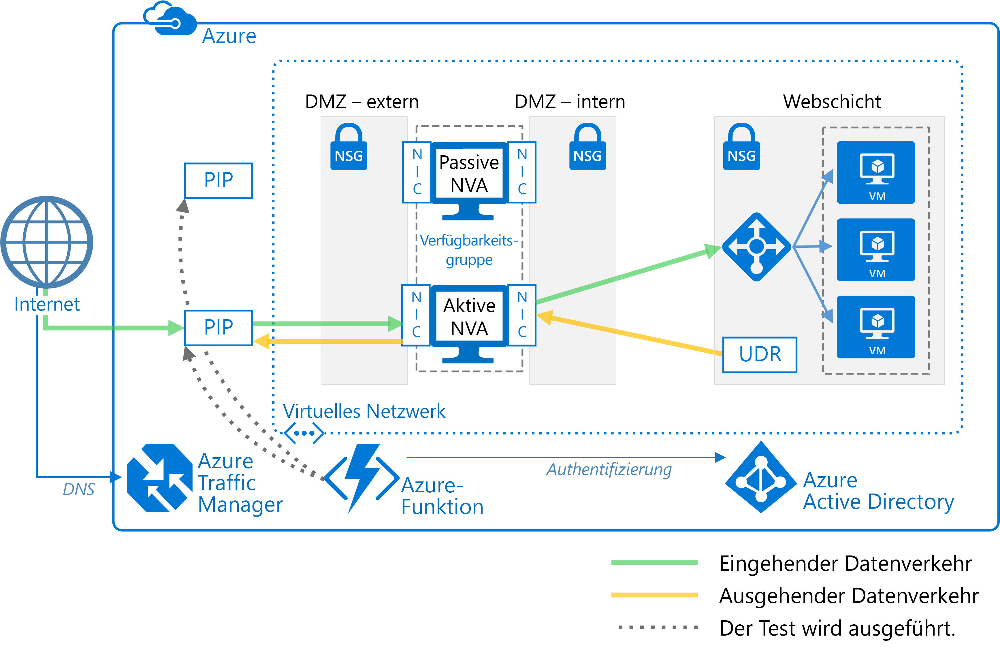

# Bereitstellen hochverfügbarer virtueller NetzwerkgeräteDeploy highly available network virtual appliances

In diesem Artikel erfahren Sie, wie eine Reihe virtueller Netzwerkgeräte (NVAs) für hohe Verfügbarkeit in Azure bereitgestellt wird.This article shows how to deploy a set of network virtual appliances (NVAs) for high availability in Azure. Ein NVA wird normalerweise verwendet, um den Netzwerkdatenverkehrsfluss von einem Umkreisnetzwerk (auch als DMZ bekannt) zu anderen Netzwerken oder Subnetzen zu steuern.An NVA is typically used to control the flow of network traffic from a perimeter network, also known as a DMZ, to other networks or subnets. Informationen zum Implementieren einer DMZ in Azure finden Sie unter [Microsoft-Clouddienste und Netzwerksicherheit][cloud-security].To learn about implementing a DMZ in Azure, see [Microsoft cloud services and network security][cloud-security]. Der Artikel enthält Beispielarchitekturen für nur eingehenden, nur ausgehenden sowie ein- und ausgehenden Datenverkehr.The article includes example architectures for ingress only, egress only, and both ingress and egress.

**Voraussetzungen:** In diesem Artikel werden grundlegende Kenntnisse über Azure-Netzwerke, [Azure-Lastenausgleichsmodule][lb-overview] und [benutzerdefinierte Routen][udr-overview] (User-Defined Routes, UDRs) vorausgesetzt.**Prerequisites:** This article assumes a basic understanding of Azure networking, [Azure load balancers][lb-overview], and [user-defined routes][udr-overview] (UDRs).

## ArchitekturdiagrammeArchitecture diagrams

Ein NVA kann in einer DMZ in vielen verschiedenen Architekturen bereitgestellt werden.An NVA can be deployed to a DMZ in many different architectures. Die folgende Abbildung veranschaulicht beispielsweise die Verwendung eines [einzelnen NVA][nva-scenario] für eingehenden Datenverkehr.For example, the following figure illustrates the use of a [single NVA][nva-scenario] for ingress.

![[0]][0]![[0]][0]

In dieser Architektur stellt das NVA eine sichere Netzwerkgrenze dar, indem der gesamte eingehende und ausgehende Netzwerkdatenverkehr überprüft und nur der Datenverkehr weitergeleitet wird, der die Netzwerksicherheitsregeln erfüllt.In this architecture, the NVA provides a secure network boundary by checking all inbound and outbound network traffic and passing only the traffic that meets network security rules. Aufgrund der Tatsache, dass der gesamte Netzwerkdatenverkehr über das NVA erfolgen muss, stellt das NVA eine einzelne Fehlerquelle (Single Point of Failure) im Netzwerk dar.However, the fact that all network traffic must pass through the NVA means that the NVA is a single point of failure in the network. Tritt beim NVA ein Fehler auf, steht kein anderer Pfad für den Netzwerkdatenverkehr bereit und keines der Back-End-Subnetze ist verfügbar.If the NVA fails, there is no other path for network traffic and all the back-end subnets are unavailable.

Um Hochverfügbarkeit für ein NVA zu gewährleisten, stellen Sie mehrere NCAs in einer Verfügbarkeitsgruppe bereit.To make an NVA highly available, deploy more than one NVA into an availability set.

In den folgenden Architekturen sind die für hochverfügbare NVAs erforderlichen Ressourcen und die Konfiguration angegeben:The following architectures describe the resources and configuration necessary for highly available NVAs:

| LösungSolution | VorteileBenefits | ÜberlegungenConsiderations |
| --- | --- | --- |
| [Eingehender Datenverkehr mit Layer-7-NVAs][ingress-with-layer-7][Ingress with layer 7 NVAs][ingress-with-layer-7] |Alle NVA-Knoten sind aktiv.All NVA nodes are active |Erfordert ein NVA, das Verbindungen beenden und SNAT verwenden kann.Requires an NVA that can terminate connections and use SNAT  Erfordert eine separate Gruppe von NVAs für den Datenverkehr aus dem Internet und von Azure.Requires a separate set of NVAs for traffic coming from the Internet and from Azure   Kann nur für Datenverkehr verwendet werden, dessen Ursprung außerhalb von Azure liegt.Can only be used for traffic originating outside Azure |
| [Ausgehender Datenverkehr mit Layer-7-NVAs][egress-with-layer-7][Egress with layer 7 NVAs][egress-with-layer-7] |Alle NVA-Knoten sind aktiv.All NVA nodes are active | Erfordert ein NVA, das Verbindungen beenden kann und die Übersetzung der Quellnetzwerkadresse (SNAT) implementiert.Requires an NVA that can terminate connections and implements source network address translation (SNAT)
| [Eingehender/ausgehender Datenverkehr mit Layer-7-NVAs][ingress-egress-with-layer-7][Ingress-Egress with layer 7 NVAs][ingress-egress-with-layer-7] |Alle Knoten sind aktiv.All nodes are active Kann den aus Azure stammenden Datenverkehr abwickeln.Able to handle traffic originated in Azure |Erfordert ein NVA, das Verbindungen beenden und SNAT verwenden kann.Requires an NVA that can terminate connections and use SNAT Erfordert eine separate Gruppe von NVAs für den Datenverkehr aus dem Internet und von Azure.Requires a separate set of NVAs for traffic coming from the Internet and from Azure |
| [PIP/UDR-Switch][pip-udr-switch][PIP-UDR switch][pip-udr-switch] |Einzelne Gruppe von NVAs für den gesamten Datenverkehr.Single set of NVAs for all traffic Kann den gesamten Datenverkehr abwickeln (keine Beschränkung für Portregeln).Can handle all traffic (no limit on port rules) |Aktiv/PassivActive-passive Erfordert einen Failoverprozess.Requires a failover process |
| [PIP/UDR ohne SNATPIP-UDR without SNAT](#pip-udr-nvas-without-snat) | Einzelne Gruppe von NVAs für den gesamten Datenverkehr.Single set of NVAs for all traffic Kann den gesamten Datenverkehr abwickeln (keine Beschränkung für Portregeln).Can handle all traffic (no limit on port rules) Erfordert keine SNAT-Konfiguration für eingehende Anforderungen.Does not require configuring SNAT for inbound requests |Aktiv/PassivActive-passive Erfordert einen Failoverprozess.Requires a failover process Sondierung und Failoverlogik werden außerhalb des virtuellen Netzwerks ausgeführt.Probing and failover logic run outside the virtual network |

## Eingehender Datenverkehr mit Layer-7-NVAsIngress with layer 7 NVAs

Die folgende Abbildung zeigt eine Hochverfügbarkeitsarchitektur, die eine DMZ für eingehenden Datenverkehr hinter einem Lastenausgleich mit Internetzugriff implementiert.The following figure shows a high availability architecture that implements an ingress DMZ behind an internet-facing load balancer. Diese Architektur bietet Konnektivität für Azure-Workloads für den Layer-7-Datenverkehr, z. B. HTTP oder HTTPS:This architecture is designed to provide connectivity to Azure workloads for layer 7 traffic, such as HTTP or HTTPS:

![[1]][1]![[1]][1]

Der Vorteil dieser Architektur ist, dass alle NVAs aktiv sind, und bei Ausfall eines NVA wird der Netzwerkdatenverkehr durch den Lastenausgleich an das andere NVA weitergeleitet.The benefit of this architecture is that all NVAs are active, and if one fails the load balancer directs network traffic to the other NVA. Beide NVAs leiten den Datenverkehr an den internen Lastenausgleich, sodass der Datenverkehr weiter fließt, solange ein NVA aktiv ist.Both NVAs route traffic to the internal load balancer so as long as one NVA is active, traffic continues to flow. Die NVAs sind erforderlich, um den für virtuelle Computer der Webebene vorgesehenen SSL-Datenverkehr zu beenden.The NVAs are required to terminate SSL traffic intended for the web tier VMs. Diese NVAs können nicht auf die Handhabung des lokalen Datenverkehrs ausgeweitet werden, da für den lokalen Datenverkehr eine andere dedizierte Gruppe von NVAs mit eigenen Netzwerkrouten erforderlich ist.These NVAs cannot be extended to handle on-premises traffic because on-premises traffic requires another dedicated set of NVAs with their own network routes.

> [!NOTE]
> Diese Architektur wird in der Referenzarchitektur für die [DMZ zwischen Azure und Ihrem lokalen Rechenzentrum][dmz-on-prem] und der Referenzarchitektur für die [DMZ zwischen Azure und dem Internet][dmz-internet] verwendet.This architecture is used in the [DMZ between Azure and your on-premises datacenter][dmz-on-prem] reference architecture and the [DMZ between Azure and the Internet][dmz-internet] reference architecture. Jede dieser Referenzarchitekturen umfasst eine Bereitstellungslösung, die Sie verwenden können.Each of these reference architectures includes a deployment solution that you can use. Weitere Informationen stehen über die Links bereit.Follow the links for more information.

## Ausgehender Datenverkehr mit Layer-7-NVAsEgress with layer 7 NVAs

Die vorherige Architektur kann so erweitert werden, dass sie eine ausgehende DMZ für Anforderungen umfasst, die aus der Azure-Workload stammen.The previous architecture can be expanded to provide an egress DMZ for requests originating in the Azure workload. Die folgende Architektur bietet Hochverfügbarkeit der NVAs in der DMZ für den Layer-7-Datenverkehr, z. B. HTTP oder HTTPS:The following architecture is designed to provide high availability of the NVAs in the DMZ for layer 7 traffic, such as HTTP or HTTPS:

![[2]][2]![[2]][2]

In dieser Architektur wird der gesamte aus Azure stammende Datenverkehr an einen internen Lastenausgleich weitergeleitet.In this architecture, all traffic originating in Azure is routed to an internal load balancer. Der Lastenausgleich verteilt ausgehende Anforderungen auf eine Gruppe von NVAs.The load balancer distributes outgoing requests between a set of NVAs. Diese NVAs leiten den Datenverkehr über ihre jeweiligen öffentlichen IP-Adressen an das Internet weiter.These NVAs direct traffic to the Internet using their individual public IP addresses.

> [!NOTE]
> Diese Architektur wird in der Referenzarchitektur für die [DMZ zwischen Azure und Ihrem lokalen Rechenzentrum][dmz-on-prem] und der Referenzarchitektur für die [DMZ zwischen Azure und dem Internet][dmz-internet] verwendet.This architecture is used in the [DMZ between Azure and your on-premises datacenter][dmz-on-prem] reference architecture and the [DMZ between Azure and the Internet][dmz-internet] reference architecture. Jede dieser Referenzarchitekturen umfasst eine Bereitstellungslösung, die Sie verwenden können.Each of these reference architectures includes a deployment solution that you can use. Weitere Informationen stehen über die Links bereit.Follow the links for more information.

## Eingehender/ausgehender Datenverkehr mit Layer-7-NVAsIngress-egress with layer 7 NVAs

Bei den beiden vorherigen Architekturen gab es eine separate DMZ für eingehenden und ausgehenden Datenverkehr.In the two previous architectures, there was a separate DMZ for ingress and egress. Die folgende Architektur veranschaulicht das Erstellen einer DMZ, die sowohl für eingehenden als auch ausgehenden Layer-7-Datenverkehr, z. B. HTTP oder HTTPS, verwendet werden kann:The following architecture demonstrates how to create a DMZ that can be used for both ingress and egress for layer 7 traffic, such as HTTP or HTTPS:

![[4]][4]

In dieser Architektur verarbeiten die NVAs eingehende Anforderungen vom Anwendungsgateway.In this architecture, the NVAs process incoming requests from the application gateway. Die NVAs verarbeiten auch ausgehende Anforderungen von den Workload-VMs im Back-End-Pool des Lastenausgleichs.The NVAs also process outgoing requests from the workload VMs in the back-end pool of the load balancer. Da eingehender Datenverkehr mit einem Anwendungsgateway und ausgehender Datenverkehr mit einem Lastenausgleich weitergeleitet wird, sind die NVAs für die Bewahrung der Sitzungsaffinität zuständig.Because incoming traffic is routed with an application gateway and outgoing traffic is routed with a load balancer, the NVAs are responsible for maintaining session affinity. Das heißt, dass das Anwendungsgateway eine Zuordnung von eingehenden und ausgehenden Anforderungen verwaltet, damit es die richtige Antwort an den ursprünglichen Anforderer weiterleiten kann.That is, the application gateway maintains a mapping of inbound and outbound requests so it can forward the correct response to the original requestor. Der interne Lastenausgleich hat jedoch keinen Zugriff auf die Zuordnungen des Anwendungsgateways und verwendet eine eigene Logik zum Senden von Antworten an die NVAs.However, the internal load balancer does not have access to the application gateway mappings, and uses its own logic to send responses to the NVAs. Es ist möglich, dass der Lastenausgleich eine Antwort an ein NVA sendet, das die Anforderung nicht ursprünglich vom Anwendungsgateway empfangen hat.It's possible the load balancer could send a response to an NVA that did not initially receive the request from the application gateway. In diesem Fall müssen die NVAs kommunizieren und die Antwort untereinander übertragen, damit das richtige NVA die Antwort an das Anwendungsgateway weiterleiten kann.In this case, the NVAs must communicate and transfer the response between them so the correct NVA can forward the response to the application gateway.

> [!NOTE]
> Sie können das Problem des asymmetrischen Routings auch beheben, indem Sie sicherstellen, dass die NVAs eine eingehende Übersetzung der Quellnetzwerkadresse (SNAT) ausführen.You can also solve the asymmetric routing issue by ensuring the NVAs perform inbound source network address translation (SNAT). Dadurch wird die ursprüngliche Quell-IP des Anforderers durch eine der IP-Adressen des NVA ersetzt, der für den eingehenden Datenfluss verwendet wird.This would replace the original source IP of the requestor to one of the IP addresses of the NVA used on the inbound flow. Auf diese Weise ist sichergestellt, dass Sie mehrere NVAs gleichzeitig verwenden und dabei die Routensymmetrie beibehalten können.This ensures that you can use multiple NVAs at a time, while preserving the route symmetry.

## PIP/UDR-Switch mit Layer-4-NVAsPIP-UDR switch with layer 4 NVAs

Die folgende Architektur weist ein aktives und ein passives NVA auf.The following architecture demonstrates an architecture with one active and one passive NVA. Diese Architektur verarbeitet sowohl eingehenden als auch ausgehenden Layer-4-Datenverkehr:This architecture handles both ingress and egress for layer 4 traffic:

![[3]][3]![[3]][3]

> [!TIP]
> Eine vollständige Lösung für diese Architektur ist auf [GitHub][pnp-ha-nva] verfügbar.A complete solution for this architecture is available on [GitHub][pnp-ha-nva].

Diese Architektur ähnelt der ersten in diesem Artikel erläuterten Architektur.This architecture is similar to the first architecture discussed in this article. Die erste Architektur enthielt ein einzelnes NVA zum Akzeptieren und Filtern eingehender Layer-4-Anforderungen.That architecture included a single NVA accepting and filtering incoming layer 4 requests. Bei dieser Architektur wird nun ein zweites passives NVA zur Bereitstellung von hoher Verfügbarkeit hinzugefügt.This architecture adds a second passive NVA to provide high availability. Wenn beim aktiven NVA ein Fehler auftritt, wird das passive NVA aktiviert, und UDR und PIP werden so geändert, dass sie auf die NICs auf dem jetzt aktiven NVA verweisen.If the active NVA fails, the passive NVA is made active and the UDR and PIP are changed to point to the NICs on the now active NVA. Diese Änderungen von UDR und PIP können entweder manuell erfolgen oder mithilfe eines automatisierten Prozesses.These changes to the UDR and PIP can either be done manually or using an automated process. Bei dem automatisierten Prozess handelt es sich in der Regel um einen Daemon oder einen anderen Überwachungsdienst, der in Azure ausgeführt wird.The automated process is typically daemon or other monitoring service running in Azure. Er fragt einen Integritätstest für das aktive NVA ab und führt den UDR- und PIP-Switch aus, wenn er einen Fehler beim NVA entdeckt.It queries a health probe on the active NVA and performs the UDR and PIP switch when it detects a failure of the NVA.

Die Abbildung oben zeigt einen [ZooKeeper][zookeeper]-Beispielcluster mit einem Daemon für hohe Verfügbarkeit.The preceding figure shows an example [ZooKeeper][zookeeper] cluster providing a high availability daemon. Innerhalb des ZooKeeper-Clusters wählt ein Quorum von Knoten einen übergeordneten Knoten.Within the ZooKeeper cluster, a quorum of nodes elects a leader. Wenn bei diesem ein Fehler auftritt, wählen die übrigen Knoten einen neuen übergeordneten Knoten.If the leader fails, the remaining nodes hold an election to elect a new leader. Bei dieser Architektur führt der übergeordnete Knoten den Daemon aus, der den Integritätsendpunkt auf dem NVA abfragt.For this architecture, the leader node executes the daemon that queries the health endpoint on the NVA. Wenn das NVA nicht auf den Integritätstest reagiert, aktiviert der Daemon das passive NVA.If the NVA fails to respond to the health probe, the daemon activates the passive NVA. Der Daemon ruft dann die Azure-REST-API auf, um den PIP vom fehlerhaften NVA zu entfernen, und fügt diesen an das neu aktivierte NVA an.The daemon then calls the Azure REST API to remove the PIP from the failed NVA and attaches it to newly activated NVA. Dann ändert der Daemon die UDR so, dass sie auf die interne IP-Adresse des neu aktivierten NVA verweist.The daemon then modifies the UDR to point to the newly activated NVA's internal IP address.

Schließen Sie die ZooKeeper-Knoten nicht in ein Subnetz ein, auf das nur über eine Route zugegriffen werden kann, die das NVA enthält.Do not include the ZooKeeper nodes in a subnet that is only accessible using a route that includes the NVA. Andernfalls kann bei einem Fehler des NVA nicht auf die ZooKeeper-Knoten zugegriffen werden.Otherwise, the ZooKeeper nodes are inaccessible if the NVA fails. Sollte aus irgendeinem Grund ein Fehler beim Daemon auftreten, können Sie auf keinen der ZooKeeper-Knoten zugreifen, um das Problem zu diagnostizieren.Should the daemon fail for any reason, you won't be able to access any of the ZooKeeper nodes to diagnose the problem.

Die vollständige Lösung einschließlich Beispielcode finden Sie in den Dateien im [GitHub-Repository][pnp-ha-nva].To see the complete solution including sample code, see the files in the [GitHub repository][pnp-ha-nva].

## PIP/UDR-NVAs ohne SNATPIP-UDR NVAs without SNAT

Bei dieser Architektur werden zwei virtuelle Azure-Computer verwendet, um die NVA-Firewall in einer Aktiv/Passiv-Konfiguration zu hosten, die automatische Failovervorgänge unterstützt, aber keine Übersetzung der Quellnetzwerkadresse (Source Network Address Translation, SNAT) benötigt.This architecture uses two Azure virtual machines to host the NVA firewall in an active-passive configuration that supports automated failover but does not require Source Network Address Translation (SNAT).

> [!TIP]
> Eine vollständige Lösung für diese Architektur ist auf [GitHub][ha-nva-fo] verfügbar.A complete solution for this architecture is available on [GitHub][ha-nva-fo].

Diese Lösung ist für Azure-Kunden konzipiert, die SNAT nicht für eingehende Anforderungen in Ihrer NVA-Firewall konfigurieren können.This solution is designed for Azure customers who cannot configure SNAT for inbound requests on their NVA firewalls. SNAT blendet die ursprüngliche Quellclient-IP-Adresse aus.SNAT hides the original source client IP address. Wenn Sie die ursprünglichen IP-Adressen protokollieren oder innerhalb anderer mehrstufiger Sicherheitskomponenten hinter Ihren NVAs verwenden möchten, ist diese Lösung grundsätzlich geeignet.If you need to log the original IPs or used them within other layered security components behind your NVAs, this solution offers a basic approach.

Das Failover von UDR-Tabelleneinträgen wird mittels einer Adresse für den nächsten Hop automatisiert, die auf die IP-Adresse einer Schnittstelle des virtuellen Computers mit der aktiven NVA-Firewall festgelegt ist.The failover of UDR table entries is automated by a next-hop address set to the IP address of an interface on the active NVA firewall virtual machine. Die Logik für das automatische Failover wird in einer Funktions-App gehostet, die Sie mithilfe von [Azure Functions](/azure/azure-functions/) erstellen.The automated failover logic is hosted in a function app that you create using [Azure Functions](/azure/azure-functions/). Der Failovercode wird als serverlose Funktion in Azure Functions ausgeführt.The failover code runs as a serverless function inside Azure Functions. Die Bereitstellung ist unkompliziert und kostengünstig und lässt sich einfach verwalten und anpassen.Deployment is convenient, cost-effective, and easy to maintain and customize. Und da die Funktions-App in Azure Functions gehostet wird, ist sie nicht vom virtuellen Netzwerk abhängig.In addition, the function app is hosted within Azure Functions, so it has no dependencies on the virtual network. Wenn sich Änderungen am virtuellen Netzwerk auf die NVA-Firewalls auswirken, wird die Funktions-App weiterhin unabhängig ausgeführt.If changes to the virtual network impact the NVA firewalls, the function app continues to run independently. Auch Tests sind genauer, da sie außerhalb des virtuellen Netzwerks und unter Verwendung der gleichen Route ausgeführt werden, die auch für eingehende Clientanforderungen verwendet wird.Testing is more accurate as well, because it takes place outside the virtual network using the same route as the inbound client requests.

Die Verfügbarkeit der NVA-Firewall wird vom Code der Funktions-App auf zwei Arten überprüft:To check the availability of the NVA firewall, the function app code probes it in one of two ways:

- Überwachen des Zustands der virtuellen Azure-Computer, die die NVA-Firewall hostenBy monitoring the state of the Azure virtual machines hosting the NVA firewall.

- Testen, ob in der Firewall ein offener Port zum Back-End-Webserver vorhanden ist.By testing whether there is an open port through the firewall to the back-end web server. Für diese Option muss das virtuelle Netzwerkgerät über PIP einen Socket verfügbar machen, den der Code der Funktions-App testen kann.For this option, the NVA must expose a socket via PIP for the function app code to test.

Der gewünschte Test wird beim Konfigurieren der Funktions-App ausgewählt.You choose the type of probe you want to use when you configure the function app. Die vollständige Lösung einschließlich Beispielcode finden Sie in den Dateien im [GitHub-Repository][ha-nva-fo].To see the complete solution including sample code, see the files in the [GitHub repository][ha-nva-fo].

## Nächste SchritteNext steps

- Erfahren Sie, wie Sie mithilfe von Layer-7-NVAs [eine DMZ zwischen Azure und Ihrem lokalen Rechenzentrum implementieren][dmz-on-prem].Learn how to [implement a DMZ between Azure and your on-premises datacenter][dmz-on-prem] using layer-7 NVAs.
- Erfahren Sie, wie Sie mithilfe von Layer-7-NVAs [eine DMZ zwischen Azure und dem Internet implementieren][dmz-internet].Learn how to [implement a DMZ between Azure and the Internet][dmz-internet] using layer-7 NVAs.
- [Behandeln von Problemen mit virtuellen Netzwerkappliances in AzureTroubleshoot network virtual appliance issues in Azure](/azure/virtual-network/virtual-network-troubleshoot-nva)

<!-- links -->

[cloud-security]: /azure/best-practices-network-security
[dmz-on-prem]: ./secure-vnet-hybrid.md
[dmz-internet]: ./secure-vnet-dmz.md
[egress-with-layer-7]: #egress-with-layer-7-nvas
[ingress-with-layer-7]: #ingress-with-layer-7-nvas
[ingress-egress-with-layer-7]: #ingress-egress-with-layer-7-nvas
[lb-overview]: /azure/load-balancer/load-balancer-overview/
[nva-scenario]: /azure/virtual-network/virtual-network-scenario-udr-gw-nva/
[pip-udr-switch]: #pip-udr-switch-with-layer-4-nvas
[udr-overview]: /azure/virtual-network/virtual-networks-udr-overview/
[zookeeper]: https://zookeeper.apache.org/
[pnp-ha-nva]: https://github.com/mspnp/ha-nva
[ha-nva-fo]: https://aka.ms/ha-nva-fo

<!-- images -->

[0]: ./images/nva-ha/single-nva.png "Architektur mit einzelnem NVA"
[1]: ./images/nva-ha/l7-ingress.png "Eingehender Layer-7-Datenverkehr"
[2]: ./images/nva-ha/l7-ingress-egress.png "Ausgehender Layer-7-Datenverkehr"
[3]: ./images/nva-ha/active-passive.png "Aktiv/Passiv-Cluster"
[4]: ./images/nva-ha/l7-ingress-egress-ag.png
