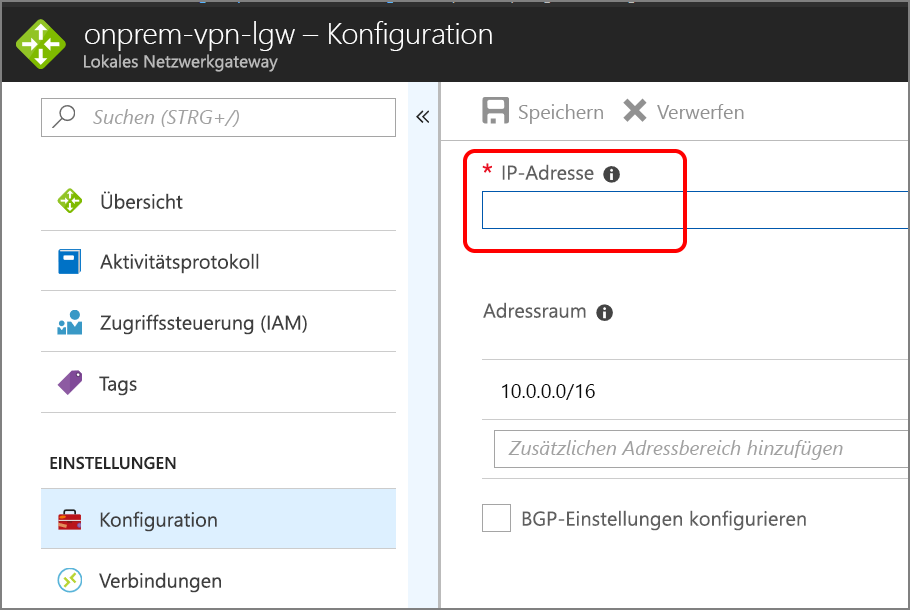

# <a name="dmz-between-azure-and-the-internet"></a>DMZ zwischen Azure und dem Internet

Diese Referenzarchitektur zeigt ein sicheres Hybridnetzwerk, das ein lokales Netzwerk in Azure erweitert und auch Internetdatenverkehr zulässt. [**So stellen Sie diese Lösung bereit**.](#deploy-the-solution)

[![0]][0] 

*Laden Sie eine [Visio-Datei][visio-download] mit dieser Architektur herunter.*

Diese Referenzarchitektur erweitert die Architektur, die in [Implementieren einer DMZ zwischen Azure und Ihrem lokalen Rechenzentrum][implementing-a-secure-hybrid-network-architecture] beschrieben wird. Dabei wird der privaten DMZ, die den Datenverkehr aus dem lokalen Netzwerk verwaltet, eine öffentliche DMZ für den Internetdatenverkehr hinzugefügt. 

Typische Einsatzmöglichkeiten für diese Architektur sind:

* Hybridanwendungen, in denen Workloads teilweise lokal und teilweise in Azure ausgeführt werden.
* Azure-Infrastruktur, die eingehenden Datenverkehr von lokalen Quellen und dem Internet weiterleitet

## <a name="architecture"></a>Architecture

Die Architektur umfasst die folgenden Komponenten.

* **Öffentliche IP-Adresse:** Die IP-Adresse des öffentlichen Endpunkts. Externe Benutzer, die mit dem Internet verbunden sind, können über diese Adresse auf das System zugreifen.
* **Virtuelles Netzwerkgerät:** Diese Architektur umfasst einen separaten Pool von virtuellen Netzwerkgeräten (Network Virtual Appliance, NVA) für Datenverkehr aus dem Internet.
* **Azure Load Balancer:** Alle aus dem Internet eingehende Anforderungen werden über den Lastenausgleich auf die NVAs in der öffentlichen DMZ verteilt.
* **Öffentliche DMZ – eingehendes Subnetz:** Dieses Subnetz akzeptiert Anforderungen vom Azure Load Balancer. Eingehende Anforderungen werden an eine der NVAs in der öffentlichen DMZ weitergeleitet.
* **Öffentliche DMZ – ausgehendes Subnetz:** Anforderungen, die von der NVA genehmigt wurden, werden über dieses Subnetz an den internen Lastenausgleich für die Webebene weitergeleitet.

## <a name="recommendations"></a>Empfehlungen

Die folgenden Empfehlungen gelten für die meisten Szenarios. Sofern Sie keine besonderen Anforderungen haben, die Vorrang haben, sollten Sie diese Empfehlungen befolgen. 

### <a name="nva-recommendations"></a>Empfehlungen für virtuelle Netzwerkgeräte

Verwenden Sie einen Satz von NVAs für Datenverkehr aus dem Internet und einen anderen für Datenverkehr mit lokalem Ursprung. Wenn Sie für beides nur einen Satz von NVAs verwenden, stellt dies ein Sicherheitsrisiko dar, da kein wirksamer Sicherheitsbereich zwischen den beiden Arten von Netzwerkdatenverkehr aufgebaut wird. Separate NVAs erleichtern das Überprüfen von Sicherheitsregeln und verdeutlichen, welche Regeln der eingehenden Netzwerkanforderung entsprechen. Einen Satz von NVAs implementiert nur Regeln für den Internetdatenverkehr, während ein anderer Satz von NVAs nur Regeln für den lokalen Datenverkehr implementiert.

Schließen Sie eine Ebene-7-NVA ein, um Anwendungsverbindungen auf NVA-Ebene zu beenden und Kompatibilität zwischen den Back-End-Ebenen sicherzustellen. Dies garantiert symmetrischen Konnektivität, bei der Antwortdatenverkehr von den Back-End-Ebenen über die NVA zurückgegeben wird.  

### <a name="public-load-balancer-recommendations"></a>Empfehlungen für den öffentlichen Lastenausgleich

Für mehr Skalierbarkeit und Verfügbarkeit stellen Sie die NVAs der öffentlichen DMZ in einer [Verfügbarkeitsgruppe][availability-set] bereit und verwenden einen [Lastenausgleich mit Internetzugriff][load-balancer], um Internetanforderungen auf die NVAs in der Verfügbarkeitsgruppe zu verteilen.  

Konfigurieren Sie den Lastenausgleich so, dass dieser nur Anforderungen über die Ports für den Internetdatenverkehr akzeptiert. Beschränken Sie z.B. eingehende HTTP-Anforderungen auf Port 80 und eingehende HTTPS-Anforderungen auf Port 443.

## <a name="scalability-considerations"></a>Überlegungen zur Skalierbarkeit

Auch wenn Ihre Architektur anfänglich eine einzelne NVA in der öffentlichen DMZ erfordert, wird empfohlen, von Anfang an einen Lastenausgleich vor der öffentlichen DMZ zu platzieren. Dies vereinfacht die Skalierung auf mehrere NVAs, wenn dies in der Zukunft erforderlich wird.

## <a name="availability-considerations"></a>Überlegungen zur Verfügbarkeit

Für den Lastenausgleich mit Internetzugriff muss jede NVA im eingehenden Subnetz der öffentlichen DMZ einen [Integritätstest][lb-probe] implementieren. Wenn ein Integritätstest an diesem Endpunkt nicht antwortet, gilt er als nicht verfügbar. Der Lastenausgleich leitet Anforderungen dann an andere NVAs in derselben Verfügbarkeitsgruppe um. Bedenken Sie, dass ein Fehler bei der Anwendung auftritt, wenn keine der NVAs antwortet. Daher ist es wichtig, eine Überwachung zu konfigurieren, mit der die DevOps gewarnt werden, wenn die Anzahl der fehlerfreien NVAs einen festgelegten Schwellenwert unterschreitet.

## <a name="manageability-considerations"></a>Überlegungen zur Verwaltbarkeit

Sämtliche Vorgänge zur Überwachung und Verwaltung der NVAs in der öffentlichen DMZ sollten über die Jumpbox im Verwaltungssubnetz ausgeführt werden. Wie bereits unter [Implementieren einer DMZ zwischen Azure und Ihrem lokalen Rechenzentrum][implementing-a-secure-hybrid-network-architecture] erläutert, definieren Sie eine einzelne Netzwerkroute aus dem lokalen Netzwerk über das Gateway bis zur Jumpbox, um den Zugriff einzuschränken.

Wenn keine Gatewaykonnektivität zwischen Ihrem lokalen Netzwerk und Azure besteht, können Sie weiterhin auf die Jumpbox zugreifen, indem Sie eine öffentliche IP-Adresse bereitstellen, diese der Jumpbox hinzufügen und sich dann über das Internet anmelden.

## <a name="security-considerations"></a>Sicherheitshinweise

Diese Referenzarchitektur implementiert mehrere Sicherheitsebenen:

* Der Lastenausgleich mit Internetzugriff leitet Anforderungen an die NVAs im eingehenden Subnetz der öffentlichen DMZ weiter – und zwar nur an Ports, die für die Anwendung erforderlich sind.
* Die NSG-Regeln für die ein- und ausgehenden Subnetze der öffentlichen DMZ verhindern, dass die NVAs gefährdet werden, indem sie Anforderungen, auf die die NSG-Regeln nicht zutreffen, blockieren.
* Die NAT-Routingkonfiguration für die NVAs leitet eingehende Anforderungen an Port 80 und Port 443 an den Lastenausgleich für die Webebene weiter, ignoriert jedoch Anforderungen an allen anderen Ports.

Sie sollten alle eingehenden Anforderungen an sämtlichen Ports protokollieren. Überprüfen Sie die Protokolle regelmäßig, und achten Sie dabei auf Anforderungen, die außerhalb der erwarteten Parameter liegen, da sie auf Eindringversuche hindeuten.


## <a name="deploy-the-solution"></a>Bereitstellen der Lösung

Eine Bereitstellung für eine Referenzarchitektur, die diese Empfehlungen implementiert, steht auf [GitHub][github-folder] zur Verfügung. 

### <a name="prerequisites"></a>Voraussetzungen

[!INCLUDE [ref-arch-prerequisites.md](../../../includes/ref-arch-prerequisites.md)]

### <a name="deploy-resources"></a>Bereitstellen von Ressourcen

1. Navigieren Sie zum Ordner `/dmz/secure-vnet-dmz` des GitHub-Repositorys für Referenzarchitekturen.

2. Führen Sie den folgenden Befehl aus:

    ```bash
    azbb -s <subscription_id> -g <resource_group_name> -l <region> -p onprem.json --deploy
    ```

3. Führen Sie den folgenden Befehl aus:

    ```bash
    azbb -s <subscription_id> -g <resource_group_name> -l <region> -p secure-vnet-hybrid.json --deploy
    ```

### <a name="connect-the-on-premises-and-azure-gateways"></a>Verbinden der lokalen und der Azure-Gateways

In diesem Schritt verbinden Sie die zwei Gateways des lokalen Netzwerks.

1. Navigieren Sie im Azure-Portal zu der Ressourcengruppe, die Sie erstellt haben. 

2. Suchen Sie nach der Ressource mit dem Namen `ra-vpn-vgw-pip`, und kopieren Sie die auf dem Blatt **Übersicht** angezeigte IP-Adresse.

3. Suchen Sie nach der Ressource mit dem Namen `onprem-vpn-lgw`.

4. Klicken Sie auf das Blatt **Konfiguration**. Fügen Sie unter **IP-Adresse** die IP-Adresse aus Schritt 2 ein.

    

5. Klicken Sie auf **Speichern**, und warten Sie, bis der Vorgang abgeschlossen ist. Dies dauert etwa fünf Minuten.

6. Suchen Sie nach der Ressource mit dem Namen `onprem-vpn-gateway1-pip`. Kopieren Sie die auf dem Blatt **Übersicht** angezeigte IP-Adresse.

7. Suchen Sie nach der Ressource mit dem Namen `ra-vpn-lgw`. 

8. Klicken Sie auf das Blatt **Konfiguration**. Fügen Sie unter **IP-Adresse** die IP-Adresse aus Schritt 6 ein.

9. Klicken Sie auf **Speichern**, und warten Sie, bis der Vorgang abgeschlossen ist.

10. Zum Überprüfen der Verbindung rufen Sie das Blatt **Verbindungen** für jedes Gateway auf. Der Status sollte **Verbunden** lauten.

### <a name="verify-that-network-traffic-reaches-the-web-tier"></a>Sicherstellen, dass Netzwerkdatenverkehr die Webebene erreicht

1. Navigieren Sie im Azure-Portal zu der Ressourcengruppe, die Sie erstellt haben. 

2. Suchen Sie nach der Ressource mit dem Namen `pub-dmz-lb`, d.h. dem Lastenausgleich vor der öffentlichen DMZ. 

3. Kopieren Sie die öffentliche IP-Adresse aus dem Blatt **Übersicht**, und öffnen Sie diese Adresse in einem Webbrowser. Daraufhin sollte die standardmäßige Apache2-Serverhomepage angezeigt werden.

4. Suchen Sie nach der Ressource mit dem Namen `int-dmz-lb`, d.h. dem Lastenausgleich vor der privaten DMZ. Kopieren Sie die private IP-Adresse aus dem Blatt **Übersicht**.

5. Suchen Sie den virtuellen Computer mit dem Namen `jb-vm1`. Klicken Sie auf **Verbinden**, und stellen Sie über Remotedesktop eine Verbindung zum virtuellen Computer her. Der Benutzername und das Kennwort sind in der Datei „onprem.json“ angegeben.

6. Öffnen Sie in der Remotedesktopsitzung einen Webbrowser, und navigieren Sie zur IP-Adresse aus Schritt 4. Daraufhin sollte die standardmäßige Apache2-Serverhomepage angezeigt werden.

[availability-set]: /azure/virtual-machines/virtual-machines-windows-manage-availability
[github-folder]: https://github.com/mspnp/reference-architectures/tree/master/dmz/secure-vnet-dmz

[implementing-a-secure-hybrid-network-architecture]: ./secure-vnet-hybrid.md
[iptables]: https://help.ubuntu.com/community/IptablesHowTo
[lb-probe]: /azure/load-balancer/load-balancer-custom-probe-overview
[load-balancer]: /azure/load-balancer/load-balancer-Internet-overview
[network-security-group]: /azure/virtual-network/virtual-networks-nsg

[visio-download]: https://archcenter.blob.core.windows.net/cdn/dmz-reference-architectures.vsdx


[0]: ./images/dmz-public.png "Sichere Hybrid-Netzwerkarchitektur"
