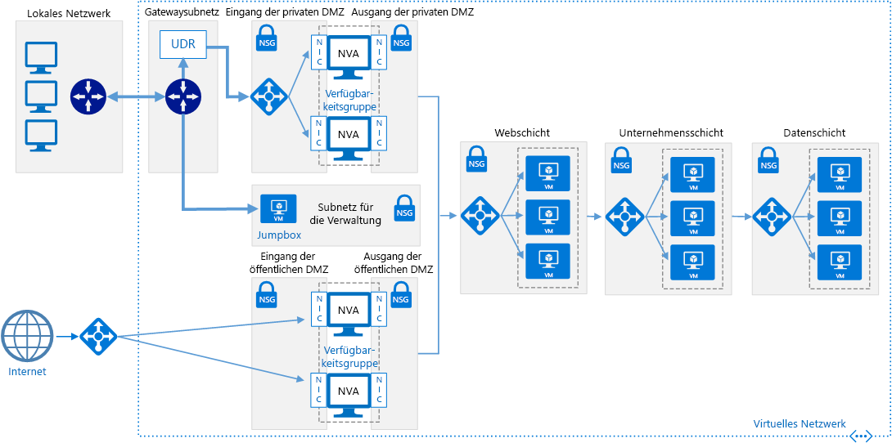

# <a name="implement-a-dmz-between-azure-and-the-internet"></a><span data-ttu-id="32084-103">Implementieren einer DMZ zwischen Azure und dem Internet</span><span class="sxs-lookup"><span data-stu-id="32084-103">Implement a DMZ between Azure and the Internet</span></span>

<span data-ttu-id="32084-104">Diese Referenzarchitektur zeigt ein sicheres Hybridnetzwerk, das ein lokales Netzwerk in Azure erweitert und auch Internetdatenverkehr zulässt.</span><span class="sxs-lookup"><span data-stu-id="32084-104">This reference architecture shows a secure hybrid network that extends an on-premises network to Azure and also accepts Internet traffic.</span></span> <span data-ttu-id="32084-105">[**Stellen Sie diese Lösung bereit**](#deploy-the-solution).</span><span class="sxs-lookup"><span data-stu-id="32084-105">[**Deploy this solution**](#deploy-the-solution).</span></span>



<span data-ttu-id="32084-107">*Laden Sie eine [Visio-Datei][visio-download] mit dieser Architektur herunter.*</span><span class="sxs-lookup"><span data-stu-id="32084-107">*Download a [Visio file][visio-download] of this architecture.*</span></span>

<span data-ttu-id="32084-108">Diese Referenzarchitektur erweitert die Architektur, die in [Implementieren einer DMZ zwischen Azure und Ihrem lokalen Rechenzentrum][implementing-a-secure-hybrid-network-architecture] beschrieben wird.</span><span class="sxs-lookup"><span data-stu-id="32084-108">This reference architecture extends the architecture described in [Implementing a DMZ between Azure and your on-premises datacenter][implementing-a-secure-hybrid-network-architecture].</span></span> <span data-ttu-id="32084-109">Dabei wird der privaten DMZ, die den Datenverkehr aus dem lokalen Netzwerk verwaltet, eine öffentliche DMZ für den Internetdatenverkehr hinzugefügt.</span><span class="sxs-lookup"><span data-stu-id="32084-109">It adds a public DMZ that handles Internet traffic, in addition to the private DMZ that handles traffic from the on-premises network.</span></span>

<span data-ttu-id="32084-110">Typische Einsatzmöglichkeiten für diese Architektur sind:</span><span class="sxs-lookup"><span data-stu-id="32084-110">Typical uses for this architecture include:</span></span>

- <span data-ttu-id="32084-111">Hybridanwendungen, in denen Workloads teilweise lokal und teilweise in Azure ausgeführt werden.</span><span class="sxs-lookup"><span data-stu-id="32084-111">Hybrid applications where workloads run partly on-premises and partly in Azure.</span></span>
- <span data-ttu-id="32084-112">Azure-Infrastruktur, die eingehenden Datenverkehr von lokalen Quellen und dem Internet weiterleitet</span><span class="sxs-lookup"><span data-stu-id="32084-112">Azure infrastructure that routes incoming traffic from on-premises and the Internet.</span></span>

## <a name="architecture"></a><span data-ttu-id="32084-113">Architecture</span><span class="sxs-lookup"><span data-stu-id="32084-113">Architecture</span></span>

<span data-ttu-id="32084-114">Die Architektur umfasst die folgenden Komponenten.</span><span class="sxs-lookup"><span data-stu-id="32084-114">The architecture consists of the following components.</span></span>

- <span data-ttu-id="32084-115">**Öffentliche IP-Adresse:**</span><span class="sxs-lookup"><span data-stu-id="32084-115">**Public IP address (PIP)**.</span></span> <span data-ttu-id="32084-116">Die IP-Adresse des öffentlichen Endpunkts.</span><span class="sxs-lookup"><span data-stu-id="32084-116">The IP address of the public endpoint.</span></span> <span data-ttu-id="32084-117">Externe Benutzer, die mit dem Internet verbunden sind, können über diese Adresse auf das System zugreifen.</span><span class="sxs-lookup"><span data-stu-id="32084-117">External users connected to the Internet can access the system through this address.</span></span>
- <span data-ttu-id="32084-118">**Virtuelles Netzwerkgerät:**</span><span class="sxs-lookup"><span data-stu-id="32084-118">**Network virtual appliance (NVA)**.</span></span> <span data-ttu-id="32084-119">Diese Architektur umfasst einen separaten Pool von virtuellen Netzwerkgeräten (Network Virtual Appliance, NVA) für Datenverkehr aus dem Internet.</span><span class="sxs-lookup"><span data-stu-id="32084-119">This architecture includes a separate pool of NVAs for traffic originating on the Internet.</span></span>
- <span data-ttu-id="32084-120">**Azure Load Balancer:**</span><span class="sxs-lookup"><span data-stu-id="32084-120">**Azure load balancer**.</span></span> <span data-ttu-id="32084-121">Alle aus dem Internet eingehende Anforderungen werden über den Lastenausgleich auf die NVAs in der öffentlichen DMZ verteilt.</span><span class="sxs-lookup"><span data-stu-id="32084-121">All incoming requests from the Internet pass through the load balancer and are distributed to the NVAs in the public DMZ.</span></span>
- <span data-ttu-id="32084-122">**Öffentliche DMZ – eingehendes Subnetz:**</span><span class="sxs-lookup"><span data-stu-id="32084-122">**Public DMZ inbound subnet**.</span></span> <span data-ttu-id="32084-123">Dieses Subnetz akzeptiert Anforderungen vom Azure Load Balancer.</span><span class="sxs-lookup"><span data-stu-id="32084-123">This subnet accepts requests from the Azure load balancer.</span></span> <span data-ttu-id="32084-124">Eingehende Anforderungen werden an eine der NVAs in der öffentlichen DMZ weitergeleitet.</span><span class="sxs-lookup"><span data-stu-id="32084-124">Incoming requests are passed to one of the NVAs in the public DMZ.</span></span>
- <span data-ttu-id="32084-125">**Öffentliche DMZ – ausgehendes Subnetz:**</span><span class="sxs-lookup"><span data-stu-id="32084-125">**Public DMZ outbound subnet**.</span></span> <span data-ttu-id="32084-126">Anforderungen, die von der NVA genehmigt wurden, werden über dieses Subnetz an den internen Lastenausgleich für die Webebene weitergeleitet.</span><span class="sxs-lookup"><span data-stu-id="32084-126">Requests that are approved by the NVA pass through this subnet to the internal load balancer for the web tier.</span></span>

## <a name="recommendations"></a><span data-ttu-id="32084-127">Empfehlungen</span><span class="sxs-lookup"><span data-stu-id="32084-127">Recommendations</span></span>

<span data-ttu-id="32084-128">Die folgenden Empfehlungen gelten für die meisten Szenarios.</span><span class="sxs-lookup"><span data-stu-id="32084-128">The following recommendations apply for most scenarios.</span></span> <span data-ttu-id="32084-129">Sofern Sie keine besonderen Anforderungen haben, die Vorrang haben, sollten Sie diese Empfehlungen befolgen.</span><span class="sxs-lookup"><span data-stu-id="32084-129">Follow these recommendations unless you have a specific requirement that overrides them.</span></span>

### <a name="nva-recommendations"></a><span data-ttu-id="32084-130">Empfehlungen für virtuelle Netzwerkgeräte</span><span class="sxs-lookup"><span data-stu-id="32084-130">NVA recommendations</span></span>

<span data-ttu-id="32084-131">Verwenden Sie einen Satz von NVAs für Datenverkehr aus dem Internet und einen anderen für Datenverkehr mit lokalem Ursprung.</span><span class="sxs-lookup"><span data-stu-id="32084-131">Use one set of NVAs for traffic originating on the Internet, and another for traffic originating on-premises.</span></span> <span data-ttu-id="32084-132">Wenn Sie für beides nur einen Satz von NVAs verwenden, stellt dies ein Sicherheitsrisiko dar, da kein wirksamer Sicherheitsbereich zwischen den beiden Arten von Netzwerkdatenverkehr aufgebaut wird.</span><span class="sxs-lookup"><span data-stu-id="32084-132">Using only one set of NVAs for both is a security risk, because it provides no security perimeter between the two sets of network traffic.</span></span> <span data-ttu-id="32084-133">Separate NVAs erleichtern das Überprüfen von Sicherheitsregeln und verdeutlichen, welche Regeln der eingehenden Netzwerkanforderung entsprechen.</span><span class="sxs-lookup"><span data-stu-id="32084-133">Using separate NVAs reduces the complexity of checking security rules, and makes it clear which rules correspond to each incoming network request.</span></span> <span data-ttu-id="32084-134">Einen Satz von NVAs implementiert nur Regeln für den Internetdatenverkehr, während ein anderer Satz von NVAs nur Regeln für den lokalen Datenverkehr implementiert.</span><span class="sxs-lookup"><span data-stu-id="32084-134">One set of NVAs implements rules for Internet traffic only, while another set of NVAs implement rules for on-premises traffic only.</span></span>

<span data-ttu-id="32084-135">Schließen Sie eine Ebene-7-NVA ein, um Anwendungsverbindungen auf NVA-Ebene zu beenden und Kompatibilität zwischen den Back-End-Ebenen sicherzustellen.</span><span class="sxs-lookup"><span data-stu-id="32084-135">Include a layer-7 NVA to terminate application connections at the NVA level and maintain compatibility with the backend tiers.</span></span> <span data-ttu-id="32084-136">Dies garantiert symmetrischen Konnektivität, bei der Antwortdatenverkehr von den Back-End-Ebenen über die NVA zurückgegeben wird.</span><span class="sxs-lookup"><span data-stu-id="32084-136">This guarantees symmetric connectivity where response traffic from the backend tiers returns through the NVA.</span></span>

### <a name="public-load-balancer-recommendations"></a><span data-ttu-id="32084-137">Empfehlungen für den öffentlichen Lastenausgleich</span><span class="sxs-lookup"><span data-stu-id="32084-137">Public load balancer recommendations</span></span>

<span data-ttu-id="32084-138">Für mehr Skalierbarkeit und Verfügbarkeit stellen Sie die NVAs der öffentlichen DMZ in einer [Verfügbarkeitsgruppe][availability-set] bereit und verwenden einen [Lastenausgleich mit Internetzugriff][load-balancer], um Internetanforderungen auf die NVAs in der Verfügbarkeitsgruppe zu verteilen.</span><span class="sxs-lookup"><span data-stu-id="32084-138">For scalability and availability, deploy the public DMZ NVAs in an [availability set][availability-set] and use an [Internet facing load balancer][load-balancer] to distribute Internet requests across the NVAs in the availability set.</span></span>

<span data-ttu-id="32084-139">Konfigurieren Sie den Lastenausgleich so, dass dieser nur Anforderungen über die Ports für den Internetdatenverkehr akzeptiert.</span><span class="sxs-lookup"><span data-stu-id="32084-139">Configure the load balancer to accept requests only on the ports necessary for Internet traffic.</span></span> <span data-ttu-id="32084-140">Beschränken Sie z.B. eingehende HTTP-Anforderungen auf Port 80 und eingehende HTTPS-Anforderungen auf Port 443.</span><span class="sxs-lookup"><span data-stu-id="32084-140">For example, restrict inbound HTTP requests to port 80 and inbound HTTPS requests to port 443.</span></span>

## <a name="scalability-considerations"></a><span data-ttu-id="32084-141">Überlegungen zur Skalierbarkeit</span><span class="sxs-lookup"><span data-stu-id="32084-141">Scalability considerations</span></span>

<span data-ttu-id="32084-142">Auch wenn Ihre Architektur anfänglich eine einzelne NVA in der öffentlichen DMZ erfordert, wird empfohlen, von Anfang an einen Lastenausgleich vor der öffentlichen DMZ zu platzieren.</span><span class="sxs-lookup"><span data-stu-id="32084-142">Even if your architecture initially requires a single NVA in the public DMZ, we recommend putting a load balancer in front of the public DMZ from the beginning.</span></span> <span data-ttu-id="32084-143">Dies vereinfacht die Skalierung auf mehrere NVAs, wenn dies in der Zukunft erforderlich wird.</span><span class="sxs-lookup"><span data-stu-id="32084-143">That will make it easier to scale to multiple NVAs in the future, if needed.</span></span>

## <a name="availability-considerations"></a><span data-ttu-id="32084-144">Überlegungen zur Verfügbarkeit</span><span class="sxs-lookup"><span data-stu-id="32084-144">Availability considerations</span></span>

<span data-ttu-id="32084-145">Für den Lastenausgleich mit Internetzugriff muss jede NVA im eingehenden Subnetz der öffentlichen DMZ einen [Integritätstest][lb-probe] implementieren.</span><span class="sxs-lookup"><span data-stu-id="32084-145">The Internet facing load balancer requires each NVA in the public DMZ inbound subnet to implement a [health probe][lb-probe].</span></span> <span data-ttu-id="32084-146">Wenn ein Integritätstest an diesem Endpunkt nicht antwortet, gilt er als nicht verfügbar. Der Lastenausgleich leitet Anforderungen dann an andere NVAs in derselben Verfügbarkeitsgruppe um.</span><span class="sxs-lookup"><span data-stu-id="32084-146">A health probe that fails to respond on this endpoint is considered to be unavailable, and the load balancer will direct requests to other NVAs in the same availability set.</span></span> <span data-ttu-id="32084-147">Bedenken Sie, dass ein Fehler bei der Anwendung auftritt, wenn keine der NVAs antwortet. Daher ist es wichtig, eine Überwachung zu konfigurieren, mit der die DevOps gewarnt werden, wenn die Anzahl der fehlerfreien NVAs einen festgelegten Schwellenwert unterschreitet.</span><span class="sxs-lookup"><span data-stu-id="32084-147">Note that if all NVAs fail to respond, your application will fail, so it's important to have monitoring configured to alert DevOps when the number of healthy NVA instances falls below a defined threshold.</span></span>

## <a name="manageability-considerations"></a><span data-ttu-id="32084-148">Überlegungen zur Verwaltbarkeit</span><span class="sxs-lookup"><span data-stu-id="32084-148">Manageability considerations</span></span>

<span data-ttu-id="32084-149">Sämtliche Vorgänge zur Überwachung und Verwaltung der NVAs in der öffentlichen DMZ sollten über die Jumpbox im Verwaltungssubnetz ausgeführt werden.</span><span class="sxs-lookup"><span data-stu-id="32084-149">All monitoring and management for the NVAs in the public DMZ should be performed by the jumpbox in the management subnet.</span></span> <span data-ttu-id="32084-150">Wie bereits unter [Implementieren einer DMZ zwischen Azure und Ihrem lokalen Rechenzentrum][implementing-a-secure-hybrid-network-architecture] erläutert, definieren Sie eine einzelne Netzwerkroute aus dem lokalen Netzwerk über das Gateway bis zur Jumpbox, um den Zugriff einzuschränken.</span><span class="sxs-lookup"><span data-stu-id="32084-150">As discussed in [Implementing a DMZ between Azure and your on-premises datacenter][implementing-a-secure-hybrid-network-architecture], define a single network route from the on-premises network through the gateway to the jumpbox, in order to restrict access.</span></span>

<span data-ttu-id="32084-151">Wenn keine Gatewaykonnektivität zwischen Ihrem lokalen Netzwerk und Azure besteht, können Sie weiterhin auf die Jumpbox zugreifen, indem Sie eine öffentliche IP-Adresse bereitstellen, diese der Jumpbox hinzufügen und sich dann über das Internet anmelden.</span><span class="sxs-lookup"><span data-stu-id="32084-151">If gateway connectivity from your on-premises network to Azure is down, you can still reach the jumpbox by deploying a public IP address, adding it to the jumpbox, and logging in from the Internet.</span></span>

## <a name="security-considerations"></a><span data-ttu-id="32084-152">Sicherheitshinweise</span><span class="sxs-lookup"><span data-stu-id="32084-152">Security considerations</span></span>

<span data-ttu-id="32084-153">Diese Referenzarchitektur implementiert mehrere Sicherheitsebenen:</span><span class="sxs-lookup"><span data-stu-id="32084-153">This reference architecture implements multiple levels of security:</span></span>

- <span data-ttu-id="32084-154">Der Lastenausgleich mit Internetzugriff leitet Anforderungen an die NVAs im eingehenden Subnetz der öffentlichen DMZ weiter – und zwar nur an Ports, die für die Anwendung erforderlich sind.</span><span class="sxs-lookup"><span data-stu-id="32084-154">The Internet facing load balancer directs requests to the NVAs in the inbound public DMZ subnet, and only on the ports necessary for the application.</span></span>
- <span data-ttu-id="32084-155">Die NSG-Regeln für die ein- und ausgehenden Subnetze der öffentlichen DMZ verhindern, dass die NVAs gefährdet werden, indem sie Anforderungen, auf die die NSG-Regeln nicht zutreffen, blockieren.</span><span class="sxs-lookup"><span data-stu-id="32084-155">The NSG rules for the inbound and outbound public DMZ subnets prevent the NVAs from being compromised, by blocking requests that fall outside of the NSG rules.</span></span>
- <span data-ttu-id="32084-156">Die NAT-Routingkonfiguration für die NVAs leitet eingehende Anforderungen an Port 80 und Port 443 an den Lastenausgleich für die Webebene weiter, ignoriert jedoch Anforderungen an allen anderen Ports.</span><span class="sxs-lookup"><span data-stu-id="32084-156">The NAT routing configuration for the NVAs directs incoming requests on port 80 and port 443 to the web tier load balancer, but ignores requests on all other ports.</span></span>

<span data-ttu-id="32084-157">Sie sollten alle eingehenden Anforderungen an sämtlichen Ports protokollieren.</span><span class="sxs-lookup"><span data-stu-id="32084-157">You should log all incoming requests on all ports.</span></span> <span data-ttu-id="32084-158">Überprüfen Sie die Protokolle regelmäßig, und achten Sie dabei auf Anforderungen, die außerhalb der erwarteten Parameter liegen, da sie auf Eindringversuche hindeuten.</span><span class="sxs-lookup"><span data-stu-id="32084-158">Regularly audit the logs, paying attention to requests that fall outside of expected parameters, as these may indicate intrusion attempts.</span></span>

## <a name="deploy-the-solution"></a><span data-ttu-id="32084-159">Bereitstellen der Lösung</span><span class="sxs-lookup"><span data-stu-id="32084-159">Deploy the solution</span></span>

<span data-ttu-id="32084-160">Eine Bereitstellung für eine Referenzarchitektur, die diese Empfehlungen implementiert, steht auf [GitHub][github-folder] zur Verfügung.</span><span class="sxs-lookup"><span data-stu-id="32084-160">A deployment for a reference architecture that implements these recommendations is available on [GitHub][github-folder].</span></span>

### <a name="prerequisites"></a><span data-ttu-id="32084-161">Voraussetzungen</span><span class="sxs-lookup"><span data-stu-id="32084-161">Prerequisites</span></span>

[!INCLUDE [ref-arch-prerequisites.md](../../../includes/ref-arch-prerequisites.md)]

### <a name="deploy-resources"></a><span data-ttu-id="32084-162">Bereitstellen von Ressourcen</span><span class="sxs-lookup"><span data-stu-id="32084-162">Deploy resources</span></span>

1. <span data-ttu-id="32084-163">Navigieren Sie zum Ordner `/dmz/secure-vnet-dmz` des GitHub-Repositorys für Referenzarchitekturen.</span><span class="sxs-lookup"><span data-stu-id="32084-163">Navigate to the `/dmz/secure-vnet-dmz` folder of the reference architectures GitHub repository.</span></span>

2. <span data-ttu-id="32084-164">Führen Sie den folgenden Befehl aus:</span><span class="sxs-lookup"><span data-stu-id="32084-164">Run the following command:</span></span>

    ```bash
    azbb -s <subscription_id> -g <resource_group_name> -l <region> -p onprem.json --deploy
    ```

3. <span data-ttu-id="32084-165">Führen Sie den folgenden Befehl aus:</span><span class="sxs-lookup"><span data-stu-id="32084-165">Run the following command:</span></span>

    ```bash
    azbb -s <subscription_id> -g <resource_group_name> -l <region> -p secure-vnet-hybrid.json --deploy
    ```

### <a name="connect-the-on-premises-and-azure-gateways"></a><span data-ttu-id="32084-166">Verbinden der lokalen und der Azure-Gateways</span><span class="sxs-lookup"><span data-stu-id="32084-166">Connect the on-premises and Azure gateways</span></span>

<span data-ttu-id="32084-167">In diesem Schritt verbinden Sie die zwei Gateways des lokalen Netzwerks.</span><span class="sxs-lookup"><span data-stu-id="32084-167">In this step, you will connect the two local network gateways.</span></span>

1. <span data-ttu-id="32084-168">Navigieren Sie im Azure-Portal zu der Ressourcengruppe, die Sie erstellt haben.</span><span class="sxs-lookup"><span data-stu-id="32084-168">In the Azure Portal, navigate to the resource group that you created.</span></span>

2. <span data-ttu-id="32084-169">Suchen Sie nach der Ressource mit dem Namen `ra-vpn-vgw-pip`, und kopieren Sie die auf dem Blatt **Übersicht** angezeigte IP-Adresse.</span><span class="sxs-lookup"><span data-stu-id="32084-169">Find the resource named `ra-vpn-vgw-pip` and copy the IP address shown in the **Overview** blade.</span></span>

3. <span data-ttu-id="32084-170">Suchen Sie nach der Ressource mit dem Namen `onprem-vpn-lgw`.</span><span class="sxs-lookup"><span data-stu-id="32084-170">Find the resource named `onprem-vpn-lgw`.</span></span>

4. <span data-ttu-id="32084-171">Klicken Sie auf das Blatt **Konfiguration**.</span><span class="sxs-lookup"><span data-stu-id="32084-171">Click the **Configuration** blade.</span></span> <span data-ttu-id="32084-172">Fügen Sie unter **IP-Adresse** die IP-Adresse aus Schritt 2 ein.</span><span class="sxs-lookup"><span data-stu-id="32084-172">Under **IP address**, paste in the IP address from step 2.</span></span>

    

5. <span data-ttu-id="32084-174">Klicken Sie auf **Speichern**, und warten Sie, bis der Vorgang abgeschlossen ist.</span><span class="sxs-lookup"><span data-stu-id="32084-174">Click **Save** and wait for the operation to complete.</span></span> <span data-ttu-id="32084-175">Dies dauert etwa fünf Minuten.</span><span class="sxs-lookup"><span data-stu-id="32084-175">It can take about 5 minutes.</span></span>

6. <span data-ttu-id="32084-176">Suchen Sie nach der Ressource mit dem Namen `onprem-vpn-gateway1-pip`.</span><span class="sxs-lookup"><span data-stu-id="32084-176">Find the resource named `onprem-vpn-gateway1-pip`.</span></span> <span data-ttu-id="32084-177">Kopieren Sie die auf dem Blatt **Übersicht** angezeigte IP-Adresse.</span><span class="sxs-lookup"><span data-stu-id="32084-177">Copy the IP address shown in the **Overview** blade.</span></span>

7. <span data-ttu-id="32084-178">Suchen Sie nach der Ressource mit dem Namen `ra-vpn-lgw`.</span><span class="sxs-lookup"><span data-stu-id="32084-178">Find the resource named `ra-vpn-lgw`.</span></span>

8. <span data-ttu-id="32084-179">Klicken Sie auf das Blatt **Konfiguration**.</span><span class="sxs-lookup"><span data-stu-id="32084-179">Click the **Configuration** blade.</span></span> <span data-ttu-id="32084-180">Fügen Sie unter **IP-Adresse** die IP-Adresse aus Schritt 6 ein.</span><span class="sxs-lookup"><span data-stu-id="32084-180">Under **IP address**, paste in the IP address from step 6.</span></span>

9. <span data-ttu-id="32084-181">Klicken Sie auf **Speichern**, und warten Sie, bis der Vorgang abgeschlossen ist.</span><span class="sxs-lookup"><span data-stu-id="32084-181">Click **Save** and wait for the operation to complete.</span></span>

10. <span data-ttu-id="32084-182">Zum Überprüfen der Verbindung rufen Sie das Blatt **Verbindungen** für jedes Gateway auf.</span><span class="sxs-lookup"><span data-stu-id="32084-182">To verify the connection, go to the **Connections** blade for each gateway.</span></span> <span data-ttu-id="32084-183">Der Status sollte **Verbunden** lauten.</span><span class="sxs-lookup"><span data-stu-id="32084-183">The status should be **Connected**.</span></span>

### <a name="verify-that-network-traffic-reaches-the-web-tier"></a><span data-ttu-id="32084-184">Sicherstellen, dass Netzwerkdatenverkehr die Webebene erreicht</span><span class="sxs-lookup"><span data-stu-id="32084-184">Verify that network traffic reaches the web tier</span></span>

1. <span data-ttu-id="32084-185">Navigieren Sie im Azure-Portal zu der Ressourcengruppe, die Sie erstellt haben.</span><span class="sxs-lookup"><span data-stu-id="32084-185">In the Azure Portal, navigate to the resource group that you created.</span></span>

2. <span data-ttu-id="32084-186">Suchen Sie nach der Ressource mit dem Namen `pub-dmz-lb`, d.h. dem Lastenausgleich vor der öffentlichen DMZ.</span><span class="sxs-lookup"><span data-stu-id="32084-186">Find the resource named `pub-dmz-lb`, which is the load balancer in front of the public DMZ.</span></span>

3. <span data-ttu-id="32084-187">Kopieren Sie die öffentliche IP-Adresse aus dem Blatt **Übersicht**, und öffnen Sie diese Adresse in einem Webbrowser.</span><span class="sxs-lookup"><span data-stu-id="32084-187">Copy the public IP addess from the **Overview** blade and open this address in a web browser.</span></span> <span data-ttu-id="32084-188">Daraufhin sollte die standardmäßige Apache2-Serverhomepage angezeigt werden.</span><span class="sxs-lookup"><span data-stu-id="32084-188">You should see the default Apache2 server home page.</span></span>

4. <span data-ttu-id="32084-189">Suchen Sie nach der Ressource mit dem Namen `int-dmz-lb`, d.h. dem Lastenausgleich vor der privaten DMZ.</span><span class="sxs-lookup"><span data-stu-id="32084-189">Find the resource named `int-dmz-lb`, which is the load balancer in front of the private DMZ.</span></span> <span data-ttu-id="32084-190">Kopieren Sie die private IP-Adresse aus dem Blatt **Übersicht**.</span><span class="sxs-lookup"><span data-stu-id="32084-190">Copy the private IP address from the **Overview** blade.</span></span>

5. <span data-ttu-id="32084-191">Suchen Sie den virtuellen Computer mit dem Namen `jb-vm1`.</span><span class="sxs-lookup"><span data-stu-id="32084-191">Find the VM named `jb-vm1`.</span></span> <span data-ttu-id="32084-192">Klicken Sie auf **Verbinden**, und stellen Sie über Remotedesktop eine Verbindung zum virtuellen Computer her.</span><span class="sxs-lookup"><span data-stu-id="32084-192">Click **Connect** and use Remote Desktop to connect to the VM.</span></span> <span data-ttu-id="32084-193">Der Benutzername und das Kennwort sind in der Datei „onprem.json“ angegeben.</span><span class="sxs-lookup"><span data-stu-id="32084-193">The user name and password are specified in the onprem.json file.</span></span>

6. <span data-ttu-id="32084-194">Öffnen Sie in der Remotedesktopsitzung einen Webbrowser, und navigieren Sie zur IP-Adresse aus Schritt 4.</span><span class="sxs-lookup"><span data-stu-id="32084-194">From the Remote Desktop Session, open a web browser and navigate to the IP address from step 4.</span></span> <span data-ttu-id="32084-195">Daraufhin sollte die standardmäßige Apache2-Serverhomepage angezeigt werden.</span><span class="sxs-lookup"><span data-stu-id="32084-195">You should see the default Apache2 server home page.</span></span>

[availability-set]: /azure/virtual-machines/virtual-machines-windows-manage-availability
[github-folder]: https://github.com/mspnp/reference-architectures/tree/master/dmz/secure-vnet-dmz

[implementing-a-secure-hybrid-network-architecture]: ./secure-vnet-hybrid.md
[iptables]: https://help.ubuntu.com/community/IptablesHowTo
[lb-probe]: /azure/load-balancer/load-balancer-custom-probe-overview
[load-balancer]: /azure/load-balancer/load-balancer-Internet-overview
[network-security-group]: /azure/virtual-network/virtual-networks-nsg

[visio-download]: https://archcenter.blob.core.windows.net/cdn/dmz-reference-architectures.vsdx
