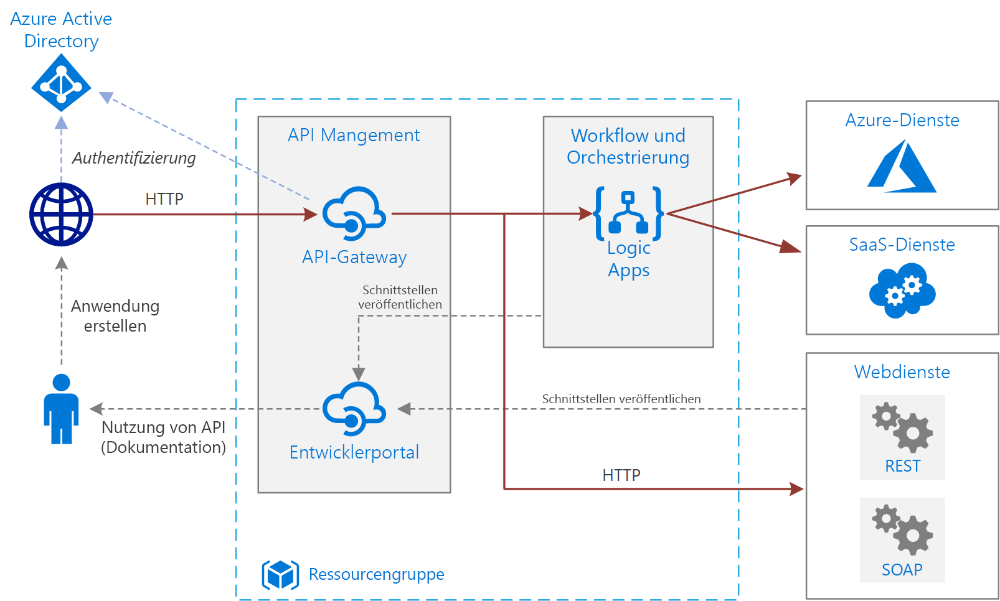

# Einfache Unternehmensintegration in AzureBasic enterprise integration on Azure

In dieser Referenzarchitektur wird [Azure Integration Services][integration-services] zum Orchestrieren von Aufrufen an Back-End-Unternehmenssysteme verwendet.This reference architecture uses [Azure Integration Services][integration-services] to orchestrate calls to enterprise backend systems. Die Back-End-Systeme können SaaS-Systeme (Software-as-a-Service), Azure-Dienste und vorhandene Webdienste in Ihrem Unternehmen enthalten.The backend systems may include software as a service (SaaS) systems, Azure services, and existing web services in your enterprise.

Azure Integration Services ist eine Sammlung von Diensten für die Integration von Anwendungen und Daten.Azure Integration Services is a collection of services for integrating applications and data. Diese Architektur verwendet zwei dieser Dienste: [Logic Apps][logic-apps] zum Orchestrieren von Workflows und [API Management][apim] zum Erstellen von API-Katalogen.This architecture uses two of those services: [Logic Apps][logic-apps] to orchestrate workflows, and [API Management][apim] to create catalogs of APIs. Diese Architektur ist für einfache Integrationsszenarien konzipiert, in denen der Workflow durch synchrone Back-End-Dienstaufrufe ausgelöst wird.This architecture is sufficient for basic integration scenarios where the workflow is triggered by synchronous calls to backend services. Eine komplexere Architektur mit [Warteschlangen und Ereignissen](./queues-events.md) baut auf dieser einfachen Architektur auf.A more sophisticated architecture using [queues and events](./queues-events.md) builds on this basic architecture.

## ArchitectureArchitecture

Die Architektur besteht aus den folgenden Komponenten:The architecture has the following components:

- **Back-End-Systeme**.**Backend systems**. Auf der rechten Seite des Diagramms befinden sich die verschiedenen Back-End-Systeme, die das Unternehmen bereitgestellt hat oder nutzt.The right-hand side of the diagram shows the various backend systems that the enterprise has deployed or relies on. Dazu gehören beispielsweise SaaS-Systeme, andere Azure-Dienste oder Webdienste, die Rest- oder SOAP-Endpunkte verfügbar machen.These might include SaaS systems, other Azure services, or web services that expose REST or SOAP endpoints.

- **Azur Logic Apps**.**Azure Logic Apps**. [Logic Apps][logic-apps] ist eine serverlose Plattform zum Erstellen von Unternehmensworkflows, die Anwendungen, Daten und Dienste integrieren.[Logic Apps][logic-apps] is a serverless platform for building enterprise workflows that integrate applications, data, and services. In dieser Architektur werden die Logik-Apps durch HTTP-Anforderungen ausgelöst.In this architecture, the logic apps are triggered by HTTP requests. Für eine komplexere Orchestrierung können Sie Workflows auch schachteln.You can also nest workflows for more complex orchestration. Logic Apps verwendet [Connectors][logic-apps-connectors] für die Integration in häufig verwendete Dienste.Logic Apps uses [connectors][logic-apps-connectors] to integrate with commonly used services. Logic Apps bietet hunderte von Connectors, und Sie können benutzerdefinierte Connectors erstellen.Logic Apps offers hundreds of connectors, and you can create custom connectors.

- **Azure API Management:****Azure API Management**. [API Management][apim] ist ein verwalteter Dienst für das Veröffentlichen von HTTP-API-Katalogen, um Wiederverwendung und Erkennbarkeit zu fördern.[API Management][apim] is a managed service for publishing catalogs of HTTP APIs, to promote reuse and discoverability. API Management besteht aus zwei zugehörigen Komponenten:API Management consists of two related components:

  - **API-Gateway**.**API gateway**. Das API-Gateway akzeptiert HTTP-Aufrufe und leitet sie an das Back-End weiter.The API gateway accepts HTTP calls and routes them to the backend.

  - **Entwicklerportal**.**Developer portal**. Jede Instanz von Azure API Management bietet Zugriff auf ein [Entwicklerportal][apim-dev-portal].Each instance of Azure API Management provides access to a [developer portal][apim-dev-portal]. Über dieses Portal haben Ihre Entwickler Zugriff auf Dokumentation und Codebeispiele für das Aufrufen der APIs.This portal gives your developers access to documentation and code samples for calling the APIs. Im Entwicklerportal können Sie außerdem APIs testen.You can also test APIs in the developer portal.

  In dieser Architektur werden Verbund-APIs durch das [Importieren von Logik-Apps][apim-logic-app] als APIs erstellt.In this architecture, composite APIs are built by [importing logic apps][apim-logic-app] as APIs. Sie können auch vorhandene Webdienste importieren, indem Sie [OpenAPI][apim-openapi]-Spezifikationen (Swagger) oder [SOAP-APIs][apim-soap] aus WSDL-Spezifikationen importieren.You can also import existing web services by [importing OpenAPI][apim-openapi] (Swagger) specifications or [importing SOAP APIs][apim-soap] from WSDL specifications.

  Das API-Gateways unterstützt die Entkopplung von Front-End-Clients vom Back-End.The API gateway helps to decouple front-end clients from the back end. Dazu kann es beispielsweise URLs umschreiben oder Anforderungen transformieren, bevor sie das Back-End erreichen.For example, it can rewrite URLs, or transform requests before they reach the backend. Es behandelt außerdem viele übergreifende Aspekte wie Authentifizierung, Unterstützung von Cross-Origin Resource Sharing (CORS) und Zwischenspeicherung von Antworten.It also handles many cross-cutting concerns such as authentication, cross-origin resource sharing (CORS) support, and response caching.

- **Azure DNS:****Azure DNS**. [Azure DNS][dns] ist ein Hostingdienst für DNS-Domänen.[Azure DNS][dns] is a hosting service for DNS domains. Azure DNS bietet eine Namensauflösung mithilfe der Microsoft Azure-Infrastruktur.Azure DNS provides name resolution by using the Microsoft Azure infrastructure. Durch das Hosten Ihrer Domänen in Azure können Sie Ihre DNS-Einträge mithilfe der gleichen Anmeldeinformationen, APIs, Tools und Abrechnung wie für die anderen Azure-Dienste verwalten.By hosting your domains in Azure, you can manage your DNS records by using the same credentials, APIs, tools, and billing that you use for your other Azure services. Erstellen Sie zur Verwendung eines benutzerdefinierten Domänennamens (etwa contoso.com) DNS-Einträge, die den benutzerdefinierten Domänennamen der IP-Adresse zuordnen.To use a custom domain name, such as contoso.com, create DNS records that map the custom domain name to the IP address. Weitere Informationen finden Sie unter [Konfigurieren eines benutzerdefinierten Domänennamens in API Management][apim-domain].For more information, see [Configure a custom domain name in API Management][apim-domain].

- **Azure Active Directory (Azure AD):****Azure Active Directory (Azure AD)**. Verwenden Sie [Azure AD][aad] zum Authentifizieren von Clients, die das Gateway-API-aufrufen.Use [Azure AD][aad] to authenticate clients that call the API gateway. Azure AD unterstützt das OpenID Connect-Protokoll (OIDC).Azure AD supports the OpenID Connect (OIDC) protocol. Clients rufen ein Zugriffstokens von Azure AD ab, und das API-Gateway [überprüft das Token][apim-jwt], um die Anforderung zu autorisieren.Clients obtain an access token from Azure AD, and API Gateway [validates the token][apim-jwt] to authorize the request. Bei Verwendung des Standard- oder Premium-Tarifs von API Management kann Azure AD auch Zugriff auf das Entwicklerportal sichern.When using the Standard or Premium tier of API Management, Azure AD can also secure access to the developer portal.

## EmpfehlungenRecommendations

Ihre individuellen Anforderungen können von der hier gezeigten generischen Architektur abweichen.Your specific requirements might differ from the generic architecture shown here. Verwenden Sie die Empfehlungen in diesem Abschnitt als Ausgangspunkt.Use the recommendations in this section as a starting point.

### API ManagementAPI Management

Verwenden Sie die Tarife „Basic“, „Standard“ oder „Premium“ für API Management.Use the API Management Basic, Standard, or Premium tiers. Diese Tarife bieten eine Vereinbarung zum Servicelevel (SLA) für die Produktionsumgebung und unterstützen eine horizontale Skalierung innerhalb der Azure-Region.These tiers offer a production service level agreement (SLA) and support scale out within the Azure region. Die Durchsatzkapazität für API Management wird in *Einheiten* gemessen.Throughput capacity for API Management is measured in *units*. Die horizontale Skalierung ist für jeden Tarif beschränkt. Der Tarif „Premium“ unterstützt zudem die horizontale Skalierung über mehrere Azure-Regionen hinweg.Each pricing tier has a maximum scale-out. The Premium tier also supports scale out across multiple Azure regions. Wählen Sie Ihren Tarif basierend auf Ihrem Funktionsumfang und dem erforderlichen Durchsatz.Choose your tier based on your feature set and the level of required throughput. Weitere Informationen finden Sie unter [API Management-Preise][apim-pricing] und [Kapazität einer Azure API Management-Instanz][apim-capacity].For more information, see [API Management pricing][apim-pricing] and [Capacity of an Azure API Management instance][apim-capacity].

Jede Azure API Management-Instanz besitzt einen Standarddomänennamen. Dabei handelt es sich um eine Unterdomäne von `azure-api.net` (Beispiel: `contoso.azure-api.net`).Each Azure API Management instance has a default domain name, which is a subdomain of `azure-api.net` &mdash, for example, `contoso.azure-api.net`. Erwägen Sie die Konfiguration einer [benutzerdefinierte Domäne][apim-domain] für Ihre Organisation.Consider configuring a [custom domain][apim-domain] for your organization.

### Logic AppsLogic Apps

Logic Apps eignet sich am besten für Szenarien, die keine Antworten mit geringer Wartezeit erfordern (etwa asynchrone API-Aufrufe oder API-Aufrufe mittlerer Dauer).Logic Apps works best in scenarios that don't require low latency for a response, such as asynchronous or semi long-running API calls. Ist eine geringe Wartezeit erforderlich (beispielsweise bei einem Aufruf, der eine Benutzeroberfläche blockiert), muss eine andere Technologie verwendet werden.If low latency is required, for example in a call that blocks a user interface, use a different technology. Verwenden Sie beispielsweise Azure Functions oder eine in Azure App Service bereitgestellte Web-API.For example, use Azure Functions or a web API deployed to Azure App Service. Verwenden Sie API Management, um die API für Ihre API-Consumer verfügbar zu machen.Use API Management to front the API to your API consumers.

### RegionRegion

Stellen Sie API Management und Logic Apps in der gleichen Region bereit, um die Netzwerklatenz zu minimieren.To minimize network latency, put API Management and Logic Apps in the same region. Wählen Sie grundsätzlich die Ihren Benutzern (oder Ihren Back-End-Diensten) am nächsten gelegene Region aus.In general, choose the region that's closest to your users (or closest to your backend services).

Die Ressourcengruppe weist ebenfalls eine Region auf.The resource group also has a region. Diese Region gibt an, wo die Metadaten der Bereitstellung gespeichert werden und die Bereitstellungsvorlage ausgeführt wird.This region specifies where to store deployment metadata and where to execute the deployment template. Platzieren Sie die Ressourcengruppe und die Ressourcen in der gleichen Region, um die Verfügbarkeit während der Bereitstellung zu verbessern.To improve availability during deployment, put the resource group and resources in the same region.

## Überlegungen zur SkalierbarkeitScalability considerations

Fügen Sie gegebenenfalls [Cachingrichtlinien][apim-caching] hinzu, um die Skalierbarkeit von API Management zu erhöhen.To increase the scalability of API Management, add [caching policies][apim-caching] where appropriate. Mit Caching können Sie zudem die Last für ihre Back-End-Dienste verringern.Caching also helps reduce the load on back-end services.

Sie können die Tarife „Basic“, „Standard“ und „Premium“ von Azure API Management können in einer Azure-Region horizontal hochskalieren, um mehr Kapazität zu bieten.To offer greater capacity, you can scale out Azure API Management Basic, Standard, and Premium tiers in an Azure region. Zum Analysieren der Nutzung für Ihren Dienst wählen Sie im Menü **Metriken** die Option **Kapazitätsmetrik** aus und nehmen dann eine entsprechende zentrale Hoch- oder Herunterskalierung vor.To analyze the usage for your service, on the **Metrics** menu, select the **Capacity Metric** option and then scale up or scale down as appropriate. Es kann zwischen 15 und 45 Minuten dauern, bis der Upgrade- bzw. Skalierungsprozess abgeschlossen ist.The upgrade or scale process can take from 15 to 45 minutes to apply.

Empfehlungen zur Skalierung eines API Management-Diensts:Recommendations for scaling an API Management service:

- Berücksichtigen Sie Datenverkehrsmuster bei der Skalierung.Consider traffic patterns when scaling. Kunden mit veränderlichen Datenverkehrsmustern benötigen mehr Kapazität.Customers with more volatile traffic patterns need more capacity.

- Eine konstante Kapazität von mehr als 66% kann darauf hinweisen, dass eine Hochskalierung notwendig ist.Consistent capacity that's greater than 66% might indicate a need to scale up.

- Eine konstante Kapazität von unter 20% kann darauf hinweisen, dass eine Herunterskalierung notwendig ist.Consistent capacity that's under 20% might indicate an opportunity to scale down.

- Führen Sie immer einen Auslastungstest mit einer repräsentativen Last für Ihren API Management-Dienst durch, bevor Sie die Last in der Produktion aktivieren.Before you enable the load in production, always load-test your API Management service with a representative load.

Mit dem Premium-Tarif können Sie eine API Management-Instanz über mehrere Azure-Regionen hinweg skalieren.With the Premium tier, you can scale an API Management instance across multiple Azure regions. Dadurch ist API Management für eine höhere SLA berechtigt, und Sie können Dienste in mehreren Regionen in der Nähe von Benutzern bereitstellen.This makes API Management eligible for a higher SLA, and lets you provision services near users in multiple regions.

Das serverlose Modell von Logic Apps bedeutet, dass Administratoren die Skalierbarkeit der Dienste nicht planen müssen.The Logic Apps serverless model means administrators don't have to plan for service scalability. Der Dienst wird automatisch entsprechend den Anforderungen skaliert.The service automatically scales to meet demand.

## Überlegungen zur VerfügbarkeitAvailability considerations

Lesen Sie die SLA für jeden Dienst:Review the SLA for each service:

- [SLA für API Management][apim-sla][API Management SLA][apim-sla]
- [SLA für Logic Apps][logic-apps-sla][Logic Apps SLA][logic-apps-sla]

Wenn Sie API Management in mindestens zwei Regionen mit Premium-Tarif bereitstellen, besteht Anspruch auf eine höhere SLA.If you deploy API Management across two or more regions with Premium tier, it is eligible for a higher SLA. Siehe [API Management-Preise][apim-pricing].See [API Management pricing][apim-pricing].

### BackupsBackups

[Sichern][apim-backup] Sie Ihre API Management-Konfiguration regelmäßig.Regularly [back up][apim-backup] your API Management configuration. Speichern Sie Ihre Sicherungsdateien an einem Ort oder in einer Azure-Region, an dem bzw. in der sich der Dienst nicht befindet.Store your backup files in a location or Azure region that differs from the region where the service is deployed. Wählen Sie basierend auf Ihrer [RTO][rto] eine Strategie für die Notfallwiederherstellung:Based on your [RTO][rto], choose a disaster recovery strategy:

- Bei einer Notfallwiederherstellung stellen Sie eine neue API Management-Instanz bereit, stellen die Sicherung auf dieser neuen Instanz wieder her und leiten die DNS-Einträge um.In a disaster recovery event, provision a new API Management instance, restore the backup to the new instance, and repoint the DNS records.

- Behalten Sie eine passive Instanz des API Management-Diensts in einer anderen Azure-Region bei.Keep a passive instance of the API Management service in another Azure region. Stellen Sie in dieser Instanz regelmäßig Sicherungen wieder her, um sie mit dem aktiven Dienst synchron zu halten.Regularly restore backups to that instance, to keep it in sync with the active service. Bei einer Notfallwiederherstellung des Diensts müssen Sie lediglich die DNS-Einträge umleiten.To restore the service during a disaster recovery event, you need only repoint the DNS records. Dieser Ansatz verursacht zwar zusätzliche Kosten, da Sie für die passive Instanz bezahlen, die Zeit bis zur Wiederherstellung wird jedoch reduziert.This approach incurs additional cost because you pay for the passive instance, but reduces the time to recover.

Für Logik-Apps empfehlen wir einen codebasierten Konfigurationsansatz für die Sicherung und Wiederherstellung.For logic apps, we recommend a configuration-as-code approach to backing up and restoring. Da Logik-Apps serverlos sind, können Sie sie aus Azure Resource Manager-Vorlagen schnell wiederherstellen.Because logic apps are serverless, you can quickly recreate them from Azure Resource Manager templates. Speichern Sie die Vorlagen in der Quellcodeverwaltung, und integrieren Sie die Vorlagen in Ihren CI/CD-Prozess (Continuous Integration/Continuous Deployment).Save the templates in source control, integrate the templates with your continuous integration/continuous deployment (CI/CD) process. Stellen Sie die Vorlage bei einer Notfallwiederherstellung in einer neuen Region bereit.In a disaster recovery event, deploy the template to a new region.

Wenn Sie eine Logik-App in einer anderen Region bereitstellen, aktualisieren Sie die Konfiguration in API Management.If you deploy a logic app to a different region, update the configuration in API Management. Sie können die **Backend**-Eigenschaft der API mithilfe eines einfachen PowerShell-Skripts aktualisieren.You can update the API's **Backend** property by using a basic PowerShell script.

## Überlegungen zur VerwaltbarkeitManageability considerations

Erstellen Sie separate Ressourcengruppen für Produktions-, Entwicklungs- und Testumgebungen.Create separate resource groups for production, development, and test environments. Separate Ressourcengruppen erleichtern das Verwalten von Bereitstellungen, das Löschen von Testbereitstellungen und das Zuweisen von Zugriffsrechten.Separate resource groups make it easier to manage deployments, delete test deployments, and assign access rights.

Berücksichtigen Sie beim Zuweisen von Ressourcen zu Ressourcengruppen diese Faktoren:When you assign resources to resource groups, consider these factors:

- **Lebenszyklus**.**Lifecycle**. Platzieren Sie Ressourcen mit gleichem Lebenszyklus im Allgemeinen in der gleichen Ressourcengruppe.In general, put resources that have the same lifecycle in the same resource group.

- **Zugriff**.**Access**. Sie können die [rollenbasierte Zugriffssteuerung][rbac] (RBAC) verwenden, um Zugriffsrichtlinien auf die Ressourcen in einer Gruppe anzuwenden.To apply access policies to the resources in a group, you can use [role-based access control][rbac] (RBAC).

- **Abrechnung**.**Billing**. Sie können die anfallenden Kosten für die Ressourcengruppe anzeigen.You can view rollup costs for the resource group.

- **Tarif für API Management**.**Pricing tier for API Management**. Verwenden Sie für Entwicklungs- und Testumgebungen den Developer-Tarif.Use the Developer tier for development and test environments. Zur Kostenminimierung während der Präproduktion stellen Sie ein Replikat Ihrer Produktionsumgebung bereit, führen die Tests aus und fahren das Replikat dann herunter.To minimize costs during preproduction, deploy a replica of your production environment, run your tests, and then shut down.

### BereitstellungDeployment

Verwenden Sie [Azure Resource Manager-Vorlagen][arm] für die Bereitstellung der Ressourcen.Use [Azure Resource Manager templates][arm] to deploy the Azure resources. Mithilfe von Vorlagen können Bereitstellungen über PowerShell oder die Azure CLI einfacher automatisiert werden.Templates make it easier to automate deployments using PowerShell or the Azure CLI.

Integrieren Sie Azure API Management und die einzelnen Logik-Apps in eigene separate Resource Manager-Vorlagen.Put API Management and any individual logic apps in their own separate Resource Manager templates. Durch die Verwendung unterschiedlicher Vorlagen können Sie die Ressourcen in Quellcodeverwaltungs-Systemen speichern.By using separate templates, you can store the resources in source control systems. Sie können die Vorlagen gemeinsam oder einzeln im Rahmen eines CI/CD-Prozesses bereitstellen.You can deploy the templates together or individually as part of a CI/CD process.

### VersionenVersions

Bei jeder Konfigurationsänderung an einer Logik-App und jeder Bereitstellung eines Updates über eine Resource Manager-Vorlage bewahrt Azure eine Kopie dieser Version auf und speichert alle Versionen, die einen Ausführungsverlauf aufweisen.Each time you change a logic app's configuration or deploy an update through a Resource Manager template, Azure keeps a copy of that version and keeps all versions that have a run history. Sie können diese Versionen verwenden, um Änderungen im Verlauf zu verfolgen, oder eine Version als aktuelle Konfiguration der Logik-App höherzustufen.You can use these versions to track historical changes or promote a version as the logic app's current configuration. Beispielsweise können Sie für eine Logik-App ein Rollback auf eine vorherige Version ausführen.For example, you can roll back a logic app to a previous version.

API Management unterstützt zwei unterschiedliche, sich jedoch ergänzende Versionierungskonzepte:API Management supports two distinct but complementary versioning concepts:

- *Versionen* bieten API-Consumern die Möglichkeit, eine API-Version basierend auf ihren Anforderungen zu wählen, z.B. v1, v2, Beta oder Produktion.*Versions* allow API consumers to choose an API version based on their needs, for example, v1, v2, beta, or production.

- *Revisionen* ermöglichen API-Administratoren das Vornehmen geringfügiger Änderungen in einer API und das Bereitstellen dieser Änderungen zusammen mit einem Änderungsprotokoll, um API-Benutzer über die Änderungen zu informieren.*Revisions* allow API administrators to make non-breaking changes in an API and deploy those changes, along with a change log to inform API consumers about the changes.

Sie können eine Revision in einer Entwicklungsumgebung erstellen und diese Änderung mithilfe von Resource Manager-Vorlagen in anderen Umgebungen bereitstellen.You can make a revision in a development environment and deploy that change in other environments by using Resource Manager templates. Weitere Informationen finden Sie unter [Veröffentlichen mehrerer Versionen Ihrer API][apim-versions].For more information, see [Publish multiple versions of your API][apim-versions]

Sie können Revisionen auch zum Testen einer API verwenden, bevor Sie die Änderungen übernehmen und für Benutzer zugänglich machen.You can also use revisions to test an API before making the changes current and accessible to users. Diese Methode wird jedoch für Auslastungstests oder Integrationstests nicht empfohlen.However, this method isn't recommended for load testing or integration testing. Verwenden Sie stattdessen separate Test- oder Präproduktionsumgebungen.Use separate test or preproduction environments instead.

## Diagnose und ÜberwachungDiagnostics and monitoring

Verwenden Sie [Azure Monitor][monitor] sowohl in API Management als auch Logic Apps für die betriebliche Überwachung.Use [Azure Monitor][monitor] for operational monitoring in both API Management and Logic Apps. Azure Monitor liefert Informationen basierend auf den für die einzelnen Dienste konfigurierten Metriken und ist standardmäßig aktiviert.Azure Monitor provides information based on the metrics configured for each service and is enabled by default. Weitere Informationen finden Sie unterFor more information, see:

- [Überwachen von veröffentlichten APIs][apim-monitor][Monitor published APIs][apim-monitor]
- [Überwachen des Status, Einrichten der Diagnoseprotokollierung und Aktivieren von Warnungen für Azure Logic Apps][logic-apps-monitor][Monitor status, set up diagnostics logging, and turn on alerts for Azure Logic Apps][logic-apps-monitor]

Jeder Dienst verfügt außerdem über folgende Optionen:Each service also has these options:

- Zur eingehenderen Analyse und Dashboardanzeige senden Sie Logic Apps-Protokolle an [Azure Log Analytics][logic-apps-log-analytics].For deeper analysis and dashboarding, send Logic Apps logs to [Azure Log Analytics][logic-apps-log-analytics].

- Zur Überwachung von DevOps konfigurieren Sie Azure Application Insights für API Management.For DevOps monitoring, configure Azure Application Insights for API Management.

- API Management unterstützt die [Power BI-Lösungsvorlage für benutzerdefinierte API-Analysen][apim-pbi].API Management supports the [Power BI solution template for custom API analytics][apim-pbi]. Sie können diese Lösungsvorlage zur Erstellung Ihrer eigenen Analyselösung verwenden.You can use this solution template for creating your own analytics solution. Für Geschäftskunden stellt Power BI Berichte zur Verfügung.For business users, Power BI makes reports available.

## SicherheitshinweiseSecurity considerations

Obwohl diese Liste nicht alle bewährten Sicherheitsmethoden vollständig beschreibt, finden Sie hier einige Sicherheitshinweise, die insbesondere für diese Architektur gelten:Although this list doesn't completely describe all security best practices, here are some security considerations that apply specifically to this architecture:

- Der Azure API Management-Dienst weist eine feste öffentliche IP-Adresse auf.The Azure API Management service has a fixed public IP address. Beschränken Sie den Aufruf von Logic Apps-Endpunkten ausschließlich auf die IP-Adresse von API Management.Restrict access for calling Logic Apps endpoints to only the IP address of API Management. Weitere Informationen finden Sie unter [Beschränken eingehender IP-Adressen][logic-apps-restrict-ip].For more information, see [Restrict incoming IP addresses][logic-apps-restrict-ip].

- Verwenden Sie rollenbasierte Zugriffssteuerung (RBAC), um sicherzustellen, dass Benutzer über entsprechende Zugriffsebenen verfügen.To make sure users have appropriate access levels, use role-based access control (RBAC).

- Sichern Sie öffentliche API-Endpunkte in API Management mit OAuth oder OpenID Connect.Secure public API endpoints in API Management by using OAuth or OpenID Connect. Um öffentliche API-Endpunkte zu sichern, konfigurieren Sie einen Identitätsanbieter und fügen eine JSON Web Token (JWT)-Validierungsrichtlinie hinzu.To secure public API endpoints, configure an identity provider, and add a JSON Web Token (JWT) validation policy. Weitere Informationen finden Sie unter [Schützen einer API über OAuth 2.0 mit Azure Active Directory und API Management][apim-oauth].For more information, see [Protect an API by using OAuth 2.0 with Azure Active Directory and API Management][apim-oauth].

- Stellen Sie eine Verbindung zu Back-End-Diensten aus API Management her, indem Sie gemeinsame Zertifikate verwenden.Connect to back-end services from API Management by using mutual certificates.

- Erzwingen Sie HTTPS für die API Management-APIs.Enforce HTTPS on the API Management APIs.

### Speichern von GeheimnissenStoring secrets

Checken Sie niemals Kennwörter, Zugriffsschlüssel oder Verbindungszeichenfolgen in die Quellcodeverwaltung ein.Never check passwords, access keys, or connection strings into source control. Wenn diese Werte benötigt werden, verwenden Sie die entsprechenden Verfahren, um sie bereitzustellen und zu sichern.If these values are required, secure and deploy these values by using the appropriate techniques.

Wenn eine Logik-App vertrauliche Werte erfordert, die Sie nicht in einem Connector erstellen können, speichern Sie diese Werte in Azure Key Vault und verweisen in einer Resource Manager-Vorlage darauf.If a logic app requires any sensitive values that you can't create within a connector, store those values in Azure Key Vault and reference them from a Resource Manager template. Verwenden Sie Vorlageparameter für die Bereitstellung und Parameterdateien für jede Umgebung.Use deployment template parameters and parameter files for each environment. Weitere Informationen finden Sie unter [Sichern von Parametern und Eingaben innerhalb eines Workflows][logic-apps-secure].For more information, see [Secure parameters and inputs within a workflow][logic-apps-secure].

API Management verwaltet Geheimnisse über Objekte, die als *benannte Werte* oder *Eigenschaften* bezeichnet werden.API Management manages secrets by using objects called *named values* or *properties*. In diesen Objekten werden Werte sicher gespeichert, auf die Sie über API Management-Richtlinien zugreifen können.These objects securely store values that you can access through API Management policies. Weitere Informationen finden Sie unter [Verwenden von benannten Werten in Azure API Management-Richtlinien][apim-properties].For more information, see [How to use Named Values in Azure API Management policies][apim-properties].

## KostenbetrachtungCost considerations

Es entstehen Kosten für alle API Management-Instanzen, sobald sie ausgeführt werden.You are charged for all API Management instances when they are running. Wenn Sie zentral hochskaliert haben, das entsprechende Leistungsniveau jedoch nicht durchgehend benötigen, können Sie manuell zentral herunterskalieren oder die [automatische Skalierung][apim-autoscale] konfigurieren.If you have scaled up and don't need that level of performance all the time, manually scale down or configure [autoscaling][apim-autoscale].

Logic Apps verwendet ein [serverloses](/azure/logic-apps/logic-apps-serverless-overview) Modell.Logic Apps uses a [serverless](/azure/logic-apps/logic-apps-serverless-overview) model. Die Abrechnung erfolgt basierend auf Aktionen und Connectorausführung.Billing is calculated based on action and connector execution. Weitere Informationen hierzu finden Sie unter [Logic Apps – Preise](https://azure.microsoft.com/pricing/details/logic-apps/).For more information, see [Logic Apps pricing](https://azure.microsoft.com/pricing/details/logic-apps/). Für Logic Apps gibt es derzeit keine Überlegungen zu den Tarifen.Currently, there are no tier considerations for Logic Apps.

## Nächste SchritteNext steps

Wenn Sie die Back-End-Systeme entkoppeln und eine höhere Zuverlässigkeit sowie eine bessere Skalierbarkeit erreichen möchten, verwenden Sie Nachrichtenwarteschlangen und Ereignisse.For greater reliability and scalability, use message queues and events to decouple the backend systems. Dieses Muster wird in der nächsten Referenzarchitektur dieser Reihe gezeigt: [Unternehmensintegration mithilfe von Nachrichtenwarteschlangen und Ereignissen](./queues-events.md)This pattern is shown in the next reference architecture in this series: [Enterprise integration using message queues and events](./queues-events.md).

<!-- links -->

[aad]: /azure/active-directory
[apim]: /azure/api-management
[apim-autoscale]: /azure/api-management/api-management-howto-autoscale
[apim-backup]: /azure/api-management/api-management-howto-disaster-recovery-backup-restore
[apim-caching]: /azure/api-management/api-management-howto-cache
[apim-capacity]: /azure/api-management/api-management-capacity
[apim-dev-portal]: /azure/api-management/api-management-key-concepts#a-namedeveloper-portal-a-developer-portal
[apim-domain]: /azure/api-management/configure-custom-domain
[apim-jwt]: /azure/api-management/policies/authorize-request-based-on-jwt-claims
[apim-logic-app]: /azure/api-management/import-logic-app-as-api
[apim-monitor]: /azure/api-management/api-management-howto-use-azure-monitor
[apim-oauth]: /azure/api-management/api-management-howto-protect-backend-with-aad
[apim-openapi]: /azure/api-management/import-api-from-oas
[apim-pbi]: https://aka.ms/apimpbi
[apim-pricing]: https://azure.microsoft.com/pricing/details/api-management/
[apim-properties]: /azure/api-management/api-management-howto-properties
[apim-sla]: https://azure.microsoft.com/support/legal/sla/api-management/
[apim-soap]: /azure/api-management/import-soap-api
[apim-versions]: /azure/api-management/api-management-get-started-publish-versions
[arm]: /azure/azure-resource-manager/resource-group-authoring-templates
[dns]: /azure/dns/
[integration-services]: https://azure.microsoft.com/product-categories/integration/
[logic-apps]: /azure/logic-apps/logic-apps-overview
[logic-apps-connectors]: /azure/connectors/apis-list
[logic-apps-log-analytics]: /azure/logic-apps/logic-apps-monitor-your-logic-apps-oms
[logic-apps-monitor]: /azure/logic-apps/logic-apps-monitor-your-logic-apps
[logic-apps-restrict-ip]: /azure/logic-apps/logic-apps-securing-a-logic-app#restrict-incoming-ip-addresses
[logic-apps-secure]: /azure/logic-apps/logic-apps-securing-a-logic-app#secure-parameters-and-inputs-within-a-workflow
[logic-apps-sla]: https://azure.microsoft.com/support/legal/sla/logic-apps
[monitor]: /azure/azure-monitor/overview
[rbac]: /azure/role-based-access-control/overview
[rto]: ../../resiliency/index.md#rto-and-rpo