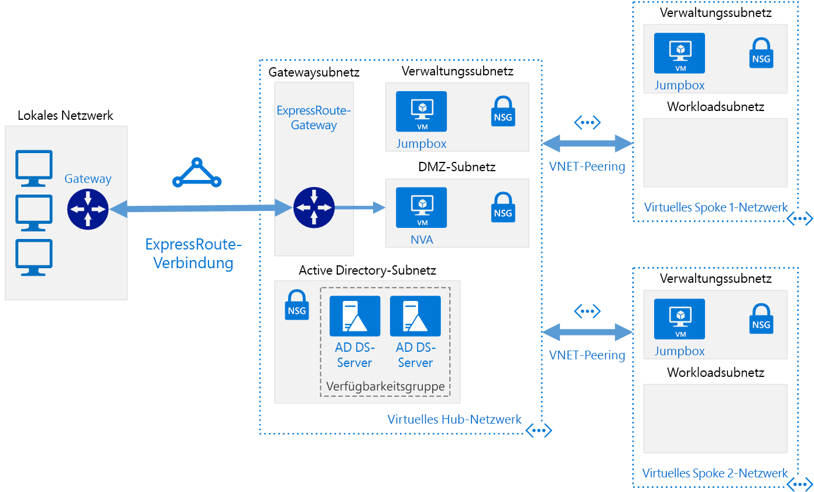

# <a name="implement-a-hub-spoke-network-topology-with-shared-services-in-azure"></a><span data-ttu-id="e141d-103">Implementieren einer Hub-Spoke-Netzwerktopologie mit gemeinsamen Diensten in Azure</span><span class="sxs-lookup"><span data-stu-id="e141d-103">Implement a hub-spoke network topology with shared services in Azure</span></span>

<span data-ttu-id="e141d-104">Diese Referenzarchitektur baut auf der [Hub-Spoke][guidance-hub-spoke]-Referenzarchitektur auf, um gemeinsame Dienste in den Hub einzubinden, die von allen Spokes genutzt werden können.</span><span class="sxs-lookup"><span data-stu-id="e141d-104">This reference architecture builds on the [hub-spoke][guidance-hub-spoke] reference architecture to include shared services in the hub that can be consumed by all spokes.</span></span> <span data-ttu-id="e141d-105">Als ersten Schritt zur Migration eines Rechenzentrums zur Cloud und Erstellung eines [virtuellen Rechenzentrums] müssen Sie zunächst die Dienste für Identität und Sicherheit freigeben.</span><span class="sxs-lookup"><span data-stu-id="e141d-105">As a first step toward migrating a datacenter to the cloud, and building a [virtual datacenter], the first services you need to share are identity and security.</span></span> <span data-ttu-id="e141d-106">Anhand dieser Referenzarchitektur wird veranschaulicht, wie Sie Ihre Active Directory-Dienste aus Ihrem lokalen Rechenzentrum auf Azure ausdehnen und ein virtuelles Netzwerkgerät (Network Virtual Appliance, NVA) hinzufügen, das in einer Hub-Spoke-Topologie als Firewall fungieren kann.</span><span class="sxs-lookup"><span data-stu-id="e141d-106">This reference architecture shows you how to extend your Active Directory services from your on-premises datacenter to Azure, and how to add a network virtual appliance (NVA) that can act as a firewall, in a hub-spoke topology.</span></span>  <span data-ttu-id="e141d-107">[**Stellen Sie diese Lösung bereit**](#deploy-the-solution).</span><span class="sxs-lookup"><span data-stu-id="e141d-107">[**Deploy this solution**](#deploy-the-solution).</span></span>

> [!NOTE]
> <span data-ttu-id="e141d-108">Dieses Szenario kann auch mithilfe von [Azure Firewall](/azure/firewall/), einem cloudbasierten Netzwerksicherheitsdienst, erreicht werden.</span><span class="sxs-lookup"><span data-stu-id="e141d-108">This scenario can also be accomplished using [Azure Firewall](/azure/firewall/), a cloud-based network security service.</span></span>



<span data-ttu-id="e141d-110">*Laden Sie eine [Visio-Datei][visio-download] mit dieser Architektur herunter.*</span><span class="sxs-lookup"><span data-stu-id="e141d-110">*Download a [Visio file][visio-download] of this architecture*</span></span>

<span data-ttu-id="e141d-111">Diese Topologie bietet unter anderem folgende Vorteile:</span><span class="sxs-lookup"><span data-stu-id="e141d-111">The benefits of this topology include:</span></span>

- <span data-ttu-id="e141d-112">**Kosteneinsparungen** durch die Zentralisierung von Diensten, die von mehreren Workloads (z.B. Network Virtual Appliances, kurz NVAs, und DNS-Servern) an einem einzigen Standort gemeinsam genutzt werden können</span><span class="sxs-lookup"><span data-stu-id="e141d-112">**Cost savings** by centralizing services that can be shared by multiple workloads, such as network virtual appliances (NVAs) and DNS servers, in a single location.</span></span>
- <span data-ttu-id="e141d-113">**Umgehung von Abonnementbeschränkungen** durch die Herstellung von Peeringverbindungen zwischen VNETs verschiedener Abonnements und dem zentralen Hub</span><span class="sxs-lookup"><span data-stu-id="e141d-113">**Overcome subscriptions limits** by peering VNets from different subscriptions to the central hub.</span></span>
- <span data-ttu-id="e141d-114">**Trennung der Belange** zwischen zentralen IT-Vorgängen (SecOps, InfraOps) und Workloads (DevOps)</span><span class="sxs-lookup"><span data-stu-id="e141d-114">**Separation of concerns** between central IT (SecOps, InfraOps) and workloads (DevOps).</span></span>

<span data-ttu-id="e141d-115">Typische Einsatzmöglichkeiten für diese Architektur sind Folgende:</span><span class="sxs-lookup"><span data-stu-id="e141d-115">Typical uses for this architecture include:</span></span>

- <span data-ttu-id="e141d-116">Workloads, die in verschiedenen Umgebungen wie Entwicklungs-, Test- und Produktionsumgebungen eingesetzt werden und gemeinsame Dienste wie DNS, IDS, NTP oder AD DS erfordern</span><span class="sxs-lookup"><span data-stu-id="e141d-116">Workloads deployed in different environments, such as development, testing, and production, that require shared services such as DNS, IDS, NTP, or AD DS.</span></span> <span data-ttu-id="e141d-117">Gemeinsame Dienste werden im Hub-VNET platziert, während die einzelnen Umgebungen in einem Spoke bereitgestellt werden, um die Isolation beizubehalten.</span><span class="sxs-lookup"><span data-stu-id="e141d-117">Shared services are placed in the hub VNet, while each environment is deployed to a spoke to maintain isolation.</span></span>
- <span data-ttu-id="e141d-118">Workloads, bei denen keine Konnektivität untereinander bestehen muss, die jedoch Zugriff auf gemeinsame Dienste erfordern</span><span class="sxs-lookup"><span data-stu-id="e141d-118">Workloads that do not require connectivity to each other, but require access to shared services.</span></span>
- <span data-ttu-id="e141d-119">Unternehmen, die auf eine zentrale Steuerung von Sicherheitsmechanismen (z.B. eine Firewall im Hub als DMZ) und eine getrennte Verwaltung von Workloads in den einzelnen Spokes angewiesen sind</span><span class="sxs-lookup"><span data-stu-id="e141d-119">Enterprises that require central control over security aspects, such as a firewall in the hub as a DMZ, and segregated management for the workloads in each spoke.</span></span>

## <a name="architecture"></a><span data-ttu-id="e141d-120">Architecture</span><span class="sxs-lookup"><span data-stu-id="e141d-120">Architecture</span></span>

<span data-ttu-id="e141d-121">Die Architektur umfasst die folgenden Komponenten.</span><span class="sxs-lookup"><span data-stu-id="e141d-121">The architecture consists of the following components.</span></span>

- <span data-ttu-id="e141d-122">**Lokales Netzwerk**.</span><span class="sxs-lookup"><span data-stu-id="e141d-122">**On-premises network**.</span></span> <span data-ttu-id="e141d-123">Ein in einer Organisation betriebenes privates lokales Netzwerk.</span><span class="sxs-lookup"><span data-stu-id="e141d-123">A private local-area network running within an organization.</span></span>

- <span data-ttu-id="e141d-124">**VPN-Gerät**:</span><span class="sxs-lookup"><span data-stu-id="e141d-124">**VPN device**.</span></span> <span data-ttu-id="e141d-125">Ein Gerät oder ein Dienst, der externe Konnektivität mit dem lokalen Netzwerk bereitstellt.</span><span class="sxs-lookup"><span data-stu-id="e141d-125">A device or service that provides external connectivity to the on-premises network.</span></span> <span data-ttu-id="e141d-126">Bei dem VPN-Gerät kann es sich um ein Hardwaregerät oder eine Softwarelösung wie den Routing- und RAS-Dienst (RRAS) unter Windows Server 2012 handeln.</span><span class="sxs-lookup"><span data-stu-id="e141d-126">The VPN device may be a hardware device, or a software solution such as the Routing and Remote Access Service (RRAS) in Windows Server 2012.</span></span> <span data-ttu-id="e141d-127">Eine Liste der unterstützten VPN-Appliances und Informationen zur Konfiguration ausgewählter VPN-Geräte für die Verbindung mit Azure finden Sie unter [Informationen zu VPN-Geräten und IPsec-/IKE-Parametern für VPN-Gatewayverbindungen zwischen Standorten][vpn-appliance].</span><span class="sxs-lookup"><span data-stu-id="e141d-127">For a list of supported VPN appliances and information on configuring selected VPN appliances for connecting to Azure, see [About VPN devices for Site-to-Site VPN Gateway connections][vpn-appliance].</span></span>

- <span data-ttu-id="e141d-128">**VPN-Gateway für ein virtuelles Netzwerk oder ExpressRoute-Gateway**:</span><span class="sxs-lookup"><span data-stu-id="e141d-128">**VPN virtual network gateway or ExpressRoute gateway**.</span></span> <span data-ttu-id="e141d-129">Über das Gateway für virtuelle Netzwerke kann das VNET zur Konnektivität mit Ihrem lokalen Netzwerk eine Verbindung mit dem VPN-Gerät oder eine ExpressRoute-Verbindung herstellen.</span><span class="sxs-lookup"><span data-stu-id="e141d-129">The virtual network gateway enables the VNet to connect to the VPN device, or ExpressRoute circuit, used for connectivity with your on-premises network.</span></span> <span data-ttu-id="e141d-130">Weitere Informationen finden Sie unter [Verbinden eines lokalen Netzwerks mit einem virtuellen Microsoft Azure-Netzwerk][connect-to-an-Azure-vnet].</span><span class="sxs-lookup"><span data-stu-id="e141d-130">For more information, see [Connect an on-premises network to a Microsoft Azure virtual network][connect-to-an-Azure-vnet].</span></span>

> [!NOTE]
> <span data-ttu-id="e141d-131">In den Bereitstellungsskripts für diese Referenzarchitektur werden ein VPN-Gateway für die Konnektivität und ein VNET in Azure verwendet, um Ihr lokales Netzwerk zu simulieren.</span><span class="sxs-lookup"><span data-stu-id="e141d-131">The deployment scripts for this reference architecture use a VPN gateway for connectivity, and a VNet in Azure to simulate your on-premises network.</span></span>

- <span data-ttu-id="e141d-132">**Hub-VNET**:</span><span class="sxs-lookup"><span data-stu-id="e141d-132">**Hub VNet**.</span></span> <span data-ttu-id="e141d-133">Das Azure-VNET, das als Hub in der Hub-Spoke-Topologie verwendet wird.</span><span class="sxs-lookup"><span data-stu-id="e141d-133">Azure VNet used as the hub in the hub-spoke topology.</span></span> <span data-ttu-id="e141d-134">Der Hub ist der zentrale Konnektivitätspunkt für Ihr lokales Netzwerk, mit dem Sie Dienste hosten, die von den verschiedenen in den Spoke-VNETs gehosteten Workloads genutzt werden können.</span><span class="sxs-lookup"><span data-stu-id="e141d-134">The hub is the central point of connectivity to your on-premises network, and a place to host services that can be consumed by the different workloads hosted in the spoke VNets.</span></span>

- <span data-ttu-id="e141d-135">**Gatewaysubnetz**:</span><span class="sxs-lookup"><span data-stu-id="e141d-135">**Gateway subnet**.</span></span> <span data-ttu-id="e141d-136">Die Gateways für die virtuellen Netzwerke befinden sich im selben Subnetz.</span><span class="sxs-lookup"><span data-stu-id="e141d-136">The virtual network gateways are held in the same subnet.</span></span>

- <span data-ttu-id="e141d-137">**Subnetz für gemeinsame Dienste**:</span><span class="sxs-lookup"><span data-stu-id="e141d-137">**Shared services subnet**.</span></span> <span data-ttu-id="e141d-138">Ein Subnetz im Hub-VNET, das für das Hosten von Diensten verwendet wird, die von allen Spokes gemeinsam genutzt werden können (z.B. DNS oder AD DS).</span><span class="sxs-lookup"><span data-stu-id="e141d-138">A subnet in the hub VNet used to host services that can be shared among all spokes, such as DNS or AD DS.</span></span>

- <span data-ttu-id="e141d-139">**DMZ-Subnetz**:</span><span class="sxs-lookup"><span data-stu-id="e141d-139">**DMZ subnet**.</span></span> <span data-ttu-id="e141d-140">Ein Subnetz im Hub-VNET zum Hosten von NVAs, die als Sicherheitseinrichtungen, z.B. Firewalls, dienen können.</span><span class="sxs-lookup"><span data-stu-id="e141d-140">A subnet in the hub VNet used to host NVAs that can act as security appliances, such as firewalls.</span></span>

- <span data-ttu-id="e141d-141">**Spoke-VNETs**:</span><span class="sxs-lookup"><span data-stu-id="e141d-141">**Spoke VNets**.</span></span> <span data-ttu-id="e141d-142">Ein oder mehrere Azure-VNETs, die als Spokes in der Hub-Spoke-Topologie verwendet werden.</span><span class="sxs-lookup"><span data-stu-id="e141d-142">One or more Azure VNets that are used as spokes in the hub-spoke topology.</span></span> <span data-ttu-id="e141d-143">Spokes können verwendet werden, um Workloads in ihren eigenen VNETs, die getrennt von anderen Spokes verwaltet werden, zu isolieren.</span><span class="sxs-lookup"><span data-stu-id="e141d-143">Spokes can be used to isolate workloads in their own VNets, managed separately from other spokes.</span></span> <span data-ttu-id="e141d-144">Jede Workload kann mehrere Schichten umfassen, wobei mehrere Subnetze über Azure Load Balancer verbunden sind.</span><span class="sxs-lookup"><span data-stu-id="e141d-144">Each workload might include multiple tiers, with multiple subnets connected through Azure load balancers.</span></span> <span data-ttu-id="e141d-145">Weitere Informationen zur Anwendungsinfrastruktur finden Sie unter [Ausführen von Windows-VM-Workloads][windows-vm-ra] und [Ausführen von Linux-VM-Workloads][linux-vm-ra].</span><span class="sxs-lookup"><span data-stu-id="e141d-145">For more information about the application infrastructure, see [Running Windows VM workloads][windows-vm-ra] and [Running Linux VM workloads][linux-vm-ra].</span></span>

- <span data-ttu-id="e141d-146">**VNET-Peering**:</span><span class="sxs-lookup"><span data-stu-id="e141d-146">**VNet peering**.</span></span> <span data-ttu-id="e141d-147">Über eine [Peeringverbindung][vnet-peering] können zwei VNETs in derselben Azure-Region miteinander verbunden werden.</span><span class="sxs-lookup"><span data-stu-id="e141d-147">Two VNets in the same Azure region can be connected using a [peering connection][vnet-peering].</span></span> <span data-ttu-id="e141d-148">Peeringverbindungen sind nicht-transitive Verbindungen zwischen VNETs mit niedrigen Latenzen.</span><span class="sxs-lookup"><span data-stu-id="e141d-148">Peering connections are non-transitive, low latency connections between VNets.</span></span> <span data-ttu-id="e141d-149">Sobald eine Peeringverbindung hergestellt wurde, tauschen die VNETs ohne Einsatz eines Routers Datenverkehr über den Azure-Backbone aus.</span><span class="sxs-lookup"><span data-stu-id="e141d-149">Once peered, the VNets exchange traffic by using the Azure backbone, without the need for a router.</span></span> <span data-ttu-id="e141d-150">In einer Hub-Spoke-Netzwerktopologie wird durch VNET-Peering eine Verbindung zwischen dem Hub und den einzelnen Spokes hergestellt.</span><span class="sxs-lookup"><span data-stu-id="e141d-150">In a hub-spoke network topology, you use VNet peering to connect the hub to each spoke.</span></span>

> [!NOTE]
> <span data-ttu-id="e141d-151">In diesem Artikel werden ausschließlich [Resource Manager](/azure/azure-resource-manager/resource-group-overview)-Bereitstellungen behandelt, Sie können jedoch auch eine Verbindung zwischen einem klassischen VNET und einem Resource Manager-VNET im selben Abonnement herstellen.</span><span class="sxs-lookup"><span data-stu-id="e141d-151">This article only covers [Resource Manager](/azure/azure-resource-manager/resource-group-overview) deployments, but you can also connect a classic VNet to a Resource Manager VNet in the same subscription.</span></span> <span data-ttu-id="e141d-152">Auf diese Weise können Ihre Spokes klassische Bereitstellungen hosten und trotzdem von gemeinsamen Diensten im Hub profitieren.</span><span class="sxs-lookup"><span data-stu-id="e141d-152">That way, your spokes can host classic deployments and still benefit from services shared in the hub.</span></span>

## <a name="recommendations"></a><span data-ttu-id="e141d-153">Empfehlungen</span><span class="sxs-lookup"><span data-stu-id="e141d-153">Recommendations</span></span>

<span data-ttu-id="e141d-154">Alle Empfehlungen für die [Hub-Spoke][guidance-hub-spoke]-Referenzarchitektur gelten auch für die Referenzarchitektur für gemeinsame Dienste.</span><span class="sxs-lookup"><span data-stu-id="e141d-154">All the recommendations for the [hub-spoke][guidance-hub-spoke] reference architecture also apply to the shared services reference architecture.</span></span>

<span data-ttu-id="e141d-155">Außerdem gelten die folgenden Empfehlungen für die meisten Szenarien mit gemeinsamen Diensten.</span><span class="sxs-lookup"><span data-stu-id="e141d-155">Also, the following recommendations apply for most scenarios under shared services.</span></span> <span data-ttu-id="e141d-156">Sofern Sie keine besonderen Anforderungen haben, die Vorrang haben, sollten Sie diese Empfehlungen befolgen.</span><span class="sxs-lookup"><span data-stu-id="e141d-156">Follow these recommendations unless you have a specific requirement that overrides them.</span></span>

### <a name="identity"></a><span data-ttu-id="e141d-157">Identity</span><span class="sxs-lookup"><span data-stu-id="e141d-157">Identity</span></span>

<span data-ttu-id="e141d-158">Die meisten Organisationen großer Unternehmen verfügen im lokalen Rechenzentrum über eine AD DS-Umgebung (Active Directory Domain Services).</span><span class="sxs-lookup"><span data-stu-id="e141d-158">Most enterprise organizations have an Active Directory Directory Services (ADDS) environment in their on-premises datacenter.</span></span> <span data-ttu-id="e141d-159">Um die Verwaltung von Assets zu ermöglichen, die aus Ihrem lokalen Netzwerk nach Azure verschoben werden und von AD DS abhängig sind, ist es ratsam, AD DS-Domänencontroller in Azure zu hosten.</span><span class="sxs-lookup"><span data-stu-id="e141d-159">To facilitate management of assets moved to Azure from your on-premises network that depend on ADDS, it is recommended to host ADDS domain controllers in Azure.</span></span>

<span data-ttu-id="e141d-160">Falls Sie Gruppenrichtlinienobjekte nutzen, die Sie für Azure und Ihre lokale Umgebung separat steuern möchten, sollten Sie für jede Azure-Region einen anderen AD-Standort verwenden.</span><span class="sxs-lookup"><span data-stu-id="e141d-160">If you make use of Group Policy Objects, that you want to control separately for Azure and your on-premises environment, use a different AD site for each Azure region.</span></span> <span data-ttu-id="e141d-161">Ordnen Sie Ihre Domänencontroller in einem zentralen VNET (Hub) an, auf das abhängige Workloads zugreifen können.</span><span class="sxs-lookup"><span data-stu-id="e141d-161">Place your domain controllers in a central VNet (hub) that dependent workloads can access.</span></span>

### <a name="security"></a><span data-ttu-id="e141d-162">Sicherheit</span><span class="sxs-lookup"><span data-stu-id="e141d-162">Security</span></span>

<span data-ttu-id="e141d-163">Wenn Sie Workloads aus Ihrer lokalen Umgebung nach Azure verschieben, müssen einige dieser Workloads auf VMs gehostet werden.</span><span class="sxs-lookup"><span data-stu-id="e141d-163">As you move workloads from your on-premises environment to Azure, some of these workloads will require to be hosted in VMs.</span></span> <span data-ttu-id="e141d-164">Aus Gründen der Konformität müssen Sie für Datenverkehr, der diese Workloads durchläuft, unter Umständen Einschränkungen erzwingen.</span><span class="sxs-lookup"><span data-stu-id="e141d-164">For compliance reasons, you may need to enforce restrictions on traffic traversing those workloads.</span></span>

<span data-ttu-id="e141d-165">Sie können virtuelle Netzwerkgeräte in Azure verwenden, um unterschiedliche Arten von Sicherheits- und Leistungsdiensten zu hosten.</span><span class="sxs-lookup"><span data-stu-id="e141d-165">You can use network virtual appliances (NVAs) in Azure to host different types of security and performance services.</span></span> <span data-ttu-id="e141d-166">Wenn Sie derzeit mit einem bestimmten Satz von lokalen Geräten vertraut sind, ist es ratsam, jeweils die gleichen virtualisierten Geräte in Azure zu verwenden (falls zutreffend).</span><span class="sxs-lookup"><span data-stu-id="e141d-166">If you are familiar with a given set of appliances on-premises today, it is recommended to use the same virtualized appliances in Azure, where applicable.</span></span>

> [!NOTE]
> <span data-ttu-id="e141d-167">Für die Bereitstellungsskripts dieser Referenzarchitektur wird eine Ubuntu-VM mit aktivierter IP-Weiterleitung verwendet, um ein virtuelles Netzwerkgerät zu imitieren.</span><span class="sxs-lookup"><span data-stu-id="e141d-167">The deployment scripts for this reference architecture use an Ubuntu VM with IP forwarding enabled to mimic a network virtual appliance.</span></span>

## <a name="considerations"></a><span data-ttu-id="e141d-168">Überlegungen</span><span class="sxs-lookup"><span data-stu-id="e141d-168">Considerations</span></span>

### <a name="overcoming-vnet-peering-limits"></a><span data-ttu-id="e141d-169">Umgehung von VNET-Peeringbeschränkungen</span><span class="sxs-lookup"><span data-stu-id="e141d-169">Overcoming VNet peering limits</span></span>

<span data-ttu-id="e141d-170">Stellen Sie sicher, dass Sie die [Begrenzung der Anzahl von VNET-Peerings pro VNET][vnet-peering-limit] in Azure einhalten.</span><span class="sxs-lookup"><span data-stu-id="e141d-170">Make sure you consider the [limitation on number of VNets peerings per VNet][vnet-peering-limit] in Azure.</span></span> <span data-ttu-id="e141d-171">Falls Sie mehr Spokes als die maximal zulässige Anzahl benötigen, sollten Sie eventuell eine Hub-Spoke-Hub-Spoke-Topologie erstellen, bei der die erste Ebene von Spokes auch als Hub fungiert.</span><span class="sxs-lookup"><span data-stu-id="e141d-171">If you decide you need more spokes than the limit will allow, consider creating a hub-spoke-hub-spoke topology, where the first level of spokes also act as hubs.</span></span> <span data-ttu-id="e141d-172">Im folgenden Diagramm wird diese Vorgehensweise veranschaulicht.</span><span class="sxs-lookup"><span data-stu-id="e141d-172">The following diagram shows this approach.</span></span>


<span data-ttu-id="e141d-174">Berücksichtigen Sie auch die Dienste, die im Hub gemeinsam genutzt werden, um sicherzustellen, dass sich der Hub für eine größere Anzahl von Spokes skalieren lässt.</span><span class="sxs-lookup"><span data-stu-id="e141d-174">Also consider what services are shared in the hub, to ensure the hub scales for a larger number of spokes.</span></span> <span data-ttu-id="e141d-175">Wenn Ihr Hub beispielsweise Firewalldienste bereitstellt, sollten Sie beim Hinzufügen mehrerer Spokes die Bandbreitenbeschränkungen Ihrer Firewalllösung berücksichtigen.</span><span class="sxs-lookup"><span data-stu-id="e141d-175">For instance, if your hub provides firewall services, consider the bandwidth limits of your firewall solution when adding multiple spokes.</span></span> <span data-ttu-id="e141d-176">Es wird empfohlen, einige dieser gemeinsamen Dienste auf eine zweite Hubebene zu verlagern.</span><span class="sxs-lookup"><span data-stu-id="e141d-176">You might want to move some of these shared services to a second level of hubs.</span></span>

## <a name="deploy-the-solution"></a><span data-ttu-id="e141d-177">Bereitstellen der Lösung</span><span class="sxs-lookup"><span data-stu-id="e141d-177">Deploy the solution</span></span>

<span data-ttu-id="e141d-178">Eine Bereitstellung für diese Architektur ist auf [GitHub][ref-arch-repo] verfügbar.</span><span class="sxs-lookup"><span data-stu-id="e141d-178">A deployment for this architecture is available on [GitHub][ref-arch-repo].</span></span> <span data-ttu-id="e141d-179">Die Bereitstellung erstellt die folgenden Ressourcengruppen in Ihrem Abonnement:</span><span class="sxs-lookup"><span data-stu-id="e141d-179">The deployment creates the following resource groups in your subscription:</span></span>

- <span data-ttu-id="e141d-180">hub-adds-rg</span><span class="sxs-lookup"><span data-stu-id="e141d-180">hub-adds-rg</span></span>
- <span data-ttu-id="e141d-181">hub-nva-rg</span><span class="sxs-lookup"><span data-stu-id="e141d-181">hub-nva-rg</span></span>
- <span data-ttu-id="e141d-182">hub-vnet-rg</span><span class="sxs-lookup"><span data-stu-id="e141d-182">hub-vnet-rg</span></span>
- <span data-ttu-id="e141d-183">onprem-vnet-rg</span><span class="sxs-lookup"><span data-stu-id="e141d-183">onprem-vnet-rg</span></span>
- <span data-ttu-id="e141d-184">spoke1-vnet-rg</span><span class="sxs-lookup"><span data-stu-id="e141d-184">spoke1-vnet-rg</span></span>
- <span data-ttu-id="e141d-185">spoke2-vnet-rg</span><span class="sxs-lookup"><span data-stu-id="e141d-185">spoke2-vnet-rg</span></span>

<span data-ttu-id="e141d-186">Die Vorlagenparameterdateien beziehen sich auf diese Namen, d.h. wenn Sie sie ändern, müssen Sie die Parameterdateien entsprechend aktualisieren.</span><span class="sxs-lookup"><span data-stu-id="e141d-186">The template parameter files refer to these names, so if you change them, update the parameter files to match.</span></span>

### <a name="prerequisites"></a><span data-ttu-id="e141d-187">Voraussetzungen</span><span class="sxs-lookup"><span data-stu-id="e141d-187">Prerequisites</span></span>

[!INCLUDE [ref-arch-prerequisites.md](../../../includes/ref-arch-prerequisites.md)]

### <a name="deploy-the-simulated-on-premises-datacenter-using-azbb"></a><span data-ttu-id="e141d-188">Bereitstellen des simulierten lokalen Rechenzentrums mit azbb</span><span class="sxs-lookup"><span data-stu-id="e141d-188">Deploy the simulated on-premises datacenter using azbb</span></span>

<span data-ttu-id="e141d-189">In diesem Schritt wird das simulierte lokale Datencenter als Azure-VNET bereitgestellt.</span><span class="sxs-lookup"><span data-stu-id="e141d-189">This step deploys the simulated on-premises datacenter as an Azure VNet.</span></span>

1. <span data-ttu-id="e141d-190">Navigieren Sie zum Ordner `hybrid-networking\shared-services-stack\` des GitHub-Repositorys.</span><span class="sxs-lookup"><span data-stu-id="e141d-190">Navigate to the `hybrid-networking\shared-services-stack\` folder of the GitHub repository.</span></span>

2. <span data-ttu-id="e141d-191">Öffnen Sie die Datei `onprem.json` .</span><span class="sxs-lookup"><span data-stu-id="e141d-191">Open the `onprem.json` file.</span></span>

3. <span data-ttu-id="e141d-192">Suchen Sie nach allen Instanzen von `UserName`, `adminUserName`, `Password` und `adminPassword`.</span><span class="sxs-lookup"><span data-stu-id="e141d-192">Search for all instances of `UserName`, `adminUserName`,`Password`, and `adminPassword`.</span></span> <span data-ttu-id="e141d-193">Geben Sie in den Parametern Werte für den Benutzernamen und das Kennwort ein, und speichern Sie die Datei.</span><span class="sxs-lookup"><span data-stu-id="e141d-193">Enter values for the user name and password in the parameters and save the file.</span></span>

4. <span data-ttu-id="e141d-194">Führen Sie den folgenden Befehl aus:</span><span class="sxs-lookup"><span data-stu-id="e141d-194">Run the following command:</span></span>

   ```bash
   azbb -s <subscription_id> -g onprem-vnet-rg -l <location> -p onprem.json --deploy
   ```

5. <span data-ttu-id="e141d-195">Warten Sie, bis die Bereitstellung abgeschlossen ist.</span><span class="sxs-lookup"><span data-stu-id="e141d-195">Wait for the deployment to finish.</span></span> <span data-ttu-id="e141d-196">Bei dieser Bereitstellung werden ein virtuelles Netzwerk, ein virtueller Windows-Computer und ein VPN-Gateway erstellt.</span><span class="sxs-lookup"><span data-stu-id="e141d-196">This deployment creates a virtual network, a virtual machine running Windows, and a VPN gateway.</span></span> <span data-ttu-id="e141d-197">Die Erstellung des VPN-Gateways kann mehr als 40 Minuten in Anspruch nehmen.</span><span class="sxs-lookup"><span data-stu-id="e141d-197">The VPN gateway creation can take more than 40 minutes to complete.</span></span>

### <a name="deploy-the-hub-vnet"></a><span data-ttu-id="e141d-198">Bereitstellen des Hub-VNet</span><span class="sxs-lookup"><span data-stu-id="e141d-198">Deploy the hub VNet</span></span>

<span data-ttu-id="e141d-199">In diesem Schritt wird das Hub-VNET bereitgestellt und mit dem simulierten lokalen VNET verbunden.</span><span class="sxs-lookup"><span data-stu-id="e141d-199">This step deploys the hub VNet and connects it to the simulated on-premises VNet.</span></span>

1. <span data-ttu-id="e141d-200">Öffnen Sie die Datei `hub-vnet.json` .</span><span class="sxs-lookup"><span data-stu-id="e141d-200">Open the `hub-vnet.json` file.</span></span>

2. <span data-ttu-id="e141d-201">Suchen Sie nach `adminPassword`, und geben Sie in den Parametern einen Benutzernamen und ein Kennwort ein.</span><span class="sxs-lookup"><span data-stu-id="e141d-201">Search for `adminPassword` and enter a user name and password in the parameters.</span></span>

3. <span data-ttu-id="e141d-202">Suchen Sie nach allen Instanzen von `sharedKey`, und geben Sie einen Wert für einen freigegebenen Schlüssel ein.</span><span class="sxs-lookup"><span data-stu-id="e141d-202">Search for all instances of `sharedKey` and enter a value for a shared key.</span></span> <span data-ttu-id="e141d-203">Speichern Sie die Datei .</span><span class="sxs-lookup"><span data-stu-id="e141d-203">Save the file.</span></span>

   ```json
   "sharedKey": "abc123",
   ```

4. <span data-ttu-id="e141d-204">Führen Sie den folgenden Befehl aus:</span><span class="sxs-lookup"><span data-stu-id="e141d-204">Run the following command:</span></span>

   ```bash
   azbb -s <subscription_id> -g hub-vnet-rg -l <location> -p hub-vnet.json --deploy
   ```

5. <span data-ttu-id="e141d-205">Warten Sie, bis die Bereitstellung abgeschlossen ist.</span><span class="sxs-lookup"><span data-stu-id="e141d-205">Wait for the deployment to finish.</span></span> <span data-ttu-id="e141d-206">Bei dieser Bereitstellung werden ein virtuelles Netzwerk, ein virtueller Computer, ein VPN-Gateway und eine Verbindung mit dem im vorherigen Abschnitt erstellten Gateway erstellt.</span><span class="sxs-lookup"><span data-stu-id="e141d-206">This deployment creates a virtual network, a virtual machine, a VPN gateway, and a connection to the gateway created in the previous section.</span></span> <span data-ttu-id="e141d-207">Die Erstellung des VPN-Gateways kann mehr als 40 Minuten in Anspruch nehmen.</span><span class="sxs-lookup"><span data-stu-id="e141d-207">The VPN gateway can take more than 40 minutes to complete.</span></span>

### <a name="deploy-ad-ds-in-azure"></a><span data-ttu-id="e141d-208">Bereitstellen von AD DS in Azure</span><span class="sxs-lookup"><span data-stu-id="e141d-208">Deploy AD DS in Azure</span></span>

<span data-ttu-id="e141d-209">In diesem Schritt werden AD DS-Domänencontroller in Azure bereitgestellt.</span><span class="sxs-lookup"><span data-stu-id="e141d-209">This step deploys AD DS domain controllers in Azure.</span></span>

1. <span data-ttu-id="e141d-210">Öffnen Sie die Datei `hub-adds.json` .</span><span class="sxs-lookup"><span data-stu-id="e141d-210">Open the `hub-adds.json` file.</span></span>

2. <span data-ttu-id="e141d-211">Suchen Sie nach allen Instanzen von `Password` und `adminPassword`.</span><span class="sxs-lookup"><span data-stu-id="e141d-211">Search for all instances of `Password` and `adminPassword`.</span></span> <span data-ttu-id="e141d-212">Geben Sie in den Parametern Werte für den Benutzernamen und das Kennwort ein, und speichern Sie die Datei.</span><span class="sxs-lookup"><span data-stu-id="e141d-212">Enter values for the user name and password in the parameters and save the file.</span></span>

3. <span data-ttu-id="e141d-213">Führen Sie den folgenden Befehl aus:</span><span class="sxs-lookup"><span data-stu-id="e141d-213">Run the following command:</span></span>

   ```bash
   azbb -s <subscription_id> -g hub-adds-rg -l <location> -p hub-adds.json --deploy
   ```

<span data-ttu-id="e141d-214">Dieser Bereitstellungsschritt kann einige Minuten dauern, da die beiden virtuellen Computer der Domäne hinzugefügt werden, die im simulierten lokalen Datencenter gehostet wird, und AD DS darauf installiert wird.</span><span class="sxs-lookup"><span data-stu-id="e141d-214">This deployment step may take several minutes, because it joins the two VMs to the domain hosted in the simulated on-premises datacenter, and installs AD DS on them.</span></span>

### <a name="deploy-the-spoke-vnets"></a><span data-ttu-id="e141d-215">Bereitstellen der Spoke-VNets</span><span class="sxs-lookup"><span data-stu-id="e141d-215">Deploy the spoke VNets</span></span>

<span data-ttu-id="e141d-216">In diesem Schritt werden die Spoke-VNETs bereitgestellt.</span><span class="sxs-lookup"><span data-stu-id="e141d-216">This step deploys the spoke VNets.</span></span>

1. <span data-ttu-id="e141d-217">Öffnen Sie die Datei `spoke1.json` .</span><span class="sxs-lookup"><span data-stu-id="e141d-217">Open the `spoke1.json` file.</span></span>

2. <span data-ttu-id="e141d-218">Suchen Sie nach `adminPassword`, und geben Sie in den Parametern einen Benutzernamen und ein Kennwort ein.</span><span class="sxs-lookup"><span data-stu-id="e141d-218">Search for `adminPassword` and enter a user name and password in the parameters.</span></span>

3. <span data-ttu-id="e141d-219">Führen Sie den folgenden Befehl aus:</span><span class="sxs-lookup"><span data-stu-id="e141d-219">Run the following command:</span></span>

   ```bash
   azbb -s <subscription_id> -g spoke1-vnet-rg -l <location> -p spoke1.json --deploy
   ```

4. <span data-ttu-id="e141d-220">Wiederholen Sie die Schritte 1 und 2 für die Datei `spoke2.json`.</span><span class="sxs-lookup"><span data-stu-id="e141d-220">Repeat steps 1 and 2 for the file `spoke2.json`.</span></span>

5. <span data-ttu-id="e141d-221">Führen Sie den folgenden Befehl aus:</span><span class="sxs-lookup"><span data-stu-id="e141d-221">Run the following command:</span></span>

   ```bash
   azbb -s <subscription_id> -g spoke2-vnet-rg -l <location> -p spoke2.json --deploy
   ```

### <a name="peer-the-hub-vnet-to-the-spoke-vnets"></a><span data-ttu-id="e141d-222">Verknüpfen des Hub-VNETs mit den Spoke-VNETs</span><span class="sxs-lookup"><span data-stu-id="e141d-222">Peer the hub VNet to the spoke VNets</span></span>

<span data-ttu-id="e141d-223">Führen Sie den folgenden Befehl aus, um eine Peeringverbindung zwischen dem Hub-VNET und den Spoke-VNETs herzustellen:</span><span class="sxs-lookup"><span data-stu-id="e141d-223">To create a peering connection from the hub VNet to the spoke VNets, run the following command:</span></span>

```bash
azbb -s <subscription_id> -g hub-vnet-rg -l <location> -p hub-vnet-peering.json --deploy
```

### <a name="deploy-the-nva"></a><span data-ttu-id="e141d-224">Bereitstellen des NVA</span><span class="sxs-lookup"><span data-stu-id="e141d-224">Deploy the NVA</span></span>

<span data-ttu-id="e141d-225">In diesem Schritt wird ein NVA im Subnetz `dmz` bereitgestellt.</span><span class="sxs-lookup"><span data-stu-id="e141d-225">This step deploys an NVA in the `dmz` subnet.</span></span>

1. <span data-ttu-id="e141d-226">Öffnen Sie die Datei `hub-nva.json` .</span><span class="sxs-lookup"><span data-stu-id="e141d-226">Open the `hub-nva.json` file.</span></span>

2. <span data-ttu-id="e141d-227">Suchen Sie nach `adminPassword`, und geben Sie in den Parametern einen Benutzernamen und ein Kennwort ein.</span><span class="sxs-lookup"><span data-stu-id="e141d-227">Search for `adminPassword` and enter a user name and password in the parameters.</span></span>

3. <span data-ttu-id="e141d-228">Führen Sie den folgenden Befehl aus:</span><span class="sxs-lookup"><span data-stu-id="e141d-228">Run the following command:</span></span>

   ```bash
   azbb -s <subscription_id> -g hub-nva-rg -l <location> -p hub-nva.json --deploy
   ```

### <a name="test-connectivity"></a><span data-ttu-id="e141d-229">Testen der Konnektivität</span><span class="sxs-lookup"><span data-stu-id="e141d-229">Test connectivity</span></span>

<span data-ttu-id="e141d-230">Testen Sie die Konnektivität zwischen der simulierten lokalen Umgebung und dem Hub-VNET.</span><span class="sxs-lookup"><span data-stu-id="e141d-230">Test conectivity from the simulated on-premises environment to the hub VNet.</span></span>

1. <span data-ttu-id="e141d-231">Suchen Sie im Azure-Portal die VM namens `jb-vm1` in der `onprem-jb-rg`-Ressourcengruppe.</span><span class="sxs-lookup"><span data-stu-id="e141d-231">Use the Azure portal to find the VM named `jb-vm1` in the `onprem-jb-rg` resource group.</span></span>

2. <span data-ttu-id="e141d-232">Klicke Sie auf `Connect`, um eine Remotedesktopsitzung mit der VM zu öffnen.</span><span class="sxs-lookup"><span data-stu-id="e141d-232">Click `Connect` to open a remote desktop session to the VM.</span></span> <span data-ttu-id="e141d-233">Verwenden Sie das Kennwort, das Sie in der `onprem.json`-Parameterdatei angegeben haben.</span><span class="sxs-lookup"><span data-stu-id="e141d-233">Use the password that you specified in the `onprem.json` parameter file.</span></span>

3. <span data-ttu-id="e141d-234">Öffnen Sie auf der VM eine PowerShell-Konsole, und verwenden Sie das `Test-NetConnection`-Cmdlet, um sicherzustellen, dass Sie eine Verbindung mit der Jumpbox-VM im Hub-VNet herstellen können.</span><span class="sxs-lookup"><span data-stu-id="e141d-234">Open a PowerShell console in the VM, and use the `Test-NetConnection` cmdlet to verify that you can connect to the jumpbox VM in the hub VNet.</span></span>

   ```powershell
   Test-NetConnection 10.0.0.68 -CommonTCPPort RDP
   ```

<span data-ttu-id="e141d-235">Die Ausgabe sollte in etwa wie folgt aussehen:</span><span class="sxs-lookup"><span data-stu-id="e141d-235">The output should look similar to the following:</span></span>

```powershell
ComputerName     : 10.0.0.68
RemoteAddress    : 10.0.0.68
RemotePort       : 3389
InterfaceAlias   : Ethernet 2
SourceAddress    : 192.168.1.000
TcpTestSucceeded : True
```

> [!NOTE]
> <span data-ttu-id="e141d-236">Standardmäßig lassen Windows Server-VMs in Azure keine ICMP-Antworten zu.</span><span class="sxs-lookup"><span data-stu-id="e141d-236">By default, Windows Server VMs do not allow ICMP responses in Azure.</span></span> <span data-ttu-id="e141d-237">Wenn Sie `ping` zum Testen der Konnektivität nutzen möchten, müssen Sie für jede VM ICMP-Datenverkehr in der erweiterten Windows-Firewall aktivieren.</span><span class="sxs-lookup"><span data-stu-id="e141d-237">If you want to use `ping` to test connectivity, you need to enable ICMP traffic in the Windows Advanced Firewall for each VM.</span></span>

<span data-ttu-id="e141d-238">Wiederholen Sie die gleichen Schritte, um die Konnektivität mit den Spoke-VNETs zu testen:</span><span class="sxs-lookup"><span data-stu-id="e141d-238">Repeat the sames steps to test connectivity to the spoke VNets:</span></span>

```powershell
Test-NetConnection 10.1.0.68 -CommonTCPPort RDP
Test-NetConnection 10.2.0.68 -CommonTCPPort RDP
```

<!-- links -->

[azure-cli-2]: /azure/install-azure-cli
[azbb]: https://github.com/mspnp/template-building-blocks/wiki/Install-Azure-Building-Blocks
[guidance-hub-spoke]: ./hub-spoke.md
[azure-vpn-gateway]: /azure/vpn-gateway/vpn-gateway-about-vpngateways
[best-practices-security]: /azure/best-practices-network-securit
[connect-to-an-Azure-vnet]: https://technet.microsoft.com/library/dn786406.aspx
[guidance-expressroute]: ./expressroute.md
[guidance-vpn]: ./vpn.md
[linux-vm-ra]: ../virtual-machines-linux/index.md
[hybrid-ha]: ./expressroute-vpn-failover.md
[naming conventions]: /azure/guidance/guidance-naming-conventions
[resource-manager-overview]: /azure/azure-resource-manager/resource-group-overview
[virtuellen Rechenzentrums]: https://aka.ms/vdc
[virtual datacenter]: https://aka.ms/vdc
[vnet-peering]: /azure/virtual-network/virtual-network-peering-overview
[vnet-peering-limit]: /azure/azure-subscription-service-limits#networking-limits
[vpn-appliance]: /azure/vpn-gateway/vpn-gateway-about-vpn-devices
[windows-vm-ra]: ../virtual-machines-windows/index.md

[visio-download]: https://archcenter.blob.core.windows.net/cdn/hybrid-network-hub-spoke.vsdx
[ref-arch-repo]: https://github.com/mspnp/reference-architectures
