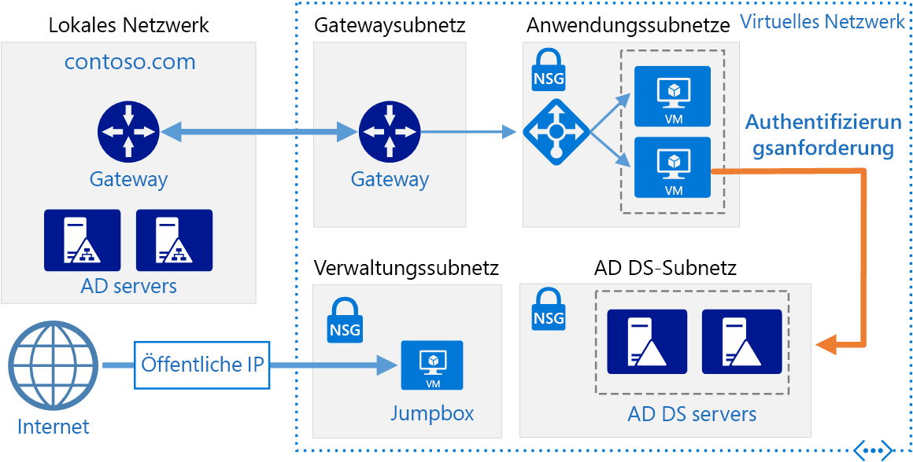
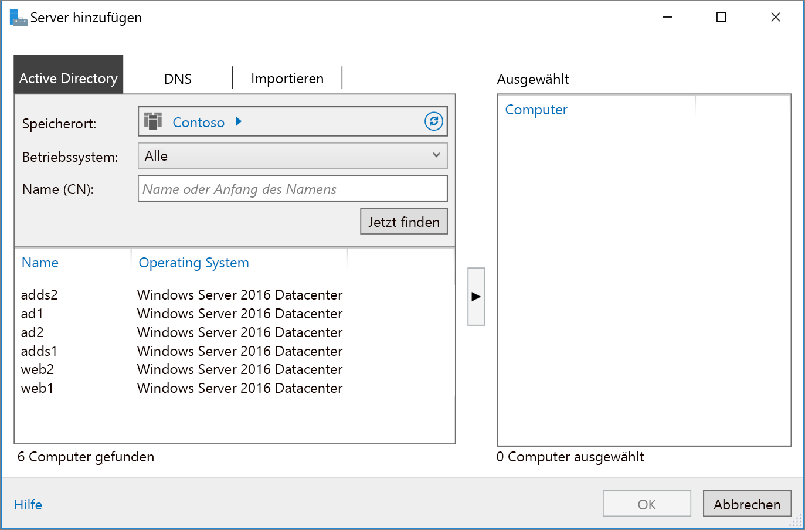

# <a name="extend-active-directory-domain-services-ad-ds-to-azure"></a><span data-ttu-id="a9fcd-103">Erweitern von Active Directory Domain Services (AD DS) auf Azure</span><span class="sxs-lookup"><span data-stu-id="a9fcd-103">Extend Active Directory Domain Services (AD DS) to Azure</span></span>

<span data-ttu-id="a9fcd-104">Diese Referenzarchitektur zeigt, wie Sie Ihre Active Directory-Umgebung nach Azure erweitern, um verteilte Authentifizierungsdienste mit Active Directory Domain Services (AD DS) bereitzustellen.</span><span class="sxs-lookup"><span data-stu-id="a9fcd-104">This reference architecture shows how to extend your Active Directory environment to Azure to provide distributed authentication services using Active Directory Domain Services (AD DS).</span></span> <span data-ttu-id="a9fcd-105">[**Stellen Sie diese Lösung bereit**](#deploy-the-solution).</span><span class="sxs-lookup"><span data-stu-id="a9fcd-105">[**Deploy this solution**](#deploy-the-solution).</span></span>



<span data-ttu-id="a9fcd-107">*Laden Sie eine [Visio-Datei][visio-download] mit dieser Architektur herunter.*</span><span class="sxs-lookup"><span data-stu-id="a9fcd-107">*Download a [Visio file][visio-download] of this architecture.*</span></span>

<span data-ttu-id="a9fcd-108">AD DS dient zum Authentifizieren von Benutzern, Computern, Anwendungen oder anderen Identitäten in einer Sicherheitsdomäne.</span><span class="sxs-lookup"><span data-stu-id="a9fcd-108">AD DS is used to authenticate user, computer, application, or other identities that are included in a security domain.</span></span> <span data-ttu-id="a9fcd-109">Ein lokales Hosting ist zwar möglich, aber wenn Ihre Anwendung teilweise lokal und teilweise in Azure gehostet wird, ist es möglicherweise effizienter, diese Funktionalität in Azure zu replizieren.</span><span class="sxs-lookup"><span data-stu-id="a9fcd-109">It can be hosted on-premises, but if your application is hosted partly on-premises and partly in Azure, it may be more efficient to replicate this functionality in Azure.</span></span> <span data-ttu-id="a9fcd-110">Dies kann Verzögerungen verringern, die durch das Senden der Authentifizierung und von lokalen Autorisierungsanforderungen aus der Cloud zurück in die lokale AD DS-Instanz auftreten.</span><span class="sxs-lookup"><span data-stu-id="a9fcd-110">This can reduce the latency caused by sending authentication and local authorization requests from the cloud back to AD DS running on-premises.</span></span>

<span data-ttu-id="a9fcd-111">Diese Architektur wird häufig verwendet, wenn das lokale Netzwerk und das virtuelle Azure-Netzwerk über eine VPN- oder ExpressRoute-Verbindung miteinander verbunden sind.</span><span class="sxs-lookup"><span data-stu-id="a9fcd-111">This architecture is commonly used when the on-premises network and the Azure virtual network are connected by a VPN or ExpressRoute connection.</span></span> <span data-ttu-id="a9fcd-112">Diese Architektur unterstützt auch die bidirektionale Replikation, sodass Änderungen sowohl lokal als auch in der Cloud vorgenommen werden können und dabei beide Quellen konsistent bleiben.</span><span class="sxs-lookup"><span data-stu-id="a9fcd-112">This architecture also supports bidirectional replication, meaning changes can be made either on-premises or in the cloud, and both sources will be kept consistent.</span></span> <span data-ttu-id="a9fcd-113">Typische Einsatzfälle für diese Architektur sind Hybridanwendungen, bei denen die Funktionalität lokal und in Azure bereitgestellt wird und Anwendungen und Dienste die Authentifizierung mit Active Directory durchführen.</span><span class="sxs-lookup"><span data-stu-id="a9fcd-113">Typical uses for this architecture include hybrid applications in which functionality is distributed between on-premises and Azure, and applications and services that perform authentication using Active Directory.</span></span>

<span data-ttu-id="a9fcd-114">Weitere Überlegungen finden Sie unter [Auswählen einer Lösung für die Integration einer lokalen Active Directory-Instanz in Azure][considerations].</span><span class="sxs-lookup"><span data-stu-id="a9fcd-114">For additional considerations, see [Choose a solution for integrating on-premises Active Directory with Azure][considerations].</span></span>

## <a name="architecture"></a><span data-ttu-id="a9fcd-115">Architecture</span><span class="sxs-lookup"><span data-stu-id="a9fcd-115">Architecture</span></span>

<span data-ttu-id="a9fcd-116">Diese Architektur erweitert die in [DMZ zwischen Azure und dem Internet][implementing-a-secure-hybrid-network-architecture-with-internet-access] gezeigte Architektur.</span><span class="sxs-lookup"><span data-stu-id="a9fcd-116">This architecture extends the architecture shown in [DMZ between Azure and the Internet][implementing-a-secure-hybrid-network-architecture-with-internet-access].</span></span> <span data-ttu-id="a9fcd-117">Sie enthält die folgenden Komponenten.</span><span class="sxs-lookup"><span data-stu-id="a9fcd-117">It has the following components.</span></span>

- <span data-ttu-id="a9fcd-118">**Lokales Netzwerk**.</span><span class="sxs-lookup"><span data-stu-id="a9fcd-118">**On-premises network**.</span></span> <span data-ttu-id="a9fcd-119">Das lokale Netzwerk enthält lokale Active Directory-Server, die Authentifizierung und Autorisierung für lokale Komponenten ausführen können.</span><span class="sxs-lookup"><span data-stu-id="a9fcd-119">The on-premises network includes local Active Directory servers that can perform authentication and authorization for components located on-premises.</span></span>
- <span data-ttu-id="a9fcd-120">**Active Directory-Server**.</span><span class="sxs-lookup"><span data-stu-id="a9fcd-120">**Active Directory servers**.</span></span> <span data-ttu-id="a9fcd-121">Hierbei handelt es sich um Domänencontroller, die Verzeichnisdienste (AD DS) implementieren und als virtuelle Computer in der Cloud ausgeführt werden.</span><span class="sxs-lookup"><span data-stu-id="a9fcd-121">These are domain controllers implementing directory services (AD DS) running as VMs in the cloud.</span></span> <span data-ttu-id="a9fcd-122">Diese Server führen die Authentifizierung von Komponenten durch, die in Ihrem virtuellen Azure-Netzwerk ausgeführt werden.</span><span class="sxs-lookup"><span data-stu-id="a9fcd-122">These servers can provide authentication of components running in your Azure virtual network.</span></span>
- <span data-ttu-id="a9fcd-123">**Active Directory-Subnetz**.</span><span class="sxs-lookup"><span data-stu-id="a9fcd-123">**Active Directory subnet**.</span></span> <span data-ttu-id="a9fcd-124">Die AD DS-Server werden in einem separaten Subnetz gehostet.</span><span class="sxs-lookup"><span data-stu-id="a9fcd-124">The AD DS servers are hosted in a separate subnet.</span></span> <span data-ttu-id="a9fcd-125">NSG-Regeln (Netzwerksicherheitsgruppe) schützen die AD DS-Server und stellen eine Firewall für Datenverkehr von unerwarteten Quellen dar.</span><span class="sxs-lookup"><span data-stu-id="a9fcd-125">Network security group (NSG) rules protect the AD DS servers and provide a firewall against traffic from unexpected sources.</span></span>
- <span data-ttu-id="a9fcd-126">**Azure-Gateway und Active Directory-Synchronisierung**.</span><span class="sxs-lookup"><span data-stu-id="a9fcd-126">**Azure Gateway and Active Directory synchronization**.</span></span> <span data-ttu-id="a9fcd-127">Das Azure-Gateway stellt eine Verbindung zwischen Ihrem lokalen Netzwerk und dem virtuellen Azure-Netzwerk her.</span><span class="sxs-lookup"><span data-stu-id="a9fcd-127">The Azure gateway provides a connection between the on-premises network and the Azure VNet.</span></span> <span data-ttu-id="a9fcd-128">Dabei kann es sich um eine [VPN-Verbindung][azure-vpn-gateway] oder um [Azure ExpressRoute][azure-expressroute] handeln.</span><span class="sxs-lookup"><span data-stu-id="a9fcd-128">This can be a [VPN connection][azure-vpn-gateway] or [Azure ExpressRoute][azure-expressroute].</span></span> <span data-ttu-id="a9fcd-129">Alle Synchronisierungsanforderungen zwischen den Active Directory-Servern in der Cloud und den lokalen Servern werden über das Gateway weitergeleitet.</span><span class="sxs-lookup"><span data-stu-id="a9fcd-129">All synchronization requests between the Active Directory servers in the cloud and on-premises pass through the gateway.</span></span> <span data-ttu-id="a9fcd-130">Benutzerdefinierte Routen (UDRs) verarbeiten das Routing für den lokalen Datenverkehr, der zu Azure übertragen wird.</span><span class="sxs-lookup"><span data-stu-id="a9fcd-130">User-defined routes (UDRs) handle routing for on-premises traffic that passes to Azure.</span></span> <span data-ttu-id="a9fcd-131">Datenverkehr zu und von Active Directory-Servern wird in diesem Szenario nicht über virtuelle Netzwerkgeräte (NVAs) übermittelt.</span><span class="sxs-lookup"><span data-stu-id="a9fcd-131">Traffic to and from the Active Directory servers does not pass through the network virtual appliances (NVAs) used in this scenario.</span></span>

<span data-ttu-id="a9fcd-132">Weitere Informationen zum Konfigurieren von UDRs und NVAs finden Sie unter [Implementieren einer sicheren Hybrid-Netzwerkarchitektur in Azure][implementing-a-secure-hybrid-network-architecture].</span><span class="sxs-lookup"><span data-stu-id="a9fcd-132">For more information about configuring UDRs and the NVAs, see [Implementing a secure hybrid network architecture in Azure][implementing-a-secure-hybrid-network-architecture].</span></span>

## <a name="recommendations"></a><span data-ttu-id="a9fcd-133">Empfehlungen</span><span class="sxs-lookup"><span data-stu-id="a9fcd-133">Recommendations</span></span>

<span data-ttu-id="a9fcd-134">Die folgenden Empfehlungen gelten für die meisten Szenarios.</span><span class="sxs-lookup"><span data-stu-id="a9fcd-134">The following recommendations apply for most scenarios.</span></span> <span data-ttu-id="a9fcd-135">Sofern Sie keine besonderen Anforderungen haben, die Vorrang haben, sollten Sie diese Empfehlungen befolgen.</span><span class="sxs-lookup"><span data-stu-id="a9fcd-135">Follow these recommendations unless you have a specific requirement that overrides them.</span></span>

### <a name="vm-recommendations"></a><span data-ttu-id="a9fcd-136">Empfehlungen für virtuelle Computer</span><span class="sxs-lookup"><span data-stu-id="a9fcd-136">VM recommendations</span></span>

<span data-ttu-id="a9fcd-137">Sie bestimmen die Anforderungen an die [VM-Größe][vm-windows-sizes] anhand der erwarteten Menge von Authentifizierungsanforderungen.</span><span class="sxs-lookup"><span data-stu-id="a9fcd-137">Determine your [VM size][vm-windows-sizes] requirements based on the expected volume of authentication requests.</span></span> <span data-ttu-id="a9fcd-138">Nutzen Sie die Spezifikationen des Computers, auf dem AD DS lokal ausgeführt wird, als Ausgangspunkt, und passen Sie die Azure-VM-Größen entsprechend an.</span><span class="sxs-lookup"><span data-stu-id="a9fcd-138">Use the specifications of the machines hosting AD DS on premises as a starting point, and match them with the Azure VM sizes.</span></span> <span data-ttu-id="a9fcd-139">Nach der Bereitstellung überwachen Sie die Auslastung und führen anhand der tatsächlichen Last auf den virtuellen Computern eine zentrale Hoch- oder Herunterskalierung durch.</span><span class="sxs-lookup"><span data-stu-id="a9fcd-139">Once deployed, monitor utilization and scale up or down based on the actual load on the VMs.</span></span> <span data-ttu-id="a9fcd-140">Weitere Informationen zum Ändern der Größe von AD DS-Domänencontrollern finden Sie unter [Kapazitätsplanung für Active Directory Domain Services][capacity-planning-for-adds].</span><span class="sxs-lookup"><span data-stu-id="a9fcd-140">For more information about sizing AD DS domain controllers, see [Capacity Planning for Active Directory Domain Services][capacity-planning-for-adds].</span></span>

<span data-ttu-id="a9fcd-141">Erstellen Sie einen separaten virtuellen Datenträger zum Speichern der Datenbank, der Protokolle und von SYSVOL für Active Directory.</span><span class="sxs-lookup"><span data-stu-id="a9fcd-141">Create a separate virtual data disk for storing the database, logs, and SYSVOL for Active Directory.</span></span> <span data-ttu-id="a9fcd-142">Speichern Sie diese Elemente nicht auf demselben Datenträger wie das Betriebssystem.</span><span class="sxs-lookup"><span data-stu-id="a9fcd-142">Do not store these items on the same disk as the operating system.</span></span> <span data-ttu-id="a9fcd-143">Standardmäßig verwenden die Datenträger, die an eine VM angefügt sind, einen Durchschreibcache (Write-Through Caching).</span><span class="sxs-lookup"><span data-stu-id="a9fcd-143">Note that by default, data disks that are attached to a VM use write-through caching.</span></span> <span data-ttu-id="a9fcd-144">Allerdings kann diese Form des Cachings zu Konflikten mit den Anforderungen von AD DS führen.</span><span class="sxs-lookup"><span data-stu-id="a9fcd-144">However, this form of caching can conflict with the requirements of AD DS.</span></span> <span data-ttu-id="a9fcd-145">Legen Sie daher unter *Hostcacheeinstellungen* für den Datenträger *Keine* fest.</span><span class="sxs-lookup"><span data-stu-id="a9fcd-145">For this reason, set the *Host Cache Preference* setting on the data disk to *None*.</span></span> <span data-ttu-id="a9fcd-146">Weitere Informationen finden Sie unter [Richtlinien zum Bereitstellen von Windows Server Active Directory auf Azure Virtual Machines][adds-data-disks].</span><span class="sxs-lookup"><span data-stu-id="a9fcd-146">For more information, see [Guidelines for Deploying Windows Server Active Directory on Azure Virtual Machines][adds-data-disks].</span></span>

<span data-ttu-id="a9fcd-147">Stellen Sie mindestens zwei virtuelle Computer mit AD DS als Domänencontroller bereit, und fügen Sie sie einer [Verfügbarkeitsgruppe][availability-set] hinzu.</span><span class="sxs-lookup"><span data-stu-id="a9fcd-147">Deploy at least two VMs running AD DS as domain controllers and add them to an [availability set][availability-set].</span></span>

### <a name="networking-recommendations"></a><span data-ttu-id="a9fcd-148">Netzwerkempfehlungen</span><span class="sxs-lookup"><span data-stu-id="a9fcd-148">Networking recommendations</span></span>

<span data-ttu-id="a9fcd-149">Konfigurieren Sie die Netzwerkschnittstelle (NIC) der VM für jeden AD DS-Server für vollständige DNS-Unterstützung (Domain Name Service) mit einer statischen privaten IP-Adresse.</span><span class="sxs-lookup"><span data-stu-id="a9fcd-149">Configure the VM network interface (NIC) for each AD DS server with a static private IP address for full domain name service (DNS) support.</span></span> <span data-ttu-id="a9fcd-150">Weitere Informationen finden Sie unter [Einrichten einer statischen privaten IP-Adresse im Azure-Portal][set-a-static-ip-address].</span><span class="sxs-lookup"><span data-stu-id="a9fcd-150">For more information, see [How to set a static private IP address in the Azure portal][set-a-static-ip-address].</span></span>

> [!NOTE]
> <span data-ttu-id="a9fcd-151">Konfigurieren Sie nicht die VM-NIC für AD DS-Instanzen mit einer öffentlichen IP-Adresse.</span><span class="sxs-lookup"><span data-stu-id="a9fcd-151">Do not configure the VM NIC for any AD DS with a public IP address.</span></span> <span data-ttu-id="a9fcd-152">Weitere Informationen finden Sie unter [Überlegungen zur Sicherheit][security-considerations].</span><span class="sxs-lookup"><span data-stu-id="a9fcd-152">See [Security considerations][security-considerations] for more details.</span></span>
>

<span data-ttu-id="a9fcd-153">Die NSG für das Active Directory-Subnetz erfordert Regeln zum Zulassen von eingehendem Datenverkehr aus lokalen Quellen.</span><span class="sxs-lookup"><span data-stu-id="a9fcd-153">The Active Directory subnet NSG requires rules to permit incoming traffic from on-premises.</span></span> <span data-ttu-id="a9fcd-154">Ausführliche Informationen zu den Ports, die AD DS verwendet, finden Sie unter [Portanforderungen für Active Directory und Active Directory Domain Services][ad-ds-ports].</span><span class="sxs-lookup"><span data-stu-id="a9fcd-154">For detailed information on the ports used by AD DS, see [Active Directory and Active Directory Domain Services Port Requirements][ad-ds-ports].</span></span> <span data-ttu-id="a9fcd-155">Stellen Sie außerdem sicher, dass die UDR-Tabellen AD DS-Datenverkehr nicht über die in dieser Architektur verwendeten NVAs leiten.</span><span class="sxs-lookup"><span data-stu-id="a9fcd-155">Also, ensure the UDR tables do not route AD DS traffic through the NVAs used in this architecture.</span></span>

### <a name="active-directory-site"></a><span data-ttu-id="a9fcd-156">Active Directory-Standort</span><span class="sxs-lookup"><span data-stu-id="a9fcd-156">Active Directory site</span></span>

<span data-ttu-id="a9fcd-157">In AD DS stellt ein Standort einen physischen Standort, ein Netzwerk oder eine Sammlung von Geräten dar.</span><span class="sxs-lookup"><span data-stu-id="a9fcd-157">In AD DS, a site represents a physical location, network, or collection of devices.</span></span> <span data-ttu-id="a9fcd-158">AD DS-Standorte dienen zum Verwalten der AD DS-Datenbankreplikation durch das Gruppieren von AD DS-Objekten, die sich nah beieinander befinden und über ein Hochgeschwindigkeitsnetzwerk verbunden sind.</span><span class="sxs-lookup"><span data-stu-id="a9fcd-158">AD DS sites are used to manage AD DS database replication by grouping together AD DS objects that are located close to one another and are connected by a high speed network.</span></span> <span data-ttu-id="a9fcd-159">AD DS enthält Logik zum Auswählen der besten Strategie für das Replizieren der AD DS-Datenbank zwischen Standorten.</span><span class="sxs-lookup"><span data-stu-id="a9fcd-159">AD DS includes logic to select the best strategy for replacating the AD DS database between sites.</span></span>

<span data-ttu-id="a9fcd-160">Es wird empfohlen, dass Sie einen AD DS-Standort einschließlich der Subnetze, die für Ihre Anwendung in Azure definiert wurden, erstellen.</span><span class="sxs-lookup"><span data-stu-id="a9fcd-160">We recommend that you create an AD DS site including the subnets defined for your application in Azure.</span></span> <span data-ttu-id="a9fcd-161">Konfigurieren Sie dann eine Standortverknüpfung zwischen Ihren lokalen AD DS-Standorten. AD DS führt daraufhin automatisch die effizienteste Datenbankreplikation durch.</span><span class="sxs-lookup"><span data-stu-id="a9fcd-161">Then, configure a site link between your on-premises AD DS sites, and AD DS will automatically perform the most efficient database replication possible.</span></span> <span data-ttu-id="a9fcd-162">Beachten Sie, dass diese Datenbankreplikation die Erstkonfiguration etwas erweitert.</span><span class="sxs-lookup"><span data-stu-id="a9fcd-162">Note that this database replication requires little beyond the initial configuration.</span></span>

### <a name="active-directory-operations-masters"></a><span data-ttu-id="a9fcd-163">Active Directory-Betriebsmaster</span><span class="sxs-lookup"><span data-stu-id="a9fcd-163">Active Directory operations masters</span></span>

<span data-ttu-id="a9fcd-164">Zur Unterstützung der Konsistenzüberprüfung zwischen Instanzen replizierter AD DS-Datenbanken kann die Betriebsmasterrolle auch AD DS-Domänencontrollern zugewiesen werden.</span><span class="sxs-lookup"><span data-stu-id="a9fcd-164">The operations masters role can be assigned to AD DS domain controllers to support consistency checking between instances of replicated AD DS databases.</span></span> <span data-ttu-id="a9fcd-165">Es gibt fünf Betriebsmasterrollen: Schemamaster, Domänennamenmaster RID-Master, Masteremulator für den primären Domänencontroller und Infrastrukturmaster.</span><span class="sxs-lookup"><span data-stu-id="a9fcd-165">There are five operations master roles: schema master, domain naming master, relative identifier master, primary domain controller master emulator, and infrastructure master.</span></span> <span data-ttu-id="a9fcd-166">Weitere Informationen zu diesen Rollen finden Sie unter [Was sind Betriebsmaster?][ad-ds-operations-masters].</span><span class="sxs-lookup"><span data-stu-id="a9fcd-166">For more information about these roles, see [What are Operations Masters?][ad-ds-operations-masters].</span></span>

<span data-ttu-id="a9fcd-167">Es wird empfohlen, den in Azure bereitgestellten Domänencontrollern keine Betriebsmasterrollen zuzuweisen.</span><span class="sxs-lookup"><span data-stu-id="a9fcd-167">We recommend you do not assign operations masters roles to the domain controllers deployed in Azure.</span></span>

### <a name="monitoring"></a><span data-ttu-id="a9fcd-168">Überwachung</span><span class="sxs-lookup"><span data-stu-id="a9fcd-168">Monitoring</span></span>

<span data-ttu-id="a9fcd-169">Überwachen Sie die Ressourcen der Domänencontroller-VMs sowie die AD DS-Dienste, und erstellen Sie einen Plan zum schnellen Beheben eventuell auftretender Probleme.</span><span class="sxs-lookup"><span data-stu-id="a9fcd-169">Monitor the resources of the domain controller VMs as well as the AD DS Services and create a plan to quickly correct any problems.</span></span> <span data-ttu-id="a9fcd-170">Weitere Informationen finden Sie unter [Überwachen von Active Directory][monitoring_ad].</span><span class="sxs-lookup"><span data-stu-id="a9fcd-170">For more information, see [Monitoring Active Directory][monitoring_ad].</span></span> <span data-ttu-id="a9fcd-171">Sie können auch Tools wie [Microsoft Systems Center][microsoft_systems_center] auf dem Überwachungsserver installieren (siehe Architekturdiagramm), um diese Aufgaben auszuführen.</span><span class="sxs-lookup"><span data-stu-id="a9fcd-171">You can also install tools such as [Microsoft Systems Center][microsoft_systems_center] on the monitoring server (see the architecture diagram) to help perform these tasks.</span></span>

## <a name="scalability-considerations"></a><span data-ttu-id="a9fcd-172">Überlegungen zur Skalierbarkeit</span><span class="sxs-lookup"><span data-stu-id="a9fcd-172">Scalability considerations</span></span>

<span data-ttu-id="a9fcd-173">AD DS ist auf Skalierbarkeit ausgelegt.</span><span class="sxs-lookup"><span data-stu-id="a9fcd-173">AD DS is designed for scalability.</span></span> <span data-ttu-id="a9fcd-174">Sie müssen keinen Lastenausgleich und keine Datenverkehrssteuerung konfigurieren, um Anforderungen an AD DS-Domänencontroller umzuleiten.</span><span class="sxs-lookup"><span data-stu-id="a9fcd-174">You don't need to configure a load balancer or traffic controller to direct requests to AD DS domain controllers.</span></span> <span data-ttu-id="a9fcd-175">Den einzigen Skalierungsaspekt stellt die Konfiguration der virtuellen Computer, auf denen AD DS ausgeführt wird, mit der richtigen Größe für die Lastanforderungen Ihres Netzwerks dar. Dazu überwachen Sie die Last auf den virtuellen Computern und skalieren nach Bedarf zentral hoch oder herunter.</span><span class="sxs-lookup"><span data-stu-id="a9fcd-175">The only scalability consideration is to configure the VMs running AD DS with the correct size for your network load requirements, monitor the load on the VMs, and scale up or down as necessary.</span></span>

## <a name="availability-considerations"></a><span data-ttu-id="a9fcd-176">Überlegungen zur Verfügbarkeit</span><span class="sxs-lookup"><span data-stu-id="a9fcd-176">Availability considerations</span></span>

<span data-ttu-id="a9fcd-177">Stellen Sie die virtuellen Computer mit AD DS in einer [Verfügbarkeitsgruppe][availability-set] bereit.</span><span class="sxs-lookup"><span data-stu-id="a9fcd-177">Deploy the VMs running AD DS into an [availability set][availability-set].</span></span> <span data-ttu-id="a9fcd-178">Erwägen Sie dabei auch, die Rolle des [Standby-Betriebsmasters][standby-operations-masters] mindestens einem Server (je nach Ihren Anforderungen auch mehr) zuzuweisen.</span><span class="sxs-lookup"><span data-stu-id="a9fcd-178">Also, consider assigning the role of [standby operations master][standby-operations-masters] to at least one server, and possibly more depending on your requirements.</span></span> <span data-ttu-id="a9fcd-179">Ein Standby-Betriebsmaster ist eine aktive Kopie des Betriebsmasters, die anstelle des primären Betriebsmasterservers während des Failovers verwendet werden kann.</span><span class="sxs-lookup"><span data-stu-id="a9fcd-179">A standby operations master is an active copy of the operations master that can be used in place of the primary operations masters server during fail over.</span></span>

## <a name="manageability-considerations"></a><span data-ttu-id="a9fcd-180">Überlegungen zur Verwaltbarkeit</span><span class="sxs-lookup"><span data-stu-id="a9fcd-180">Manageability considerations</span></span>

<span data-ttu-id="a9fcd-181">Führen Sie regelmäßige Sicherungen von AD DS durch.</span><span class="sxs-lookup"><span data-stu-id="a9fcd-181">Perform regular AD DS backups.</span></span> <span data-ttu-id="a9fcd-182">Kopieren Sie nicht einfach die VHD-Dateien der Domänencontroller, anstatt regelmäßige Sicherungen auszuführen, da die AD DS-Datenbankdatei auf der VHD möglicherweise beim Kopieren nicht konsistent ist. Dies könnte dazu führen, dass die Datenbank nicht mehr neu gestartet werden kann.</span><span class="sxs-lookup"><span data-stu-id="a9fcd-182">Don't simply copy the VHD files of domain controllers instead of performing regular backups, because the AD DS database file on the VHD may not be in a consistent state when it's copied, making it impossible to restart the database.</span></span>

<span data-ttu-id="a9fcd-183">Fahren Sie Domänencontroller-VMs nicht über das Azure-Portal herunter.</span><span class="sxs-lookup"><span data-stu-id="a9fcd-183">Do not shut down a domain controller VM using Azure portal.</span></span> <span data-ttu-id="a9fcd-184">Führen Sie die Vorgänge zum Herunterfahren und Neustarten stattdessen im Gastbetriebssystem durch.</span><span class="sxs-lookup"><span data-stu-id="a9fcd-184">Instead, shut down and restart from the guest operating system.</span></span> <span data-ttu-id="a9fcd-185">Beim Herunterfahren über das Portal wird die Zuordnung des virtuellen Computers aufgehoben und dadurch sowohl die `VM-GenerationID` als auch die `invocationID` des Active Directory-Repositorys zurückgesetzt.</span><span class="sxs-lookup"><span data-stu-id="a9fcd-185">Shutting down through the portal causes the VM to be deallocated, which resets both the `VM-GenerationID` and the `invocationID` of the Active Directory repository.</span></span> <span data-ttu-id="a9fcd-186">Damit werden der RID-Pool (relative ID) von AD DS verworfen und SYSVOL als nicht autorisierend markiert. Als Folge müsste der Domänencontroller neu konfiguriert werden.</span><span class="sxs-lookup"><span data-stu-id="a9fcd-186">This discards the AD DS relative identifier (RID) pool and marks SYSVOL as nonauthoritative, and may require reconfiguration of the domain controller.</span></span>

## <a name="security-considerations"></a><span data-ttu-id="a9fcd-187">Sicherheitshinweise</span><span class="sxs-lookup"><span data-stu-id="a9fcd-187">Security considerations</span></span>

<span data-ttu-id="a9fcd-188">AD DS-Server stellen Authentifizierungsdienste bereit und sind damit ein attraktives Ziel für Angriffe.</span><span class="sxs-lookup"><span data-stu-id="a9fcd-188">AD DS servers provide authentication services and are an attractive target for attacks.</span></span> <span data-ttu-id="a9fcd-189">Wenn Sie sie schützen möchten, müssen Sie direkte Internetverbindungen verhindern, indem Sie die AD DS-Server in einem separaten Subnetz mit einer NSG, die als Firewall fungiert, platzieren.</span><span class="sxs-lookup"><span data-stu-id="a9fcd-189">To secure them, prevent direct Internet connectivity by placing the AD DS servers in a separate subnet with an NSG acting as a firewall.</span></span> <span data-ttu-id="a9fcd-190">Schließen Sie alle Ports auf den AD DS-Servern mit Ausnahme derjenigen, die für die Authentifizierung, Autorisierung und Serversynchronisierung erforderlich sind.</span><span class="sxs-lookup"><span data-stu-id="a9fcd-190">Close all ports on the AD DS servers except those necessary for authentication, authorization, and server synchronization.</span></span> <span data-ttu-id="a9fcd-191">Weitere Informationen finden Sie unter [Portanforderungen für Active Directory und Active Directory Domain Services][ad-ds-ports].</span><span class="sxs-lookup"><span data-stu-id="a9fcd-191">For more information, see [Active Directory and Active Directory Domain Services Port Requirements][ad-ds-ports].</span></span>

<span data-ttu-id="a9fcd-192">Erwägen Sie auch die Implementierung zusätzlicher Sicherheitsperimeter um die Server durch ein Paar von Subnetzen und NVAs. Eine Beschreibung finden Sie unter [Implementieren einer sichere Hybrid-Netzwerkarchitektur mit Internetzugriff in Azure][implementing-a-secure-hybrid-network-architecture-with-internet-access].</span><span class="sxs-lookup"><span data-stu-id="a9fcd-192">Consider implementing an additional security perimeter around servers with a pair of subnets and NVAs, as described in [Implementing a secure hybrid network architecture with Internet access in Azure][implementing-a-secure-hybrid-network-architecture-with-internet-access].</span></span>

<span data-ttu-id="a9fcd-193">Verwenden Sie BitLocker oder Azure Disk Encryption, um den Datenträger, auf dem die AD DS-Datenbank gehostet wird, zu verschlüsseln.</span><span class="sxs-lookup"><span data-stu-id="a9fcd-193">Use either BitLocker or Azure disk encryption to encrypt the disk hosting the AD DS database.</span></span>

## <a name="deploy-the-solution"></a><span data-ttu-id="a9fcd-194">Bereitstellen der Lösung</span><span class="sxs-lookup"><span data-stu-id="a9fcd-194">Deploy the solution</span></span>

<span data-ttu-id="a9fcd-195">Eine Bereitstellung für diese Architektur ist auf [GitHub][github] verfügbar.</span><span class="sxs-lookup"><span data-stu-id="a9fcd-195">A deployment for this architecture is available on [GitHub][github].</span></span> <span data-ttu-id="a9fcd-196">Beachten Sie, dass die gesamte Bereitstellung bis zu zwei Stunden dauern kann, was das Erstellen des VPN-Gateways und die Ausführung der Skripts beinhaltet, die AD DS konfigurieren.</span><span class="sxs-lookup"><span data-stu-id="a9fcd-196">Note that the entire deployment can take up to two hours, which includes creating the VPN gateway and running the scripts that configure AD DS.</span></span>

### <a name="prerequisites"></a><span data-ttu-id="a9fcd-197">Voraussetzungen</span><span class="sxs-lookup"><span data-stu-id="a9fcd-197">Prerequisites</span></span>

1. <span data-ttu-id="a9fcd-198">Führen Sie das Klonen, Forken oder Herunterladen der ZIP-Datei für das [GitHub-Repository](https://github.com/mspnp/identity-reference-architectures) durch.</span><span class="sxs-lookup"><span data-stu-id="a9fcd-198">Clone, fork, or download the zip file for the [GitHub repository](https://github.com/mspnp/identity-reference-architectures).</span></span>

2. <span data-ttu-id="a9fcd-199">Installieren Sie [Azure CLI 2.0](/cli/azure/install-azure-cli?view=azure-cli-latest).</span><span class="sxs-lookup"><span data-stu-id="a9fcd-199">Install [Azure CLI 2.0](/cli/azure/install-azure-cli?view=azure-cli-latest).</span></span>

3. <span data-ttu-id="a9fcd-200">Installieren Sie das npm-Paket mit den [Azure Bausteinen](https://github.com/mspnp/template-building-blocks/wiki/Install-Azure-Building-Blocks).</span><span class="sxs-lookup"><span data-stu-id="a9fcd-200">Install the [Azure building blocks](https://github.com/mspnp/template-building-blocks/wiki/Install-Azure-Building-Blocks) npm package.</span></span>

   ```bash
   npm install -g @mspnp/azure-building-blocks
   ```

4. <span data-ttu-id="a9fcd-201">Melden Sie sich über eine Eingabeaufforderung, eine Bash-Eingabeaufforderung oder die PowerShell-Eingabeaufforderung folgendermaßen bei Ihrem Azure-Konto an:</span><span class="sxs-lookup"><span data-stu-id="a9fcd-201">From a command prompt, bash prompt, or PowerShell prompt, sign into your Azure account as follows:</span></span>

   ```bash
   az login
   ```

### <a name="deploy-the-simulated-on-premises-datacenter"></a><span data-ttu-id="a9fcd-202">Bereitstellen des simulierten lokalen Rechenzentrums</span><span class="sxs-lookup"><span data-stu-id="a9fcd-202">Deploy the simulated on-premises datacenter</span></span>

1. <span data-ttu-id="a9fcd-203">Navigieren Sie zum Ordner `identity/adds-extend-domain` des GitHub-Repositorys.</span><span class="sxs-lookup"><span data-stu-id="a9fcd-203">Navigate to the `identity/adds-extend-domain` folder of the GitHub repository.</span></span>

2. <span data-ttu-id="a9fcd-204">Öffnen Sie die Datei `onprem.json` .</span><span class="sxs-lookup"><span data-stu-id="a9fcd-204">Open the `onprem.json` file.</span></span> <span data-ttu-id="a9fcd-205">Suchen Sie nach Instanzen von `adminPassword` und `Password`, und fügen Sie Werte für die Kennwörter hinzu.</span><span class="sxs-lookup"><span data-stu-id="a9fcd-205">Search for instances of `adminPassword` and `Password` and add values for the passwords.</span></span>

3. <span data-ttu-id="a9fcd-206">Führen Sie den folgenden Befehl aus, und warten Sie, bis die Bereitstellung abgeschlossen ist:</span><span class="sxs-lookup"><span data-stu-id="a9fcd-206">Run the following command and wait for the deployment to finish:</span></span>

    ```bash
    azbb -s <subscription_id> -g <resource group> -l <location> -p onprem.json --deploy
    ```

### <a name="deploy-the-azure-vnet"></a><span data-ttu-id="a9fcd-207">Bereitstellen von Azure VNet</span><span class="sxs-lookup"><span data-stu-id="a9fcd-207">Deploy the Azure VNet</span></span>

1. <span data-ttu-id="a9fcd-208">Öffnen Sie die Datei `azure.json` .</span><span class="sxs-lookup"><span data-stu-id="a9fcd-208">Open the `azure.json` file.</span></span>  <span data-ttu-id="a9fcd-209">Suchen Sie nach Instanzen von `adminPassword` und `Password`, und fügen Sie Werte für die Kennwörter hinzu.</span><span class="sxs-lookup"><span data-stu-id="a9fcd-209">Search for instances of `adminPassword` and `Password` and add values for the passwords.</span></span>

2. <span data-ttu-id="a9fcd-210">Suchen Sie in der gleichen Datei nach Instanzen von `sharedKey`, und geben Sie gemeinsam verwendete Schlüssel für die VPN-Verbindung ein.</span><span class="sxs-lookup"><span data-stu-id="a9fcd-210">In the same file, search for instances of `sharedKey` and enter shared keys for the VPN connection.</span></span>

    ```json
    "sharedKey": "",
    ```

3. <span data-ttu-id="a9fcd-211">Führen Sie den folgenden Befehl aus, und warten Sie, bis die Bereitstellung abgeschlossen ist.</span><span class="sxs-lookup"><span data-stu-id="a9fcd-211">Run the following command and wait for the deployment to finish.</span></span>

    ```bash
    azbb -s <subscription_id> -g <resource group> -l <location> -p onoprem.json --deploy
    ```

   <span data-ttu-id="a9fcd-212">Führen Sie die Bereitstellung in der gleichen Ressourcengruppe durch, in der das lokale VNet bereitgestellt ist.</span><span class="sxs-lookup"><span data-stu-id="a9fcd-212">Deploy to the same resource group as the on-premises VNet.</span></span>

### <a name="test-connectivity-with-the-azure-vnet"></a><span data-ttu-id="a9fcd-213">Testen der Konnektivität mit Azure VNet</span><span class="sxs-lookup"><span data-stu-id="a9fcd-213">Test connectivity with the Azure VNet</span></span>

<span data-ttu-id="a9fcd-214">Nach Abschluss der Bereitstellung können Sie die Konnektivität zwischen der simulierten lokalen Umgebung und dem virtuellen Azure-Netzwerk testen.</span><span class="sxs-lookup"><span data-stu-id="a9fcd-214">After deployment completes, you can test conectivity from the simulated on-premises environment to the Azure VNet.</span></span>

1. <span data-ttu-id="a9fcd-215">Navigieren Sie im Azure-Portal zu der Ressourcengruppe, die Sie erstellt haben.</span><span class="sxs-lookup"><span data-stu-id="a9fcd-215">Use the Azure portal, navigate to the resource group that you created.</span></span>

2. <span data-ttu-id="a9fcd-216">Suchen Sie den virtuellen Computer mit dem Namen `ra-onpremise-mgmt-vm1`.</span><span class="sxs-lookup"><span data-stu-id="a9fcd-216">Find the VM named `ra-onpremise-mgmt-vm1`.</span></span>

3. <span data-ttu-id="a9fcd-217">Klicke Sie auf `Connect`, um eine Remotedesktopsitzung mit der VM zu öffnen.</span><span class="sxs-lookup"><span data-stu-id="a9fcd-217">Click `Connect` to open a remote desktop session to the VM.</span></span> <span data-ttu-id="a9fcd-218">Der Benutzername ist `contoso\testuser`, und das Kennwort entspricht dem, das Sie in der `onprem.json`-Parameterdatei angegeben haben.</span><span class="sxs-lookup"><span data-stu-id="a9fcd-218">The username is `contoso\testuser`, and the password is the one that you specified in the `onprem.json` parameter file.</span></span>

4. <span data-ttu-id="a9fcd-219">Öffnen Sie von der Remotedesktopsitzung aus eine andere Remotedesktopsitzung mit 10.0.4.4, der IP-Adresse des virtuellen Computers mit dem Namen `adds-vm1`.</span><span class="sxs-lookup"><span data-stu-id="a9fcd-219">From inside your remote desktop session, open another remote desktop session to 10.0.4.4, which is the IP address of the VM named `adds-vm1`.</span></span> <span data-ttu-id="a9fcd-220">Der Benutzername ist `contoso\testuser`, und das Kennwort entspricht dem, das Sie in der `azure.json`-Parameterdatei angegeben haben.</span><span class="sxs-lookup"><span data-stu-id="a9fcd-220">The username is `contoso\testuser`, and the password is the one that you specified in the `azure.json` parameter file.</span></span>

5. <span data-ttu-id="a9fcd-221">Wechseln Sie innerhalb der Remotedesktopsitzung für `adds-vm1` zum **Server-Manager**, und klicken Sie auf **Weitere zu verwaltende Server hinzufügen**.</span><span class="sxs-lookup"><span data-stu-id="a9fcd-221">From inside the remote desktop session for `adds-vm1`, go to **Server Manager** and click **Add other servers to manage**.</span></span>

6. <span data-ttu-id="a9fcd-222">Klicken Sie auf der Registerkarte **Active Directory** auf **Jetzt suchen**.</span><span class="sxs-lookup"><span data-stu-id="a9fcd-222">In the **Active Directory** tab, click **Find now**.</span></span> <span data-ttu-id="a9fcd-223">Daraufhin sollte eine Liste der AD-, AD DS- und Web-VMs angezeigt werden.</span><span class="sxs-lookup"><span data-stu-id="a9fcd-223">You should see a list of the AD, AD DS, and Web VMs.</span></span>

   

## <a name="next-steps"></a><span data-ttu-id="a9fcd-225">Nächste Schritte</span><span class="sxs-lookup"><span data-stu-id="a9fcd-225">Next steps</span></span>

- <span data-ttu-id="a9fcd-226">Informieren Sie sich über bewährte Methoden für das [Erstellen einer AD DS-Ressourcengesamtstruktur][adds-resource-forest] in Azure.</span><span class="sxs-lookup"><span data-stu-id="a9fcd-226">Learn the best practices for [creating an AD DS resource forest][adds-resource-forest] in Azure.</span></span>
- <span data-ttu-id="a9fcd-227">Informieren Sie sich über bewährte Methoden für das [Erstellen einer Infrastruktur für Active Directory-Verbunddienste (AD FS)][adfs] in Azure.</span><span class="sxs-lookup"><span data-stu-id="a9fcd-227">Learn the best practices for [creating an Active Directory Federation Services (AD FS) infrastructure][adfs] in Azure.</span></span>

<!-- links -->

[adds-resource-forest]: adds-forest.md
[adfs]: adfs.md
[azure-cli-2]: /azure/install-azure-cli
[azbb]: https://github.com/mspnp/template-building-blocks/wiki/Install-Azure-Building-Blocks
[implementing-a-secure-hybrid-network-architecture]: ../dmz/secure-vnet-hybrid.md
[implementing-a-secure-hybrid-network-architecture-with-internet-access]: ../dmz/secure-vnet-dmz.md

[adds-data-disks]: https://msdn.microsoft.com/en-us/library/mt674703.aspx
[ad-ds-operations-masters]: https://technet.microsoft.com/library/cc779716(v=ws.10).aspx
[ad-ds-ports]: https://technet.microsoft.com/library/dd772723(v=ws.11).aspx
[availability-set]: /azure/virtual-machines/virtual-machines-windows-create-availability-set
[azure-expressroute]: /azure/expressroute/expressroute-introduction
[azure-vpn-gateway]: /azure/vpn-gateway/vpn-gateway-about-vpngateways
[capacity-planning-for-adds]: https://social.technet.microsoft.com/wiki/contents/articles/14355.capacity-planning-for-active-directory-domain-services.aspx
[considerations]: ./considerations.md
[GitHub]: https://github.com/mspnp/identity-reference-architectures/tree/master/adds-extend-domain
[microsoft_systems_center]: https://www.microsoft.com/download/details.aspx?id=50013
[monitoring_ad]: https://msdn.microsoft.com/library/bb727046.aspx
[security-considerations]: #security-considerations
[set-a-static-ip-address]: /azure/virtual-network/virtual-networks-static-private-ip-arm-pportal
[standby-operations-masters]: https://technet.microsoft.com/library/cc794737(v=ws.10).aspx
[visio-download]: https://archcenter.blob.core.windows.net/cdn/identity-architectures.vsdx
[vm-windows-sizes]: /azure/virtual-machines/virtual-machines-windows-sizes

[0]: ./images/adds-extend-domain.png "Schützen einer Hybrid-Netzwerkarchitektur mit Active Directory"
