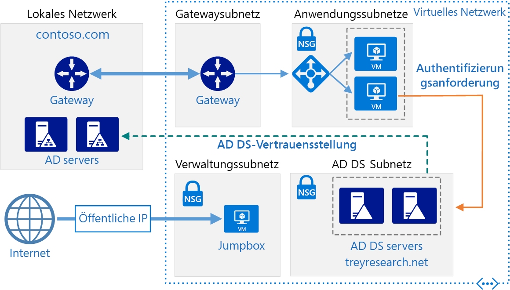
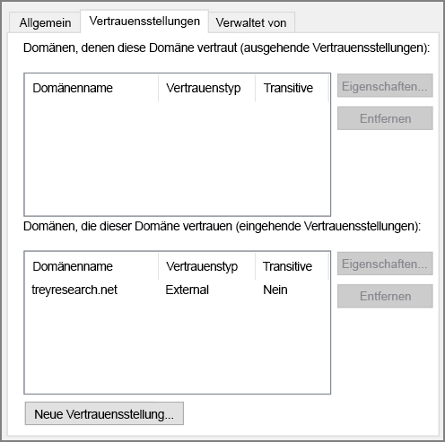

# <a name="create-an-active-directory-domain-services-ad-ds-resource-forest-in-azure"></a>Erstellen einer Active Directory Domain Services (AD DS)-Ressourcengesamtstruktur in Azure

Diese Referenzarchitektur zeigt, wie eine separate Active Directory-Domäne in Azure erstellt wird, der Domänen in der lokalen Active Directory-Gesamtstruktur vertrauen. [**Stellen Sie diese Lösung bereit**](#deploy-the-solution).



*Laden Sie eine [Visio-Datei][visio-download] mit dieser Architektur herunter.*

In Active Directory Domain Services (AD DS) werden Identitätsinformationen in einer hierarchischen Struktur gespeichert. Der oberste Knoten in der hierarchischen Struktur wird als Gesamtstruktur bezeichnet. Eine Gesamtstruktur enthält Domänen, und Domänen enthalten andere Objekttypen. In dieser Referenzarchitektur wird eine AD DS-Gesamtstruktur in Azure mit einer unidirektionalen ausgehenden Vertrauensstellung mit einer lokalen Domäne erstellt. Die Gesamtstruktur in Azure enthält eine Domäne, die lokal nicht vorhanden ist. Aufgrund der Vertrauensstellung werden Anmeldungen bei lokalen Domänen als vertrauenswürdig für den Zugriff auf Ressourcen in der separaten Azure-Domäne angesehen.

Zu den typischen Verwendungsmöglichkeiten dieser Architektur zählen die Verwaltung einer Sicherheitstrennung für in der Cloud gespeicherte Objekte und Identitäten sowie die Migration einzelner Domänen aus einem lokalen System in die Cloud.

Weitere Überlegungen finden Sie unter [Auswählen einer Lösung für die Integration einer lokalen Active Directory-Instanz in Azure][considerations]. 

## <a name="architecture"></a>Architecture

Diese Architektur besteht aus den folgenden Komponenten.

- **Lokales Netzwerk**. Das lokale Netzwerk enthält eine eigene Active Directory-Gesamtstruktur und eigene Domänen.
- **Active Directory-Server**. Hierbei handelt es sich um Domänencontroller, die Domänendienste implementieren und als virtuelle Computer in der Cloud ausgeführt werden. Diese Server hosten eine Gesamtstruktur mit einer oder mehrere Domänen, die von den lokal gehosteten getrennt sind.
- **Unidirektionale Vertrauensstellung**. Das Beispiel im Diagramm zeigt eine unidirektionale Vertrauensstellung von der Domäne in Azure zur lokalen Domäne. Diese Beziehung ermöglicht lokalen Benutzern den Zugriff auf Ressourcen in der Domäne in Azure, jedoch nicht umgekehrt. Es kann eine bidirektionale Vertrauensstellung erstellt werden, wenn Cloudbenutzer auch Zugriff auf lokale Ressourcen benötigen.
- **Active Directory-Subnetz**. Die AD DS-Server werden in einem separaten Subnetz gehostet. NSG-Regeln (Netzwerksicherheitsgruppe) schützen die AD DS-Server und stellen eine Firewall für Datenverkehr von unerwarteten Quellen dar.
- **Azure-Gateway**. Das Azure-Gateway stellt eine Verbindung zwischen dem lokalen Netzwerk und dem Azure-VNet her. Dabei kann es sich um eine [VPN-Verbindung][azure-vpn-gateway] oder um [Azure ExpressRoute][azure-expressroute] handeln. Weitere Informationen finden Sie unter [Implementieren einer sicheren Hybrid-Netzwerkarchitektur in Azure][implementing-a-secure-hybrid-network-architecture].

## <a name="recommendations"></a>Empfehlungen

Spezifische Empfehlungen zur Implementierung von Active Directory in Azure finden Sie in den folgenden Artikeln:

- [Erweitern von Active Directory Domain Services (AD DS) auf Azure][adds-extend-domain]
- [Richtlinien für die Bereitstellung von Windows Server Active Directory auf virtuellen Azure-Computern][ad-azure-guidelines]

### <a name="trust"></a>Vertrauen

Die lokalen Domänen sind in einer anderen Gesamtstruktur als die Domänen in der Cloud enthalten. Um die Authentifizierung von lokalen Benutzern in der Cloud zu ermöglichen, müssen die Domänen in Azure der Anmeldedomäne in der lokalen Gesamtstruktur vertrauen. Ebenso kann es bei Bereitstellung einer Anmeldedomäne für externe Benutzer in der Cloud erforderlich sein, dass die lokale Gesamtstruktur der Clouddomäne vertraut.

Sie können Vertrauensstellungen auf Gesamtstrukturebene durch [Erstellen von Gesamtstrukturvertrauensstellungen][creating-forest-trusts] oder auf Domänenebene durch [Erstellen externer Vertrauensstellungen][creating-external-trusts] einrichten. Eine Vertrauensstellung auf Gesamtstrukturebene erstellt eine Beziehung zwischen allen Domänen in zwei Gesamtstrukturen. Eine Vertrauensstellung auf Ebene externer Domänen erstellt nur eine Beziehung zwischen zwei angegebenen Domänen. Sie sollten Vertrauensstellungen auf Ebene externer Domänen nur zwischen Domänen in verschiedenen Gesamtstrukturen erstellen.

Vertrauensstellungen können unidirektional oder bidirektional sein:

- Eine unidirektionale Vertrauensstellung ermöglicht Benutzern in einer Domäne oder Gesamtstruktur (als *eingehende* Domäne oder Gesamtstruktur bezeichnet) Zugriff auf die Ressourcen in einer anderen Domäne oder Gesamtstruktur (als *ausgehende* Domäne oder Gesamtstruktur bezeichnet).
- Eine bidirektionale Vertrauensstellung ermöglicht Benutzern in beiden Domänen oder Gesamtstrukturen den Zugriff auf Ressourcen in der jeweils anderen Domäne oder Gesamtstruktur.

Die folgende Tabelle enthält eine Übersicht über Vertrauensstellungskonfigurationen für einige einfache Szenarien:

| Szenario | Lokale Vertrauensstellung | Cloudvertrauensstellung |
| --- | --- | --- |
| Lokale Benutzer benötigen Zugriff auf Ressourcen in der Cloud, aber nicht umgekehrt |Unidirektional, eingehend |Unidirektional, ausgehend |
| Benutzer in der Cloud benötigen Zugriff auf lokale Ressourcen, aber nicht umgekehrt |Unidirektional, ausgehend |Unidirektional, eingehend |
| Sowohl Benutzer in der Cloud als auch lokale Benutzer benötigen Zugriff auf Ressourcen in der Cloud und auf lokale Ressourcen |Bidirektional, eingehend und ausgehend |Bidirektional, eingehend und ausgehend |

## <a name="scalability-considerations"></a>Überlegungen zur Skalierbarkeit

Active Directory ist für Domänencontroller, die Teil derselben Domäne sind, automatisch skalierbar. Anforderungen werden auf alle Controller innerhalb einer Domäne verteilt. Sie können einen weiteren Domänencontroller hinzufügen, und er wird automatisch mit der Domäne synchronisiert. Konfigurieren Sie keinen separaten Lastenausgleich, um Datenverkehr an Controller innerhalb der Domäne weiterzuleiten. Stellen Sie sicher, dass alle Domänencontroller über genügend Arbeitsspeicher und Speicherressourcen für den Umgang mit der Domänendatenbank verfügen. Erstellen Sie alle Domänencontroller als virtuelle Computer derselben Größe.

## <a name="availability-considerations"></a>Überlegungen zur Verfügbarkeit

Stellen Sie mindestens zwei Domänencontroller für jede Domäne bereit. Dies ermöglicht eine automatische Replikation zwischen Servern. Erstellen Sie eine Verfügbarkeitsgruppe für die virtuellen Computer, die als Active Directory-Server für die Handhabung der einzelnen Domänen dienen. Es müssen mindestens zwei Server in dieser Verfügbarkeitsgruppe enthalten sein.

Überlegen Sie auch, ob Sie einen oder mehrere Server in jeder Domäne als [Standby-Betriebsmaster][standby-operations-masters] für den Fall festlegen, dass die Verbindung mit einem Server mit FSMO-Rolle (Flexible Single Master Operation) fehlschlägt.

## <a name="manageability-considerations"></a>Überlegungen zur Verwaltbarkeit

Informationen zu Überlegungen in Bezug auf Verwaltung und Überwachung finden Sie unter [Erweitern von Active Directory auf Azure][adds-extend-domain].

Weitere Informationen finden Sie unter [Überwachen von Active Directory][monitoring_ad]. Sie können Tools wie z.B. [Microsoft Systems Center][microsoft_systems_center] auf einem Überwachungsserver im Verwaltungssubnetz installieren, um diese Aufgaben auszuführen.

## <a name="security-considerations"></a>Sicherheitshinweise

Vertrauensstellungen auf Gesamtstrukturebene sind transitiv. Wenn Sie eine Vertrauensstellung auf Gesamtstrukturebene zwischen einer lokalen Gesamtstruktur und einer Gesamtstruktur in der Cloud erstellen, wird diese Vertrauensstellung auf weitere neue Domänen ausgeweitet, die in beiden Gesamtstrukturen erstellt werden. Wenn Sie Domänen verwenden, um eine Trennung aus Sicherheitsgründen bereitzustellen, sollten Sie Vertrauensstellungen nur auf Domänenebene erstellen. Vertrauensstellungen auf Domäneneben sind nicht transitiv.

Spezifische Überlegungen zur Sicherheit für Active Directory finden Sie im Abschnitt „Sicherheitshinweise“ unter [Erweitern von Active Directory auf Azure][adds-extend-domain].

## <a name="deploy-the-solution"></a>Bereitstellen der Lösung

Eine Bereitstellung für diese Architektur ist auf [GitHub][github] verfügbar. Beachten Sie, dass die gesamte Bereitstellung bis zu zwei Stunden dauern kann, was das Erstellen des VPN-Gateways und die Ausführung der Skripts beinhaltet, die AD DS konfigurieren.

### <a name="prerequisites"></a>Voraussetzungen

1. Führen Sie das Klonen, Forken oder Herunterladen der ZIP-Datei für das [GitHub-Repository](https://github.com/mspnp/identity-reference-architectures) durch.

2. Installieren Sie [Azure CLI 2.0](/cli/azure/install-azure-cli?view=azure-cli-latest).

3. Installieren Sie das npm-Paket mit den [Azure Bausteinen](https://github.com/mspnp/template-building-blocks/wiki/Install-Azure-Building-Blocks).

   ```bash
   npm install -g @mspnp/azure-building-blocks
   ```

4. Melden Sie sich über eine Eingabeaufforderung, eine Bash-Eingabeaufforderung oder die PowerShell-Eingabeaufforderung folgendermaßen bei Ihrem Azure-Konto an:

   ```bash
   az login
   ```

### <a name="deploy-the-simulated-on-premises-datacenter"></a>Bereitstellen des simulierten lokalen Rechenzentrums

1. Navigieren Sie zum Ordner `identity/adds-forest` des GitHub-Repositorys.

2. Öffnen Sie die Datei `onprem.json` . Suchen Sie nach Instanzen von `adminPassword` und `Password`, und fügen Sie Werte für die Kennwörter hinzu.

3. Führen Sie den folgenden Befehl aus, und warten Sie, bis die Bereitstellung abgeschlossen ist:

    ```bash
    azbb -s <subscription_id> -g <resource group> -l <location> -p onprem.json --deploy
    ```

### <a name="deploy-the-azure-vnet"></a>Bereitstellen von Azure VNet

1. Öffnen Sie die Datei `azure.json` . Suchen Sie nach Instanzen von `adminPassword` und `Password`, und fügen Sie Werte für die Kennwörter hinzu.

2. Suchen Sie in der gleichen Datei nach Instanzen von `sharedKey`, und geben Sie gemeinsam verwendete Schlüssel für die VPN-Verbindung ein.

    ```json
    "sharedKey": "",
    ```

3. Führen Sie den folgenden Befehl aus, und warten Sie, bis die Bereitstellung abgeschlossen ist.

    ```bash
    azbb -s <subscription_id> -g <resource group> -l <location> -p onoprem.json --deploy
    ```

   Führen Sie die Bereitstellung in der gleichen Ressourcengruppe durch, in der das lokale VNet bereitgestellt ist.

### <a name="test-the-ad-trust-relation"></a>Testen der AD-Vertrauensbeziehung

1. Navigieren Sie im Azure-Portal zu der Ressourcengruppe, die Sie erstellt haben.

2. Suchen Sie im Azure-Portal die VM `ra-adt-mgmt-vm1`.

3. Klicke Sie auf `Connect`, um eine Remotedesktopsitzung mit der VM zu öffnen. Der Benutzername ist `contoso\testuser`, und das Kennwort entspricht dem, das Sie in der `onprem.json`-Parameterdatei angegeben haben.

4. Öffnen Sie von der Remotedesktopsitzung aus eine andere Remotedesktopsitzung mit 192.168.0.4 (IP-Adresse des virtuellen Computers namens `ra-adtrust-onpremise-ad-vm1`). Der Benutzername ist `contoso\testuser`, und das Kennwort entspricht dem, das Sie in der `azure.json`-Parameterdatei angegeben haben.

5. Wechseln Sie von der Remotedesktopsitzung für `ra-adtrust-onpremise-ad-vm1` zum **Server-Manager**, und klicken Sie auf **Extras** > **Active Directory-Domänen und -Vertrauensstellungen**.

6. Klicken Sie im linken Bereich mit der rechten Maustaste auf „contoso.com“, und klicken Sie auf **Eigenschaften**.

7. Klicken Sie auf die Registerkarte **Vertrauensstellungen**. Als eingehende Vertrauensstellung sollte „treyresearch.net“ angezeigt werden.



## <a name="next-steps"></a>Nächste Schritte

- Informieren Sie sich über bewährte Methoden für das [Erweitern Ihrer lokalen AD DS-Domäne auf Azure][adds-extend-domain].
- Informieren Sie sich über bewährte Methoden für das [Erstellen einer AD FS-Infrastruktur][adfs] in Azure.

<!-- links -->
[adds-extend-domain]: adds-extend-domain.md
[adfs]: adfs.md
[azure-cli-2]: /azure/install-azure-cli
[azbb]: https://github.com/mspnp/template-building-blocks/wiki/Install-Azure-Building-Blocks

[implementing-a-secure-hybrid-network-architecture]: ../dmz/secure-vnet-hybrid.md
[implementing-a-secure-hybrid-network-architecture-with-internet-access]: ../dmz/secure-vnet-dmz.md

[running-VMs-for-an-N-tier-architecture-on-Azure]: ../virtual-machines-windows/n-tier.md

[ad-azure-guidelines]: https://msdn.microsoft.com/library/azure/jj156090.aspx
[azure-expressroute]: https://azure.microsoft.com/documentation/articles/expressroute-introduction/
[azure-vpn-gateway]: https://azure.microsoft.com/documentation/articles/vpn-gateway-about-vpngateways/
[considerations]: ./considerations.md
[creating-external-trusts]: https://technet.microsoft.com/library/cc816837(v=ws.10).aspx
[creating-forest-trusts]: https://technet.microsoft.com/library/cc816810(v=ws.10).aspx
[github]: https://github.com/mspnp/identity-reference-architectures/tree/master/adds-forest
[incoming-trust]: https://raw.githubusercontent.com/mspnp/identity-reference-architectures/master/adds-forest/extensions/incoming-trust.ps1
[microsoft_systems_center]: https://microsoft.com/cloud-platform/system-center
[monitoring_ad]: https://msdn.microsoft.com/library/bb727046.aspx
[resource-manager-overview]: /azure/azure-resource-manager/resource-group-overview
[solution-script]: https://raw.githubusercontent.com/mspnp/identity-reference-architectures/master/adds-forest/Deploy-ReferenceArchitecture.ps1
[standby-operations-masters]: https://technet.microsoft.com/library/cc794737(v=ws.10).aspx
[outgoing-trust]: https://raw.githubusercontent.com/mspnp/identity-reference-architectures/master/adds-forest/extensions/outgoing-trust.ps1
[verify-a-trust]: https://technet.microsoft.com/library/cc753821.aspx
[visio-download]: https://archcenter.blob.core.windows.net/cdn/identity-architectures.vsdx
