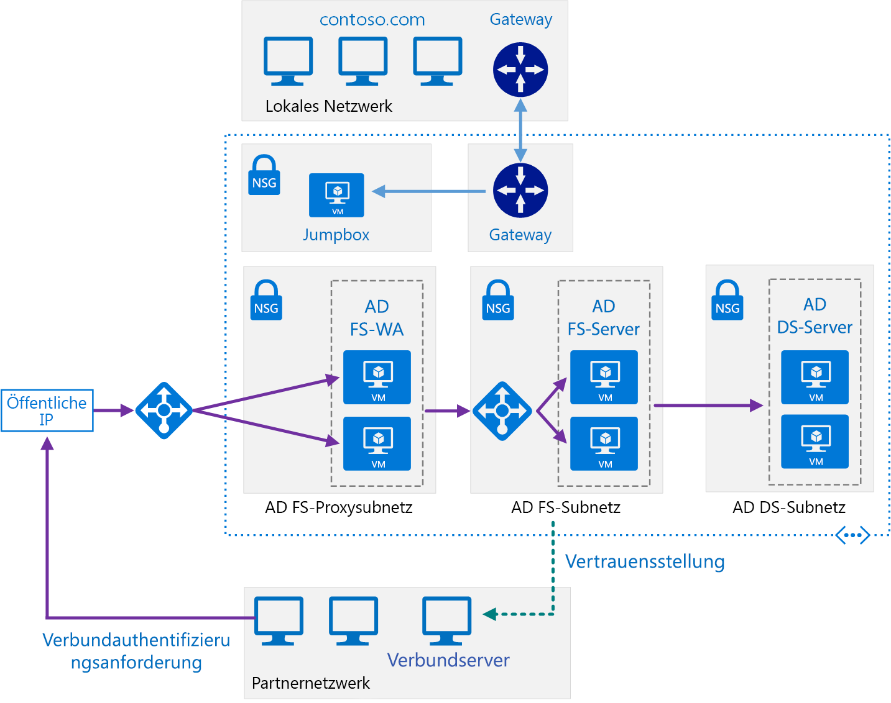

# <a name="extend-active-directory-federation-services-ad-fs-to-azure"></a>Erweitern von Active Directory Federation Services (AD FS) auf Azure

Mit dieser Referenzarchitektur wird ein sicheres hybrides Netzwerk implementiert, das Ihr lokales Netzwerk auf Azure erweitert, und [Active Directory-Verbunddienste (AD FS)][active-directory-federation-services] verwendet, um Verbundauthentifizierung und Autorisierung für Komponenten auszuführen, die in Azure ausgeführt werden. [**Stellen Sie diese Lösung bereit**](#deploy-the-solution).



*Laden Sie eine [Visio-Datei][visio-download] mit dieser Architektur herunter.*

AD FS kann lokal gehostet werden, aber wenn Ihre Anwendung eine hybride Anwendung ist, in der einige Teile in Azure implementiert sind, kann es effizienter sein, AD FS in der Cloud zu replizieren.

Im Diagramm sind folgende Szenarios dargestellt:

- Anwendungscode von einer Partnerorganisation greift auf eine Webanwendung zu, die in Ihrem Azure VNet gehostet wird.
- Ein externer registrierter Benutzer mit Anmeldeinformationen, die in Active Directory Domain Services (DS) gespeichert sind, greift auf eine Webanwendung zu, die in Ihrem Azure VNet gehostet wird.
- Ein Benutzer, der über ein autorisiertes Gerät eine Verbindung mit Ihrem virtuellen Netzwerk (VNet) hergestellt hat, führt eine Webanwendung aus, die in Ihrem Azure VNet gehostet wird.

Typische Einsatzmöglichkeiten für diese Architektur sind:

- Hybridanwendungen, in denen Workloads teilweise lokal und teilweise in Azure ausgeführt werden
- Lösungen, in denen Verbundautorisierung verwendet wird, um Webanwendungen für Partnerorganisationen verfügbar zu machen
- Systeme, die Zugriff über Webbrowser ermöglichen, die außerhalb der Firewall der Organisation ausgeführt werden
- Systeme, die Benutzern Zugriff auf Webanwendungen ermöglichen, indem sie eine Verbindung von einem autorisierten externen Gerät herstellen, etwa ein Remotecomputer, ein Notebook oder ein anderes mobiles Gerät

In dieser Referenzarchitektur liegt der Schwerpunkt auf *passivem Verbund*, in dem die Verbundserver entscheiden, wie und wann ein Benutzer authentifiziert werden muss. Der Benutzer gibt Anmeldeinformationen an, wenn die Anwendung gestartet wird. Dieser Mechanismus wird am häufigsten von Webbrowsern verwendet und beinhaltet ein Protokoll, das den Browser zu einer Website umleitet, auf der sich der Benutzer authentifiziert. AD FS unterstützt auch *aktiven Verbund*, bei dem eine Anwendung die jeweiligen Anmeldeinformationen bereitstellt, ohne dass weiterer Benutzereingriff erforderlich ist. Dieses Szenario ist aber nicht Bestandteil dieser Architektur.

Weitere Überlegungen finden Sie unter [Auswählen einer Lösung für die Integration einer lokalen Active Directory-Instanz in Azure][considerations].

## <a name="architecture"></a>Architecture

Diese Architektur erweitert die Implementierung, die unter [Erweitern von Active Directory Domain Services (AD DS) auf Azure][extending-ad-to-azure] beschrieben ist. Sie enthält die folgenden Komponenten.

- **AD DS-Subnetz**. Der AD DS-Server befinden sich in ihrem eigenen Subnetz mit Regeln für Netzwerksicherheitsgruppen (NSG), die als Firewall fungieren.

- **AD DS-Server**. Domänencontroller, die als virtuelle Computer in Azure ausgeführt werden. Diese Server bieten Authentifizierung von lokalen Identitäten in der Domäne.

- **AD FS-Subnetz**. Die AD FS-Server befinden sich in ihrem eigenen Subnetz mit NSG-Regeln, die als Firewall fungieren.

- **AD FS-Server**. Die AD FS-Server bieten Verbundautorisierung und -authentifizierung. In dieser Architektur führen sie die folgenden Aufgaben aus:

  - Empfangen von Sicherheitstoken, die Ansprüche enthalten, die ein Partnerverbundserver im Auftrag eines Partnerbenutzers stellt. AD FS überprüft, ob die Token gültig sind, bevor die Ansprüche an die in Azure ausgeführte Webanwendung übergeben werden, um die Anforderungen zu autorisieren.

    Die in Azure ausgeführte Anwendung ist die *vertrauende Seite*. Die Partnerverbundserver muss Ansprüche ausgeben, die von der Webanwendung verstanden werden. Die Partnerverbundserver werden als *Kontopartner* bezeichnet, weil sie Anforderungen im Auftrag von authentifizierten Konten in der Partnerorganisation übergeben. Die AD FS-Server werden als *Ressourcenpartner* bezeichnet, weil sie Zugriff auf Ressourcen (die Webanwendung) ermöglichen.

  - Authentifizieren und Autorisieren von eingehenden Anforderungen von externen Benutzern, die einen Webbrowser oder ein Gerät ausführen, der oder das Zugriff auf Webanwendungen benötigt, durch Verwenden von AD DS und dem [Active Directory-Geräteregistrierungsdienst][ADDRS].

  Die AD FS-Server sind als eine Farm konfiguriert, auf die über einen Azure-Lastenausgleich zugegriffen wird. Diese Implementierung verbessert die Verfügbarkeit und die Skalierbarkeit. Die AD FS-Server werden nicht direkt im Internet verfügbar gemacht. Der gesamte Internet-Datenverkehr wird über AD FS-Webanwendungs-Proxyserver und eine DMZ (auch als Umkreisnetzwerk bezeichnet) gefiltert.

  Weitere Informationen zur Funktionsweise von AD FS finden Sie unter [Active Directory-Verbunddienste: Übersicht][active-directory-federation-services-overview]. Darüber hinaus enthält der Artikel [AD FS-Bereitstellung in Azure][adfs-intro] eine ausführliche schrittweise Einführung in die Implementierung.

- **AD FS-Proxysubnetz**. Die AD FS-Proxyserver können in ihrem eigenen Subnetz enthalten sein, in dem NSG-Regeln Schutz bieten. Die Server in diesem Subnetz werden dem Internet über eine Reihe von virtuellen Netzwerkgeräten verfügbar gemacht, die eine Firewall zwischen Ihrem virtuellen Azure-Netzwerk und dem Internet bereitstellen.

- **AD FS-Webanwendungs-Proxyserver (WAP-Server)**. Diese virtuellen Computer fungieren als AD FS-Server für eingehende Anforderungen von Partnerorganisationen und externen Geräten. Die WAP-Server fungieren als Filter, der die AD FS-Server gegen direkten Zugriff aus dem Internet abschirmt. So wie bei den AD FS-Servern bietet Ihnen Bereitstellen der WAP-Server in einer Farm mit Lastenausgleich größere Verfügbarkeit und Skalierbarkeit, als dies bei Bereitstellung einer Sammlung von eigenständigen Servern der Fall ist.

  > [!NOTE]
  > Ausführliche Informationen zu, Installieren von WAP-Servern finden Sie unter [Installieren und Konfigurieren des Webanwendungsproxy-Servers][install_and_configure_the_web_application_proxy_server].
  >

- **Partnerorganisation**. Eine Partnerorganisation, die eine Webanwendung ausführt, die Zugriff auf eine Webanwendung anfordert, die in Azure ausgeführt wird. Der Verbundserver in der Partnerorganisation authentifiziert Anforderungen lokal und sendet Sicherheitstoken, die Ansprüche enthalten, an AD FS, der in Azure ausgeführt wird. AD FS in Azure überprüft die Sicherheitstoken und kann, wenn die Token gültig sind, die Ansprüche an die in Azure ausgeführte Webanwendung übergeben, um sie zu autorisieren.

  > [!NOTE]
  > Sie können auch mit einem Azure-Gateway einen VPN-Tunnel konfigurieren, um für vertrauenswürdige Partner direkten Zugriff auf AD FS zu ermöglichen. Anforderungen, die von diesen Partnern eingehen, durchlaufen nicht den WAP-Server.
  >

## <a name="recommendations"></a>Empfehlungen

Die folgenden Empfehlungen gelten für die meisten Szenarios. Sofern Sie keine besonderen Anforderungen haben, die Vorrang haben, sollten Sie diese Empfehlungen befolgen.

### <a name="networking-recommendations"></a>Netzwerkempfehlungen

Konfigurieren Sie die Netzwerkschnittstelle für jeden der virtuellen Computer, die AD FS und WAP-Server hosten, mit statischen privaten IP-Adressen.

Geben Sie den virtuellen Computern mit AD FS keine öffentlichen IP-Adressen. Weitere Informationen hierzu finden Sie im Abschnitt [Sicherheitshinweise](#security-considerations).

Legen Sie die IP-Adresse des bevorzugten und die des sekundären DNS-Servers (Domain Name System) für die Netzwerkschnittstellen für jeden virtuellen AD FS- und WAP-Computer so fest, dass sie auf die virtuellen Active Directory Domain Services-Computer verweisen. DNS sollte auf den virtuellen Active Directory Domain Services-Computern ausgeführt werden. Dieser Schritt ist notwendig, damit jeder virtuelle Computer der Domäne beitreten kann.

### <a name="ad-fs-installation"></a>AD FS-Installation

Der Artikel [Bereitstellen einer Verbundserverfarm][Deploying_a_federation_server_farm] enthält ausführliche Anweisungen zum Installieren und Konfigurieren von AD FS. Führen Sie die folgenden Aufgaben aus, bevor Sie den ersten AD FS-Server in der Farm konfigurieren:

1. Rufen Sie ein öffentlich vertrauenswürdiges Zertifikat ab, mit dem eine Serverauthentifizierung vorgenommen wird. Der *Antragstellername* muss den Namen enthalten, den Clients dazu verwenden, auf den Verbunddienst zuzugreifen. Dies kann der DNS-Name sein, der für den Lastenausgleich registriert ist, etwa *adfs.contoso.com* (aus Sicherheitsgründen sollten Sie keine Platzhalterzeichen, z.B. **. contoso.com*, verwenden). Verwenden Sie auf allen virtuellen Computern, die als AD FS-Server fungieren, dasselbe Zertifikat. Sie können ein Zertifikat von einer vertrauenswürdigen Zertifizierungsstelle erwerben, wird in Ihrer Organisation aber Active Directory-Zertifikatdienste verwendet, können Sie Ihr eigenes Zertifikat erstellen.

    *Alternativer Antragstellername* wird vom Geräteregistrierungsdienst (Device Registration Service, DRS) verwendet, um Zugriff von externen Geräten zu ermöglichen. Dieser Name muss in der Form *enterpriseregistration.contoso.com* vorliegen.

    Weitere Informationen hierzu finden Sie unter [Abrufen und Konfigurieren eines SSL-Zertifikats (Secure Sockets Layer) für AD FS][adfs_certificates].

2. Generieren Sie auf dem Domänencontroller einen neuen Stammschlüssel für den Schlüsselverteilungsdienst. Legen Sie die effektive Zeit auf die aktuelle Zeit abzüglich 10 Stunden fest (diese Konfiguration verringert die Verzögerung, die auftreten kann, wenn Schlüssel in der Domäne verteilt und synchronisiert werden). Dieser Schritt ist erforderlich, damit das Gruppendienstkonto erstellt werden kann, mit dem der AD FS-Dienst ausgeführt wird. Im folgenden PowerShell-Befehl ist beispielhaft gezeigt, wie dies ausgeführt wird:

    ```powershell
    Add-KdsRootKey -EffectiveTime (Get-Date).AddHours(-10)
    ```

3. Fügen Sie jeden virtuellen Computer, der als AD FS-Server fungiert, zur Domäne hinzu.

> [!NOTE]
> Damit AD FS installiert werden kann, müssen die virtuellen AD FS-Computer auf den Domänencontroller zugreifen können, auf dem die FSMO-Rolle (Flexible Single Master Operation) für den PDC-Emulator (Primary Domain Controller, primärer Domänencontroller) ausgeführt wird, und dieser Domänencontroller muss ausgeführt werden. <<RBC: Is there a way to make this less repetitive?>>
>

### <a name="ad-fs-trust"></a>AD FS-Vertrauensstellung

Richten Sie eine Verbundvertrauensstellung zwischen Ihrer AD FS-Installation und den Verbundservern jeder Partnerorganisation ein. Konfigurieren Sie jegliche erforderliche Ansprüchefilterung und -zuordnung.

- DevOps-Mitarbeiter in jeder Partnerorganisation müssen eine Vertrauensstellung der vertrauenden Seite für die Webanwendungen hinzufügen, auf die über Ihre AD FS-Server zugegriffen werden kann.
- DevOps-Mitarbeiter in Ihrer Organisation müssen eine Anspruchsanbieter-Vertrauensstellung konfigurieren, damit Ihre AD FS-Server den Ansprüchen vertrauen können, die von Partnerorganisationen bereitgestellt werden.
- DevOps-Mitarbeiter in Ihrer Organisation müssen außerdem AD FS so konfigurieren, dass Ansprüche an die Webanwendungen Ihrer Organisation übergeben werden.

Weitere Informationen hierzu finden Sie unter [Establishing Federation Trust][establishing-federation-trust].

Veröffentlichen Sie die Webanwendungen Ihrer Organisation, und machen Sie diese für externe Partner verfügbar, indem Sie Präauthentifizierung durch die WAP-Server verwenden. Weitere Informationen hierzu finden Sie unter [Veröffentlichen von Anwendungen mit AD FS-Vorauthentifizierung][publish_applications_using_AD_FS_preauthentication].

AD FS unterstützt Tokentransformation und -ergänzung. Azure Active Directory bietet diese Funktionalität nicht. Wenn Sie die Vertrauensstellungen einrichten, können Sie mit AD FS:

- Anspruchstransformationen für Autorisierungsregeln konfigurieren. Beispielsweise können Sie Gruppensicherheit aus einer Darstellung, die von einer Nicht-Microsoft-Partnerorganisation verwendet wird, zu einer anderen Darstellung zuordnen, die von Active Directory DS in Ihrer Organisation autorisiert werden kann.
- Ansprüche aus einem Format in ein anderes transformieren. Beispielsweise können Sie von SAML 2.0 zu SAML 1.1 zuordnen, wenn Ihre Anwendung nur SAML 1.1-Ansprüche unterstützt.

### <a name="ad-fs-monitoring"></a>AD FS-Überwachung

Das [System Center-Management Pack für Active Directory Federation Services 2012 R2 ][oms-adfs-pack] bietet sowohl proaktive als auch reaktive Überwachung Ihrer AD FS-Bereitstellung für den Verbundserver. Dieses Management Pack überwacht Folgendes:

- Ereignisse, die der AD FS-Dienst in seinen Ereignisprotokollen speichert
- Die Leistungsdaten, die von den AD FS-Leistungsindikatoren gesammelt werden
- Die Gesamtintegrität des AD FS-Systems und der Webanwendungen (vertrauende Seiten); stellt außerdem Benachrichtigung für schwerwiegende Probleme und Warnungen bereit

## <a name="scalability-considerations"></a>Überlegungen zur Skalierbarkeit

Die folgenden Aspekte, die aus dem Artikel [Planen der AD FS-Bereitstellung][plan-your-adfs-deployment] zusammengefasst sind, bieten einen Ausgangspunkt zum Anpassen der Größe von AD FS-Farmen:

- Wenn Sie weniger als 1000 Benutzer haben, sollten Sie keine dedizierten Server erstellen, sondern stattdessen AD FS auf jedem der Active Directory DS-Server in der Cloud installieren. Verwenden Sie dazu mindestens zwei Active Directory DS-Server, damit Verfügbarkeit sichergestellt ist. Erstellen Sie einen einzelnen WAP-Server.
- Wenn Sie zwischen 1000 und 15000 Benutzer haben, erstellen Sie zwei dedizierte AD FS-Server und zwei dedizierte WAP-Server.
- Wenn Sie zwischen 15000 und 60000 Benutzer haben, erstellen Sie drei bis fünf dedizierte AD FS-Server und mindestens zwei dedizierte WAP-Server.

Für diese Angaben wird angenommen, dass Sie virtuelle Computer in einer Größe mit doppeltem Vierkern (Standard_D4_v2 oder besser) in Azure verwenden.

Wenn Sie die interne Windows-Datenbank verwenden, um die AD FS-Konfigurationsdaten zu speichern, sind Sie auf acht AD FS-Server in der Farm beschränkt. Wenn sich davon ausgehen, dass Sie zukünftig mehr benötigen, sollten Sie SQL Server verwenden. Weitere Informationen hierzu finden Sie unter [Die Rolle der AD FS-Konfigurationsdatenbank][adfs-configuration-database].

## <a name="availability-considerations"></a>Überlegungen zur Verfügbarkeit

Erstellen Sie eine AD FS-Farm mit mindestens zwei Servern, um die Verfügbarkeit des Diensts zu erhöhen. Verwenden Sie verschiedene Speicherkonten für jeden virtuellen AD FS-Computer in der Farm. Mit dieser Vorgehensweise lässt sich sicherstellen, dass ein Fehler in einem Speicherkonto nicht dazu führt, dass die gesamte Farm unzugänglich wird.

Erstellen Sie getrennte Azure-Verfügbarkeitsgruppen für die virtuellen AD FS- und WAP-Computer. Stellen Sie sicher, dass in jeder Gruppe mindestens zwei virtuelle Computer vorhanden sind. Jede Verfügbarkeitsgruppe muss mindestens zwei Upgdatedomänen und zwei Fehlerdomänen haben.

Konfigurieren Sie die Lastenausgleiche für die virtuellen AD FS- und WAP-Computer wie folgt:

- Verwenden Sie einen Azure-Lastenausgleich, um externen Zugriff auf die virtuellen WAP-Computer zu bieten, und einen internen Lastenausgleich, um die Last auf die AD FS-Server in der Farm zu verteilen.
- Übergeben Sie an die AD FS/WAP-Server nur Datenverkehr, der am Port 443 (HTTPS) ankommt.
- Geben Sie dem Lastenausgleich eine statische IP-Adresse.
- Erstellen Sie einen Integritätstest, indem Sie HTTP für `/adfs/probe` verwenden. Weitere Informationen finden Sie unter [Hardware Load Balancer Health Checks and Web Application Proxy/AD FS 2012 R2](https://blogs.technet.microsoft.com/applicationproxyblog/2014/10/17/hardware-load-balancer-health-checks-and-web-application-proxy-ad-fs-2012-r2/) (Hardware-Load Balancer-Integritätsprüfungen und Webanwendungsproxy/AD FS 2012 R2).

  > [!NOTE]
  > AD FS-Server verwenden das SNI-Protokoll (Server Name Indication), daher schlägt ein Versuch, den Test über einen HTTPS-Endpunkt aus dem Lastenausgleich auszuführen, fehl.
  >

- Fügen Sie einen DNS-*A*-Datensatz zu der Domäne für den AD FS-Lastenausgleich hinzu. Geben Sie die IP-Adresse des Lastenausgleichs an, und geben sie ihm einen Namen in der Domäne (z.B. „adfs.contoso.com“). Dies ist der Name, den Clients und WAP-Server verwenden, um auf die AD FS-Serverfarm zuzugreifen.

Sie können entweder SQL Server oder die interne Windows-Datenbank verwenden, um die AD FS-Konfigurationsinformationen zu speichern. Die interne Windows-Datenbank bietet grundlegende Redundanz. Änderungen werden direkt nur in eine der AD FS-Datenbanken im AD FS-Cluster geschrieben, während die anderen Server Pullreplikation verwenden, um ihre Datenbanken auf dem neuesten Stand zu halten. Wird SQL Server verwendet, können vollständige Datenbankredundanz und hohe Verfügbarkeit bereitgestellt werden, indem Failoverclustering oder Spiegelung verwendet wird.

## <a name="manageability-considerations"></a>Überlegungen zur Verwaltbarkeit

DevOps-Mitarbeiter sollten darauf vorbereitet sein, die folgenden Aufgaben auszuführen:

- Verwalten der Verbundserver, einschließlich Verwalten der AD FS-Farm, Verwalten der Vertrauensrichtlinien auf den Verbundservern und Verwalten der Zertifikate, die von den Verbunddiensten verwendet werden
- Verwalten der WAP-Server, einschließlich Verwalten der WAP-Farm und -Zertifikate
- Verwalten von Webanwendungen, einschließlich Konfigurieren der vertrauenden Seiten, der Authentifizierungsmethoden und der Anspruchszuordnungen
- Sichern der AD FS-Komponenten

## <a name="security-considerations"></a>Sicherheitshinweise

Da für AD FS HTTPS verwendet wird, müssen Sie darauf achten, dass die NSG-Regeln für das Subnetz, in dem die virtuellen Computer auf Webebene enthalten sind, HTTPS-Anforderungen zulassen. Diese Anforderungen können aus dem lokalen Netzwerk, aus den Subnetzen, die die Webebene, die Geschäftsebene, die Datenebene, die private DMZ oder die öffentliche DMZ enthalten, oder aus dem Subnetz stammen, das die AD FS-Server enthält.

Verhindern Sie, dass AD FS-Server direkt für das Internet verfügbar gemacht werden. AD FS-Server sind zur Domäne gehörende Computer, die die vollständige Autorisierung haben, Sicherheitstoken zu gewähren. Wenn ein Server kompromittiert ist, kann ein böswilliger Benutzer Token für Vollzugriff auf alle Webanwendungen und alle Verbundserver ausgeben, die durch AD FS geschützt sind. Muss Ihr System Anforderungen von externen Benutzern verarbeiten, die nicht über vertrauenswürdige Partnerwebsites zugreifen, sollten Sie diese Anforderungen mit WAP-Servern verarbeiten. Weitere Informationen hierzu finden Sie unter [Platzieren eines Verbundserverproxys][where-to-place-an-fs-proxy].

Platzieren Sie AD FS-Server und WAP-Server in getrennten Subnetzen mit jeweils eigener Firewall. Sie können NSG-Regeln verwenden, um Firewallregeln zu definieren. Alle Firewalls müssen Datenverkehr über den Port 443 (HTTPS) zulassen.

Beschränken Sie direkten Anmeldezugriff auf die AD FS- und WAP-Server. Nur DevOps-Mitarbeiter sollten Verbindungen herstellen können. Binden Sie die WAP-Server nicht in die Domäne ein.

Sie sollten erwägen, eine Reihe von virtuellen Netzwerkgeräten zu verwenden, die zu Überwachungszwecken ausführliche Informationen zu dem Datenverkehr protokollieren, der in Ihrem virtuellen Netzwerk empfangen wird.

## <a name="deploy-the-solution"></a>Bereitstellen der Lösung

Eine Bereitstellung für diese Architektur ist auf [GitHub][github] verfügbar. Beachten Sie, dass die gesamte Bereitstellung bis zu zwei Stunden dauern kann. Dieser Vorgang umfasst die Erstellung des VPN-Gateways und die Ausführung der Skripts, mit denen Active Directory und AD FS konfiguriert werden.

### <a name="prerequisites"></a>Voraussetzungen

1. Führen Sie das Klonen, Forken oder Herunterladen der ZIP-Datei für das [GitHub-Repository](https://github.com/mspnp/identity-reference-architectures) durch.

1. Installieren Sie [Azure CLI 2.0](/cli/azure/install-azure-cli?view=azure-cli-latest).

1. Installieren Sie das npm-Paket mit den [Azure Bausteinen](https://github.com/mspnp/template-building-blocks/wiki/Install-Azure-Building-Blocks).

   ```bash
   npm install -g @mspnp/azure-building-blocks
   ```

1. Melden Sie sich über eine Eingabeaufforderung, eine Bash-Eingabeaufforderung oder die PowerShell-Eingabeaufforderung folgendermaßen bei Ihrem Azure-Konto an:

   ```bash
   az login
   ```

### <a name="deploy-the-simulated-on-premises-datacenter"></a>Bereitstellen des simulierten lokalen Rechenzentrums

1. Navigieren Sie zum Ordner `adfs` des GitHub-Repositorys.

1. Öffnen Sie die Datei `onprem.json` . Suchen Sie nach Instanzen von `adminPassword`, `Password` und `SafeModeAdminPassword`, und aktualisieren Sie die Kennwörter.

1. Führen Sie den folgenden Befehl aus, und warten Sie, bis die Bereitstellung abgeschlossen ist:

    ```bash
    azbb -s <subscription_id> -g <resource group> -l <location> -p onprem.json --deploy
    ```

### <a name="deploy-the-azure-infrastructure"></a>Bereitstellen der Azure-Infrastruktur

1. Öffnen Sie die Datei `azure.json` .  Suchen Sie nach Instanzen von `adminPassword` und `Password`, und fügen Sie Werte für die Kennwörter hinzu.

1. Führen Sie den folgenden Befehl aus, und warten Sie, bis die Bereitstellung abgeschlossen ist:

    ```bash
    azbb -s <subscription_id> -g <resource group> -l <location> -p azure.json --deploy
    ```

### <a name="set-up-the-ad-fs-farm"></a>Einrichten der AD FS-Farm

1. Öffnen Sie die Datei `adfs-farm-first.json` .  Suchen Sie nach `AdminPassword`, und ersetzen Sie das Standardkennwort.

1. Führen Sie den folgenden Befehl aus:

    ```bash
    azbb -s <subscription_id> -g <resource group> -l <location> -p adfs-farm-first.json --deploy
    ```

1. Öffnen Sie die Datei `adfs-farm-rest.json` .  Suchen Sie nach `AdminPassword`, und ersetzen Sie das Standardkennwort.

1. Führen Sie den folgenden Befehl aus, und warten Sie, bis die Bereitstellung abgeschlossen ist:

    ```bash
    azbb -s <subscription_id> -g <resource group> -l <location> -p adfs-farm-rest.json --deploy
    ```

### <a name="configure-ad-fs-part-1"></a>Konfigurieren von AD FS (Teil 1)

1. Öffnen Sie eine Remotedesktopsitzung mit dem virtuellen Computer mit dem Namen `ra-adfs-jb-vm1`. Dies ist die Jumpbox-VM. Der Benutzername lautet `testuser`.

1. Öffnen Sie über die Jumpbox eine Remotedesktopsitzung mit dem virtuellen Computer `ra-adfs-proxy-vm1`. Die private IP-Adresse lautet 10.0.6.4.

1. Führen Sie für diese Remotedesktopsitzung die [PowerShell ISE](/powershell/scripting/components/ise/windows-powershell-integrated-scripting-environment--ise-) aus.

1. Navigieren Sie in PowerShell zum folgenden Verzeichnis:

    ```powershell
    C:\Packages\Plugins\Microsoft.Powershell.DSC\2.77.0.0\DSCWork\adfs-v2.0
    ```

1. Fügen Sie den folgenden Code in einen Skriptbereich ein, und führen Sie ihn aus:

    ```powershell
    . .\adfs-webproxy.ps1
    $cd = @{
        AllNodes = @(
            @{
                NodeName = 'localhost'
                PSDscAllowPlainTextPassword = $true
                PSDscAllowDomainUser = $true
            }
        )
    }

    $c1 = Get-Credential -UserName testuser -Message "Enter password"
    InstallWebProxyApp -DomainName contoso.com -FederationName adfs.contoso.com -WebApplicationProxyName "Contoso App" -AdminCreds $c1 -ConfigurationData $cd
    Start-DscConfiguration .\InstallWebProxyApp
    ```

    Geben Sie an der `Get-Credential`-Eingabeaufforderung das Kennwort ein, das Sie in der Bereitstellungsparameterdatei angegeben haben.

1. Führen Sie den folgenden Befehl aus, um den Status der [DSC](/powershell/dsc/overview/overview)-Konfiguration zu überwachen:

    ```powershell
    Get-DscConfigurationStatus
    ```

    Es kann mehrere Minuten dauern, um Konsistenz zu erzielen. Während dieses Zeitraums werden unter Umständen Fehler für den Befehl angezeigt. Wenn die Konfiguration erfolgreich ist, sollte die Ausgabe etwa wie folgt aussehen:

    ```powershell
    PS C:\Packages\Plugins\Microsoft.Powershell.DSC\2.77.0.0\DSCWork\adfs-v2.0> Get-DscConfigurationStatus

    Status     StartDate                 Type            Mode  RebootRequested      NumberOfResources
    ------     ---------                 ----            ----  ---------------      -----------------
    Success    12/17/2018 8:21:09 PM     Consistency     PUSH  True                 4
    ```

### <a name="configure-ad-fs-part-2"></a>Konfigurieren von AD FS (Teil 2)

1. Öffnen Sie über die Jumpbox eine Remotedesktopsitzung mit dem virtuellen Computer `ra-adfs-proxy-vm2`. Die private IP-Adresse lautet 10.0.6.5.

1. Führen Sie für diese Remotedesktopsitzung die [PowerShell ISE](/powershell/scripting/components/ise/windows-powershell-integrated-scripting-environment--ise-) aus.

1. Navigieren Sie zum folgenden Verzeichnis:

    ```powershell
    C:\Packages\Plugins\Microsoft.Powershell.DSC\2.77.0.0\DSCWork\adfs-v2.0
    ```

1. Fügen Sie Folgendes in einen Skriptbereich ein, und führen Sie das Skript aus:

    ```powershell
    . .\adfs-webproxy-rest.ps1
    $cd = @{
        AllNodes = @(
            @{
                NodeName = 'localhost'
                PSDscAllowPlainTextPassword = $true
                PSDscAllowDomainUser = $true
            }
        )
    }

    $c1 = Get-Credential -UserName testuser -Message "Enter password"
    InstallWebProxy -DomainName contoso.com -FederationName adfs.contoso.com -WebApplicationProxyName "Contoso App" -AdminCreds $c1 -ConfigurationData $cd
    Start-DscConfiguration .\InstallWebProxy
    ```

    Geben Sie an der `Get-Credential`-Eingabeaufforderung das Kennwort ein, das Sie in der Bereitstellungsparameterdatei angegeben haben.

1. Führen Sie den folgenden Befehl aus, um den Status der DSC-Konfiguration zu überwachen:

    ```powershell
    Get-DscConfigurationStatus
    ```

    Es kann mehrere Minuten dauern, um Konsistenz zu erzielen. Während dieses Zeitraums werden unter Umständen Fehler für den Befehl angezeigt. Wenn die Konfiguration erfolgreich ist, sollte die Ausgabe etwa wie folgt aussehen:

    ```powershell
    PS C:\Packages\Plugins\Microsoft.Powershell.DSC\2.77.0.0\DSCWork\adfs-v2.0> Get-DscConfigurationStatus

    Status     StartDate                 Type            Mode  RebootRequested      NumberOfResources
    ------     ---------                 ----            ----  ---------------      -----------------
    Success    12/17/2018 8:21:09 PM     Consistency     PUSH  True                 4
    ```

    Es kann vorkommen, dass ein DSC-Fehler auftritt. Wenn bei der Statusprüfung `Status=Failure` und `Type=Consistency` angezeigt werden, können Sie versuchen, Schritt 4 erneut auszuführen.

### <a name="sign-into-ad-fs"></a>Anmelden an AD FS

1. Öffnen Sie über die Jumpbox eine Remotedesktopsitzung mit dem virtuellen Computer `ra-adfs-adfs-vm1`. Die private IP-Adresse lautet 10.0.5.4.

1. Führen Sie die Schritte unter [Enable the Idp-Initiated Sign on page](/windows-server/identity/ad-fs/troubleshooting/ad-fs-tshoot-initiatedsignon#enable-the-idp-intiated-sign-on-page) (Aktivieren der vom Identitätsanbieter initiierten Anmeldeseite) aus.

1. Navigieren Sie von der Jumpbox zu `https://adfs.contoso.com/adfs/ls/idpinitiatedsignon.htm`. Unter Umständen wird eine Zertifikatwarnung angezeigt, die Sie für diesen Test ignorieren können.

1. Vergewissern Sie sich, dass die Anmeldeseite von Contoso Corporation angezeigt wird. Melden Sie sich als **contoso\testuser** an.

<!-- links -->
[extending-ad-to-azure]: adds-extend-domain.md

[vm-recommendations]: ../virtual-machines-windows/single-vm.md
[implementing-a-secure-hybrid-network-architecture]: ../dmz/secure-vnet-hybrid.md
[implementing-a-secure-hybrid-network-architecture-with-internet-access]: ../dmz/secure-vnet-dmz.md
[hybrid-azure-on-prem-vpn]: ../hybrid-networking/vpn.md

[azure-cli]: /azure/azure-resource-manager/xplat-cli-azure-resource-manager
[DRS]: https://technet.microsoft.com/library/dn280945.aspx
[where-to-place-an-fs-proxy]: https://technet.microsoft.com/library/dd807048.aspx
[ADDRS]: https://technet.microsoft.com/library/dn486831.aspx
[plan-your-adfs-deployment]: https://msdn.microsoft.com/library/azure/dn151324.aspx
[ad_network_recommendations]: #network_configuration_recommendations_for_AD_DS_VMs
[adfs_certificates]: https://technet.microsoft.com/library/dn781428(v=ws.11).aspx
[create_service_account_for_adfs_farm]: https://technet.microsoft.com/library/dd807078.aspx
[adfs-configuration-database]: https://technet.microsoft.com/library/ee913581(v=ws.11).aspx
[active-directory-federation-services]: /windows-server/identity/active-directory-federation-services
[security-considerations]: #security-considerations
[recommendations]: #recommendations
[active-directory-federation-services-overview]: https://technet.microsoft.com/library/hh831502(v=ws.11).aspx
[establishing-federation-trust]: https://blogs.msdn.microsoft.com/alextch/2011/06/27/establishing-federation-trust/
[Deploying_a_federation_server_farm]:  /windows-server/identity/ad-fs/deployment/deploying-a-federation-server-farm
[install_and_configure_the_web_application_proxy_server]: https://technet.microsoft.com/library/dn383662.aspx
[publish_applications_using_AD_FS_preauthentication]: https://technet.microsoft.com/library/dn383640.aspx
[managing-adfs-components]: https://technet.microsoft.com/library/cc759026.aspx
[oms-adfs-pack]: https://www.microsoft.com/download/details.aspx?id=41184
[azure-powershell-download]: /powershell/azure/overview
[aad]: /azure/active-directory/
[aadb2c]: /azure/active-directory-b2c/
[adfs-intro]: /azure/active-directory/hybrid/whatis-hybrid-identity
[github]: https://github.com/mspnp/identity-reference-architectures/tree/master/adfs
[adfs_certificates]: https://technet.microsoft.com/library/dn781428(v=ws.11).aspx
[considerations]: ./considerations.md
[visio-download]: https://archcenter.blob.core.windows.net/cdn/identity-architectures.vsdx
