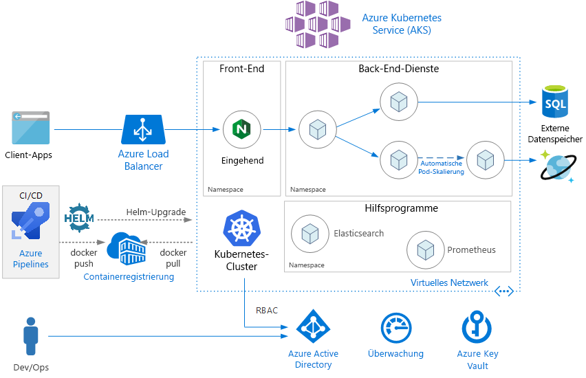
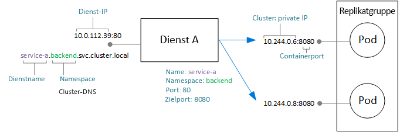
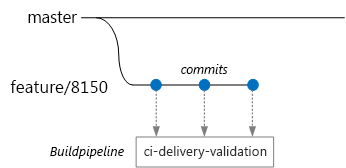
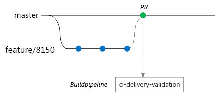
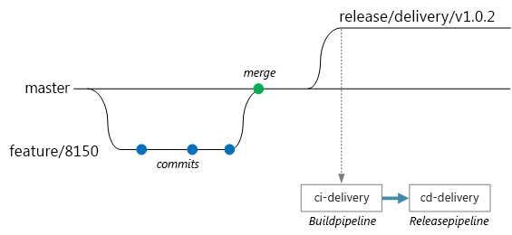

# <a name="microservices-architecture-on-azure-kubernetes-service-aks"></a>Microservicearchitektur in Azure Kubernetes Service (AKS)

In dieser Referenzarchitektur wird veranschaulicht, wie eine Microserviceanwendung für Azure Kubernetes Service (AKS) bereitgestellt wird. Es wird eine einfache AKS-Konfiguration beschrieben, die als Ausgangspunkt für die meisten Bereitstellungen dienen kann. Anspruchsvollere Optionen, z.B. erweiterte Netzwerkoptionen, werden in einer separaten Referenzarchitektur beschrieben.

In diesem Artikel werden Kubernetes-Grundkenntnisse vorausgesetzt. Es geht hauptsächlich um die Infrastruktur- und DevOps-Aspekte bei der Ausführung einer Microservicearchitektur für AKS. Eine Anleitung zum Entwerfen von Microservices aus Sicht eines domänengesteuerten Entwurfs (Domain-Driven Design, DDD) finden Sie unter [Entwerfen, Erstellen und Betreiben von Microservices in Azure](/azure/architecture/microservices).

> [!NOTE]
> Wir arbeiten an einer Referenzimplementierung (RI) für diesen Artikel, die voraussichtlich Anfang 2019 veröffentlicht wird. Dieser Artikel wird dann aktualisiert, damit er die bewährten Methoden dieser Referenzimplementierung enthält.



## <a name="architecture"></a>Architecture

Die Architektur umfasst die folgenden Komponenten.

**Azure Kubernetes Service** (AKS): AKS ist ein Azure-Dienst, mit dem ein verwalteter Kubernetes-Cluster bereitgestellt wird. 

**Kubernetes-Cluster**: AKS ist für die Bereitstellung des Kubernetes-Clusters und die Verwaltung der Kubernetes-Masterkomponenten zuständig. Sie verwalten nur die Agent-Knoten.

**Virtuelles Netzwerk**. Standardmäßig erstellt AKS ein virtuelles Netzwerk, in dem die Agent-Knoten bereitgestellt werden können. Bei anspruchsvolleren Szenarien können Sie zuerst das virtuelle Netzwerk erstellen, damit Sie Dinge wie die Konfiguration der Subnetze, lokale Konnektivität und IP-Adressierung steuern können. Weitere Informationen finden Sie unter [Konfigurieren von erweiterten Netzwerken in Azure Kubernetes Service (AKS)](/azure/aks/configure-advanced-networking).

**Eingang**: Mit einem Eingang werden HTTP(S)-Routen für Dienste im Cluster verfügbar gemacht. Weitere Informationen finden Sie unten im Abschnitt [API-Gateway](#api-gateway).

**Externe Datenspeicher**: Microservices sind normalerweise zustandslos und schreiben den Status in externe Datenspeicher, z.B. Azure SQL-Datenbank oder Cosmos DB.

**Azure Active Directory:** AKS nutzt eine Azure AD-Identität (Azure Active Directory), um andere Azure-Ressourcen, z.B. Azure Load Balancers, zu erstellen und zu verwalten. Azure AD wird auch für die Benutzerauthentifizierung in Clientanwendungen empfohlen.

**Azure Container Registry**: Verwenden Sie Container Registry zum Speichern von privaten Docker-Images, die im Cluster bereitgestellt werden. AKS kann die Authentifizierung mit Container Registry durchführen, indem die eigene Azure AD-Identität verwendet wird. Beachten Sie hierbei, dass Azure Container Registry für AKS nicht zwingend erforderlich ist. Sie können auch andere Containerregistrierungen nutzen, z.B. Docker-Hub.

**Azure Pipelines**. Pipelines ist Teil von Azure DevOps Services und führt automatisierte Build-, Test- und Bereitstellungsvorgänge durch. Sie können auch CI/CD-Lösungen von Drittanbietern, z.B. Jenkins, verwenden. 

**Helm**: Helm ist ein Paket-Manager für Kubernetes und ermöglicht das Bündeln von Kubernetes-Objekten als Einheit, die Sie veröffentlichen, bereitstellen, mit einer Versionsangabe versehen und aktualisieren können.

**Azure Monitor**: Azure Monitor erfasst Metriken und Protokolle und speichert diese Elemente. Beispiele hierfür sind Plattformmetriken für die Azure-Dienste in der Lösung und Anwendungstelemetrie. Nutzen Sie diese Daten zum Überwachen der Anwendung, Einrichten von Warnungen und Dashboards und Durchführen von Analysen der Grundursache von Fehlern. Azure Monitor wird mit AKS integriert, um Metriken von Controllern, Knoten und Containern sowie aus Containerprotokollen und Knotenprotokollen zu erfassen.

## <a name="design-considerations"></a>Überlegungen zum Entwurf

In dieser Referenzarchitektur geht es zwar um Microservicearchitekturen, aber ein Großteil der empfohlenen Methoden gilt auch für andere Workloads, die unter AKS ausgeführt werden.

### <a name="microservices"></a>Microservices

Das Kubernetes Service-Objekt ist eine natürliche Möglichkeit zum Modellieren von Microservices in Kubernetes. Ein Microservice ist eine lose gekoppelte, unabhängig bereitstellbare Codeeinheit. Microservices kommunizieren normalerweise über gut definierte APIs und können per Dienstermittlung ermittelt werden. Mit dem Kubernetes Service-Objekt werden Funktionen bereitgestellt, die die folgenden Anforderungen erfüllen:

- IP-Adresse. Das Kubernetes Service-Objekt umfasst eine statische interne IP-Adresse für eine Gruppe von Pods (ReplicaSet). Wenn Pods erstellt oder verschoben werden, ist der Dienst über diese interne IP-Adresse immer erreichbar.

- Lastenausgleich. Für den Datenverkehr, der an die IP-Adresse des Diensts gesendet wird, wird ein Lastenausgleich auf die Pods durchgeführt. 

- Dienstermittlung: Diensten werden vom Kubernetes-DNS-Dienst interne DNS-Einträge zugewiesen. Dies bedeutet, dass das API-Gateway mit dem DNS-Namen einen Back-End-Dienst aufrufen kann. Derselbe Mechanismus kann auch für die Kommunikation von Dienst zu Dienst verwendet werden. Die DNS-Einträge sind nach Namespace organisiert. Wenn Ihre Namespaces also den Kontextgrenzen entsprechen, wird der DNS-Name für einen Dienst automatisch der Anwendungsdomäne zugeordnet.

Im folgenden Diagramm ist die konzeptionelle Beziehung zwischen Diensten und Pods dargestellt. Die eigentliche Zuordnung zu Endpunkt-IP-Adressen und -ports wird mit kube-proxy, dem Kubernetes-Netzwerkproxy, durchgeführt.



### <a name="api-gateway"></a>API Gateway

Ein *API-Gateway* ist ein Gateway, das zwischen externen Clients und den Microservices angeordnet ist. Es fungiert als Reverseproxy und leitet Anforderungen von Clients an Microservices weiter. Darüber hinaus kann es verschiedene übergreifende Aufgaben wie Authentifizierung, SSL-Beendigung und Ratenbegrenzung übernehmen. 

Die von einem Gateway bereitgestellte Funktionalität kann wie folgt gruppiert werden:

- [Gatewayrouting](../../patterns/gateway-routing.md): Dient zum Weiterleiten von Clientanforderungen an die richtigen Back-End-Dienste. Es stellt einen einzelnen Endpunkt für Clients bereit und trägt zur Entkopplung von Clients und Diensten bei.

- [Gatewayaggregation](../../patterns/gateway-aggregation.md): Dient zum Aggregieren mehrerer Anforderungen in einer einzelnen Anforderung, um umfangreiche Interaktionen („Chattiness“) zwischen dem Client und dem Back-End zu verringern.

- [Gatewayabladung:](../../patterns/gateway-offloading.md) Ein Gateway kann Funktionalität für die Back-End-Dienste abladen, z.B. SSL-Beendigung, Authentifizierung, IP-Whitelisting oder Clientratenbegrenzung (Drosselung).

API-Gateways sind ein allgemeines [Microserviceentwurfsmuster](https://microservices.io/patterns/apigateway.html). Sie können mit unterschiedlichen Technologien implementiert werden. Die häufigste Implementierung ist wahrscheinlich die Bereitstellung eines Edgerouters oder Reverseproxys, z.B. Nginx, HAProxy oder Traefik, im Cluster. 

Andere Optionen sind:

- Azure Application Gateway bzw. Azure API Management, wobei es sich jeweils um verwaltete Dienste handelt, die sich außerhalb des Clusters befinden. Ein Application Gateway-Eingangscontroller befindet sich derzeit in der Betaphase.

- Azure-Funktionsproxys: Mit Proxys können Anforderungen und Antworten geändert und Anforderungen basierend auf der URL weitergeleitet werden.

Mit dem Kubernetes-Ressourcentyp **Eingang** werden die Konfigurationseinstellungen für einen Proxyserver abstrahiert. Dies funktioniert in Verbindung mit einem Eingangscontroller, der die zugrunde liegende Implementierung des Eingangs bereitstellt. Es gibt Eingangscontroller für Nginx, HAProxy, Traefik und Application Gateway (Vorschauversion) usw.

Der Eingangscontroller führt die Konfiguration des Proxyservers durch. Häufig sind hierfür komplexe Konfigurationsdateien erforderlich, deren Optimierung schwierig sein kann, wenn Sie kein Experte sind. Der Eingangscontroller stellt also eine willkommene Abstraktion dar. Außerdem hat der Eingangscontroller Zugriff auf die Kubernetes-API, damit er intelligente Entscheidungen zum Routing und Lastenausgleich treffen kann. Mit dem Nginx-Eingangscontroller wird beispielsweise der Netzwerkproxy „kube-proxy“ umgangen.

Falls Sie dagegen die vollständige Kontrolle über die Einstellungen haben müssen, können Sie diese Abstraktion auch umgehen und den Proxyserver manuell konfigurieren. 

Ein Reverseproxyserver ist ein potenzieller Engpass oder Single Point of Failure. Stellen Sie daher immer mindestens zwei Replikate bereit, um eine hohe Verfügbarkeit zu gewährleisten.

### <a name="data-storage"></a>Datenspeicher

In einer Microservicearchitektur sollten Datenspeicher nicht für Dienste gemeinsam genutzt werden. Für jeden Dienst sollten die eigenen privaten Daten in einem separaten logischen Speicher enthalten sein, um versteckte Abhängigkeiten zwischen Diensten zu vermeiden. Der Grund ist die Vermeidung einer unbeabsichtigten Kopplung von Diensten, die entstehen kann, wenn Dienste die gleichen zugrunde liegenden Datenschemas nutzen. Wenn Dienste ihre eigenen Datenspeicher nutzen, können Sie zudem jeweils den richtigen Datenspeicher für ihre speziellen Anforderungen verwenden. Weitere Informationen finden Sie unter [Entwerfen von Microservices: Überlegungen zu Daten](/azure/architecture/microservices/data-considerations).

Vermeiden Sie das Speichern von persistenten Daten in einem lokalen Clusterspeicher, weil die Daten dann an den Knoten gebunden sind. Alternative: 

- Verwenden Sie einen externen Dienst, z.B. Azure SQL-Datenbank oder Cosmos DB. *ODER*

- Stellen Sie mit Azure Disks oder Azure Files ein persistentes Volume bereit. Nutzen Sie Azure Files, wenn dasselbe Volume gemeinsam von mehreren Pods genutzt werden soll.

### <a name="namespaces"></a>Namespaces

Verwenden Sie Namespaces, um Dienste im Cluster zu organisieren. Jedes Objekt in einem Kubernetes-Cluster gehört zu einem Namespace. Wenn Sie ein neues Objekt erstellen, geht es standardmäßig in den Namespace `default` ein. Es ist aber eine gute Vorgehensweise, aussagekräftigere Namespaces zu erstellen, damit die Ressourcen im Cluster besser organisiert werden können.

Zunächst einmal tragen Namespaces zur Verhinderung von Namenskonflikten bei. Wenn mehrere Teams Microservices in demselben Cluster bereitstellen und ggf. Hunderte von Microservices vorhanden sind, wird die Verwaltung schwierig, falls alle in demselben Namespace enthalten sind. Darüber hinaus haben Sie mit Namespaces folgende Möglichkeiten:

- Wenden Sie Ressourceneinschränkungen auf einen Namespace an, damit die Gesamtzahl der Pods, die diesem Namespace zugewiesen sind, das Ressourcenkontingent des Namespace nicht überschreiten kann.

- Wenden Sie Richtlinien auf Namespaceebene an, z.B. rollenbasierte Zugriffssteuerung und Sicherheitsrichtlinien.

Für eine Microservicearchitektur kann erwägt werden, die Microservices anhand von Kontextgrenzen zu organisieren und für jede Kontextgrenze Namespaces zu erstellen. Beispielsweise können alle Microservices, die sich auf die Kontextgrenze „Auftragserfüllung“ beziehen, in demselben Namespace angeordnet werden. Alternativ hierzu können Sie auch einen Namespace für jedes Entwicklungsteam erstellen.

Ordnen Sie Hilfsdienste in einem separaten Namespace an. Beispielsweise können Sie Elasticsearch oder Prometheus für die Clusterüberwachung oder auch Tiller für Helm bereitstellen.

## <a name="scalability-considerations"></a>Überlegungen zur Skalierbarkeit

Für Kubernetes wird die horizontale Skalierung auf zwei Ebenen unterstützt:

- Skalieren Sie die Anzahl von Pods, die einer Bereitstellung zugeordnet sind.
- Skalieren Sie die Knoten im Cluster, um die gesamten Computeressourcen zu erhöhen, die für den Cluster verfügbar sind.

Sie können Pods und Knoten zwar manuell horizontal hochskalieren, aber wir empfehlen Ihnen die Verwendung der automatischen Skalierung. So kann die Wahrscheinlichkeit verringert werden, dass es für Dienste bei hoher Belastung zu einem Ressourcenmangel kommt. Bei einer Strategie für die automatische Skalierung müssen sowohl Pods als auch Knoten berücksichtigt werden. Wenn Sie nur die Pods horizontal hochskalieren, erreichen Sie schließlich die Ressourcengrenzwerte der Knoten. 

### <a name="pod-autoscaling"></a>Automatische Skalierung von Pods

Bei der „horizontalen automatischen Podskalierung“ (Horizontal Pod Autoscaler, HPA) werden Pods basierend auf beobachteten CPU-, Arbeitsspeicher- oder benutzerdefinierten Metriken skaliert. Zum Konfigurieren der horizontalen Skalierung von Pods geben Sie eine Zielmetrik (z.B. 70% der CPU) und die minimale und maximale Anzahl von Replikaten an. Sie sollten für Ihre Dienste einen Auslastungstest durchführen, um diese Zahlen abzuleiten.

Ein Nebeneffekt der automatischen Skalierung ist, dass Pods häufiger erstellt oder ausgeschlossen werden können, wenn Ereignisse mit horizontalem Hoch- und Herunterskalieren eintreten. Gehen Sie wie folgt vor, um die Auswirkungen zu entschärfen:

- Verwenden Sie Bereitschaftstests, um Kubernetes mitzuteilen, wann ein neuer Pod Datenverkehr akzeptieren kann.
- Nutzen Sie Budgets für die Unterbrechung von Pods, um einzuschränken, wie viele Pods gleichzeitig aus einem Dienst ausgeschlossen werden können.

### <a name="cluster-autoscaling"></a>Automatische Skalierung von Clustern

Mit der automatischen Skalierung von Clustern wird die Anzahl von Knoten skaliert. Falls Pods aufgrund von Ressourceneinschränkungen nicht geplant werden können, stellt die automatische Skalierung des Clusters mehr Knoten bereit.  (Hinweis: Die Integration zwischen AKS und der automatischen Skalierung des Clusters befindet sich derzeit in der Vorschauphase.)

Während bei HPA auf die tatsächlich genutzten Ressourcen oder andere Metriken ausgeführter Pods geachtet wird, werden bei der automatischen Skalierung des Clusters Knoten für Pods bereitgestellt, die noch nicht geplant sind. Aus diesem Grund werden die angeforderten Ressourcen untersucht, die in der Kubernetes-Podspezifikation für eine Bereitstellung angegeben sind. Verwenden Sie Auslastungstests, um diese Werte zu optimieren.

Da Sie die VM-Größe nach dem Erstellen des Clusters nicht mehr ändern können, sollten Sie zunächst eine Kapazitätsplanung durchführen. Hierbei können Sie eine geeignete VM-Größe für die Agent-Knoten wählen, die beim Erstellen des Clusters verwendet werden soll. 

## <a name="availability-considerations"></a>Überlegungen zur Verfügbarkeit

### <a name="health-probes"></a>Integritätstests

Mit Kubernetes werden zwei Arten von Integritätstest definiert, die von einem Pod verfügbar gemacht werden können:

- Bereitschaftstest: Teilt Kubernetes mit, ob der Pod für das Akzeptieren von Anforderungen bereit ist.

- Livetest: Teilt Kubernetes mit, ob ein Pod entfernt und eine neue Instanz gestartet werden soll.

Im Hinblick auf Tests ist es hilfreich, sich daran zu erinnern, wie ein Dienst in Kubernetes funktioniert. Ein Dienst verfügt über eine Bezeichnungsauswahl, mit der eine Gruppe von (null oder mehr) Pods abgeglichen werden kann. Kubernetes führt für den Datenverkehr einen Lastenausgleich auf die Pods durch, die die Auswahlkriterien erfüllen. Nur Pods, die erfolgreich gestartet wurden und fehlerfrei sind, erhalten Datenverkehr. Falls ein Container abstürzt, nimmt Kubernetes den Pod außer Betrieb und plant einen Ersatz.

Es kann vorkommen, dass ein Pod noch nicht für den Empfang von Datenverkehr bereit ist, obwohl er erfolgreich gestartet wurde. Beispielsweise werden Initialisierungsaufgaben durchgeführt, bei denen die im Container ausgeführte Anwendung Dinge in den Arbeitsspeicher lädt oder Konfigurationsdaten liest. Definieren Sie einen Bereitschaftstest, um anzugeben, dass ein Pod fehlerfrei, aber noch nicht für den Empfang von Datenverkehr bereit ist. 

Livetests werden verwendet, wenn ein Pod noch ausgeführt wird, aber fehlerhaft ist und recycelt werden sollte. Angenommen, ein Container stellt HTTP-Anforderungen bereit, hängt aber aus irgendeinem Grund. Der Container stürzt nicht ab, stellt aber keine Anforderungen mehr bereit. Wenn Sie einen HTTP-Livetest definieren, antwortet der Test nicht mehr, und Kubernetes erhält die Information, dass der Pod neu gestartet werden muss.

Hier sind einige Aspekte angegeben, die beim Entwerfen von Tests berücksichtigt werden sollten:

- Falls Ihr Code über eine lange Startdauer verfügt, besteht die Gefahr, dass bei einem Livetest ein Fehler gemeldet wird, bevor der Startvorgang abgeschlossen ist. Verwenden Sie die Einstellung „initialDelaySeconds“, mit der der Start des Tests verzögert wird, um dies zu verhindern.

- Ein Livetest stellt nur dann eine Hilfe dar, wenn ein Neustart des Pods wahrscheinlich ist, um den fehlerfreien Zustand wiederherzustellen. Sie können einen Livetest als Maßnahme gegen Speicherverluste oder unerwartete Deadlocks verwenden, aber es hat keinen Zweck, einen Pod neu zu starten, für den sofort wieder ein Fehler auftritt.

- In einigen Fällen werden Bereitschaftstests genutzt, um abhängige Dienste zu überprüfen. Wenn für einen Pod beispielsweise eine Abhängigkeit von einer Datenbank besteht, kann mit dem Livetest ggf. die Datenbankverbindung überprüft werden. Dieser Ansatz kann aber zu unerwarteten Problemen führen. Unter Umständen ist ein externer Dienst aus einem bestimmten Grund vorübergehend nicht verfügbar. Dies führt dazu, dass der Bereitschaftstest für alle Pods Ihres Diensts fehlschlägt, sodass alle aus dem Lastenausgleich entfernt werden und es im weiteren Verlauf zu kaskadierenden Fehlern kommt. Ein besserer Ansatz ist die Implementierung einer Verarbeitungswiederholung in Ihrem Dienst, damit Ihr Dienst nach vorübergehenden Fehlern korrekt wiederhergestellt werden kann.

### <a name="resource-constraints"></a>Ressourceneinschränkungen

Ressourcenkonflikte können sich auf die Verfügbarkeit eines Diensts auswirken. Definieren Sie Ressourceneinschränkungen für Container, damit ein einzelner Container die Clusterressourcen (Arbeitsspeicher und CPU) nicht überlasten kann. Für andere Ressourcen, bei denen es sich nicht um Container handelt, z.B. Threads oder Netzwerkverbindungen, können Sie das [Bulkhead-Muster](/azure/architecture/patterns/bulkhead) (Trennwandmuster) verwenden, um Ressourcen zu isolieren.

Nutzen Sie Ressourcenkontingente, um die Gesamtzahl der Ressourcen, die für einen Namespace zulässig sind, zu begrenzen. Auf diese Weise kann das Front-End die Back-End-Dienste für Ressourcen blockieren (oder umgekehrt).

## <a name="security-considerations"></a>Sicherheitshinweise

### <a name="role-based-access-control-rbac"></a>Rollenbasierte Zugriffssteuerung (Role Based Access Control, RBAC)

Kubernetes und Azure verfügen jeweils über Mechanismen für die rollenbasierte Zugriffssteuerung (RBAC):

- Mit der rollenbasierten Zugriffssteuerung von Azure wird der Zugriff auf Ressourcen in Azure gesteuert, z.B. auch die Möglichkeit zum Erstellen neuer Azure-Ressourcen. Berechtigungen können Benutzern, Gruppen oder Dienstprinzipalen zugewiesen werden. (Ein Dienstprinzipal ist eine Sicherheitsidentität, die von Anwendungen verwendet wird.)

- Mit der rollenbasierten Zugriffssteuerung von Kubernetes werden die Berechtigungen für die Kubernetes-API gesteuert. Beispielsweise sind das Erstellen und Auflisten von Pods Aktionen, die per RBAC für einen Benutzer autorisiert (oder abgelehnt) werden können. Zum Zuweisen von Kubernetes-Berechtigungen zu Benutzern erstellen Sie *Rollen* und *Rollenbindungen*:

  - Eine Rolle ist ein Satz mit Berechtigungen, die innerhalb eines Namespace gelten. Berechtigungen werden in Form von Verben (abrufen, aktualisieren, erstellen, löschen) für Ressourcen (Pods, Bereitstellungen usw.) definiert.

  - Mit einer Rollenbindung (RoleBinding) werden Benutzer oder Gruppen einer Rolle zugewiesen.

  - Es ist auch ein ClusterRole-Objekt vorhanden. Dies ähnelt einer Rolle, gilt aber für den gesamten Cluster übergreifend für alle Namespaces. Erstellen Sie eine Clusterrollenbindung (ClusterRoleBinding), um Benutzer oder Gruppen einer Clusterrolle (ClusterRole) zuzuweisen.

AKS integriert diese beiden RBAC-Mechanismen. Beim Erstellen eines AKS-Clusters können Sie diesen so konfigurieren, dass für die Benutzerauthentifizierung Azure AD verwendet wird. Ausführliche Informationen zur Einrichtung finden Sie unter [Integrieren von Azure Active Directory in Azure Kubernetes Service](/azure/aks/aad-integration).

Nachdem dies konfiguriert wurde, muss sich ein Benutzer, der Zugriff auf die Kubernetes-API erhalten möchte (z.B. über kubectl), mit seinen Azure AD-Anmeldeinformationen anmelden.

Standardmäßig hat ein Azure AD-Benutzer keinen Zugriff auf den Cluster. Zum Gewähren des Zugriffs erstellt der Clusteradministrator Rollenbindungen (RoleBindings), die sich auf Azure AD-Benutzer oder -Gruppen beziehen. Es tritt ein Fehler auf, wenn ein Benutzer nicht über die Berechtigungen für einen bestimmten Vorgang verfügt.

Dies wirft folgende Frage auf: Wenn Benutzer standardmäßig keinen Zugriff haben, wie verfügt der Clusteradministrator dann überhaupt über die Berechtigung zum Erstellen der Rollenbindungen? Ein AKS-Cluster weist zwei Arten von Anmeldeinformationen auf, mit denen der Kubernetes-API-Server aufgerufen wird: Clusterbenutzer und Clusteradministrator. Mit den Anmeldeinformationen für den Clusteradministrator wird Vollzugriff auf den Cluster gewährt. Mit dem Azure CLI-Befehl `az aks get-credentials --admin` werden die Anmeldeinformationen des Clusteradministrators heruntergeladen und in Ihrer kubeconfig-Datei gespeichert. Der Clusteradministrator kann diese kubeconfig-Datei zum Erstellen von Rollen und Rollenbindungen verwenden.

Da die Anmeldeinformationen des Clusteradministrators mit umfassenden Berechtigungen verbunden sind, können Sie Azure RBAC verwenden, um den Zugriff zu beschränken:

- Die „Administratorrolle für Azure Kubernetes Service-Cluster“ verfügt über die Berechtigung zum Herunterladen der Anmeldeinformationen für den Clusteradministrator. Dieser Rolle sollten nur Clusteradministratoren zugewiesen werden.

- Die „Benutzerrolle für Azure Kubernetes Service-Cluster“ verfügt über die Berechtigung zum Herunterladen der Anmeldeinformationen für den Clusterbenutzer. Benutzer ohne Administratorrechte können dieser Rolle zugewiesen werden. Mit dieser Rolle werden keine besonderen Berechtigungen für Kubernetes-Ressourcen im Cluster gewährt. Einem Benutzer wird lediglich die Berechtigung gewährt, eine Verbindung mit dem API-Server herzustellen. 

Beachten Sie beim Definieren Ihrer RBAC-Richtlinien (sowohl für Kubernetes als auch für Azure) die Rollen in Ihrer Organisation:

- Wer kann einen AKS-Cluster erstellen oder löschen und die Administratoranmeldeinformationen herunterladen?
- Wer kann einen Cluster verwalten?
- Wer kann Ressourcen innerhalb eines Namespace erstellen oder aktualisieren?

Es ist eine bewährte Vorgehensweise, den Bereich für Kubernetes-RBAC-Berechtigungen basierend auf dem Namespace festzulegen, indem „Roles“ und „RoleBindings“ verwendet werden (anstatt „ClusterRoles“ und „ClusterRoleBindings“).

Abschließend muss die Frage beantwortet werden, über welche Berechtigungen der AKS-Cluster für die Erstellung und Verwaltung von Azure-Ressourcen verfügt, z.B. Lastenausgleichsmodule, Netzwerke oder Speicher. Für die Authentifizierung gegenüber Azure-APIs nutzt der Cluster einen Azure AD-Dienstprinzipal. Falls Sie beim Erstellen des Clusters keinen Dienstprinzipal angeben, wird automatisch einer erstellt. Es ist aber eine gute Vorgehensweise in Bezug auf die Sicherheit, zuerst den Dienstprinzipal zu erstellen und ihm die RBAC-Mindestberechtigungen zuzuweisen. Weitere Informationen finden Sie unter [Dienstprinzipale mit Azure Kubernetes Service (AKS)](/azure/aks/kubernetes-service-principal).

### <a name="secrets-management-and-application-credentials"></a>Geheimnisverwaltung und Anwendungsanmeldeinformationen

Anwendungen und Dienste benötigen häufig Anmeldeinformationen, mit denen sie sich an externen Diensten, z.B. Azure Storage oder SQL-Datenbank, anmelden können. Die Herausforderung besteht darin, diese Anmeldeinformationen sicher aufzubewahren und vor der Offenlegung zu schützen. 

Für Azure-Ressourcen besteht eine Option darin, verwaltete Identitäten zu nutzen. Die Idee bei einer verwalteten Identität ist, dass für eine Anwendung oder einen Dienst eine Identität in Azure AD gespeichert ist, die zum Authentifizieren gegenüber einem Azure-Dienst verwendet wird. Für die Anwendung oder den Dienst wird in Azure AD ein Dienstprinzipal erstellt, und für die Authentifizierung werden OAuth 2.0-Token verwendet. Der ausführende Prozess ruft eine localhost-Adresse auf, um das Token abzurufen. Auf diese Weise müssen Sie keine Kennwörter oder Verbindungszeichenfolgen speichern. Sie können verwaltete Identitäten in AKS nutzen, indem Sie den einzelnen Pods über das Projekt [aad-pod-identity](https://github.com/Azure/aad-pod-identity) Identitäten zuweisen.

Derzeit unterstützen nicht alle Azure-Dienste die Authentifizierung mit verwalteten Identitäten. Eine Liste finden Sie unter [Azure-Dienste, die die Azure AD-Authentifizierung unterstützen](/azure/active-directory/managed-identities-azure-resources/services-support-msi).

Auch bei verwalteten Identitäten müssen Sie wahrscheinlich einige Anmeldeinformationen oder anderen Anwendungsgeheimnisse speichern, z.B. für Azure-Dienste, die keine verwalteten Identitäten unterstützen, Drittanbieterdienste, API-Schlüssel usw. Hier sind einige Optionen für die sichere Speicherung von Geheimnissen angegeben:

- Azure Key Vault: In AKS können Sie ein oder mehrere Geheimnisse aus Key Vault als Volume bereitstellen. Das Volume liest die Geheimnisse aus Key Vault aus. Der Pod kann die Geheimnisse dann wie ein reguläres Volume lesen. Weitere Informationen finden Sie unter dem Projekt [Kubernetes-KeyVault-FlexVolume](https://github.com/Azure/kubernetes-keyvault-flexvol) auf GitHub.

    Der Pod authentifiziert sich selbst entweder mit einer Pod-Identität (oben beschrieben) oder mit einem Azure AD-Dienstprinzipal und einem geheimen Clientschlüssel. Die Verwendung von Pod-Identitäten wird empfohlen, da der geheime Clientschlüssel in diesem Fall nicht benötigt wird. 

- HashiCorp Vault: Kubernetes-Anwendungen können sich auch per HashiCorp authentifizieren, indem sie verwaltete Azure AD-Identitäten verwenden. Weitere Informationen finden Sie unter [HashiCorp Vault speaks Azure Active Directory](https://open.microsoft.com/2018/04/10/scaling-tips-hashicorp-vault-azure-active-directory/) (HashiCorp Vault spricht Azure Active Directory). Sie können Vault selbst für Kubernetes bereitstellen, aber es wird empfohlen, die Anwendung nicht in Ihrem Anwendungscluster, sondern in einem separaten dedizierten Cluster auszuführen. 

- Kubernetes-Geheimnisse: Eine weitere Option ist einfach die Nutzung von Kubernetes-Geheimnissen. Diese Option ist am einfachsten zu konfigurieren, aber es sind auch einige Herausforderungen zu bewältigen. Die Geheimnisse werden in „etcd“ gespeichert, wobei es sich um einen verteilten Schlüssel-Wert-Speicher handelt. Bei AKS [wird etcd im ruhenden Zustand verschlüsselt](https://github.com/Azure/kubernetes-kms#azure-kubernetes-service-aks). Microsoft verwaltet die Verschlüsselungsschlüssel.

Die Nutzung eines Systems wie HashiCorp Vault oder Azure Key Vault hat mehrere Vorteile, z.B.:

- Zentralisierte Steuerung der Geheimnisse
- Sicherheit, dass alle Geheimnisse im Ruhezustand verschlüsselt sind
- Zentrale Schlüsselverwaltung
- Zugriffssteuerung für Geheimnisse
- Überwachung

### <a name="pod-and-container-security"></a>Pod- und Containersicherheit

Dies ist keine vollständige Liste, aber hier sind einige empfohlene Vorgehensweisen zum Schützen Ihrer Pods und Container angegeben: 

Führen Sie Container nicht im privilegierten Modus aus. Im privilegierten Modus hat ein Container Zugriff auf alle Geräte auf dem Host. Sie können eine Pod-Sicherheitsrichtlinie festlegen, um die Ausführung im privilegierten Modus für Container zu unterbinden. 

Vermeiden Sie nach Möglichkeit die Ausführung von Prozessen als Root-Benutzer innerhalb von Containern. Container bieten aus Sicherheitssicht keine vollständige Isolation, und es ist besser, einen Containerprozess als nicht privilegierter Benutzer auszuführen. 

Speichern Sie Images in einer vertrauenswürdigen privaten Registrierung, z.B. Azure Container Registry oder Docker Trusted Registry. Verwenden Sie in Kubernetes einen Webhook für die Aufnahmeüberprüfung, um sicherzustellen, dass Pods Images nur aus der vertrauenswürdigen Registrierung per Pullvorgang abrufen können.

Scannen Sie Images auf bekannte Sicherheitsrisiken, indem Sie Scanlösungen wie Twistlock oder Aqua verwenden, die über den Azure Marketplace erhältlich sind.

Automatisieren Sie das Patchen der Images mit ACR Tasks, einem Feature von Azure Container Registry. Ein Containerimage besteht aus verschiedenen Ebenen. Die Basisebenen enthalten das Betriebssystemimage und die Anwendungsframework-Images, z.B. ASP.NET Core oder Node.js. Die Erstellung der Basisimages ist den Anwendungsentwicklern normalerweise vorgeschaltet, und die Verwaltung wird von anderen Projektbeteiligten durchgeführt. Wenn diese Images vorher gepatcht werden, ist es wichtig, dass Sie Ihre eigenen Images aktualisieren, testen und erneut bereitstellen, damit keine bekannten Sicherheitsrisiken bestehen. ACR Tasks kann zum Automatisieren dieses Prozesses beitragen.

## <a name="deployment-cicd-considerations"></a>Bereitstellungsaspekte (CI/CD)

Hier sind einige Ziele eines stabilen CI/CD-Prozesses für eine Microservicearchitektur aufgeführt:

- Jedes Team kann die eigenen Dienste unabhängig erstellen und bereitstellen, ohne dass andere Teams hierdurch beeinträchtigt oder gestört werden.

- Bevor eine neue Version eines Diensts für die Produktion bereitgestellt wird, wird sie zunächst zur Überprüfung in Umgebungen für die Entwicklung, Tests und Qualitätssicherung bereitgestellt. Jede Phase verfügt über so genannte „Quality Gates“.

- Eine neue Version eines Diensts kann parallel zur vorherigen Version bereitgestellt werden.

- Es sind ausreichende Richtlinien für die Zugriffssteuerung vorhanden.

- Sie können den Containerimages vertrauen, die für die Produktion bereitgestellt werden.

### <a name="isolation-of-environments"></a>Isolation von Umgebungen

Sie verfügen über mehrere Umgebungen, in denen Sie Dienste bereitstellen, z.B. Entwicklung, Feuerprobe, Integrationstests, Auslastungstests und schließlich Produktion. Für diese Umgebungen ist ein gewisses Maß an Isolation erforderlich. In Kubernetes haben Sie die Wahl zwischen physischer Isolation und logischer Isolation. Physische Isolation bedeutet, dass die Bereitstellung in separaten Clustern erfolgt. Bei der logischen Isolation werden wie oben beschrieben Namespaces und Richtlinien verwendet.

Unsere Empfehlung lautet, einen dedizierten Produktionscluster mit einem zusätzlichen separaten Cluster für Ihre Entwicklungs- und Testumgebungen zu erstellen. Verwenden Sie die logische Isolation, um Umgebungen im Entwicklungs-/Testcluster zu trennen. Im Entwicklungs-/Testcluster bereitgestellte Dienste sollten niemals Zugriff auf Datenspeicher haben, in denen sich Geschäftsdaten befinden. 

### <a name="helm"></a>Helm

Erwägen Sie die Verwendung von Helm zum Erstellen und Bereitstellen von Diensten. Einige Features von Helm für CI/CD sind:

- Organisieren aller Kubernetes-Objekte für einen bestimmten Microservice in einem gemeinsamen Helm-Diagramm
- Bereitstellen des Diagramms als einzelnen Helm-Befehl, anstatt einer Reihe von kubectl-Befehlen
- Nachverfolgen von Updates und Revisionen per semantischer Versionierung und möglicher Rollback auf eine vorherige Version
- Verwenden von Vorlagen zur Vermeidung von doppelten Informationen, z.B. Bezeichnungen und Selektoren, über viele Dateien hinweg
- Verwalten von Abhängigkeiten zwischen Diagrammen
- Veröffentlichen von Diagrammen in einem Helm-Repository, z.B. Azure Container Registry, und Integrieren in die Buildpipeline

Weitere Informationen zur Verwendung von Container Registry als Helm-Repository finden Sie unter [Verwenden Sie Azure Container Registry als Helm-Repository für Ihre Anwendungsdiagramme](/azure/container-registry/container-registry-helm-repos).

### <a name="cicd-workflow"></a>CI/CD-Workflow

Vor dem Erstellen eines CI/CD-Workflows müssen Sie sich darüber im Klaren sein, wie die Codebasis strukturiert sein und verwaltet werden soll.

- Arbeiten die Teams in separaten Repositorys oder in einem „Monorepo“ (einzelnen Repository)?
- Wie sieht Ihre Strategie für das „Branchen“ aus?
- Wer kann Code per Pushvorgang in die Produktion übertragen? Ist eine Release Manager-Rolle vorhanden?

Die Beliebtheit des Monorepo-Ansatzes ist gestiegen, aber beide Ansätze haben sowohl Vor- als auch Nachteile.

| &nbsp; | Monorepo | Mehrere Repositorys |
|--------|----------|----------------|
| **Vorteile** | Codefreigabe<br/>Einfacheres Standardisieren von Code und Tools<br/>Einfacheres Umgestalten von Code<br/>Auffindbarkeit: Zentrale Codeansicht<br/> | Eindeutige Eigentümerschaft pro Team<br/>Potenziell weniger Zusammenführungskonflikte<br/>Unterstützung bei der Durchsetzung der Entkopplung von Microservices |
| **Herausforderungen** | Änderungen an freigegebenem Code können sich auf mehrere Microservices auswirken<br/>Höheres Potenzial für Zusammenführungskonflikte<br/>Tools müssen auf große Codebasis skaliert werden<br/>Zugriffssteuerung<br/>Komplexerer Bereitstellungsprozess | Schwierigere Codefreigabe<br/>Schwierigeres Durchsetzen von Codierungsstandards<br/>Verwaltung von Abhängigkeiten<br/>Diffuse Codebasis, schlechte Auffindbarkeit<br/>Mangel an freigegebener Infrastruktur

In diesem Abschnitt wird ein möglicher CI/CD-Workflow veranschaulicht, der auf den folgenden Annahmen basiert:

- Für das Coderepository wird der Monorepo-Ansatz genutzt, und die Ordner sind nach Microservice organisiert.
- Die Branchstrategie des Teams basiert auf der [Trunk-basierten Entwicklung](https://trunkbaseddevelopment.com/).
- Das Team nutzt [Azure Pipelines](/azure/devops/pipelines), um den CI/CD-Prozess auszuführen.
- Das Team verwendet [Namespaces](/azure/container-registry/container-registry-best-practices#repository-namespaces) in Azure Container Registry, um Images, die bereits für die Produktion genehmigt wurden, von den noch in der Testphase befindlichen Images zu isolieren.

In diesem Beispiel arbeitet ein Entwickler an einem Microservice mit dem Namen „Delivery Service“ (Lieferdienst). (Der Name stammt aus der Referenzimplementierung, die [hier](../../microservices/index.md#the-drone-delivery-application) beschrieben ist.) Beim Entwickeln eines neuen Features checkt der Entwickler Code in einen Featurebranch ein.



Wenn Commits per Pushvorgang an diesen Branch übertragen werden, wird ein CI-Build für den Microservice ausgelöst. Für Featurebranches wird die Benennungskonvention `feature/*` verwendet. Die [Builddefinitionsdatei](/azure/devops/pipelines/yaml-schema) enthält einen Trigger, der nach dem Branchnamen und dem Quellpfad filtert. Mit diesem Ansatz kann jedes Team über eine eigene Buildpipeline verfügen.

```yaml
trigger:
  batch: true
  branches:
    include:
    - master
    - feature/*

    exclude:
    - feature/experimental/*

  paths:
     include:
     - /src/shipping/delivery/
```

An diesem Punkt des Workflows führt der CI-Build eine Codeüberprüfung mit minimalem Umfang durch:

1. Erstellen des Codes
1. Ausführen von Komponententests

Hierbei werden die Buildzeiten kurz gehalten, damit der Entwickler schnell Feedback erhält. Wenn das Feature für die Zusammenführung mit dem Master bereit ist, öffnet der Entwickler einen PR-Vorgang. Hierdurch wird ein weiterer CI-Build ausgelöst, bei dem einige zusätzliche Überprüfungen durchgeführt werden:

1. Erstellen des Codes
1. Durchführen von Komponententests
1. Erstellen des Runtime-Containerimages
1. Durchführen von Überprüfungen auf Sicherheitsrisiken für das Image



> [!NOTE]
> In Azure Repos können Sie [Richtlinien](/azure/devops/repos/git/branch-policies) zum Schützen von Branches definieren. Für die Richtlinie sind beispielsweise ggf. ein erfolgreicher CI-Build sowie eine Genehmigung eines Prüfers erforderlich, damit die Zusammenführung mit dem Master erfolgen kann.

An einem bestimmten Punkt ist das Team zum Bereitstellen einer neuen Version des Lieferdiensts bereit. Hierzu erstellt der Release Manager einen Branch vom Master, indem er das folgende Benennungsmuster verwendet: `release/<microservice name>/<semver>`. Beispiel: `release/delivery/v1.0.2`.
Hierdurch wird ein vollständiger CI-Buildvorgang ausgelöst, bei dem alle obigen Schritte und zusätzlich die folgenden Schritte ausgeführt werden:

1. Übertragen des Docker-Images an Azure Container Registry per Pushvorgang. Das Image wird mit der Versionsnummer aus dem Branchnamen versehen.
2. Ausführen von `helm package` zum Verpacken des Helm-Diagramms
3. Übertragen des Helm-Pakets an Container Registry, indem `az acr helm push` ausgeführt wird

Wenn dieser Buildvorgang erfolgreich ist, wird mithilfe einer [Releasepipeline](/azure/devops/pipelines/release/what-is-release-management) von Azure Pipelines ein Bereitstellungsprozess ausgelöst. Diese Pipeline

1. Führen Sie `helm upgrade` aus, um das Helm-Diagramm in einer Umgebung für die Qualitätssicherung bereitzustellen.
1. Eine genehmigende Person meldet sich ab, bevor das Paket für die Produktion bereitgestellt wird. Weitere Informationen finden Sie unter [Release deployment control using approvals](/azure/devops/pipelines/release/approvals/approvals) (Steuerung von Releasebereitstellungen durch Genehmigungen).
1. Versehen Sie das Docker-Image für den Produktionsnamespace in Azure Container Registry mit einem neuen Tag. Wenn das derzeitige Tag beispielsweise `myrepo.azurecr.io/delivery:v1.0.2` lautet, lautet das Tag für die Produktion `reponame.azurecr.io/prod/delivery:v1.0.2`.
1. Führen Sie `helm upgrade` aus, um das Helm-Diagramm für die Produktionsumgebung bereitzustellen.



Es ist wichtig, Folgendes zu beachten: Auch beim Monorepo-Ansatz können diese Aufgaben einzelnen Microservices zugeordnet werden, damit die Teams Bereitstellungen schneller durchführen können. Dieser Prozess umfasst einige manuelle Schritte: Genehmigen von PRs, Erstellen von Releasebranches und Genehmigen von Bereitstellungen im Produktionscluster. Der Richtlinie nach sind dies manuelle Schritte, aber sie können auch vollständig automatisiert werden, falls die Organisation dies vorzieht.
