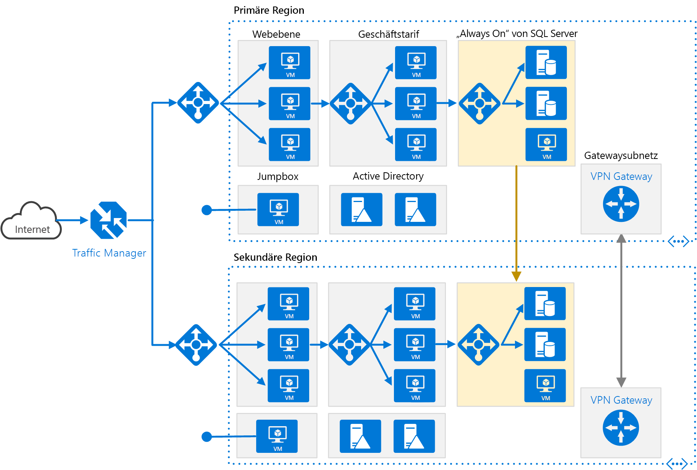

# <a name="run-an-n-tier-application-in-multiple-azure-regions-for-high-availability"></a><span data-ttu-id="2d9d2-103">Ausführen einer n-schichtigen Anwendung in mehreren Azure-Regionen für Hochverfügbarkeit</span><span class="sxs-lookup"><span data-stu-id="2d9d2-103">Run an N-tier application in multiple Azure regions for high availability</span></span>

<span data-ttu-id="2d9d2-104">Diese Referenzarchitektur zeigt eine Reihe bewährter Methoden zum Ausführen einer n-schichtigen Anwendung in mehreren Azure-Regionen, um Verfügbarkeit und eine stabile Infrastruktur für die Notfallwiederherstellung zu erzielen.</span><span class="sxs-lookup"><span data-stu-id="2d9d2-104">This reference architecture shows a set of proven practices for running an N-tier application in multiple Azure regions, in order to achieve availability and a robust disaster recovery infrastructure.</span></span>



<span data-ttu-id="2d9d2-106">*Laden Sie eine [Visio-Datei][visio-download] mit dieser Architektur herunter.*</span><span class="sxs-lookup"><span data-stu-id="2d9d2-106">*Download a [Visio file][visio-download] of this architecture.*</span></span>

## <a name="architecture"></a><span data-ttu-id="2d9d2-107">Architecture</span><span class="sxs-lookup"><span data-stu-id="2d9d2-107">Architecture</span></span>

<span data-ttu-id="2d9d2-108">Diese Architektur basiert auf der Architektur aus [N-schichtige Anwendung mit SQL Server](n-tier-sql-server.md).</span><span class="sxs-lookup"><span data-stu-id="2d9d2-108">This architecture builds on the one shown in [N-tier application with SQL Server](n-tier-sql-server.md).</span></span>

- <span data-ttu-id="2d9d2-109">**Primäre und sekundäre Regionen**.</span><span class="sxs-lookup"><span data-stu-id="2d9d2-109">**Primary and secondary regions**.</span></span> <span data-ttu-id="2d9d2-110">Verwenden Sie zwei Regionen, um eine höhere Verfügbarkeit zu erreichen.</span><span class="sxs-lookup"><span data-stu-id="2d9d2-110">Use two regions to achieve higher availability.</span></span> <span data-ttu-id="2d9d2-111">Eine ist die primäre Region.</span><span class="sxs-lookup"><span data-stu-id="2d9d2-111">One is the primary region.</span></span> <span data-ttu-id="2d9d2-112">Die andere Region ist für das Failover.</span><span class="sxs-lookup"><span data-stu-id="2d9d2-112">The other region is for failover.</span></span>

- <span data-ttu-id="2d9d2-113">**Azure Traffic Manager**.</span><span class="sxs-lookup"><span data-stu-id="2d9d2-113">**Azure Traffic Manager**.</span></span> <span data-ttu-id="2d9d2-114">[Traffic Manager][traffic-manager] leitet eingehende Anforderungen an eine der Regionen weiter.</span><span class="sxs-lookup"><span data-stu-id="2d9d2-114">[Traffic Manager][traffic-manager] routes incoming requests to one of the regions.</span></span> <span data-ttu-id="2d9d2-115">Während des normalen Betriebs werden Anforderungen an die primäre Region weitergeleitet.</span><span class="sxs-lookup"><span data-stu-id="2d9d2-115">During normal operations, it routes requests to the primary region.</span></span> <span data-ttu-id="2d9d2-116">Wenn diese Region nicht mehr verfügbar ist, führt Traffic Manager ein Failover zur sekundären Region aus.</span><span class="sxs-lookup"><span data-stu-id="2d9d2-116">If that region becomes unavailable, Traffic Manager fails over to the secondary region.</span></span> <span data-ttu-id="2d9d2-117">Weitere Informationen finden Sie im Abschnitt [Traffic Manager-Konfiguration](#traffic-manager-configuration).</span><span class="sxs-lookup"><span data-stu-id="2d9d2-117">For more information, see the section [Traffic Manager configuration](#traffic-manager-configuration).</span></span>

- <span data-ttu-id="2d9d2-118">**Ressourcengruppen:**</span><span class="sxs-lookup"><span data-stu-id="2d9d2-118">**Resource groups**.</span></span> <span data-ttu-id="2d9d2-119">Erstellen Sie separate [Ressourcengruppen][resource groups] für die primäre Region, die sekundäre Region und für Traffic Manager.</span><span class="sxs-lookup"><span data-stu-id="2d9d2-119">Create separate [resource groups][resource groups] for the primary region, the secondary region, and for Traffic Manager.</span></span> <span data-ttu-id="2d9d2-120">Dies bietet Ihnen die Flexibilität, jede Region als eine einzelne Ressourcensammlung zu verwalten.</span><span class="sxs-lookup"><span data-stu-id="2d9d2-120">This gives you the flexibility to manage each region as a single collection of resources.</span></span> <span data-ttu-id="2d9d2-121">Sie können beispielsweise eine Region erneut bereitstellen, ohne die andere außer Betrieb zu nehmen.</span><span class="sxs-lookup"><span data-stu-id="2d9d2-121">For example, you could redeploy one region, without taking down the other one.</span></span> <span data-ttu-id="2d9d2-122">[Verknüpfen Sie die Ressourcengruppen][resource-group-links], damit Sie eine Abfrage zum Auflisten aller Ressourcen für die Anwendung ausführen können.</span><span class="sxs-lookup"><span data-stu-id="2d9d2-122">[Link the resource groups][resource-group-links], so that you can run a query to list all the resources for the application.</span></span>

- <span data-ttu-id="2d9d2-123">**VNETs:**</span><span class="sxs-lookup"><span data-stu-id="2d9d2-123">**VNets**.</span></span> <span data-ttu-id="2d9d2-124">Erstellen Sie für jede Region ein separates VNET.</span><span class="sxs-lookup"><span data-stu-id="2d9d2-124">Create a separate VNet for each region.</span></span> <span data-ttu-id="2d9d2-125">Stellen Sie sicher, dass sich die Adressräume nicht überschneiden.</span><span class="sxs-lookup"><span data-stu-id="2d9d2-125">Make sure the address spaces do not overlap.</span></span>

- <span data-ttu-id="2d9d2-126">**SQL Server Always On-Verfügbarkeitsgruppe**.</span><span class="sxs-lookup"><span data-stu-id="2d9d2-126">**SQL Server Always On Availability Group**.</span></span> <span data-ttu-id="2d9d2-127">Bei Verwendung von SQL Server werden [SQL Always On-Verfügbarkeitsgruppen][sql-always-on] empfohlen, um Hochverfügbarkeit zu erzielen.</span><span class="sxs-lookup"><span data-stu-id="2d9d2-127">If you are using SQL Server, we recommend [SQL Always On Availability Groups][sql-always-on] for high availability.</span></span> <span data-ttu-id="2d9d2-128">Erstellen Sie eine einzelne Verfügbarkeitsgruppe, die SQL Server-Instanzen in beiden Regionen enthält.</span><span class="sxs-lookup"><span data-stu-id="2d9d2-128">Create a single availability group that includes the SQL Server instances in both regions.</span></span>

    > [!NOTE]
    > <span data-ttu-id="2d9d2-129">Ziehen Sie auch eine [Azure SQL-Datenbank][azure-sql-db] in Betracht, die eine relationale Datenbank als Clouddienst bereitstellt.</span><span class="sxs-lookup"><span data-stu-id="2d9d2-129">Also consider [Azure SQL Database][azure-sql-db], which provides a relational database as a cloud service.</span></span> <span data-ttu-id="2d9d2-130">Mit einer SQL-Datenbank müssen Sie weder eine Verfügbarkeitsgruppe konfigurieren noch das Failover verwalten.</span><span class="sxs-lookup"><span data-stu-id="2d9d2-130">With SQL Database, you don't need to configure an availability group or manage failover.</span></span>
    >

- <span data-ttu-id="2d9d2-131">**VPN-Gateways**.</span><span class="sxs-lookup"><span data-stu-id="2d9d2-131">**VPN Gateways**.</span></span> <span data-ttu-id="2d9d2-132">Erstellen Sie ein [VPN-Gateway][vpn-gateway] in jedem VNet, und konfigurieren Sie eine [VNet-zu-VNet-Verbindung][vnet-to-vnet], um den Netzwerkdatenverkehr zwischen den beiden VNets zu ermöglichen.</span><span class="sxs-lookup"><span data-stu-id="2d9d2-132">Create a [VPN gateway][vpn-gateway] in each VNet, and configure a [VNet-to-VNet connection][vnet-to-vnet], to enable network traffic between the two VNets.</span></span> <span data-ttu-id="2d9d2-133">Dies ist für die SQL Always On-Verfügbarkeitsgruppe erforderlich.</span><span class="sxs-lookup"><span data-stu-id="2d9d2-133">This is required for the SQL Always On Availability Group.</span></span>

## <a name="recommendations"></a><span data-ttu-id="2d9d2-134">Empfehlungen</span><span class="sxs-lookup"><span data-stu-id="2d9d2-134">Recommendations</span></span>

<span data-ttu-id="2d9d2-135">Eine Architektur mit mehreren Regionen kann eine höhere Verfügbarkeit als eine Bereitstellung in einer einzelnen Region bieten.</span><span class="sxs-lookup"><span data-stu-id="2d9d2-135">A multi-region architecture can provide higher availability than deploying to a single region.</span></span> <span data-ttu-id="2d9d2-136">Wenn ein regionaler Ausfall die primäre Region beeinträchtigt, können Sie mit [Traffic Manager][traffic-manager] ein Failover zur sekundären Region ausführen.</span><span class="sxs-lookup"><span data-stu-id="2d9d2-136">If a regional outage affects the primary region, you can use [Traffic Manager][traffic-manager] to fail over to the secondary region.</span></span> <span data-ttu-id="2d9d2-137">Diese Architektur kann auch hilfreich sein, wenn bei einem einzelnen Subsystem der Anwendung ein Fehler auftritt.</span><span class="sxs-lookup"><span data-stu-id="2d9d2-137">This architecture can also help if an individual subsystem of the application fails.</span></span>

<span data-ttu-id="2d9d2-138">Es gibt mehrere allgemeine Vorgehensweisen für das Erreichen von Hochverfügbarkeit mit mehreren Regionen:</span><span class="sxs-lookup"><span data-stu-id="2d9d2-138">There are several general approaches to achieving high availability across regions:</span></span>

- <span data-ttu-id="2d9d2-139">Aktiv/passiv mit Hot Standby.</span><span class="sxs-lookup"><span data-stu-id="2d9d2-139">Active/passive with hot standby.</span></span> <span data-ttu-id="2d9d2-140">Der Datenverkehr wird an eine Region weitergeleitet, während die andere im Hot Standby wartet.</span><span class="sxs-lookup"><span data-stu-id="2d9d2-140">Traffic goes to one region, while the other waits on hot standby.</span></span> <span data-ttu-id="2d9d2-141">Hot Standby (unmittelbar betriebsbereit) bedeutet, dass die virtuellen Computer in der sekundären Region jederzeit zugeordnet sind und ausgeführt werden.</span><span class="sxs-lookup"><span data-stu-id="2d9d2-141">Hot standby means the VMs in the secondary region are allocated and running at all times.</span></span>
- <span data-ttu-id="2d9d2-142">Aktiv/passiv mit Cold Standby.</span><span class="sxs-lookup"><span data-stu-id="2d9d2-142">Active/passive with cold standby.</span></span> <span data-ttu-id="2d9d2-143">Der Datenverkehr wird an eine Region weitergeleitet, während die andere im Cold Standby wartet.</span><span class="sxs-lookup"><span data-stu-id="2d9d2-143">Traffic goes to one region, while the other waits on cold standby.</span></span> <span data-ttu-id="2d9d2-144">Cold Standby (verzögert betriebsbereit) bedeutet, dass die virtuellen Computer in der sekundären Region erst zugewiesen werden, wenn sie für das Failover benötigt werden.</span><span class="sxs-lookup"><span data-stu-id="2d9d2-144">Cold standby means the VMs in the secondary region are not allocated until needed for failover.</span></span> <span data-ttu-id="2d9d2-145">Dieser Ansatz erfordert weniger Ausführungszeit, es dauert aber im Allgemeinen länger, bis bei einem Ausfall alle Komponenten online geschaltet sind.</span><span class="sxs-lookup"><span data-stu-id="2d9d2-145">This approach costs less to run, but will generally take longer to come online during a failure.</span></span>
- <span data-ttu-id="2d9d2-146">Aktiv/aktiv.</span><span class="sxs-lookup"><span data-stu-id="2d9d2-146">Active/active.</span></span> <span data-ttu-id="2d9d2-147">Beide Regionen sind aktiv, und Anforderungen werden per Lastenausgleich zwischen ihnen verteilt.</span><span class="sxs-lookup"><span data-stu-id="2d9d2-147">Both regions are active, and requests are load balanced between them.</span></span> <span data-ttu-id="2d9d2-148">Wenn eine Region nicht verfügbar ist, wird sie aus der Rotation entfernt.</span><span class="sxs-lookup"><span data-stu-id="2d9d2-148">If one region becomes unavailable, it is taken out of rotation.</span></span>

<span data-ttu-id="2d9d2-149">Bei dieser Referenzarchitektur liegt der Schwerpunkt auf Aktiv/Passiv mit Hot Standby, wobei Traffic Manager für das Failover verwendet wird.</span><span class="sxs-lookup"><span data-stu-id="2d9d2-149">This reference architecture focuses on active/passive with hot standby, using Traffic Manager for failover.</span></span> <span data-ttu-id="2d9d2-150">Beachten Sie, dass Sie eine kleine Anzahl virtueller Computer für Hot Standby bereitstellen und dann nach Bedarf horizontal skalieren können.</span><span class="sxs-lookup"><span data-stu-id="2d9d2-150">Note that you could deploy a small number of VMs for hot standby and then scale out as needed.</span></span>

### <a name="regional-pairing"></a><span data-ttu-id="2d9d2-151">Regionspaare</span><span class="sxs-lookup"><span data-stu-id="2d9d2-151">Regional pairing</span></span>

<span data-ttu-id="2d9d2-152">Jede Azure-Region ist mit einer anderen Region innerhalb desselben Gebiets gepaart.</span><span class="sxs-lookup"><span data-stu-id="2d9d2-152">Each Azure region is paired with another region within the same geography.</span></span> <span data-ttu-id="2d9d2-153">Sie wählen im Allgemeinen Regionen aus dem gleichen Regionspaar aus (z.B. „USA, Osten 2“ und „USA, Mitte“).</span><span class="sxs-lookup"><span data-stu-id="2d9d2-153">In general, choose regions from the same regional pair (for example, East US 2 and US Central).</span></span> <span data-ttu-id="2d9d2-154">Das bietet die folgenden Vorteile:</span><span class="sxs-lookup"><span data-stu-id="2d9d2-154">Benefits of doing so include:</span></span>

- <span data-ttu-id="2d9d2-155">Bei einem umfassenden Ausfall wird die Wiederherstellung mindestens einer Region aus jedem Paar priorisiert.</span><span class="sxs-lookup"><span data-stu-id="2d9d2-155">If there is a broad outage, recovery of at least one region out of every pair is prioritized.</span></span>
- <span data-ttu-id="2d9d2-156">Geplante Azure-Systemupdates werden in Regionspaaren nacheinander ausgeführt, um mögliche Ausfallzeiten zu minimieren.</span><span class="sxs-lookup"><span data-stu-id="2d9d2-156">Planned Azure system updates are rolled out to paired regions sequentially, to minimize possible downtime.</span></span>
- <span data-ttu-id="2d9d2-157">Regionspaare befinden sich innerhalb des gleichen geografischen Gebiets, um Anforderungen in Bezug auf den Datenspeicherort zu erfüllen.</span><span class="sxs-lookup"><span data-stu-id="2d9d2-157">Pairs reside within the same geography, to meet data residency requirements.</span></span>

<span data-ttu-id="2d9d2-158">Sie sollten allerdings sicherstellen, dass beide Regionen alle Azure-Dienste, die für Ihre Anwendung erforderlich sind, unterstützen (siehe [Dienste nach Region][services-by-region]).</span><span class="sxs-lookup"><span data-stu-id="2d9d2-158">However, make sure that both regions support all of the Azure services needed for your application (see [Services by region][services-by-region]).</span></span> <span data-ttu-id="2d9d2-159">Weitere Informationen zu Regionspaaren finden Sie unter [Geschäftskontinuität und Notfallwiederherstellung: Azure-Regionspaare][regional-pairs].</span><span class="sxs-lookup"><span data-stu-id="2d9d2-159">For more information about regional pairs, see [Business continuity and disaster recovery (BCDR): Azure Paired Regions][regional-pairs].</span></span>

### <a name="traffic-manager-configuration"></a><span data-ttu-id="2d9d2-160">Traffic Manager-Konfiguration</span><span class="sxs-lookup"><span data-stu-id="2d9d2-160">Traffic Manager configuration</span></span>

<span data-ttu-id="2d9d2-161">Beachten Sie beim Konfigurieren von Traffic Manager die folgenden Punkte:</span><span class="sxs-lookup"><span data-stu-id="2d9d2-161">Consider the following points when configuring Traffic Manager:</span></span>

- <span data-ttu-id="2d9d2-162">**Routing:**</span><span class="sxs-lookup"><span data-stu-id="2d9d2-162">**Routing**.</span></span> <span data-ttu-id="2d9d2-163">Traffic Manager unterstützt mehrere [Routingalgorithmen][tm-routing].</span><span class="sxs-lookup"><span data-stu-id="2d9d2-163">Traffic Manager supports several [routing algorithms][tm-routing].</span></span> <span data-ttu-id="2d9d2-164">Verwenden Sie für das in diesem Artikel beschriebenen Szenario Routing nach *Priorität* (ehemals Routingmethode *Failover*).</span><span class="sxs-lookup"><span data-stu-id="2d9d2-164">For the scenario described in this article, use *priority* routing (formerly called *failover* routing).</span></span> <span data-ttu-id="2d9d2-165">Bei dieser Einstellung sendet Traffic Manager alle Anforderungen an die primäre Region, bis die primäre Region nicht mehr erreichbar ist.</span><span class="sxs-lookup"><span data-stu-id="2d9d2-165">With this setting, Traffic Manager sends all requests to the primary region, unless the primary region becomes unreachable.</span></span> <span data-ttu-id="2d9d2-166">Zu diesem Zeitpunkt wird automatisch ein Failover zur sekundären Region ausgeführt.</span><span class="sxs-lookup"><span data-stu-id="2d9d2-166">At that point, it automatically fails over to the secondary region.</span></span> <span data-ttu-id="2d9d2-167">Weitere Informationen finden Sie unter [Konfigurieren der Routingmethode „Failover“][tm-configure-failover].</span><span class="sxs-lookup"><span data-stu-id="2d9d2-167">See [Configure Failover routing method][tm-configure-failover].</span></span>
- <span data-ttu-id="2d9d2-168">**Integritätstest:**</span><span class="sxs-lookup"><span data-stu-id="2d9d2-168">**Health probe**.</span></span> <span data-ttu-id="2d9d2-169">Traffic Manager verwendet einen HTTP- oder HTTPS-[Test][tm-monitoring], um die Verfügbarkeit jeder Region zu überwachen.</span><span class="sxs-lookup"><span data-stu-id="2d9d2-169">Traffic Manager uses an HTTP (or HTTPS) [probe][tm-monitoring] to monitor the availability of each region.</span></span> <span data-ttu-id="2d9d2-170">Der Test prüft auf eine HTTP 200-Antwort für einen angegebenen URL-Pfad.</span><span class="sxs-lookup"><span data-stu-id="2d9d2-170">The probe checks for an HTTP 200 response for a specified URL path.</span></span> <span data-ttu-id="2d9d2-171">Es hat sich bewährt, einen Endpunkt zu erstellen, der die Gesamtintegrität der Anwendung meldet, und diesen Endpunkt für den Integritätstest zu verwenden.</span><span class="sxs-lookup"><span data-stu-id="2d9d2-171">As a best practice, create an endpoint that reports the overall health of the application, and use this endpoint for the health probe.</span></span> <span data-ttu-id="2d9d2-172">Andernfalls meldet der Test eventuell einen fehlerfreien Endpunkt, obwohl wichtige Teile der Anwendung fehlerhaft sind.</span><span class="sxs-lookup"><span data-stu-id="2d9d2-172">Otherwise, the probe might report a healthy endpoint when critical parts of the application are actually failing.</span></span> <span data-ttu-id="2d9d2-173">Weitere Informationen finden Sie unter [Überwachungsmuster für den Integritätsendpunkt][health-endpoint-monitoring-pattern].</span><span class="sxs-lookup"><span data-stu-id="2d9d2-173">For more information, see [Health Endpoint Monitoring pattern][health-endpoint-monitoring-pattern].</span></span>

<span data-ttu-id="2d9d2-174">Wenn Traffic Manager ein Failover ausführt, können die Clients die Anwendung für eine bestimmte Zeit nicht erreichen.</span><span class="sxs-lookup"><span data-stu-id="2d9d2-174">When Traffic Manager fails over there is a period of time when clients cannot reach the application.</span></span> <span data-ttu-id="2d9d2-175">Die Dauer wird durch folgende Faktoren beeinflusst:</span><span class="sxs-lookup"><span data-stu-id="2d9d2-175">The duration is affected by the following factors:</span></span>

- <span data-ttu-id="2d9d2-176">Der Integritätstest muss erkennen, dass die primäre Region nicht erreichbar ist.</span><span class="sxs-lookup"><span data-stu-id="2d9d2-176">The health probe must detect that the primary region has become unreachable.</span></span>
- <span data-ttu-id="2d9d2-177">Die DNS-Server müssen die zwischengespeicherten DNS-Einträge für die IP-Adresse aktualisieren, die von der DNS-Gültigkeitsdauer (TTL) abhängig ist.</span><span class="sxs-lookup"><span data-stu-id="2d9d2-177">DNS servers must update the cached DNS records for the IP address, which depends on the DNS time-to-live (TTL).</span></span> <span data-ttu-id="2d9d2-178">Die Standardgültigkeitsdauer beträgt 300 Sekunden (5 Minuten), Sie können diesen Wert aber bei der Erstellung des Traffic Manager-Profils anpassen.</span><span class="sxs-lookup"><span data-stu-id="2d9d2-178">The default TTL is 300 seconds (5 minutes), but you can configure this value when you create the Traffic Manager profile.</span></span>

<span data-ttu-id="2d9d2-179">Weitere Informationen finden Sie unter [Traffic Manager-Überwachung][tm-monitoring].</span><span class="sxs-lookup"><span data-stu-id="2d9d2-179">For details, see [About Traffic Manager Monitoring][tm-monitoring].</span></span>

<span data-ttu-id="2d9d2-180">Bei Failovern durch Traffic Manager sollten Sie ein manuelles Failback ausführen, anstatt ein automatisches Failback zu implementieren.</span><span class="sxs-lookup"><span data-stu-id="2d9d2-180">If Traffic Manager fails over, we recommend performing a manual failback rather than implementing an automatic failback.</span></span> <span data-ttu-id="2d9d2-181">Andernfalls könnte eine Situation eintreten, bei der die Anwendung zwischen den Regionen hin und her wechselt.</span><span class="sxs-lookup"><span data-stu-id="2d9d2-181">Otherwise, you can create a situation where the application flips back and forth between regions.</span></span> <span data-ttu-id="2d9d2-182">Überprüfen Sie vor einem Failback, ob alle Subsysteme der Anwendung fehlerfrei sind.</span><span class="sxs-lookup"><span data-stu-id="2d9d2-182">Verify that all application subsystems are healthy before failing back.</span></span>

<span data-ttu-id="2d9d2-183">Beachten Sie, dass Traffic Manager in der Standardeinstellung automatisch Failbacks ausführt.</span><span class="sxs-lookup"><span data-stu-id="2d9d2-183">Note that Traffic Manager automatically fails back by default.</span></span> <span data-ttu-id="2d9d2-184">Um dies zu verhindern, verringern Sie die Priorität der primären Region nach einem Failover manuell.</span><span class="sxs-lookup"><span data-stu-id="2d9d2-184">To prevent this, manually lower the priority of the primary region after a failover event.</span></span> <span data-ttu-id="2d9d2-185">Angenommen, die primäre Region hat die Priorität 1 und die sekundäre Datenbank die Priorität 2.</span><span class="sxs-lookup"><span data-stu-id="2d9d2-185">For example, suppose the primary region is priority 1 and the secondary is priority 2.</span></span> <span data-ttu-id="2d9d2-186">Nach einem Failover legen Sie dann die Priorität der primären Region auf 3 fest, um ein automatisches Failback zu verhindern.</span><span class="sxs-lookup"><span data-stu-id="2d9d2-186">After a failover, set the primary region to priority 3, to prevent automatic failback.</span></span> <span data-ttu-id="2d9d2-187">Wenn Sie wieder zurück wechseln möchten, ändern Sie die Priorität wieder in 1.</span><span class="sxs-lookup"><span data-stu-id="2d9d2-187">When you are ready to switch back, update the priority to 1.</span></span>

<span data-ttu-id="2d9d2-188">Mit dem folgenden Befehl für die [Azure-Befehlszeilenschnittstelle][azure-cli] wird die Priorität aktualisiert:</span><span class="sxs-lookup"><span data-stu-id="2d9d2-188">The following [Azure CLI][azure-cli] command updates the priority:</span></span>

```azurecli
az network traffic-manager endpoint update --resource-group <resource-group> --profile-name <profile>
    --name <endpoint-name> --type azureEndpoints --priority 3
```

<span data-ttu-id="2d9d2-189">Ein anderer Ansatz besteht darin, den Endpunkt vorübergehend zu deaktivieren, bis Sie zum Ausführen eines Failbacks bereit sind:</span><span class="sxs-lookup"><span data-stu-id="2d9d2-189">Another approach is to temporarily disable the endpoint until you are ready to fail back:</span></span>

```azurecli
az network traffic-manager endpoint update --resource-group <resource-group> --profile-name <profile>
    --name <endpoint-name> --type azureEndpoints --endpoint-status Disabled
```

<span data-ttu-id="2d9d2-190">Je nach Ursache eines Failovers müssen Sie die Ressourcen innerhalb einer Region möglicherweise erneut bereitstellen.</span><span class="sxs-lookup"><span data-stu-id="2d9d2-190">Depending on the cause of a failover, you might need to redeploy the resources within a region.</span></span> <span data-ttu-id="2d9d2-191">Testen Sie vor dem Failback die Betriebsbereitschaft.</span><span class="sxs-lookup"><span data-stu-id="2d9d2-191">Before failing back, perform an operational readiness test.</span></span> <span data-ttu-id="2d9d2-192">Beim Test sollten z.B. folgende Punkte geprüft werden:</span><span class="sxs-lookup"><span data-stu-id="2d9d2-192">The test should verify things like:</span></span>

- <span data-ttu-id="2d9d2-193">Virtuelle Computer sind richtig konfiguriert.</span><span class="sxs-lookup"><span data-stu-id="2d9d2-193">VMs are configured correctly.</span></span> <span data-ttu-id="2d9d2-194">(Alle erforderliche Software ist installiert, IIS wird ausgeführt usw.)</span><span class="sxs-lookup"><span data-stu-id="2d9d2-194">(All required software is installed, IIS is running, and so on.)</span></span>
- <span data-ttu-id="2d9d2-195">Subsysteme der Anwendung sind fehlerfrei.</span><span class="sxs-lookup"><span data-stu-id="2d9d2-195">Application subsystems are healthy.</span></span>
- <span data-ttu-id="2d9d2-196">Funktionstests.</span><span class="sxs-lookup"><span data-stu-id="2d9d2-196">Functional testing.</span></span> <span data-ttu-id="2d9d2-197">(Beispielsweise, dass die Datenbankebene von der Webebene aus erreichbar ist.)</span><span class="sxs-lookup"><span data-stu-id="2d9d2-197">(For example, the database tier is reachable from the web tier.)</span></span>

### <a name="configure-sql-server-always-on-availability-groups"></a><span data-ttu-id="2d9d2-198">Konfigurieren von SQL Server Always On-Verfügbarkeitsgruppen</span><span class="sxs-lookup"><span data-stu-id="2d9d2-198">Configure SQL Server Always On Availability Groups</span></span>

<span data-ttu-id="2d9d2-199">Bei früheren Versionen als Windows Server 2016 erfordern SQL Server Always On-Verfügbarkeitsgruppen einen Domänencontroller, und alle Knoten in der Verfügbarkeitsgruppe müssen sich in der gleichen Active Directory (AD)-Domäne befinden.</span><span class="sxs-lookup"><span data-stu-id="2d9d2-199">Prior to Windows Server 2016, SQL Server Always On Availability Groups require a domain controller, and all nodes in the availability group must be in the same Active Directory (AD) domain.</span></span>

<span data-ttu-id="2d9d2-200">So konfigurieren Sie die Verfügbarkeitsgruppe:</span><span class="sxs-lookup"><span data-stu-id="2d9d2-200">To configure the availability group:</span></span>

- <span data-ttu-id="2d9d2-201">Platzieren Sie mindestens zwei Domänencontroller in jeder Region.</span><span class="sxs-lookup"><span data-stu-id="2d9d2-201">At a minimum, place two domain controllers in each region.</span></span>
- <span data-ttu-id="2d9d2-202">Weisen Sie jedem Domänencontroller eine statische IP-Adresse zu.</span><span class="sxs-lookup"><span data-stu-id="2d9d2-202">Give each domain controller a static IP address.</span></span>
- <span data-ttu-id="2d9d2-203">Erstellen Sie eine VNet-zu-VNet-Verbindung, um die Kommunikation zwischen den VNets zu ermöglichen.</span><span class="sxs-lookup"><span data-stu-id="2d9d2-203">Create a VNet-to-VNet connection to enable communication between the VNets.</span></span>
- <span data-ttu-id="2d9d2-204">Fügen Sie für jedes VNet die IP-Adressen der Domänencontroller (aus beiden Regionen) zur DNS-Serverliste hinzu.</span><span class="sxs-lookup"><span data-stu-id="2d9d2-204">For each VNet, add the IP addresses of the domain controllers (from both regions) to the DNS server list.</span></span> <span data-ttu-id="2d9d2-205">Sie können den folgenden CLI-Befehl verwenden.</span><span class="sxs-lookup"><span data-stu-id="2d9d2-205">You can use the following CLI command.</span></span> <span data-ttu-id="2d9d2-206">Weitere Informationen finden Sie unter [Ändern von DNS-Servern][vnet-dns].</span><span class="sxs-lookup"><span data-stu-id="2d9d2-206">For more information, see [Change DNS servers][vnet-dns].</span></span>

    ```azurecli
    az network vnet update --resource-group <resource-group> --name <vnet-name> --dns-servers "10.0.0.4,10.0.0.6,172.16.0.4,172.16.0.6"
    ```

- <span data-ttu-id="2d9d2-207">Erstellen Sie einen [Windows Server-Failovercluster][wsfc] (WSFC), der die SQL Server-Instanzen in beiden Regionen enthält.</span><span class="sxs-lookup"><span data-stu-id="2d9d2-207">Create a [Windows Server Failover Clustering][wsfc] (WSFC) cluster that includes the SQL Server instances in both regions.</span></span>
- <span data-ttu-id="2d9d2-208">Erstellen Sie eine SQL Server Always On-Verfügbarkeitsgruppe, die SQL Server-Instanzen sowohl in der primären als auch der sekundären Region enthält.</span><span class="sxs-lookup"><span data-stu-id="2d9d2-208">Create a SQL Server Always On Availability Group that includes the SQL Server instances in both the primary and secondary regions.</span></span> <span data-ttu-id="2d9d2-209">Die Schritte finden Sie unter [Erweitern der Always On-Verfügbarkeitsgruppe auf ein Azure-Remoterechenzentrum (PowerShell)](https://blogs.msdn.microsoft.com/sqlcat/2014/09/22/extending-alwayson-availability-group-to-remote-azure-datacenter-powershell/).</span><span class="sxs-lookup"><span data-stu-id="2d9d2-209">See [Extending Always On Availability Group to Remote Azure Datacenter (PowerShell)](https://blogs.msdn.microsoft.com/sqlcat/2014/09/22/extending-alwayson-availability-group-to-remote-azure-datacenter-powershell/) for the steps.</span></span>

  - <span data-ttu-id="2d9d2-210">Legen Sie das primäre Replikat in der primären Region ab.</span><span class="sxs-lookup"><span data-stu-id="2d9d2-210">Put the primary replica in the primary region.</span></span>
  - <span data-ttu-id="2d9d2-211">Legen Sie ein oder mehrere sekundäre Replikate in der primären Region ab.</span><span class="sxs-lookup"><span data-stu-id="2d9d2-211">Put one or more secondary replicas in the primary region.</span></span> <span data-ttu-id="2d9d2-212">Konfigurieren Sie diese für die Verwendung synchroner Commits mit automatischem Failover.</span><span class="sxs-lookup"><span data-stu-id="2d9d2-212">Configure these to use synchronous commit with automatic failover.</span></span>
  - <span data-ttu-id="2d9d2-213">Legen Sie ein oder mehrere sekundäre Replikate in der sekundären Region ab.</span><span class="sxs-lookup"><span data-stu-id="2d9d2-213">Put one or more secondary replicas in the secondary region.</span></span> <span data-ttu-id="2d9d2-214">Konfigurieren Sie diese aus Leistungsgründen für die Verwendung *asynchroner* Commits.</span><span class="sxs-lookup"><span data-stu-id="2d9d2-214">Configure these to use *asynchronous* commit, for performance reasons.</span></span> <span data-ttu-id="2d9d2-215">(Andernfalls müssen alle T-SQL-Transaktionen auf einem Roundtrip über das Netzwerk zur sekundären Region warten.)</span><span class="sxs-lookup"><span data-stu-id="2d9d2-215">(Otherwise, all T-SQL transactions have to wait on a round trip over the network to the secondary region.)</span></span>

    > [!NOTE]
    > <span data-ttu-id="2d9d2-216">Replikate mit asynchronem Commit unterstützen kein automatisches Failover.</span><span class="sxs-lookup"><span data-stu-id="2d9d2-216">Asynchronous commit replicas do not support automatic failover.</span></span>

## <a name="availability-considerations"></a><span data-ttu-id="2d9d2-217">Überlegungen zur Verfügbarkeit</span><span class="sxs-lookup"><span data-stu-id="2d9d2-217">Availability considerations</span></span>

<span data-ttu-id="2d9d2-218">Bei einer komplexen n-schichtigen Anwendung müssen Sie möglicherweise nicht die gesamte Anwendung in der sekundären Region replizieren.</span><span class="sxs-lookup"><span data-stu-id="2d9d2-218">With a complex N-tier app, you may not need to replicate the entire application in the secondary region.</span></span> <span data-ttu-id="2d9d2-219">Stattdessen replizieren Sie nur ein kritisches Subsystem, das zur Unterstützung der Geschäftskontinuität erforderlich ist.</span><span class="sxs-lookup"><span data-stu-id="2d9d2-219">Instead, you might just replicate a critical subsystem that is needed to support business continuity.</span></span>

<span data-ttu-id="2d9d2-220">Traffic Manager ist eine mögliche Schwachstelle im System.</span><span class="sxs-lookup"><span data-stu-id="2d9d2-220">Traffic Manager is a possible failure point in the system.</span></span> <span data-ttu-id="2d9d2-221">Wenn beim Traffic Manager-Dienst ein Fehler auftritt, können Clients während der Ausfallzeit nicht auf Ihre Anwendung zugreifen.</span><span class="sxs-lookup"><span data-stu-id="2d9d2-221">If the Traffic Manager service fails, clients cannot access your application during the downtime.</span></span> <span data-ttu-id="2d9d2-222">In der [SLA für Traffic Manager][tm-sla] erfahren Sie, ob Ihre geschäftlichen Anforderungen für Hochverfügbarkeit mit Traffic Manager allein erfüllt werden.</span><span class="sxs-lookup"><span data-stu-id="2d9d2-222">Review the [Traffic Manager SLA][tm-sla], and determine whether using Traffic Manager alone meets your business requirements for high availability.</span></span> <span data-ttu-id="2d9d2-223">Wenn dies nicht der Fall ist, erwägen Sie als Failback eine andere Verwaltungslösung für den Datenverkehr.</span><span class="sxs-lookup"><span data-stu-id="2d9d2-223">If not, consider adding another traffic management solution as a failback.</span></span> <span data-ttu-id="2d9d2-224">Wenn der Azure Traffic Manager-Dienst fehlerhaft ist, ändern Sie die CNAME-Einträge im DNS, sodass diese auf die andere Verwaltungslösung für den Datenverkehr verweisen.</span><span class="sxs-lookup"><span data-stu-id="2d9d2-224">If the Azure Traffic Manager service fails, change your CNAME records in DNS to point to the other traffic management service.</span></span> <span data-ttu-id="2d9d2-225">(Dieser Schritt muss manuell durchgeführt werden. Bis die DNS-Änderungen weitergegeben wurden, ist die Anwendung nicht verfügbar.)</span><span class="sxs-lookup"><span data-stu-id="2d9d2-225">(This step must be performed manually, and your application will be unavailable until the DNS changes are propagated.)</span></span>

<span data-ttu-id="2d9d2-226">Für den SQL Server-Cluster sind zwei Failoverszenarien zu berücksichtigen:</span><span class="sxs-lookup"><span data-stu-id="2d9d2-226">For the SQL Server cluster, there are two failover scenarios to consider:</span></span>

- <span data-ttu-id="2d9d2-227">Bei allen SQL Server-Datenbankreplikaten in der primären Region treten Fehler auf.</span><span class="sxs-lookup"><span data-stu-id="2d9d2-227">All of the SQL Server database replicas in the primary region fail.</span></span> <span data-ttu-id="2d9d2-228">Dies kann z. B. während eines regionalen Ausfalls vorkommen.</span><span class="sxs-lookup"><span data-stu-id="2d9d2-228">For example, this could happen during a regional outage.</span></span> <span data-ttu-id="2d9d2-229">In diesem Fall müssen Sie für die Verfügbarkeitsgruppe ein manuelles Failover ausführen, obwohl Traffic Manager automatisch ein Failover auf dem Front-End ausführt.</span><span class="sxs-lookup"><span data-stu-id="2d9d2-229">In that case, you must manually fail over the availability group, even though Traffic Manager automatically fails over on the front end.</span></span> <span data-ttu-id="2d9d2-230">Führen Sie die Schritte unter [Ausführen eines erzwungenen manuellen Failovers einer SQL Server-Verfügbarkeitsgruppe](https://msdn.microsoft.com/library/ff877957.aspx) aus, in denen beschrieben ist, wie ein erzwungenes Failover mithilfe von SQL Server Management Studio, Transact-SQL oder PowerShell in SQL Server 2016 ausgeführt wird.</span><span class="sxs-lookup"><span data-stu-id="2d9d2-230">Follow the steps in [Perform a Forced Manual Failover of a SQL Server Availability Group](https://msdn.microsoft.com/library/ff877957.aspx), which describes how to perform a forced failover by using SQL Server Management Studio, Transact-SQL, or PowerShell in SQL Server 2016.</span></span>

   > [!WARNING]
   > <span data-ttu-id="2d9d2-231">Bei einem erzwungenem Failover besteht das Risiko eines Datenverlusts.</span><span class="sxs-lookup"><span data-stu-id="2d9d2-231">With forced failover, there is a risk of data loss.</span></span> <span data-ttu-id="2d9d2-232">Sobald die primäre Region wieder online ist, erstellen Sie eine Momentaufnahme der Datenbank, und verwenden Sie [tablediff], um die Unterschiede zu ermitteln.</span><span class="sxs-lookup"><span data-stu-id="2d9d2-232">Once the primary region is back online, take a snapshot of the database and use [tablediff] to find the differences.</span></span>

- <span data-ttu-id="2d9d2-233">Traffic Manager führt ein Failover zur sekundären Region aus, doch ist das primäre SQL Server-Datenbankreplikat weiterhin verfügbar.</span><span class="sxs-lookup"><span data-stu-id="2d9d2-233">Traffic Manager fails over to the secondary region, but the primary SQL Server database replica is still available.</span></span> <span data-ttu-id="2d9d2-234">So kann beispielsweise die Front-End-Ebene fehlgeschlagen, ohne dass dies Auswirkungen auf die virtuellen SQL Server-Computer hat.</span><span class="sxs-lookup"><span data-stu-id="2d9d2-234">For example, the front-end tier might fail, without affecting the SQL Server VMs.</span></span> <span data-ttu-id="2d9d2-235">In diesem Fall wird der Internetdatenverkehr an die sekundäre Region weitergeleitet, und diese Region kann immer noch eine Verbindung mit dem primären Replikat herstellen.</span><span class="sxs-lookup"><span data-stu-id="2d9d2-235">In that case, Internet traffic is routed to the secondary region, and that region can still connect to the primary replica.</span></span> <span data-ttu-id="2d9d2-236">Es kommt jedoch zu erhöhter Latenz, da die SQL Server-Verbindungen regionsübergreifend verlaufen.</span><span class="sxs-lookup"><span data-stu-id="2d9d2-236">However, there will be increased latency, because the SQL Server connections are going across regions.</span></span> <span data-ttu-id="2d9d2-237">In dieser Situation sollten Sie auf folgende Weise ein manuelles Failover ausführen:</span><span class="sxs-lookup"><span data-stu-id="2d9d2-237">In this situation, you should perform a manual failover as follows:</span></span>

   1. <span data-ttu-id="2d9d2-238">Wechseln Sie bei einem SQL Server-Datenbankreplikat in der sekundären Region vorübergehend zu *synchronen* Commits.</span><span class="sxs-lookup"><span data-stu-id="2d9d2-238">Temporarily switch a SQL Server database replica in the secondary region to *synchronous* commit.</span></span> <span data-ttu-id="2d9d2-239">Dadurch wird sichergestellt, dass während des Failovers kein Datenverlust auftritt.</span><span class="sxs-lookup"><span data-stu-id="2d9d2-239">This ensures there won't be data loss during the failover.</span></span>
   2. <span data-ttu-id="2d9d2-240">Führen Sie ein Failover zu diesem Replikat aus.</span><span class="sxs-lookup"><span data-stu-id="2d9d2-240">Fail over to that replica.</span></span>
   3. <span data-ttu-id="2d9d2-241">Wenn Sie ein Failback zur primären Region ausführen, ändern Sie die Einstellung wieder in asynchrone Commits.</span><span class="sxs-lookup"><span data-stu-id="2d9d2-241">When you fail back to the primary region, restore the asynchronous commit setting.</span></span>

## <a name="manageability-considerations"></a><span data-ttu-id="2d9d2-242">Überlegungen zur Verwaltbarkeit</span><span class="sxs-lookup"><span data-stu-id="2d9d2-242">Manageability considerations</span></span>

<span data-ttu-id="2d9d2-243">Beim Aktualisieren der Bereitstellung aktualisieren Sie immer jeweils eine Region, um die Möglichkeit eines globalen Fehlers aufgrund einer falschen Konfiguration oder eines Fehlers in der Anwendung zu reduzieren.</span><span class="sxs-lookup"><span data-stu-id="2d9d2-243">When you update your deployment, update one region at a time to reduce the chance of a global failure from an incorrect configuration or an error in the application.</span></span>

<span data-ttu-id="2d9d2-244">Testen Sie die Resilienz des Systems gegenüber Fehlern.</span><span class="sxs-lookup"><span data-stu-id="2d9d2-244">Test the resiliency of the system to failures.</span></span> <span data-ttu-id="2d9d2-245">Hier sind einige häufige Fehlerszenarien aufgeführt, die getestet werden können:</span><span class="sxs-lookup"><span data-stu-id="2d9d2-245">Here are some common failure scenarios to test:</span></span>

- <span data-ttu-id="2d9d2-246">Herunterfahren von VM-Instanzen</span><span class="sxs-lookup"><span data-stu-id="2d9d2-246">Shut down VM instances.</span></span>
- <span data-ttu-id="2d9d2-247">Auslasten von Ressourcen, z.B. CPU und Speicher</span><span class="sxs-lookup"><span data-stu-id="2d9d2-247">Pressure resources such as CPU and memory.</span></span>
- <span data-ttu-id="2d9d2-248">Trennen/Verzögern des Netzwerks</span><span class="sxs-lookup"><span data-stu-id="2d9d2-248">Disconnect/delay network.</span></span>
- <span data-ttu-id="2d9d2-249">Absturz von Prozessen</span><span class="sxs-lookup"><span data-stu-id="2d9d2-249">Crash processes.</span></span>
- <span data-ttu-id="2d9d2-250">Ablauf von Zertifikaten</span><span class="sxs-lookup"><span data-stu-id="2d9d2-250">Expire certificates.</span></span>
- <span data-ttu-id="2d9d2-251">Simulieren von Hardwarefehlern</span><span class="sxs-lookup"><span data-stu-id="2d9d2-251">Simulate hardware faults.</span></span>
- <span data-ttu-id="2d9d2-252">Herunterfahren des DNS-Diensts auf den Domänencontrollern</span><span class="sxs-lookup"><span data-stu-id="2d9d2-252">Shut down the DNS service on the domain controllers.</span></span>

<span data-ttu-id="2d9d2-253">Messen Sie die Wiederherstellungszeiten, und stellen Sie sicher, dass diese Ihren geschäftlichen Anforderungen entsprechen.</span><span class="sxs-lookup"><span data-stu-id="2d9d2-253">Measure the recovery times and verify they meet your business requirements.</span></span> <span data-ttu-id="2d9d2-254">Testen Sie auch Kombinationen von Fehlermodi.</span><span class="sxs-lookup"><span data-stu-id="2d9d2-254">Test combinations of failure modes, as well.</span></span>

## <a name="related-resources"></a><span data-ttu-id="2d9d2-255">Zugehörige Ressourcen</span><span class="sxs-lookup"><span data-stu-id="2d9d2-255">Related resources</span></span>

<span data-ttu-id="2d9d2-256">Es wird empfohlen, sich das folgende [Azure-Beispielszenario](/azure/architecture/example-scenario) anzusehen. Darin wird veranschaulicht, wie einige dieser Technologien in spezifischen Lösungen verwendet werden:</span><span class="sxs-lookup"><span data-stu-id="2d9d2-256">You may wish to review the following [Azure example scenarios](/azure/architecture/example-scenario) that demonstrate specific solutions using some of the same technologies:</span></span>

- [<span data-ttu-id="2d9d2-257">Webanwendung mit mehreren Ebenen, die für Hochverfügbarkeit und Notfallwiederherstellung in Azure konzipiert ist</span><span class="sxs-lookup"><span data-stu-id="2d9d2-257">Multitier web application built for high availability and disaster recovery on Azure</span></span>](/azure/architecture/example-scenario/infrastructure/multi-tier-app-disaster-recovery)
- [<span data-ttu-id="2d9d2-258">Erstellen von sicheren Webanwendungen mit virtuellen Windows-Computern in Azure</span><span class="sxs-lookup"><span data-stu-id="2d9d2-258">Building secure web applications with Windows virtual machines on Azure</span></span>](/azure/architecture/example-scenario/infrastructure/regulated-multitier-app)

<!-- links -->

[hybrid-vpn]: ../hybrid-networking/vpn.md
[azure-dns]: /azure/dns/dns-overview
[azure-sla]: https://azure.microsoft.com/support/legal/sla/
[azure-sql-db]: /azure/sql-database/
[health-endpoint-monitoring-pattern]: https://msdn.microsoft.com/library/dn589789.aspx
[azure-cli]: /cli/azure/
[regional-pairs]: /azure/best-practices-availability-paired-regions
[resource groups]: /azure/azure-resource-manager/resource-group-overview
[resource-group-links]: /azure/resource-group-link-resources
[resource-manager-overview]: /azure/azure-resource-manager/resource-group-overview
[services-by-region]: https://azure.microsoft.com/regions/#services
[sql-always-on]: https://msdn.microsoft.com/library/hh510230.aspx
[tablediff]: https://msdn.microsoft.com/library/ms162843.aspx
[tm-configure-failover]: /azure/traffic-manager/traffic-manager-configure-failover-routing-method
[tm-monitoring]: /azure/traffic-manager/traffic-manager-monitoring
[tm-routing]: /azure/traffic-manager/traffic-manager-routing-methods
[tm-sla]: https://azure.microsoft.com/support/legal/sla/traffic-manager
[traffic-manager]: https://azure.microsoft.com/services/traffic-manager
[visio-download]: https://archcenter.blob.core.windows.net/cdn/vm-reference-architectures.vsdx
[vnet-dns]: /azure/virtual-network/manage-virtual-network#change-dns-servers
[vnet-to-vnet]: /azure/vpn-gateway/vpn-gateway-vnet-vnet-rm-ps
[vpn-gateway]: /azure/vpn-gateway/vpn-gateway-about-vpngateways
[wsfc]: https://msdn.microsoft.com/library/hh270278.aspx
