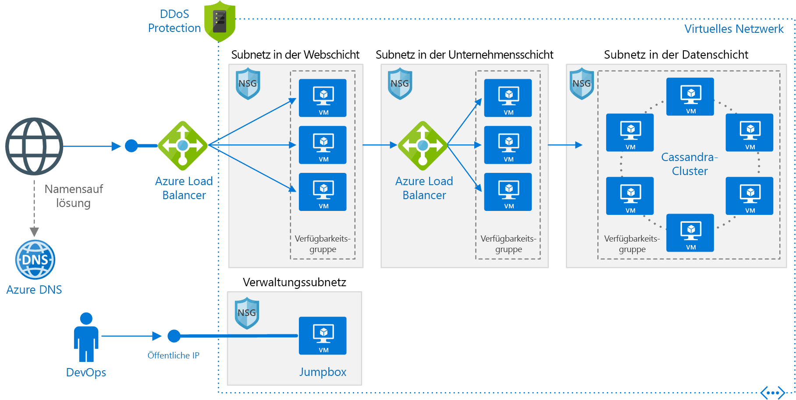

# <a name="linux-n-tier-application-in-azure-with-apache-cassandra"></a>n-schichtige Linux-Anwendung in Azure mit Apache Cassandra

Diese Referenzarchitektur zeigt, wie Sie für eine [n-schichtige](../../guide/architecture-styles/n-tier.md) Anwendung konfigurierte virtuelle Computer (VMs) und ein entsprechendes virtuelles Netzwerk mit Apache Cassandra unter Linux für die Datenebene bereitstellen. [**Stellen Sie diese Lösung bereit**](#deploy-the-solution).



*Laden Sie eine [Visio-Datei][visio-download] mit dieser Architektur herunter.*

## <a name="architecture"></a>Architecture

Die Architektur besteht aus den folgenden Komponenten:

- **Ressourcengruppe**. [Ressourcengruppen][resource-manager-overview] dienen zum Gruppieren von Ressourcen, damit sie nach Lebensdauer, Besitzer oder anderen Kriterien verwaltet werden können.

- **Virtuelles Netzwerk (VNET) und Subnetze:** Jede Azure-VM wird in einem virtuellen Netzwerk (VNET) bereitgestellt, das in Subnetze segmentiert werden kann. Erstellen Sie für jede Schicht ein separates Subnetz.

- **NSGs**. Verwenden Sie [Netzwerksicherheitsgruppen][nsg] (NSGs), um den Netzwerkdatenverkehr im VNET zu beschränken. In der hier gezeigten dreischichtigen Architektur akzeptiert die Datenbankschicht beispielsweise Datenverkehr von der Unternehmensschicht und dem Verwaltungssubnetz, aber nicht vom Web-Front-End.

- **DDoS Protection**. Obwohl die Azure-Plattform Schutz vor verteilten Denial-of-Service-Angriffen (DDoS) beinhaltet, empfehlen wir die Verwendung der Dienstebene [DDoS Protection Standard][ddos], die erweiterte Funktionen für die DDoS-Entschärfung bietet. Weitere Informationen finden Sie unter [Sicherheitshinweise](#security-considerations).

- **Virtuelle Computer:** Empfehlungen zum Konfigurieren von virtuellen Computern finden Sie unter [Run a Windows VM on Azure](./windows-vm.md) (Ausführen eines virtuellen Windows-Computers in Azure) sowie unter [Run a Linux VM on Azure](./linux-vm.md) (Ausführen eines virtuellen Linux-Computers in Azure).

- **Verfügbarkeitsgruppen**: Erstellen Sie eine [Verfügbarkeitsgruppe][azure-availability-sets] für jede Schicht, und stellen Sie mindestens zwei VMs in jeder Schicht bereit. Dadurch ist die VM für eine höhere [Vereinbarung zum Servicelevel (SLA)][vm-sla] qualifiziert.

- **Azure Load Balancer-Instanzen:** Die [Load Balancer-Instanzen][load-balancer] verteilen eingehende Internetanforderungen an die VM-Instanzen. Verwenden Sie einen [öffentlichen Load Balancer][load-balancer-external], um eingehenden Internetdatenverkehr auf die Webschicht zu verteilen, und einen [internen Load Balancer][load-balancer-internal], um Netzwerkdatenverkehr von der Webschicht auf die Unternehmensschicht zu verteilen.

- **Öffentliche IP-Adresse:** Für den Empfang von Internetdatenverkehr benötigt der öffentliche Load Balancer eine öffentliche IP-Adresse.

- **Jumpbox**: Wird auch als [geschützter Host] bezeichnet. Dies ist eine geschützte VM im Netzwerk, die von Administratoren zum Herstellen der Verbindung mit anderen VMs verwendet wird. Die Jumpbox verfügt über eine NSG, bei der Remotedatenverkehr nur von öffentlichen IP-Adressen zugelassen wird, die in einer Liste mit sicheren Adressen enthalten sind. Die Netzwerksicherheitsgruppe (NSG) muss SSH-Datenverkehr zulassen.

- **Apache Cassandra-Datenbank**: Stellt Hochverfügbarkeit in der Datenschicht durch Replikation und Failover bereit.

- **Azure DNS:** [Azure DNS][azure-dns] ist ein Hostingdienst für DNS-Domänen. Er ermöglicht eine Namensauflösung mithilfe der Microsoft Azure-Infrastruktur. Durch das Hosten Ihrer Domänen in Azure können Sie Ihre DNS-Einträge mithilfe der gleichen Anmeldeinformationen, APIs, Tools und Abrechnung wie für die anderen Azure-Dienste verwalten.

## <a name="recommendations"></a>Empfehlungen

Ihre Anforderungen können von der hier beschriebenen Architektur abweichen. Verwenden Sie diese Empfehlungen als Startpunkt.

### <a name="vnet--subnets"></a>VNET/Subnetze

Legen Sie bei der Erstellung des VNET fest, wie viele IP-Adressen Ihre Ressourcen in jedem Subnetz benötigen. Geben Sie mithilfe der [CIDR] eine Subnetzmaske und einen VNET-Adressbereich an, der für die erforderlichen IP-Adressen groß genug ist. Verwenden Sie einen Adressraum, der in die standardmäßigen [privaten IP-Adressblöcke][private-ip-space] 10.0.0.0/8, 172.16.0.0/12 und 192.168.0.0/16 fällt.

Wählen Sie einen Adressbereich aus, der sich nicht mit Ihrem lokalen Netzwerk überschneidet, für den Fall, dass Sie später ein Gateway zwischen dem VNET und dem lokalen Netzwerk einrichten müssen. Sobald Sie das VNET erstellt haben, können Sie den Adressbereich nicht mehr ändern.

Entwerfen Sie Subnetze unter Berücksichtigung der Funktionalität und Sicherheitsanforderungen. Alle VMs innerhalb derselben Schicht oder Rolle sollten im selben Subnetz platziert werden, was eine Sicherheitsbegrenzung darstellen kann. Weitere Informationen zum Entwerfen von VNETs und Subnetzen finden Sie unter [Planen und Entwerfen von Azure Virtual Networks][plan-network].

### <a name="load-balancers"></a>Load Balancer

Machen Sie die VMs nicht direkt über das Internet verfügbar. Weisen Sie stattdessen jeder VM eine private IP-Adresse zu. Clients verwenden für die Verbindungsherstellung die IP-Adresse des öffentlichen Load Balancers.

Definieren Sie Lastenausgleichsregeln, um Netzwerkdatenverkehr an die virtuellen Computer weiterzuleiten. Um beispielsweise HTTP-Datenverkehr zu aktivieren, erstellen Sie eine Regel, die Port 80 aus der Front-End-Konfiguration Port 80 im Back-End-Adresspool zuordnet. Wenn ein Client eine HTTP-Anforderung an Port 80 sendet, wählt der Lastenausgleich mithilfe eines [Hashalgorithmus][load-balancer-hashing], der die Quell-IP-Adresse enthält, eine Back-End-IP-Adresse aus. So werden Clientanforderungen auf alle VMs verteilt.

### <a name="network-security-groups"></a>Netzwerksicherheitsgruppen

Verwenden Sie NSG-Regeln, um den Datenverkehr zwischen den Schichten zu beschränken. In der oben gezeigten dreischichtigen Architektur kommuniziert die Internetschicht beispielsweise nicht direkt mit der Datenbankschicht. Um dies zu erzwingen, sollte die Datenbankschicht eingehenden Datenverkehr aus dem Subnetz der Internetschicht blockieren.

1. Lehen Sie sämtlichen eingehenden Datenverkehr aus dem VNet ab. (Verwenden Sie den `VIRTUAL_NETWORK`-Tag in der Regel.)
2. Lassen Sie eingehenden Datenverkehr aus dem Subnetz der Unternehmensschicht zu.
3. Lassen Sie eingehenden Datenverkehr aus dem Subnetz der Datenbankschicht zu. Diese Regel ermöglicht die Kommunikation zwischen den virtuellen Datenbankcomputern, die für die Replikation und das Failover der Datenbank erforderlich ist.
4. Lassen Sie SSH-Datenverkehr (Port 22) aus dem Subnetz der Jumpbox zu. Diese Regel erlaubt Administratoren, über die Jumpbox eine Verbindung mit der Datenbankschicht herzustellen.

Erstellen Sie die Regeln 2&ndash;4 mit einer höheren Priorität als die erste Regel, damit sie Vorrang haben.

### <a name="cassandra"></a>Cassandra

Für die Produktion wird [DataStax Enterprise][datastax] empfohlen, wobei diese Empfehlungen für alle Cassandra-Editionen gelten. Weitere Informationen zur Ausführung von DataStax in Azure finden Sie im [DataStax Enterprise-Bereitstellungshandbuch für Azure][cassandra-in-azure].

Fassen Sie die VMs für einen Cassandra-Cluster in einer Verfügbarkeitsgruppe zusammen, um sicherzustellen, dass die Cassandra-Replikate auf verschiedene Fehler- und Upgradedomänen verteilt werden. Weitere Informationen zu Fehler- und Upgradedomänen finden Sie unter [Verwalten der Verfügbarkeit virtueller Computer][azure-availability-sets].

Konfigurieren Sie jeweils drei Fehlerdomänen (Maximalwert) und 18 Upgradedomänen pro Verfügbarkeitsgruppe. Dadurch wird die maximale Anzahl von Upgradedomänen erreicht, die nach wie vor gleichmäßig auf die Fehlerdomänen verteilt werden können.

Konfigurieren Sie Knoten im rackfähigen Modus. Ordnen Sie Fehlerdomänen den Racks in der Datei `cassandra-rackdc.properties` zu.

Es ist kein vor dem Cluster geschaltetes Lastenausgleichsmodul erforderlich. Der Client stellt eine direkte Verbindung mit einem Knoten im Cluster her.

Stellen Sie Cassandra in mehreren Azure-Regionen bereit, um eine hohe Verfügbarkeit zu erzielen. Knoten in jeder Region werden in unterschiedlichen Racks und in Fehler- und Upgradedomänen konfiguriert, um Resilienz innerhalb der Region sicherzustellen.

### <a name="jumpbox"></a>Jumpbox

Verweigern Sie den SSH-Zugriff über das öffentliche Internet auf die VMs, auf denen die Anwendungsworkload ausgeführt wird. Der gesamte SSH-Zugriff auf diese virtuellen Computer muss stattdessen über die Jumpbox erfolgen. Ein Administrator meldet sich bei der Jumpbox und von der Jumpbox aus dann bei der anderen VM an. Die Jumpbox lässt SSH-Datenverkehr aus dem Internet zu, allerdings nur von bekannten, sicheren IP-Adressen.

Die Jumpbox hat sehr geringe Leistungsanforderungen. Wählen Sie daher einen virtuellen Computer mit geringer Größe. Erstellen Sie eine [öffentliche IP-Adresse] für die Jumpbox. Platzieren Sie die Jumpbox in dasselbe VNET wie die anderen VMs, jedoch in ein separates Verwaltungssubnetz.

Fügen Sie zum Schutz der Jumpbox eine NSG-Regel hinzu, die ausschließlich SSH-Verbindungen von einer sicheren Gruppe öffentlicher IP-Adressen zulässt. Konfigurieren Sie die NSGs für die anderen Subnetze, um SSH-Datenverkehr aus dem Verwaltungssubnetz zuzulassen.

## <a name="scalability-considerations"></a>Überlegungen zur Skalierbarkeit

Erwägen Sie für die Internet- und Unternehmensschichten die Verwendung von [VM-Skalierungsgruppen][vmss], anstatt separate VMs in einer Verfügbarkeitsgruppe bereitzustellen. Eine Skalierungsgruppe erleichtert die Bereitstellung und Verwaltung einer Gruppe identischer VMs und ermöglicht die automatische Skalierung der VMs auf der Grundlage von Leistungsmetriken. Mit zunehmender Last auf den virtuellen Computern werden dem Lastenausgleich automatisch zusätzliche virtuelle Computer hinzugefügt. Erwägen Sie die Verwendung von Skalierungsgruppen, wenn Sie VMs schnell horizontal hochskalieren müssen oder eine automatische Skalierung benötigen.

Es gibt zwei grundlegende Methoden für das Konfigurieren von virtuellen Computern in einer Skalierungsgruppe:

- Verwenden Sie Erweiterungen, um die VM nach ihrer Bereitstellung zu konfigurieren. Bei diesem Ansatz dauert das Starten neuer VM-Instanzen länger als bei virtuellen Computern ohne Erweiterungen.

- Stellen Sie einen [verwalteten Datenträger](/azure/storage/storage-managed-disks-overview) mit einem benutzerdefinierten Datenträgerimage bereit. Diese Option kann möglicherweise schneller bereitgestellt werden. Allerdings müssen Sie das Image auf dem neuesten Stand halten.

Weitere Informationen finden Sie unter [Überlegungen zum Entwurf von Skalierungsgruppen][vmss-design].

> [!TIP]
> Wenn Sie eine Lösung für die automatische Skalierung verwenden, testen Sie diese im Voraus mit Workloads auf Produktionsebene.

Jedes Azure-Abonnement verfügt über Standardeinschränkungen, zu denen auch eine maximale Anzahl von virtuellen Computern pro Region gehört. Sie können den Grenzwert erhöhen, indem Sie eine Supportanfrage einreichen. Weitere Informationen finden Sie unter [Grenzwerte für Azure-Abonnements, -Dienste und -Kontingente sowie allgemeine Beschränkungen][subscription-limits].

## <a name="availability-considerations"></a>Überlegungen zur Verfügbarkeit

Wenn Sie keine VM-Skalierungsgruppen verwenden, platzieren Sie VMs für die gleiche Schicht in einer Verfügbarkeitsgruppe. Erstellen Sie zur Unterstützung der [Verfügbarkeits-SLA für Azure-VMs][vm-sla] mindestens zwei VMs in der Verfügbarkeitsgruppe. Weitere Informationen finden Sie unter [Verwalten der Verfügbarkeit virtueller Computer][availability-set]. Skalierungsgruppen verwenden automatisch *Platzierungsgruppen*, die als eine implizite Verfügbarkeitsgruppe fungieren.

Der Lastenausgleich verwendet [Integritätstests][health-probes] zur Überwachung der Verfügbarkeit von VM-Instanzen. Kann eine Instanz bei einem Test nicht innerhalb des jeweiligen Zeitlimits erreicht werden, beendet der Lastenausgleich das Senden von Datenverkehr an diese VM. Der Lastenausgleich führt weiterhin Tests durch, und wenn die VM wieder erreichbar ist, sendet er auch wieder Datenverkehr an diese VM.

Empfehlungen für Integritätstests durch den Lastenausgleich:

- Die Tests können für HTTP oder TCP durchgeführt werden. Wenn auf Ihren virtuellen Computern ein HTTP-Server ausgeführt wird, erstellen Sie einen HTTP-Test. Erstellen Sie andernfalls einen TCP-Test.
- Geben Sie für einen HTTP-Test den Pfad zu einem HTTP-Endpunkt an. Der Test überprüft, ob von diesem Pfad eine HTTP-200-Antwort empfangen wird. Dies kann den Stammpfad („/“) oder ein Endpunkt zur Integritätsüberwachung sein, der benutzerdefinierte Logik zum Überprüfen der Integrität der Anwendung implementiert. Der Endpunkt muss anonyme HTTP-Anforderungen zulassen.
- Der Test wird von einer [bekannten][health-probe-ip] IP-Adresse (168.63.129.16) gesendet. Stellen Sie sicher, dass Sie den an oder von diese(r) IP-Adresse gesendeten Datenverkehr nicht in Firewallrichtlinien oder NSG-Regeln blockieren.
- Verwenden Sie die [Protokolle der Integritätstests][health-probe-log], um den Status der Integritätstests anzuzeigen. Aktivieren Sie die Protokollierung für jeden Lastenausgleich im Azure-Portal. Die Protokolle werden in Azure Blob Storage geschrieben. Die Protokolle zeigen, wie viele VMs aufgrund von fehlerhaften Testantworten keinen Netzwerkdatenverkehr empfangen.

Für den Cassandra-Cluster hängen die Failoverszenarien von den Konsistenzebenen, die von der Anwendung verwendet werden, und von der Anzahl von Replikaten ab. Weitere Informationen zu Konsistenzebenen und der Verwendung in Cassandra finden Sie unter [Konfigurieren der Datenkonsistenz][cassandra-consistency] sowie unter [Cassandra: Wie viele Knoten kommunizieren mit Quorum?][cassandra-consistency-usage]. Die Verfügbarkeit der Daten wird in Cassandra durch die Konsistenzebene, die von der Anwendung verwendet wird, und vom Replikationsverfahren bestimmt. Weitere Informationen zur Replikation in Cassandra finden Sie unter [Datenreplikation in NoSQL-Datenbanken im Überblick][cassandra-replication].

## <a name="security-considerations"></a>Sicherheitshinweise

Virtuelle Netzwerke stellen in Azure eine Isolationsbegrenzung für Datenverkehr dar. VMs in einem VNET können nicht direkt mit VMs in einem anderen VNET kommunizieren. VMs im selben VNET können miteinander kommunizieren, sofern Sie den Datenverkehr nicht durch die Erstellung von [Netzwerksicherheitsgruppen][nsg] (NSGs) beschränken. Weitere Informationen finden Sie unter [Microsoft Cloud Services und Netzwerksicherheit][network-security].

Für eingehenden Internetdatenverkehr definieren die Lastenausgleichsregeln, welcher Datenverkehr an das Back-End weitergeleitet wird. Allerdings unterstützen Lastenausgleichsregeln keine IP-Sicherheitslisten. Wenn Sie also einer Sicherheitsliste bestimmte öffentliche IP-Adressen hinzufügen möchten, fügen Sie dem Subnetz eine NSG hinzu.

**DMZ**. Für die Erstellung einer DMZ zwischen dem Internet und dem virtuellen Azure-Netzwerk sollten Sie eventuell eine virtuelle Netzwerkappliance (Network Virtual Appliance, NVA) hinzufügen. NVA ist ein Oberbegriff für eine virtuelle Appliance, die netzwerkbezogene Aufgaben wie Erstellung von Firewalls, Paketüberprüfung, Überwachung und benutzerdefiniertes Routing ausführen kann. Weitere Informationen finden Sie unter [Implementieren einer DMZ zwischen Azure und dem Internet][dmz].

**Verschlüsselung**. Verschlüsseln Sie sensible ruhende Daten, und verwalten Sie die Datenbankverschlüsselungsschlüssel mithilfe von [Azure Key Vault][azure-key-vault]. Key Vault kann Verschlüsselungsschlüssel in Hardwaresicherheitsmodulen (HSMs) speichern. Es empfiehlt sich außerdem, Anwendungsgeheimnisse wie Datenbankverbindungszeichenfolgen in Key Vault zu speichern.

**DDoS Protection**. Die Azure-Plattform stellt DDoS Protection Basic-Schutz standardmäßig bereit. Dieser Basisschutz ist dafür ausgelegt, die Azure-Infrastruktur als Ganzes zu schützen. Obwohl der DDoS Protection Basic-Schutz automatisch aktiviert ist, empfehlen wir die Verwendung von [DDoS Protection Standard][ddos]. DDoS Protection Standard wendet basierend auf den Mustern des Netzwerkdatenverkehrs Ihrer Anwendung eine adaptive Optimierung an, um Bedrohungen zu erkennen. Dadurch können DDoS-Angriffe entschärft werden, die von den infrastrukturweiten DDoS-Richtlinien möglicherweise nicht erkannt werden. DDoS Protection Standard stellt über Azure Monitor auch Warnungen, Telemetrie und Analysen bereit. Weitere Informationen finden Sie unter [Azure DDoS Protection – empfohlene Methoden und Referenzarchitekturen][ddos-best-practices].

## <a name="deploy-the-solution"></a>Bereitstellen der Lösung

Eine Bereitstellung für diese Referenzarchitektur ist auf [GitHub][github-folder] verfügbar.

### <a name="prerequisites"></a>Voraussetzungen

[!INCLUDE [ref-arch-prerequisites.md](../../../includes/ref-arch-prerequisites.md)]

### <a name="deploy-the-solution-using-azbb"></a>Bereitstellen der Lösung mit azbb

Um die Linux VMs für eine n-schichtige Anwendungsreferenzarchitektur bereitzustellen, führen Sie die folgenden Schritte aus:

1. Navigieren Sie zum `virtual-machines\n-tier-linux`-Ordner für das Repository, das Sie oben in Schritt 1 der Voraussetzungen als Klon erstellt haben.

2. Die Parameterdatei gibt einen Standard-Administratorbenutzernamen und ein Standardkennwort für jeden virtuellen Computer in der Bereitstellung an. Ändern Sie diese Informationen, bevor Sie die Referenzarchitektur bereitstellen. Öffnen Sie die `n-tier-linux.json`-Datei, und ersetzen Sie jedes Feld **adminUsername** und **adminPassword** durch neue Einstellungen.   Speichern Sie die Datei .

3. Stellen Sie die Referenzarchitektur wie unten dargestellt mit dem Tool **azbb** bereit.

   ```azurecli
   azbb -s <your subscription_id> -g <your resource_group_name> -l <azure region> -p n-tier-linux.json --deploy
   ```

Weitere Informationen zum Bereitstellen dieser Beispielreferenzarchitektur mithilfe von Azure-Bausteinen finden Sie im [GitHub-Repository][git].

## <a name="next-steps"></a>Nächste Schritte

- [Microsoft Learn-Modul: Übersicht über die n-schichtige Architektur](/learn/modules/n-tier-architecture/)

<!-- links -->

[dmz]: ../dmz/secure-vnet-dmz.md
[multi-vm]: ./multi-vm.md
[naming conventions]: /azure/guidance/guidance-naming-conventions
[azure-availability-sets]: /azure/virtual-machines/virtual-machines-linux-manage-availability
[azure-dns]: /azure/dns/dns-overview
[azure-key-vault]: https://azure.microsoft.com/services/key-vault

[geschützter Host]: https://en.wikipedia.org/wiki/Bastion_host
[cassandra-in-azure]: https://academy.datastax.com/resources/deployment-guide-azure
[cassandra-consistency]: https://docs.datastax.com/en/cassandra/2.0/cassandra/dml/dml_config_consistency_c.html
[cassandra-replication]: https://academy.datastax.com/planet-cassandra/data-replication-in-nosql-databases-explained
[cassandra-consistency-usage]: https://medium.com/@foundev/cassandra-how-many-nodes-are-talked-to-with-quorum-also-should-i-use-it-98074e75d7d5#.b4pb4alb2

[CIDR]: https://en.wikipedia.org/wiki/Classless_Inter-Domain_Routing
[datastax]: https://www.datastax.com/products/datastax-enterprise
[ddos]: /azure/virtual-network/ddos-protection-overview
[ddos-best-practices]: /azure/security/azure-ddos-best-practices
[git]: https://github.com/mspnp/template-building-blocks
[github-folder]: https://github.com/mspnp/reference-architectures/tree/master/virtual-machines/n-tier-linux
[load-balancer-external]: /azure/load-balancer/load-balancer-internet-overview
[load-balancer-internal]: /azure/load-balancer/load-balancer-internal-overview
[nsg]: /azure/virtual-network/virtual-networks-nsg
[nsg-rules]: /azure/azure-resource-manager/best-practices-resource-manager-security#network-security-groups
[plan-network]: /azure/virtual-network/virtual-network-vnet-plan-design-arm
[private-ip-space]: https://en.wikipedia.org/wiki/Private_network#Private_IPv4_address_spaces
[öffentliche IP-Adresse]: /azure/virtual-network/virtual-network-ip-addresses-overview-arm
[vm-sla]: https://azure.microsoft.com/support/legal/sla/virtual-machines
[visio-download]: https://archcenter.blob.core.windows.net/cdn/vm-reference-architectures.vsdx

[resource-manager-overview]: /azure/azure-resource-manager/resource-group-overview
[vmss]: /azure/virtual-machine-scale-sets/virtual-machine-scale-sets-overview
[load-balancer]: /azure/load-balancer/load-balancer-get-started-internet-arm-cli
[load-balancer-hashing]: /azure/load-balancer/load-balancer-overview#load-balancer-features
[vmss-design]: /azure/virtual-machine-scale-sets/virtual-machine-scale-sets-design-overview
[subscription-limits]: /azure/azure-subscription-service-limits
[availability-set]: /azure/virtual-machines/virtual-machines-windows-manage-availability
[health-probes]: /azure/load-balancer/load-balancer-overview#load-balancer-features
[health-probe-log]: /azure/load-balancer/load-balancer-monitor-log
[health-probe-ip]: /azure/virtual-network/virtual-networks-nsg#special-rules
[network-security]: /azure/best-practices-network-security
