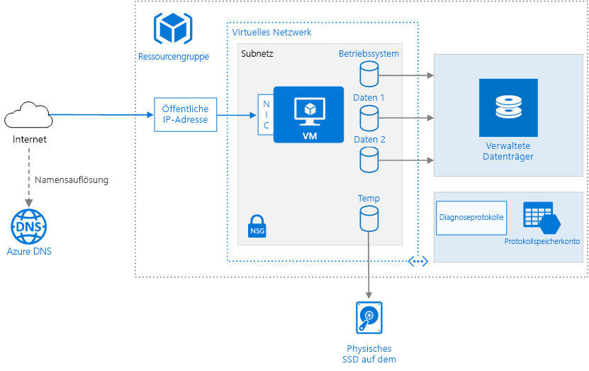

# <a name="run-a-windows-virtual-machine-on-azure"></a>Ausführen eines virtuellen Windows-Computers in Azure

Für die Bereitstellung eines virtuellen Computers (VM) in Azure werden neben dem eigentlichen virtuellen Computer noch einige andere Komponenten wie etwa Netzwerk- und Speicherressourcen benötigt. In diesem Artikel werden die bewährten Methoden für das Ausführen eines virtuellen Windows-Computers in Azure veranschaulicht.



## <a name="resource-group"></a>Ressourcengruppe

Eine [Ressourcengruppe][resource-manager-overview] ist ein logischer Container, der verwandte Azure-Ressourcen enthält. Ressourcen sollten allgemein auf der Grundlage ihrer Lebensdauer sowie auf der Grundlage der Benutzer gruppiert werden, die sie verwalten.

Legen Sie eng miteinander verknüpfte Ressourcen mit demselben Lebenszyklus in derselben [Ressourcengruppe][resource-manager-overview] ab. Mithilfe von Ressourcengruppen können Sie Ressourcen als Gruppe bereitstellen und überwachen und Abrechnungskosten nach Ressourcengruppe verfolgen. Sie können auch Ressourcen als Gruppe löschen, was für Testbereitstellungen sehr nützlich ist. Vergeben Sie aussagekräftige Ressourcennamen, um das Auffinden einer bestimmten Ressource und das Erfassen ihrer Rolle zu vereinfachen. Weitere Informationen finden Sie unter [Empfohlene Namenskonventionen für Azure-Ressourcen][naming-conventions].

## <a name="virtual-machine"></a>Virtueller Computer

Sie können eine VM über eine Liste mit veröffentlichten Images oder über ein benutzerdefiniertes verwaltetes Image oder eine virtuelle Festplattendatei (VHD) bereitstellen, die in Azure Blob Storage hochgeladen wurde.

Azure bietet viele verschiedene Größen von virtuellen Computern. Weitere Informationen finden Sie im [Artikel zu den Größen für virtuelle Computer in Azure][virtual-machine-sizes]. Starten Sie beim Verschieben einer vorhandenen Workload in Azure mit der VM-Größe, die Ihren lokalen Servern am ehesten entspricht. Messen Sie dann die Leistung Ihrer tatsächlichen Workload in Bezug auf CPU, Arbeitsspeicher und Datenträger-IOPS (E/A-Vorgänge pro Sekunde), und passen Sie die Größe nach Bedarf an.

Es empfiehlt sich generell, eine Azure-Region zu wählen, der sich in der Nähe Ihrer internen Benutzer oder Ihrer Kunden befindet. Es sind nicht alle VM-Größen in allen Regionen verfügbar. Weitere Informationen finden Sie unter [Dienste nach Region][services-by-region]. Führen Sie den folgenden Befehl über die Azure-Befehlszeilenschnittstelle (CLI) aus, um eine Liste mit den in einer bestimmten Region verfügbaren VM-Größen anzuzeigen:

```azurecli
az vm list-sizes --location <location>
```

Informationen zum Auswählen eines veröffentlichten VM-Image finden Sie unter [Suchen nach Windows-VM-Images][select-vm-image].

## <a name="disks"></a>Datenträger

Zum Erzielen einer optimalen E/A-Leistung empfehlen wir [Storage Premium][premium-storage] zum Speichern von Daten auf SSDs (Solid State Drives). Die Kosten basieren auf der Kapazität des bereitgestellten Datenträgers. IOPS und Durchsatz richten sich ebenfalls nach der Datenträgergröße. Berücksichtigen Sie beim Bereitstellen eines Datenträgers also alle drei Faktoren (Kapazität, IOPS und Durchsatz).

Wir empfehlen auch die Verwendung von [Managed Disks][managed-disks]. Verwaltete Datenträger führen die Speicherverarbeitung für Sie durch, sodass die Datenträgerverwaltung vereinfacht wird. Bei verwalteten Datenträgern ist kein Speicherkonto erforderlich. Sie geben einfach die Größe und den Typ des Datenträgers an. Dieser wird dann als Ressource mit Hochverfügbarkeit bereitgestellt.

Der Datenträger für das Betriebssystem ist eine in [Azure Storage][azure-storage] gespeicherte virtuelle Festplatte, sodass diese weiterhin bestehen bleibt, auch wenn der Hostcomputer ausgefallen ist. Es empfiehlt sich zudem, mindestens einen [Datenträger für Daten][data-disk] (VHD für Anwendungsdaten) zu erstellen. Installieren Sie, sofern möglich, Anwendungen auf einem Datenträger für Daten und nicht auf dem Datenträger für das Betriebssystem. Einige ältere Anwendungen müssen möglicherweise Komponenten auf dem Laufwerk „C:“ installieren. In diesem Fall können Sie die [Größe des Datenträgers für das Betriebssystem][resize-os-disk] mit PowerShell ändern.

Die VM wird auch mit einem temporären Datenträger erstellt (Laufwerk `D:` unter Windows). Dieser Datenträger wird auf dem Hostcomputer auf einem physischen Laufwerk gespeichert. Er wird *nicht* in Azure Storage gespeichert und kann bei Neustarts und anderen Ereignissen während des VM-Lebenszyklus gelöscht werden. Verwenden Sie diesen Datenträger nur für temporäre Daten, z. B. Auslagerungsdateien.

## <a name="network"></a>Netzwerk

Die Netzwerkkomponenten enthalten die folgenden Ressourcen:

- **Virtuelles Netzwerk**. Jeder virtuelle Computer wird in einem virtuellen Netzwerk bereitgestellt, das in mehrere Subnetze segmentiert werden kann.

- **Netzwerkschnittstelle (NIC)** Die NIC ermöglicht der VM die Kommunikation mit dem virtuellen Netzwerk. Falls Sie mehrere Netzwerkschnittstellenkarten für Ihre VM benötigen, sollten Sie sich darüber im Klaren sein, dass für jede [VM-Größe][vm-size-tables] eine maximale Anzahl von Netzwerkschnittstellenkarten definiert ist.

- **Öffentliche IP-Adresse:** Eine öffentliche IP-Adresse wird für die Kommunikation mit der VM &mdash; benötigt, z. B. per Remotedesktop (RDP). Die öffentliche IP-Adresse kann dynamisch oder statisch sein. Die Standardeinstellung ist „Dynamisch“.

- Reservieren Sie eine [statische IP-Adresse][static-ip], falls Sie eine statische IP-Adresse benötigen, die sich nicht ändert – wenn Sie z. B. einen A-Eintrag in DNS erstellen oder die IP-Adresse zu einer Liste mit sicheren Adressen hinzufügen müssen.
- Sie können auch einen vollständig qualifizierten Domänennamen (FQDN) für die IP-Adresse erstellen. Sie können anschließend einen [CNAME-Eintrag][cname-record] in DNS registrieren, der auf den FQDN verweist. Weitere Informationen finden Sie unter [Erstellen eines vollqualifizierten Domänennamens im Azure-Portal][fqdn].

- **Netzwerksicherheitsgruppen (NSG)** [Netzwerksicherheitsgruppen][nsg] dienen zum Zulassen oder Verweigern von Netzwerkdatenverkehr für virtuelle Computer. NSGs können entweder Subnetzen oder einzelnen VM-Instanzen zugeordnet werden.

Alle Netzwerksicherheitsgruppen enthalten eine Reihe von [Standardregeln][nsg-default-rules], einschließlich einer Regel, die den gesamten eingehenden Internetverkehr blockiert. Die Standardregeln können nicht gelöscht, aber von anderen Regeln überschrieben werden. Um Internetdatenverkehr zu ermöglichen, erstellen Sie Regeln, die eingehenden Datenverkehr an bestimmten Ports zulassen, z.B. Port 80 für HTTP. Fügen Sie zum Aktivieren von RDP eine NSG-Regel hinzu, die eingehenden Datenverkehr am TCP-Port 3389 zulässt.

## <a name="operations"></a>Vorgänge

**Diagnose**: Aktivieren Sie die Überwachung und Diagnose, einschließlich grundlegender Integritätsmetriken, Infrastrukturprotokolle zur Diagnose sowie [Startdiagnose][boot-diagnostics]. Startdiagnosen dienen dazu, einen Fehler beim Startvorgang zu untersuchen, wenn Ihre VM einen nicht startfähigen Zustand hat. Erstellen Sie ein Azure Storage-Konto zum Speichern der Protokolle. Ein standardmäßiger lokal redundanter Speicher (LRS) reicht für Diagnoseprotokolle aus. Weitere Informationen finden Sie unter [Aktivieren von Überwachung und Diagnose][enable-monitoring].

**Verfügbarkeit**: Ihr virtueller Computer kann von einer [geplanten Wartung][planned-maintenance] oder von [ungeplanten Ausfallzeiten][manage-vm-availability] betroffen sein. Sie können [VM-Neustartprotokolle][reboot-logs] verwenden, um zu ermitteln, ob ein VM-Neustart durch einen geplanten Wartungsvorgang verursacht wurde. Stellen Sie mehrere VMs in einer [Verfügbarkeitsgruppe](/azure/virtual-machines/windows/manage-availability#configure-multiple-virtual-machines-in-an-availability-set-for-redundancy) bereit, um eine höhere Verfügbarkeit zu erzielen. Diese Konfiguration führt auch zu einer höheren [Vereinbarung zum Servicelevel (Service Level Agreement, SLA)][vm-sla].

**Sicherungen** Verwenden Sie als Schutz vor versehentlichem Datenverlust den Dienst [Azure Backup](/azure/backup/), um Ihre VMs in georedundantem Speicher zu sichern. Mit Azure Backup sind anwendungskonsistente Sicherungen möglich.

**Beenden eines virtuellen Computers:** Unter Azure wird zwischen den Zuständen „Stopped“ (Beendet) und „Deallocated“ (Zuordnung aufgehoben) unterschieden. Ihnen werden nur Gebühren berechnet, wenn der VM-Status angehalten wird, aber nicht, wenn die Zuordnung für den virtuellen Computer aufgehoben wurde. Sie können die Zuordnung des virtuellen Computers auch mit der Schaltfläche **Beenden** im Azure-Portal aufheben. Wenn das Herunterfahren über das Betriebssystem erfolgt, während Sie angemeldet sind, wird der virtuelle Computer zwar beendet, aber die Zuordnung wird **nicht** aufgehoben. Es fallen also weiter Kosten an.

**Löschen eines virtuellen Computers:**  Wenn Sie eine VM löschen, werden die VHDs nicht gelöscht. Dies bedeutet, dass Sie die VM problemlos löschen können, ohne dass Daten verloren gehen. Allerdings wird Ihnen der Speicherplatz weiter in Rechnung gestellt. Um die VHD zu löschen, löschen Sie die Datei aus dem [Blobspeicher][blob-storage]. Zur Verhinderung des versehentlichen Löschens verwenden Sie eine [Ressourcensperre][resource-lock], um die gesamte Ressourcengruppe oder einzelne Ressourcen, z. B. einen virtuellen Computer, zu sperren.

## <a name="security-considerations"></a>Sicherheitshinweise

Verwenden Sie [Azure Security Center][security-center], um sich eine zentrale Übersicht über den Sicherheitszustand Ihrer Azure-Ressourcen zu verschaffen. Mit Security Center werden potenzielle Sicherheitsprobleme überwacht, und Sie erhalten eine umfassende Darstellung des Sicherheitszustands Ihrer Bereitstellung. Security Center wird für jedes Azure-Abonnement individuell konfiguriert. Aktivieren Sie die Erfassung von Sicherheitsdaten wie unter [Einbinden Ihres Azure-Abonnements in Security Center Standard][security-center-get-started] beschrieben. Nachdem die Datensammlung aktiviert wurde, durchsucht Security Center VMs automatisch, die unter diesem Abonnement erstellt werden.

**Patchverwaltung:** Falls aktiviert, prüft Security Center, ob kritische und Sicherheitsupdates fehlen. Verwenden Sie [Gruppenrichtlinieneinstellungen][group-policy] auf dem virtuellen Computer, um automatische Systemupdates zu aktivieren.

**Antischadsoftware:**  Falls aktiviert, prüft Security Center, ob Antischadsoftware installiert ist. Sie können auch das Security Center nutzen, um Antischadsoftware über das Azure-Portal zu installieren.

**Zugriffssteuerung:** Arbeiten Sie mit der [rollenbasierten Zugriffssteuerung][rbac] (Role-Based Access Control, RBAC), um den Zugriff auf Azure-Ressourcen zu steuern. Mithilfe der RBAC können Sie Mitglieder Ihres DevOps-Teams Autorisierungsrollen zuweisen. Die Rolle „Leser“ kann beispielsweise Azure-Ressourcen anzeigen, diese aber nicht erstellen, verwalten oder löschen. Einige Berechtigungen gelten spezifisch für einen Azure-Ressourcentyp. Die VM-Rolle „Mitwirkender“ kann z. B. eine VM neu starten oder Ihre Zuordnung aufheben, das Administratorkennwort zurücksetzen, eine neue VM erstellen usw. Andere [integrierte RBAC-Rollen][rbac-roles], die für diese Architektur nützlich sein können, sind u. a. [DevTest Labs-Benutzer][rbac-devtest] und [Netzwerkmitwirkender][rbac-network]. 

> [!NOTE]
> Die RBAC schränkt nicht die Aktionen eines Benutzers ein, der bei einer VM angemeldet ist. Diese Berechtigungen werden vom Kontotyp im Gastbetriebssystem bestimmt.

**Überwachungsprotokolle:** Verwenden Sie [Überwachungsprotokolle][audit-logs], um Bereitstellungsaktionen und andere VM-Ereignisse anzuzeigen.

**Datenverschlüsselung:** Verwenden Sie [Azure Disk Encryption][disk-encryption], wenn Sie die Datenträger für Betriebssystem und Daten verschlüsseln müssen.

## <a name="next-steps"></a>Nächste Schritte

- Informationen zur Bereitstellung einer Windows-VM finden Sie unter [Erstellen und Verwalten von virtuellen Windows-Computern mit Azure PowerShell](/azure/virtual-machines/windows/tutorial-manage-vm).
- Informationen zu einer vollständigen n-schichtigen Architektur auf Windows-VMs finden Sie unter [n-schichtige Windows-Anwendung in Azure mit SQL Server](./n-tier-sql-server.md).

<!-- links -->
[audit-logs]: https://azure.microsoft.com/blog/analyze-azure-audit-logs-in-powerbi-more/
[azure-storage]: /azure/storage/storage-introduction
[blob-storage]: /azure/storage/storage-introduction
[boot-diagnostics]: https://azure.microsoft.com/blog/boot-diagnostics-for-virtual-machines-v2/
[cname-record]: https://en.wikipedia.org/wiki/CNAME_record
[data-disk]: /azure/virtual-machines/virtual-machines-windows-about-disks-vhds
[disk-encryption]: /azure/security/azure-security-disk-encryption
[enable-monitoring]: /azure/monitoring-and-diagnostics/insights-how-to-use-diagnostics
[fqdn]: /azure/virtual-machines/virtual-machines-windows-portal-create-fqdn
[group-policy]: https://docs.microsoft.com/previous-versions/windows/it-pro/windows-server-2012-R2-and-2012/dn595129(v=ws.11)
[manage-vm-availability]: /azure/virtual-machines/virtual-machines-windows-manage-availability
[managed-disks]: /azure/storage/storage-managed-disks-overview
[naming-conventions]: ../../best-practices/naming-conventions.md
[nsg]: /azure/virtual-network/virtual-networks-nsg
[nsg-default-rules]: /azure/virtual-network/virtual-networks-nsg#default-rules
[planned-maintenance]: /azure/virtual-machines/virtual-machines-windows-planned-maintenance
[premium-storage]: /azure/virtual-machines/windows/premium-storage
[rbac]: /azure/active-directory/role-based-access-control-what-is
[rbac-roles]: /azure/active-directory/role-based-access-built-in-roles
[rbac-devtest]: /azure/active-directory/role-based-access-built-in-roles#devtest-labs-user
[rbac-network]: /azure/active-directory/role-based-access-built-in-roles#network-contributor
[reboot-logs]: https://azure.microsoft.com/blog/viewing-vm-reboot-logs/
[resize-os-disk]: /azure/virtual-machines/virtual-machines-windows-expand-os-disk
[resource-lock]: /azure/resource-group-lock-resources
[resource-manager-overview]: /azure/azure-resource-manager/resource-group-overview
[security-center]: /azure/security-center/security-center-intro
[security-center-get-started]: /azure/security-center/security-center-get-started
[select-vm-image]: /azure/virtual-machines/virtual-machines-windows-cli-ps-findimage
[services-by-region]: https://azure.microsoft.com/regions/#services
[static-ip]: /azure/virtual-network/virtual-networks-reserved-public-ip
[virtual-machine-sizes]: /azure/virtual-machines/virtual-machines-windows-sizes
[visio-download]: https://archcenter.blob.core.windows.net/cdn/vm-reference-architectures.vsdx
[vm-size-tables]: /azure/virtual-machines/virtual-machines-windows-sizes
[vm-sla]: https://azure.microsoft.com/support/legal/sla/virtual-machines
