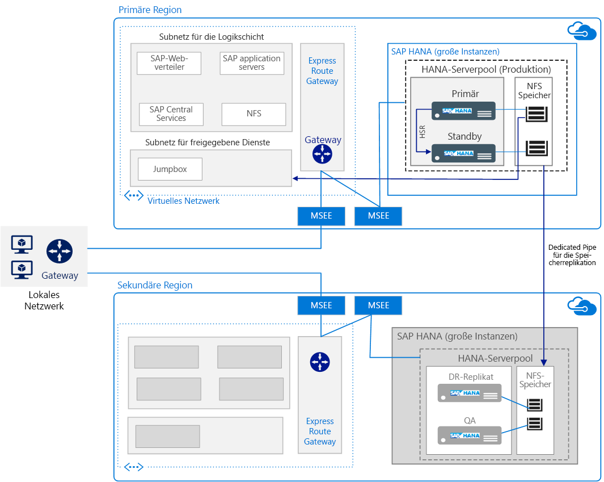

# Ausführen von SAP HANA in Azure (große Instanzen)

Anhand dieser Referenzarchitektur werden einige bewährte Methoden für die Ausführung von SAP HANA in Azure (große Instanzen) mit Hochverfügbarkeit und Notfallwiederherstellung (Disaster Recovery, DR) veranschaulicht. Große HANA-Instanzen werden auf physischen Servern in Azure-Regionen bereitgestellt.

*Laden Sie eine [Visio-Datei][visio-download] mit dieser Architektur herunter.*

> [!NOTE]
> Zum Bereitstellen dieser Referenzarchitektur ist eine geeignete Lizenzierung von SAP-Produkten und anderen nicht von Microsoft stammenden Technologiekomponenten erforderlich.

## Architecture

Diese Architektur umfasst die folgenden Infrastrukturkomponenten.

- **Virtuelles Netzwerk**. Der [Azure Virtual Network][vnet]-Dienst verbindet auf sichere Weise Azure-Ressourcen miteinander und wird in separate [Subnetze][subnet] für jede Ebene unterteilt. SAP-Anwendungsebenen werden auf virtuellen Azure-Computern (VMs) bereitgestellt, um eine Verbindung mit der HANA-Datenbankebene herzustellen, die in großen Instanzen gespeichert ist.

- **Virtuelle Computer:** Virtuelle Computer werden in der SAP-Anwendungsebene und der Ebene für gemeinsame Dienste verwendet. Letztere enthält eine Jumpbox, die von Administratoren verwendet wird, um große HANA-Instanzen einzurichten und Zugriff auf andere virtuelle Computer bereitzustellen.

- **Große HANA-Instanz**. Ein [physischer Server][physical], der für die SAP HANA TDI-Standards (Tailored Datacenter Integration) zertifiziert ist, führt SAP HANA aus. Diese Architektur verwendet zwei große HANA-Instanzen: eine primäre und eine sekundäre Compute-Einheit. Hochverfügbarkeit auf der Datenebene wird über HSR (HANA System Replication) bereitgestellt.

- **Hochverfügbarkeitspaar**: Eine Gruppe von Blades der großen HANA-Instanzen wird gemeinsam verwaltet, um Anwendungsredundanz und -zuverlässigkeit zu bieten.

- **MSEE (Microsoft Enterprise Edge)**: MSEE ist ein Verbindungspunkt von einem Verbindungsanbieter oder Ihrem Netzwerkedge über eine ExpressRoute-Verbindung.

- **Netzwerkschnittstellenkarten (NICs)**: Um die Kommunikation zu ermöglichen, stellt der Server für große HANA-Instanzen standardmäßig vier virtuelle NICs bereit. Diese Architektur erfordert eine NIC für die Clientkommunikation, eine zweite NIC für die für HSR erforderliche Konnektivität zwischen den Knoten, eine dritte NIC für den Speicher der großen HANA-Instanz und eine vierte NIC für iSCSI im Hochverfügbarkeitsclustering.

- **NFS-Speicher (Network File System )**: Der [NFS][nfs]-Server unterstützt die Netzwerkdateifreigabe, die sichere Datenpersistenz für die große HANA-Instanz bereitstellt.

- **ExpressRoute**: [ExpressRoute][expressroute] ist der empfohlene Azure-Netzwerkdienst für die Erstellung privater Verbindungen zwischen einem lokalen Netzwerk und virtuellen Azure-Netzwerken, die nicht über das öffentliche Internet genutzt werden. Virtuelle Azure-Computer stellen über eine weitere ExpressRoute-Verbindung eine Verbindung mit großen HANA-Instanzen her. Die ExpressRoute-Verbindung zwischen dem virtuellen Azure-Netzwerk und den großen HANA-Instanzen wird als Teil des Microsoft-Angebots eingerichtet.

- **Gateway**: Das ExpressRoute-Gateway wird verwendet, um das für die SAP-Anwendungsebene verwendete virtuelle Azure-Netzwerk mit dem Netzwerk der großen HANA-Instanz zu verbinden. Verwenden Sie die SKU für [Hohe Leistung oder Höchstleistung][sku].

- **Notfallwiederherstellung (Disaster Recovery, DR)**: Auf Anforderung wird Speicherreplikation unterstützt. Sie wird zwischen dem primären Server und dem [DR-Standort][DR-site] in einer anderen Region konfiguriert.

## Empfehlungen

Die Anforderungen können unterschiedlich sein, daher sollten Sie diese Empfehlungen als Ausgangspunkt verwenden.

### Compute mit großen HANA-Instanzen

[Große Instanzen][physical] sind physische Server, die auf der EX E7-CPU-Architektur von Intel basieren und in einem Umfeld für große Instanzen (also in einer bestimmten Gruppe von Servern oder Blades) konfiguriert sind. Eine Compute-Einheit entspricht einem Server oder Blade, und ein Stempel setzt sich aus mehreren Servern oder Blades zusammen. In einem großen Instanzstempel werden Server nicht gemeinsam verwendet und sind für die Ausführung der SAP HANA-Bereitstellung eines Kunden reserviert.

Eine Vielzahl von SKUs sind für große HANA-Instanzen verfügbar und unterstützen bei einer Einzelinstanz bis zu 20 TB (60 TB horizontale Skalierung) Speicher für S/4HANA- oder andere SAP HANA-Workloads. [Zwei Klassen][classes] von Servern werden angeboten:

- Typ I-Klasse: S72, S72m, S144, S144m, S192, and S192m

- Typ II-Klasse: S384, S384m, S384xm, S576m, S768m, and S960m

Beispielsweise enthält die SKU S72 768 GB RAM, 3 TB Speicher und 2 Intel Xeon-Prozessoren (E7-8890 v3) mit 36 Kernen. Wählen Sie eine SKU aus, die die Größenanforderungen erfüllt, die Sie in Ihrer Architektur und Ihren Entwurfssitzungen festgelegt haben. Stellen Sie immer sicher, dass Ihre Größenangabe für die richtige SKU gilt. Funktionen und Bereitstellungsanforderungen sind [abhängig vom Typ unterschiedlich][type], und die Verfügbarkeit ist von der [Region][region] abhängig. Sie können auch aus einer SKU in eine größere SKU wechseln.

Microsoft unterstützt Sie bei der Einrichtung der großen Instanz, aber es liegt in Ihrer Verantwortung, die Konfigurationseinstellungen des Betriebssystems zu überprüfen. Beachten Sie unbedingt die aktuellsten SAP-Hinweise für Ihr spezifisches Linux-Release.

### Storage

Speicherlayout wird gemäß der Empfehlung der TDI für SAP HANA implementiert. Große HANA-Instanzen verfügen über eine bestimmte-Speicherkonfiguration für die TDI-Standardspezifikationen. Allerdings können Sie zusätzlichen Speicher in Schritten von 1 TB erwerben.

Um die Anforderungen der unternehmenswichtigen Umgebungen einschließlich schneller Wiederherstellung zu unterstützen, wird NFS verwendet und kein direkt zugeordneter Speicher. Der NFS-Speicherserver für große HANA-Instanzen wird in einer mehrinstanzenfähigen Umgebung gehostet, in der Mandanten mit Compute-, Netzwerk- und Speicherisolierung getrennt und gesichert werden.

Um hohe Verfügbarkeit am primären Standort zu unterstützen, verwenden Sie unterschiedliche Speicherlayouts. Bei einer horizontalen Skalierung mit mehreren Hosts wird beispielsweise der Speicher gemeinsam genutzt. Eine weitere Option für Hochverfügbarkeit ist die anwendungsbasierte Replikation (z.B. HSR). Für die Notfallwiederherstellung wird jedoch eine auf Momentaufnahmen basierende Speicherreplikation verwendet.

### Netzwerk

Diese Architektur verwendet virtuelle und physische Netzwerke. Das virtuelle Netzwerk ist Bestandteil von Azure IaaS und stellt eine Verbindung mit einem diskreten physischen Netzwerk mit großen HANA-Instanzen über [ExpressRoute][expressroute]-Verbindungen her. Ein standortübergreifendes Gateway verbindet Ihre Workloads im virtuellen Azure-Netzwerk mit Ihren lokalen Standorten.

Netzwerke mit großen HANA-Instanzen werden aus Sicherheitsgründen voneinander isoliert. Instanzen, die sich in unterschiedlichen Regionen befinden, kommunizieren mit Ausnahme der dedizierten Speicherreplikation nicht miteinander. Um HSR verwenden zu können, ist jedoch Kommunikation zwischen den Regionen erforderlich. [IP-Routingtabellen][ip] oder Proxys können verwendet werden, um regionsübergreifende HSR zu aktivieren.

Alle virtuellen Azure-Netzwerke, die eine Verbindung mit großen HANA-Instanzen in einer Region herstellen, können [verbindungsübergreifend][cross-connected] über ExpressRoute mit großen HANA-Instanzen in einer sekundären Region verbunden werden.

ExpressRoute für große HANA-Instanzen ist während der Bereitstellung standardmäßig enthalten. Für die Einrichtung ist ein bestimmtes Netzwerklayout einschließlich der erforderlichen CIDR-Adressbereiche und Domänenrouting erforderlich. Details finden Sie unter [Infrastruktur und Verbindungen mit SAP HANA in Azure (große Instanzen)][HLI-infrastructure].

## Überlegungen zur Skalierbarkeit

Um zentral hoch- oder herunterzuskalieren, können Sie aus vielen Größen von Servern auswählen, die für große HANA-Instanzen verfügbar sind. Sie gehören zur Kategorie [Typ I und Typ II][classes] und sind auf verschiedene Workloads zugeschnitten. Wählen Sie eine Größe aus, die mit Ihrer Workload während der nächsten drei Jahre wachsen kann. Einjährige Vertragslaufzeiten sind ebenfalls verfügbar.

Eine Bereitstellung für horizontales Skalieren mit mehreren Hosts wird in der Regel als eine Art von Datenbankpartitionierungsstrategie für BW/4HANA-Bereitstellungen verwendet. Planen Sie die Platzierung der HANA Tabellen vor der Installation, um horizontales Hochskalieren zu ermöglichen. Aus infrastruktureller Sicht sind mehrere Hosts mit einem gemeinsamen Speichervolume verbunden, was eine schnelle Übernahme durch Standbyhosts ermöglicht, falls einer der Computeworkerknoten im HANA-System ausfällt.

S/4HANA und SAP Business Suite für HANA auf einem einzelnen Blade können mit einer einzelnen Instanz großer HANA-Instanzen bis zu 20 TB zentral hochskaliert werden.

Für Greenfield-Szenarien steht der [SAP Quick Sizer][quick-sizer] zur Verfügung, um Arbeitsspeicheranforderungen für die Implementierung von SAP-Software zusätzlich zu HANA zu berechnen. Der Arbeitsspeicherbedarf für HANA nimmt mit zunehmender Datenmenge zu. Verwenden Sie den aktuellen Speicherverbrauch Ihres Systems als Grundlage für die Vorhersage des zukünftigen Verbrauchs, und ordnen Sie dann Ihren Bedarf einer der Größen der großen HANA-Instanzen zu.

Wenn Sie bereits über SAP-Bereitstellungen verfügen, stellt SAP Berichte zur Verfügung, mit denen Sie die von vorhandenen Systemen verwendeten Daten überprüfen und den Speicherbedarf für eine HANA-Instanz berechnen können. Beachten Sie beispielsweise die folgenden SAP-Hinweise:

- SAP-Hinweis [1793345][sap-1793345]: Größenanpassung für die SAP-Suite für HANA
- SAP-Hinweis [1872170][sap-1872170]: Bericht zur Größenanpassung für die Suite für HANA und S/4 HANA
- SAP-Hinweis [2121330][sap-2121330]: Häufig gestellte Fragen: Bericht zur Größenanpassung für SAP BW unter HANA
- SAP-Hinweis [1736976][sap-1736976]: Bericht zur Größenanpassung für BW unter HANA
- SAP-Hinweis [2296290][sap-2296290]: Neuer Bericht zur Größenanpassung für BW unter HANA

## Überlegungen zur Verfügbarkeit

Ressourcenredundanz ist das allgemeine Thema bei hochverfügbaren Infrastrukturlösungen. Für Unternehmen, die über eine weniger strenge SLA verfügen, bieten virtuelle Azure-Computer mit einer einzigen Instanz eine Uptime-SLA. Weitere Informationen finden Sie unter [Vereinbarung zum Azure-Servicelevel](https://azure.microsoft.com/support/legal/sla/).

Arbeiten Sie mit SAP, Ihrem Systemintegrator oder Microsoft zusammen, um eine [Hochverfügbarkeits- und Notfallwiederherstellungsstrategie][hli-hadr] zu entwickeln und zu implementieren. Diese Architektur folgt der [Vereinbarung zum Servicelevel][sla] (SLA) für Azure für HANA in Azure (große Instanzen). Um Ihre Verfügbarkeitsanforderungen zu beurteilen, sollten Sie die einzelnen Fehlerpunkte, die gewünschte Verfügbarkeit der Dienste und diese allgemeinen Metriken berücksichtigen:

- RTO (Recovery Time Objective) ist die Zeitspanne, in der der Server für große HANA-Instanzen nicht verfügbar ist.

- RPO (Recovery Point Objective) ist der maximal tolerierbare Zeitraum, in welchem Kundendaten aufgrund eines Fehlers verloren gehen können.

Für Hochverfügbarkeit sollten Sie mehrere Instanzen in einem HA-Paar bereitstellen und HSR in einem synchronen Modus verwenden, um Datenverluste und Ausfallzeiten zu minimieren. Zusätzlich zu einem lokalen Hochverfügbarkeitssetup mit zwei Knoten unterstützt HSR die Replikation mit mehreren Ebenen, wobei sich ein dritter Knoten in einer separaten Azure-Region als Replikationsziel beim sekundären Replikat des geclusterten HSR-Paars registriert. Auf diese Weise entsteht eine Replikationsverkettung. Das Failover auf den DR-Knoten ist ein manueller Prozess.

Wenn Sie HSR für große HANA-Instanzen mit automatischem Failover einrichten, können Sie das Microsoft Service Management-Team bitten, ein [STONITH-Gerät][stonith] für Ihre vorhandenen Server einzurichten.

## Überlegungen zur Notfallwiederherstellung

Diese Architektur unterstützt [Notfallwiederherstellung][hli-dr] zwischen großen HANA-Instanzen in verschiedenen Azure-Regionen. Es gibt zwei Möglichkeiten zur Unterstützung von Notfallwiederherstellung mit großen HANA-Instanzen:

- Speicherreplikation. Der Inhalt des primären Speichers wird ständig in die Remotespeichersysteme für die Notfallwiederherstellung repliziert, die auf dem designierten Server für die Notfallwiederherstellung der großen HANA-Instanzen verfügbar sind. Bei der Speicherreplikation wird die HANA-Datenbank nicht in den Arbeitsspeicher geladen. Diese Notfallwiederherstellungsoption ist aus Verwaltungssicht einfacher. Um festzustellen, ob dies eine geeignete Strategie ist, berücksichtigen Sie die Datenbankladezeit im Vergleich zur Verfügbarkeits-SLA. Speicherreplikation ermöglicht Ihnen außerdem, Zeitpunktwiederherstellung auszuführen. Wenn Mehrzweck-Notfallwiederherstellung (kostenoptimiert) eingerichtet ist, müssen Sie zusätzlichen Speicher mit derselben Größe am Notfallwiederherstellungs-Standort erwerben. Microsoft stellt Self-Service-[Speichermomentaufnahme- und -Failoverskripts] [ scripts] für HANA-Failover als Teil des Angebots großer HANA-Instanzen bereit.

- HSR mit mehreren Ebenen mit einem dritten Replikat in der Notfallwiederherstellungsregion (wobei die HANA-Datenbank in den Speicher geladen wird). Diese Option unterstützt eine schnellere Wiederherstellung, jedoch keine Zeitpunktwiederherstellung. Für HSR ist ein sekundäres System erforderlich. Die HANA-Systemreplikation für den Notfallwiederherstellungs-Standort erfolgt über Proxys (z.B nginx) oder IP-Tabellen.

> [!NOTE]
> Sie können diese Referenzarchitektur für Kosten optimieren, indem Sie die Ausführung in einer Einzelinstanzumgebung vornehmen. Dieses [kostenoptimierte Szenario](https://blogs.sap.com/2016/07/19/new-whitepaper-for-high-availability-for-sap-hana-cost-optimized-scenario/) eignet sich für HANA-Workloads, die nicht aus der Produktion stammen.

## Sicherungsüberlegungen

Basierend auf Ihren Geschäftsanforderungen können Sie unter verschiedenen Optionen zur [Sicherung und Wiederherstellung][hli-backup] wählen.

| Sicherungsoption                   | Vorteile                                                                                                   | Nachteile                                                       |
|---------------------------------|--------------------------------------------------------------------------------------------------------|------------------------------------------------------------|
| HANA-Sicherung        | Nativ für SAP. Integrierte Konsistenzprüfung.                                                             | Lange Sicherungs- und Wiederherstellungszeiten. Speicherplatzverbrauch |
| HANA-Momentaufnahme      | Nativ für SAP. Schnelle Sicherung und Wiederherstellung.                                                               |                                       |
| Speichermomentaufnahme   | In großen HANA-Instanzen enthalten. Optimierte Notfallwiederherstellung für große HANA-Instanzen. Sicherungsunterstützung für das Startvolume. | Maximal 254 Momentaufnahmen pro Volume.                          |
| Protokollsicherung         | Für Zeitpunktwiederherstellung erforderlich.                                                                   |                                                            |
| Andere Sicherungstools | Redundanter Sicherungsspeicherort.                                                                             | Zusätzliche Lizenzierungskosten.                                |

## Überlegungen zur Verwaltbarkeit

Überwachen Sie die Ressourcen großer HANA-Instanzen wie CPU, Arbeitsspeicher, Netzwerkbandbreite und Speicherplatz mit SAP HANA Studio, SAP HANA Cockpit, SAP Solution Manager und anderen nativen Linux-Tools. Große HANA-Instanzen beinhalten keine integrierten Überwachungstools. Microsoft bietet Ressourcen, um Sie bei der [Problembehandlung und Überwachung][hli-troubleshoot] entsprechend den Anforderungen Ihrer Organisation zu unterstützen, und das Microsoft-Supportteam kann Ihnen bei der Behandlung technischer Probleme Hilfestellung leisten.

Wenn Sie Computingfunktionen in größerem Umfang benötigen, müssen Sie eine größere SKU abrufen.

## Sicherheitshinweise

- Große HANA-Instanzen verwenden standardmäßig Speicherverschlüsselung basierend auf TDE (Transparent Data Encryption) für die ruhenden Daten.

- Daten im Übergang zwischen großen HANA-Instanzen und den virtuellen Computern werden nicht verschlüsselt. Um die Datenübertragung zu verschlüsseln, aktivieren Sie die anwendungsspezifische Verschlüsselung. Weitere Informationen finden Sie im SAP-Hinweis [2159014][sap-2159014]: Häufig gestellte Fragen: SAP HANA-Sicherheit.

- Isolierung sorgt für Sicherheit zwischen den Mandanten in der mehrinstanzenfähigen HANA-Umgebung (große Instanz). Mandanten werden mit ihrem eigenen VLAN isoliert.

- [Bewährte Methoden für die Azure-Netzwerksicherheit][network-best-practices] bieten hilfreiche Anleitungen.

- Wie bei jeder Bereitstellung wird [Betriebssystemhärtung][os-hardening] empfohlen.

- Aus Gründen der physischen Sicherheit ist der Zugriff auf Azure-Datencenter nur durch entsprechend autorisierte Mitarbeiter möglich. Kunden können generell nicht auf die physischen Server zugreifen.

Weitere Informationen finden Sie unter [SAP HANA-Sicherheit: Überblick][sap-security]. (Ein SAP Service Marketplace-Konto ist für den Zugriff erforderlich.)

## Communitys

Communitys können Fragen beantworten und Sie beim Einrichten einer erfolgreichen Bereitstellung unterstützen. Beachten Sie Folgendes:

- [Running SAP Applications on the Microsoft Platform (Blog)][running-sap-blog]
- [Azure-Communitysupport][azure-forum]
- [SAP Community][sap-community]
- [Stack Overflow SAP][stack-overflow]

## Zugehörige Ressourcen

Es wird empfohlen, sich das folgende [Azure-Beispielszenario](/azure/architecture/example-scenario) anzusehen. Darin wird veranschaulicht, wie einige dieser Technologien in spezifischen Lösungen verwendet werden:

- [Ausführen von SAP-Produktionsworkloads mit einer Oracle Database-Instanz in Azure](/azure/architecture/example-scenario/apps/sap-production)
- [Entwicklungs-/Testumgebungen für SAP-Workloads in Azure](/azure/architecture/example-scenario/apps/sap-dev-test)

<!-- links -->

[azure-forum]: https://azure.microsoft.com/support/forums/
[azure-large-instances]: /azure/virtual-machines/workloads/sap/hana-overview-architecture
[classes]: /azure/virtual-machines/workloads/sap/hana-overview-architecture
[cross-connected]: /azure/virtual-machines/workloads/sap/hana-overview-high-availability-disaster-recovery#network-considerations-for-disaster-recovery-with-hana-large-instances
[dr-site]: /azure/virtual-machines/workloads/sap/hana-overview-high-availability-disaster-recovery
[expressroute]: /azure/architecture/reference-architectures/hybrid-networking/expressroute
[filter-network]: https://azure.microsoft.com/blog/multiple-vm-nics-and-network-virtual-appliances-in-azure/
[hli-dr]: /azure/virtual-machines/workloads/sap/hana-overview-high-availability-disaster-recovery#network-considerations-for-disaster-recovery-with-hana-large-instances
[hli-backup]: /azure/virtual-machines/workloads/sap/hana-overview-high-availability-disaster-recovery#backup-and-restore
[hli-hadr]: /azure/virtual-machines/workloads/sap/hana-overview-high-availability-disaster-recovery?toc=%2fazure%2fvirtual-machines%2flinux%2ftoc.json
[hli-infrastructure]: /azure/virtual-machines/workloads/sap/hana-overview-infrastructure-connectivity
[hli-overview]: /azure/virtual-machines/workloads/sap/hana-overview-architecture
[hli-troubleshoot]: /azure/virtual-machines/workloads/sap/troubleshooting-monitoring
[ip]: https://blogs.msdn.microsoft.com/saponsqlserver/2018/02/10/setting-up-hana-system-replication-on-azure-hana-large-instances/
[network-best-practices]: /azure/security/azure-security-network-security-best-practices
[nfs]: /azure/virtual-machines/workloads/sap/high-availability-guide-suse-nfs
[os-hardening]: /azure/security/azure-security-iaas
[physical]: /azure/virtual-machines/workloads/sap/hana-overview-architecture
[planning]: /azure/vpn-gateway/vpn-gateway-plan-design
[protecting-sap]: https://blogs.msdn.microsoft.com/saponsqlserver/2016/05/06/protecting-sap-systems-running-on-vmware-with-azure-site-recovery/
[ref-arch]: /azure/architecture/reference-architectures/
[running-SAP]: https://blogs.msdn.microsoft.com/saponsqlserver/2016/06/07/sap-on-sql-general-update-for-customers-partners-june-2016/
[region]: https://azure.microsoft.com/global-infrastructure/services/
[running-sap-blog]: https://blogs.msdn.microsoft.com/saponsqlserver/2017/05/04/sap-on-azure-general-update-for-customers-partners-april-2017/
[quick-sizer]: https://service.sap.com/quicksizing
[sap-1793345]: https://launchpad.support.sap.com/#/notes/1793345
[sap-1872170]: https://launchpad.support.sap.com/#/notes/1872170
[sap-2121330]: https://launchpad.support.sap.com/#/notes/2121330
[sap-2159014]: https://launchpad.support.sap.com/#/notes/2159014
[sap-1736976]: https://launchpad.support.sap.com/#/notes/1736976
[sap-2296290]: https://launchpad.support.sap.com/#/notes/2296290
[sap-community]: https://www.sap.com/community.html
[sap-security]: https://archive.sap.com/documents/docs/DOC-62943
[scripts]: /azure/virtual-machines/workloads/sap/hana-overview-high-availability-disaster-recovery
[sku]: /azure/expressroute/expressroute-about-virtual-network-gateways
[sla]: https://azure.microsoft.com/support/legal/sla/virtual-machines
[stack-overflow]: https://stackoverflow.com/tags/sap/info
[stonith]: /azure/virtual-machines/workloads/sap/ha-setup-with-stonith
[subnet]: /azure/virtual-network/virtual-network-manage-subnet
[swd]: https://help.sap.com/doc/saphelp_nw70ehp2/7.02.16/en-us/48/8fe37933114e6fe10000000a421937/frameset.htm
[type]: /azure/virtual-machines/workloads/sap/hana-installation
[vnet]: /azure/virtual-network/virtual-networks-overview
[visio-download]: https://archcenter.blob.core.windows.net/cdn/sap-reference-architectures.vsdx