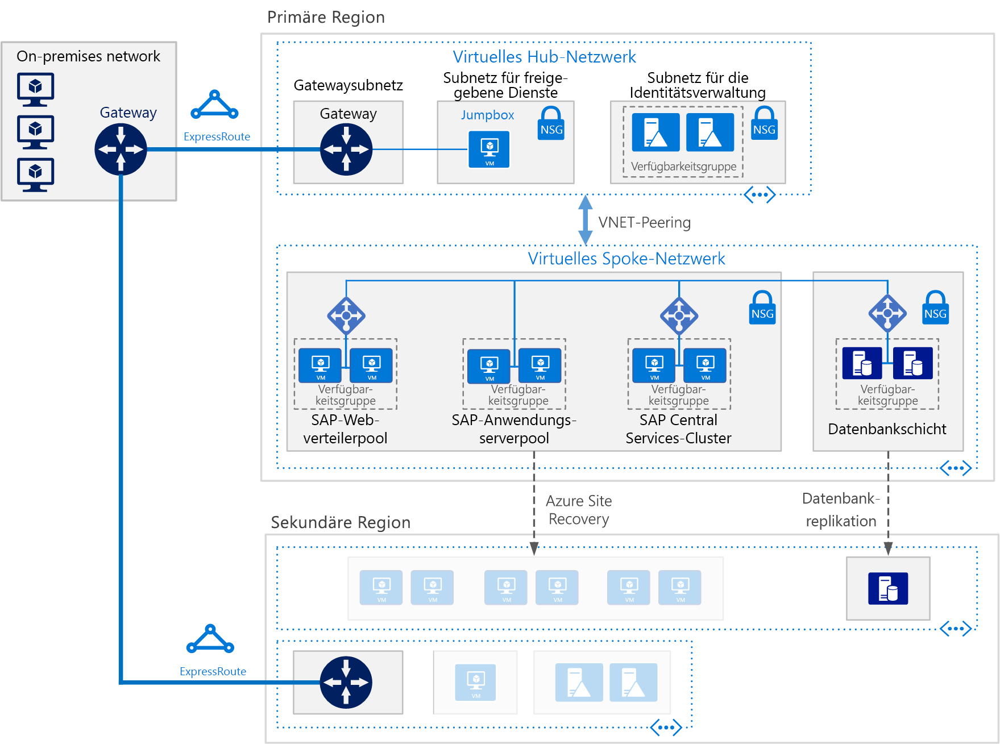

# Bereitstellen von SAP NetWeaver (Windows) für AnyDB auf virtuellen Azure-Computern

Anhand dieser Referenzarchitektur werden einige bewährte Methoden veranschaulicht, wie SAP NetWeaver in einer Windows-Umgebung in Azure mit Hochverfügbarkeit ausgeführt werden kann. Die Datenbank ist AnyDB. „AnyDB“ ist der SAP-Begriff für alle unterstützten Datenbank-Managementsysteme neben SAP HANA. Diese Architektur wird mit virtuellen Computern bestimmter Größen bereitgestellt, die an die Anforderungen Ihres Unternehmens angepasst werden können.

*Laden Sie eine [Visio-Datei][visio-download] mit dieser Architektur herunter.*

> [!NOTE]
> Zum Bereitstellen dieser Referenzarchitektur ist eine geeignete Lizenzierung von SAP-Produkten und anderen nicht von Microsoft stammenden Technologiekomponenten erforderlich.

## Architecture

Diese Architektur umfasst die folgenden Infrastruktur- und Schlüsselsoftwarekomponenten.

**Virtuelles Netzwerk**. Der „Azure Virtual Network“-Dienst verbindet Azure-Ressourcen sicher miteinander. In dieser Architektur wird das virtuelle Netzwerk über ein VPN-Gateway mit einer lokalen Umgebung verbunden, und dieses Gateway wird im Hub einer [Hub-Spoke-Topologie](../hybrid-networking/hub-spoke.md) bereitgestellt. Die Speiche (Spoke) ist das virtuelle Netzwerk, das für die SAP-Anwendungen und die Datenbankschicht verwendet wird.

**Subnetze:** Das virtuelle Netzwerk wird für jede Schicht in getrennte Subnetze unterteilt: Anwendung (SAP NetWeaver), Datenbank, gemeinsame Dienste (Jumpbox) und Active Directory.

**Virtuelle Computer:** In dieser Architektur werden virtuelle Computer für die Logikschicht und die Datenbankschicht verwendet, die wie folgt gruppiert sind:

- **SAP NetWeaver**: Auf der Logikschicht werden virtuelle Windows-Computer verwendet und werden SAP Central Services und SAP-Anwendungsserver ausgeführt. Die virtuellen Computer, auf denen Central Services ausgeführt wird, sind für Hochverfügbarkeit als Windows Server-Failovercluster konfiguriert, mit Unterstützung durch SIOS DataKeeper Cluster Edition.
- **AnyDB**. Auf der Datenbankschicht wird AnyDB als Quelldatenbank ausgeführt, z. B. Microsoft SQL Server, Oracle oder IBM DB2.
- **Jumpbox**: Wird auch als „geschützter Host“ bezeichnet. Dies ist ein geschützter virtueller Computer im Netzwerk, der von Administratoren zum Herstellen von Verbindungen mit anderen virtuellen Computern verwendet wird.
- **Windows Server Active Directory-Domänencontroller**. Die Domänencontroller werden auf allen virtuellen Computern und für alle Benutzer in der Domäne verwendet.

**Lastenausgleichsmodule**. [Azure Load Balancer](/azure/load-balancer/load-balancer-overview)-Instanzen werden dazu verwendet, Datenverkehr auf virtuelle Computer im Logikschichtsubnetz zu verteilen. In der Datenschicht kann Hochverfügbarkeit abhängig vom DBMS mithilfe von integrierten SAP-Lastenausgleichsmodulen, Azure Load Balancer oder anderen Mechanismen erzielt werden. Weitere Informationen finden Sie unter [Azure Virtual Machines – DBMS-Bereitstellung für SAP NetWeaver](/azure/virtual-machines/workloads/sap/dbms-guide).

**Verfügbarkeitsgruppen**: Virtuelle Computer für die Rollen SAP Web Dispatcher, SAP-Anwendungsserver und (A)SCS werden in getrennten [Verfügbarkeitsgruppen](/azure/virtual-machines/windows/tutorial-availability-sets) gruppiert, und pro Rolle werden mindestens zwei virtuelle Computer bereitgestellt. Dies bewirkt, dass die virtuellen Computer für eine höhere [Vereinbarung zum Servicelevel](https://azure.microsoft.com/support/legal/sla/virtual-machines) (Service Level Agreement, SLA) auswählbar sind.

**NICs**. [Netzwerkschnittstellenkarten](/azure/virtual-network/virtual-network-network-interface) (NICs) ermöglichen die gesamte Kommunikation von virtuellen Computern in einem virtuellen Netzwerk.

**Netzwerksicherheitsgruppen**. Um eingehenden, ausgehenden und subnetzinternen Datenverkehr im virtuellen Netzwerk einzuschränken, können Sie [Netzwerksicherheitsgruppen](/azure/virtual-network/virtual-networks-nsg) (NSGs) erstellen.

**Gateway**: Über ein Gateway wird Ihr lokales Netzwerk in das virtuelle Azure-Netzwerk erweitert. [ExpressRoute](/azure/architecture/reference-architectures/hybrid-networking/expressroute) ist der empfohlene Azure-Dienst für das Erstellen von privaten Verbindungen, die nicht über das öffentliche Internet laufen, es kann aber auch eine [Standort-zu-Standort](/azure/vpn-gateway/vpn-gateway-howto-site-to-site-resource-manager-portal)-Verbindung verwendet werden.

**Azure Storage**. Soll permanenter Speicher einer virtuellen Festplatte (VHD) eines virtuellen Computers bereitgestellt werden, ist [Azure Storage](/azure/storage/storage-standard-storage) erforderlich. Dieser Dienst wird auch von [Cloudzeuge](/windows-server/failover-clustering/deploy-cloud-witness) verwendet, um einen Failoverclustervorgang zu implementieren.

## Empfehlungen

Ihre Anforderungen können von der hier beschriebenen Architektur abweichen. Verwenden Sie diese Empfehlungen als Startpunkt.

### SAP Web Dispatcher-Pool

Die Web Dispatcher-Komponente wird als Lastenausgleichsmodul für SAP-Datenverkehr zwischen den SAP-Anwendungsservern verwendet. Um Hochverfügbarkeit für die Web Dispatcher-Komponente zu erreichen, wird mit Azure Load Balancer das parallele Web Dispatcher-Setup implementiert. Für Web Dispatcher wird eine Roundrobin-Konfiguration für HTTP(S)-Datenverkehrsverteilung zwischen den verfügbaren Web Dispatcher-Instanzen im Pool der Lastenausgleichsmodule verwendet.

Ausführliche Informationen zum Ausführen von SAP NetWeaver in virtuellen Azure-Computern finden Sie unter [Azure Virtual Machines – Planung und Implementierung für SAP NetWeaver](/azure/virtual-machines/workloads/sap/planning-guide).

### Anwendungsserverpool

Um Anmeldegruppen für ABAP-Anwendungsserver zu verwalten, wird die SMLG-Transaktion verwendet. In ihr wird die Lastenausgleichsfunktion im Nachrichtenserver der Central Services verwendet, um Arbeitslast im SAP-Anwendungsserverpool für SAPGUIs und RFC-Datenverkehr zu verteilen. Die Anwendungsserververbindung mit den hochverfügbaren Central Services erfolgt über den Namen des virtuellen Netzwerkclusters.

### SAP Central Services-Cluster

In dieser Referenzarchitektur wird Central Services auf virtuellen Computern auf der Logikschicht ausgeführt. Die Central Services-Komponente ist ein möglicher Single Point of Failure (SPOF), wenn sie auf einem einzelnen virtuellen Computer bereitgestellt wird – dies ist die typische Bereitstellung, wenn Hochverfügbarkeitnicht erforderlich ist. Soll eine Hochverfügbarkeitslösung implementiert werden, kann ein Cluster mit freigegebenen Datenträgern oder ein Dateifreigabecluster verwendet werden.

Um virtuelle Computer für einen Cluster mit freigegebenen Datenträgern zu konfigurieren, verwenden Sie [Windows Server-Failovercluster](https://blogs.sap.com/2018/01/25/how-to-create-sap-resources-in-windows-failover-cluster/). [Cloudzeuge](/windows-server/failover-clustering/deploy-cloud-witness) wird als ein Quorumzeuge empfohlen. Zur Unterstützung der Failoverclusterumgebung führt [SIOS DataKeeper Cluster Edition](https://azuremarketplace.microsoft.com/marketplace/apps/sios_datakeeper.sios-datakeeper-8) die Funktion zur Clustererstellung der freigegebenen Volumes aus, indem unabhängige Datenträger repliziert werden, die sich im Besitz der Clusterknoten befinden. Azure selbst unterstützt keine freigegebenen Datenträger und erfordert daher Lösungen, die von SIOS bereitgestellt werden.

Einzelheiten dazu finden Sie unter „3. Important Update for SAP Customers Running ASCS on SIOS on Azure“ im Blog [Running SAP applications on the Microsoft Platform](https://blogs.msdn.microsoft.com/saponsqlserver/2017/05/04/sap-on-azure-general-update-for-customers-partners-april-2017/).

Eine weitere Möglichkeit zur Verwaltung von Clustering besteht darin, mit Windows Server Failovercluster ein Dateifreigabecluster zu implementieren. [SAP](https://blogs.sap.com/2018/03/19/migration-from-a-shared-disk-cluster-to-a-file-share-cluster/) hat kürzlich das Bereitstellungsmuster von Central Services so geändert, dass über einen UNC-Pfad auf die globalen „/sapmnt“-Verzeichnisse zugegriffen wird. Mit dieser Änderung [entfällt die Forderung](https://blogs.msdn.microsoft.com/saponsqlserver/2017/08/10/high-available-ascs-for-windows-on-file-share-shared-disk-no-longer-required/) nach SIOS oder anderen Lösungen für freigegebene Datenträger auf den virtuellen Computern mit Central Services. Es wird weiterhin empfohlen sicherzustellen, dass die UNC-Freigabe für „/sapmnt“ [hochverfügbar](https://blogs.sap.com/2017/07/21/how-to-create-a-high-available-sapmnt-share/) ist. Dies lässt sich in der Central Services-Instanz erreichen, indem Windows Server-Failovercluster mit [Scale Out File Server](https://blogs.msdn.microsoft.com/saponsqlserver/2017/11/14/file-server-with-sofs-and-s2d-as-an-alternative-to-cluster-shared-disk-for-clustering-of-an-sap-ascs-instance-in-azure-is-generally-available/) (SOFS) und der [Storage Spaces Direct](https://blogs.sap.com/2018/03/07/your-sap-on-azure-part-5-ascs-high-availability-with-storage-spaces-direct/)-Funktion (S2D, „Direkte Speicherplätze“) in Windows Server 2016 verwendet wird.

### Verfügbarkeitsgruppen

Verfügbarkeitsgruppen verteilen Server auf verschiedene physische Infrastruktur und aktualisieren Gruppen, um die Verfügbarkeit des Diensts zu verbessern. Ordnen Sie virtuelle Computer, die dieselbe Rolle ausführen, in einer Verfügbarkeitsgruppe an, um vor Ausfallzeiten aufgrund von Wartung der Azure-Infrastruktur zu schützen und [SLAs](https://azure.microsoft.com/support/legal/sla/virtual-machines) (Vereinbarungen zum Servicelevel) zu erfüllen. Es empfiehlt sich, mindestens zwei virtuelle Computer pro Verfügbarkeitsgruppe zu haben.

Alle virtuellen Computer in einer Gruppe müssen dieselbe Rolle ausführen. Mischen Sie keine Server mit unterschiedlichen Rollen in derselben Verfügbarkeitsgruppe. Ordnen Sie z. B. keinen Central Services-Knoten in derselben Verfügbarkeitsgruppe mit dem Anwendungsserver an.

### NICs

In herkömmlichen lokalen SAP-Bereitstellungen sind mehrere Netzwerkschnittstellenkarten (NICs) pro Computer implementiert, um administrativen Datenverkehr von Geschäftsdatenverkehr zu trennen. In Azure ist das virtuelle Netzwerk eine softwaredefiniertes Netzwerk, in dem der gesamte Datenverkehr über dieselbe Netzwerkstruktur gesendet wird. Aus diesem Grund ist die Verwendung von mehreren NICs nicht erforderlich. Wenn Ihre Organisation den Datenverkehr jedoch aufteilen muss, können Sie mehrere NICs pro virtueller Maschine bereitstellen, jede NIC mit einem anderen Subnetz verbinden und dann Netzwerksicherheitsgruppen verwenden, um verschiedene Zugriffssteuerungsrichtlinien zu erzwingen.

### Subnetze und Netzwerksicherheitsgruppen

In dieser Architektur wird der Adressraum des virtuellen Netzwerks in Subnetze unterteilt. In dieser Referenzarchitektur liegt der Fokus hauptsächlich auf dem Logikschichtsubnetz. Jedes Subnetz kann einer Netzwerksicherheitsgruppe (NSG) zugeordnet werden, in der die Zugriffsrichtlinien für das Subnetz definiert sind. Platzieren Sie Anwendungsserver in einem separaten Subnetz, sodass Sie diese leichter schützen können, indem Sie die Sicherheitsrichtlinien des Subnetzes und nicht die einzelnen Server verwalten.

Wenn eine NSG einem Subnetz zugeordnet ist, gilt sie für alle Server im Subnetz. Weitere Informationen zur Verwendung von Netzwerksicherheitsgruppen für eine differenziertere Kontrolle über die Server in einem Subnetz finden Sie unter [Filtern des Netzwerkdatenverkehrs mit Netzwerksicherheitsgruppen](https://azure.microsoft.com/en-us/blog/multiple-vm-nics-and-network-virtual-appliances-in-azure/).

### Load Balancer

[SAP Web Dispatcher](https://help.sap.com/doc/saphelp_nw73ehp1/7.31.19/en-US/48/8fe37933114e6fe10000000a421937/frameset.htm) verwaltet den Lastenausgleich von HTTP(S)-Datenverkehr in einem Pool von SAP-Anwendungsservern.

Für Datenverkehr von SAP GUI-Clients, die sich über das DIAG-Protokoll oder RFC (Remote Function Calls) mit einem SAP-Server verbinden, verteilt der Central Services-Nachrichtenserver die Last über SAP-Anwendungsserver-[Anmeldungsgruppen](https://wiki.scn.sap.com/wiki/display/SI/ABAP+Logon+Group+based+Load+Balancing), sodass kein zusätzliches Lastenausgleichsmodul erforderlich ist.

### Azure Storage

Für alle virtuellen Computer, die als Datenbankserver fungieren, sollte Azure Storage Premium verwendet werden, um eine einheitliche Wartezeit für Lese- und Schreibvorgänge zu erzielen. Informationen zu einem virtuellen Einzelinstanzcomputer, auf dem Storage Premium für alle Betriebssystemdatenträger und Daten-Datenträger verwendet wird, finden Sie unter [SLA für virtuelle Computer](https://azure.microsoft.com/support/legal/sla/virtual-machines). Außerdem sollten Sie für Produktions-SAP-Systeme in allen Fällen [Azure Managed Disks](/azure/storage/storage-managed-disks-overview) in der Variante Premium verwenden. Aus Gründen der Zuverlässigkeit wird Managed Disks verwendet, um die VHD-Dateien für die Datenträger zu verwalten. Außerdem wird von Managed Disks sichergestellt, dass die Datenträger für virtuelle Computer in einer Verfügbarkeitsgruppe isoliert sind, um Single Points of Failure zu vermeiden.

Für SAP-Anwendungsserver, etwa die virtuellen Central Services-Computer, können Sie zur Kostensenkung Azure-Standardspeicher verwenden, da die Anwendung im Arbeitsspeicher ausgeführt wird und Datenträger nur zur Protokollierung verwendet werden. Allerdings ist Standardspeicher derzeit nur für nicht verwalteten Speicher zertifiziert. Da Anwendungsserver keine Daten hosten, können Sie auch die kleineren P4- und P6-Storage Premium-Datenträger verwenden, um die Kosten zu minimieren.

Azure Storage wird auch von [Cloudzeuge](/windows-server/failover-clustering/deploy-cloud-witness) verwendet, um das Quorum mit einem Gerät in einer Azure-Remoteregion außerhalb der primären Region zu verwalten, in der sich der Cluster befindet.

Für den Sicherungsdatenspeicher empfiehlt es sich, Azure-[Speicher des Typs „kalte Zugriffsebene“](/azure/storage/storage-blob-storage-tiers) und [„Archivzugriffsebene“](/azure/storage/storage-blob-storage-tiers) zu verwenden. Diese Speicherebenen sind kostengünstige Möglichkeiten, langlebige Daten zu speichern, auf die eher selten zugegriffen wird.

## Überlegungen zur Leistung

SAP-Anwendungsserver kommunizieren ständig mit den Datenbankservern. Für leistungskritische Anwendungen, die auf einer beliebigen Datenbankplattform, z. B. SAP HANA, ausgeführt werden, sollten Sie [Schreibbeschleunigung](/azure/virtual-machines/linux/how-to-enable-write-accelerator) aktivieren, um die Latenz der Protokollschreibvorgänge zu verbessern. Um die serverübergreifende Kommunikation zu optimieren, verwenden Sie [Accelerated Networking](https://azure.microsoft.com/blog/linux-and-windows-networking-performance-enhancements-accelerated-networking/). Beachten Sie, dass diese Beschleunigungskomponenten nur für bestimmte VM-Serien verfügbar sind.

Zur Erreichung eines hohen Durchsatzes in Bezug auf IOPS und die Datenträger-Bandbreite gelten für das Azure-Speicherlayout die gängigen Vorgehensweisen zur [Leistungsoptimierung](/azure/virtual-machines/windows/premium-storage-performance) für Speichervolumes. Wenn beispielsweise mehrere Datenträger kombiniert werden, um ein Stripeset-Datenträgervolume zu erstellen, verbessert sich die E/A-Leistung. Eine Aktivierung des Lesecaches für Speicherinhalte, die sich in unregelmäßigen Abständen ändern, bewirkt eine höhere Geschwindigkeit beim Datenabruf.

Für SAP auf SQL bietet der Blogbeitrag [Top 10 Key Considerations for Deploying SAP Applications on Azure](https://blogs.msdn.microsoft.com/saponsqlserver/2015/05/25/top-10-key-considerations-for-deploying-sap-applications-on-azure/) hervorragende Ratschläge zum Optimieren von Azure-Speicher für SAP-Workloads auf SQL Server.

## Überlegungen zur Skalierbarkeit

Auf der SAP-Anwendungsschicht sind in Azure viele verschiedene VM-Größen für zentrales Hochskalieren und horizontales Hochskalieren verfügbar. Eine umfassende Liste finden Sie im [SAP-Hinweis 1928533](https://launchpad.support.sap.com/#/notes/1928533): „SAP Applications on Azure: Supported Products and Azure VM types“ (SAP-Anwendungen in Azure: Unterstützte Produkte und Azure-VM-Typen). (Für den Zugriff ist ein SAP Service Marketplace-Konto erforderlich.) SAP-Anwendungsserver und die Central Services-können zentral hoch-/herunterskaliert oder horizontal hochskaliert werden, indem weitere Instanzen hinzugefügt werden. Die AnyDB-Datenbank kann zentral hoch-/herunterskaliert, aber nicht horizontal hochskaliert werden. Der SAP-Datenbankcontainer für AnyDB unterstützt Sharding nicht.

## Überlegungen zur Verfügbarkeit

Ressourcenredundanz ist das allgemeine Thema bei hochverfügbaren Infrastrukturlösungen. Für Unternehmen, die über eine weniger strenge SLA verfügen, bieten virtuelle Azure-Computer mit einer einzigen Instanz eine Uptime-SLA. Weitere Informationen finden Sie unter [Vereinbarung zum Azure-Servicelevel](https://azure.microsoft.com/support/legal/sla/).

Bei dieser verteilten Installation der SAP-Anwendung wird die Basisinstallation repliziert, um Hochverfügbarkeit zu erzielen. Der Entwurf für die Hochverfügbarkeit variiert für jede Ebene der Architektur.

### Logikschicht

Hochverfügbarkeit für SAP Web Dispatcher wird mit redundanten Instanzen erzielt. Informationen hierzu finden Sie in der SAP-Dokumentation unter [SAP Web Dispatcher](https://help.sap.com/doc/saphelp_nw70ehp2/7.02.16/en-us/48/8fe37933114e6fe10000000a421937/frameset.htm).

Hochverfügbarkeit von Central Services wird mit Windows Server-Failovercluster implementiert. Wenn der Clusterspeicher in Azure bereitgestellt wird, kann er für den Failovercluster auf zwei Arten konfiguriert werden: als freigegebenes Clustervolumes oder als Dateifreigabe.

Da Azure freigegebene Datenträger nicht unterstützt, wird SIOS Datakeeper verwendet, um die Inhalte unabhängiger Datenträger, die den Clusterknoten zugeordnet sind, zu replizieren und die Datenträger für den Cluster-Manager als ein freigegebenes Clustervolume zu abstrahieren. Implementierungsdetails finden Sie unter [Clustering SAP ASCS on Azure](https://blogs.msdn.microsoft.com/saponsqlserver/2015/05/20/clustering-sap-ascs-instance-using-windows-server-failover-cluster-on-microsoft-azure-with-sios-datakeeper-and-azure-internal-load-balancer/).

Eine andere Möglichkeit besteht darin, eine Dateifreigabe zu verwenden, die vom [Scale Out File Server](https://blogs.msdn.microsoft.com/saponsqlserver/2017/11/14/file-server-with-sofs-and-s2d-as-an-alternative-to-cluster-shared-disk-for-clustering-of-an-sap-ascs-instance-in-azure-is-generally-available/) (SOFS) bereitgestellt wird. SOFS bietet robuste Dateifreigaben, die Sie als freigegebenes Clustervolume für den Windows-Cluster verwenden können. Ein SOFS-Cluster kann für mehrere Central Services-Knoten freigegeben werden. Zum jetzigen Zeitpunkt wird SOFS nur für Hochverfügbarkeitsentwürfe verwendet, da sich der SOFS-Cluster nicht über Regionen erstreckt, um Unterstützung für Notfallwiederherstellung zu bieten.

Hochverfügbarkeit für die SAP-Anwendungsserver wird erzielt, indem für Datenverkehr in einem Pool mit Anwendungsservern ein Lastenausgleich durchgeführt wird.
Weitere Informationen finden Sie unter [SAP-Zertifizierungen und -Konfigurationen in Microsoft Azure](/azure/virtual-machines/workloads/sap/sap-certifications).

### Datenbankschicht

Für diese Referenzarchitektur wird angenommen, dass die Quelldatenbank in AnyDB ausgeführt wird – also ein DBMS wie SQL Server, SAP ASE, IBM DB2 oder Oracle. Die native Replikationsfunktion der Datenbankschicht bietet entweder manuelles oder automatisches Failover zwischen replizierten Knoten.

Implementierungsdetails zu bestimmten Datenbanksystemen finden Sie unter [Azure Virtual Machines – DBMS-Bereitstellung für SAP NetWeaver](/azure/virtual-machines/workloads/sap/dbms-guide).

## Überlegungen zur Notfallwiederherstellung

Zur Notfallwiederherstellung muss es möglich sein, ein Failover zu einer sekundären Region ausführen zu können. Für jede Ebene wird eine andere Strategie genutzt, um per Notfallwiederherstellung für den erforderlichen Schutz zu sorgen.

- **Anwendungsserverschicht**. SAP-Anwendungsserver enthalten keine Geschäftsdaten. In Azure besteht eine einfache Strategie für die Notfallwiederherstellung darin, SAP-Anwendungsserver in der sekundären Region zu erstellen und die Server dann herunterzufahren. Bei Konfigurationsänderungen oder Kernel-Updates auf dem primären Anwendungsserver müssen die gleichen Änderungen auf die virtuellen Computern in der sekundären Region kopiert werden. Beispielsweise werden die ausführbaren Kerneldateien auf die virtuellen Computer für die Notfallwiederherstellung kopiert. Sollen Anwendungsserver automatisch in einer sekundären Region repliziert werden, ist [Azure Site Recovery](/azure/site-recovery/site-recovery-overview) die empfohlene Lösung.

- **Central Services**. Auch bei dieser Komponente des SAP-Anwendungsstapels werden keine Geschäftsdaten beibehalten. Sie können einen virtuellen Computer in der Notfallwiederherstellungregion erstellen, um die Central Services-Rolle auszuführen. Der einzige Inhalt, der vom primären Central Services-Knoten synchronisiert wird, ist der Inhalt der Freigabe „/sapmnt“. Wenn Konfigurationsänderungen oder Kernel-Updates auf den primären Central Services-Servern stattfinden, müssen sie auf dem virtuellen Computer in der Notfallwiederherstellungsregion, auf dem Central Services ausgeführt wird, wiederholt werden. Um die beiden Server zu synchronisieren, können Sie entweder Azure Site Recovery verwenden, um die Clusterknoten zu replizieren, oder einfach einen regelmäßig geplanten Kopierauftrag verwenden, um „/sapmnt“ in die Notfallwiederherstellungsregion zu kopieren. Ausführliche Informationen zum Erstellungs-, Kopier- und Testfailoverprozess für diese einfache Replikationsmethode erhalten Sie, indem Sie den Artikel [SAP NetWeaver: Building a Hyper-V and Microsoft Azure-based Disaster Recovery Solution](https://download.microsoft.com/download/9/5/6/956FEDC3-702D-4EFB-A7D3-2DB7505566B6/SAP%20NetWeaver%20-%20Building%20an%20Azure%20based%20Disaster%20Recovery%20Solution%20V1_5%20.docx) (SAP NetWeaver: Erstellen einer Lösung für die Notfallwiederherstellung auf Basis von Hyper-V und Microsoft Azure) herunterladen und im Abschnitt 4.3. SAP SPOF layer (ASCS)“ (4.3. SAP-SPOF-Schicht (ASCS)) nachsehen.

- **Datenbankschicht**. Notfallwiederherstellung lässt sich am besten mit der in die Datenbank integrierten Replikationstechnologie implementieren. Im Fall von SQL Server empfiehlt sich beispielsweise die Verwendung einer AlwaysOn-Verfügbarkeitsgruppe, um ein Replikat in einer Remoteregion einzurichten, wozu Transaktionen asynchron mit manuellem Failover repliziert werden. Asynchrone Replikation vermeidet Auswirkungen auf die Leistung von interaktiven Workloads am primären Standort. Manuelles Failover bietet für eine Person die Möglichkeit, die Notfallwiederherstellungsauswirkungen zu bewerten und zu entscheiden, ob ein Betrieb aus dem Notfallwiederherstellungsstandort gerechtfertigt ist.

Um Azure Site Recovery zu verwenden, automatisch einen vollständig replizierten Produktionsstandort Ihres Originals einzurichten, müssen Sie benutzerdefinierte [Bereitstellungsskripts](/azure/site-recovery/site-recovery-runbook-automation) ausführen. Site Recovery stellt zunächst die virtuellen Computer in Verfügbarkeitsgruppen bereit, und führt dann Skripts aus, um Ressourcen, etwa Lastenausgleichsmodule, hinzuzufügen.

## Überlegungen zur Verwaltbarkeit

In Azure sind mehrere Funktionen für die [Überwachung und Diagnose](/azure/architecture/best-practices/monitoring) der Gesamtstruktur enthalten. Außerdem wird die erweiterte Überwachung von virtuellen Azure-Computern von der Azure Operations Management Suite (OMS) durchgeführt.

Um SAP-basierte Überwachung von Ressourcen sowie der Leistung von Diensten der SAP-Infrastruktur bereitzustellen, wird die [Azure-Erweiterung zur verbesserten Überwachung für SAP](/azure/virtual-machines/workloads/sap/deployment-guide#detailed-tasks-for-sap-software-deployment) verwendet. Mit dieser Erweiterung werden statistische Daten zur Azure-Überwachung in die SAP-Anwendung eingespeist, damit die Betriebssystemüberwachung und DBA Cockpit-Funktionen ermöglicht werden.

## Sicherheitshinweise

SAP verfügt über ein eigenes Modul für die Benutzerverwaltung (Users Management Engine, UME), um den rollenbasierten Zugriff und die Autorisierung in der SAP-Anwendung zu steuern. Ausführliche Informationen finden Sie im [SAP NetWeaver Application Server for ABAP Security Guide](https://help.sap.com/viewer/864321b9b3dd487d94c70f6a007b0397/7.4.19) und im [SAP NetWeaver Application Server Java Security Guide](https://help.sap.com/doc/saphelp_snc_uiaddon_10/1.0/en-US/57/d8bfcf38f66f48b95ce1f52b3f5184/frameset.htm).

Um zusätzliche Netzwerksicherheit zu erreichen, können Sie eine [Netzwerk-DMZ](../dmz/secure-vnet-hybrid.md) implementieren, für die ein virtuelles Netzwerkgerät verwendet wird, um eine Firewall vor dem Subnetz für Web Dispatcher zu erstellen.

Um die Sicherheit der Infrastruktur zu gewährleisten, sind die Daten während der Übertragung und im Ruhezustand verschlüsselt. Im Abschnitt „Sicherheitshinweise“ des Artikels [Azure Virtual Machines – Planung und Implementierung für SAP NetWeaver](/azure/virtual-machines/workloads/sap/planning-guide) geht es um die Netzwerksicherheit. In diesem Artikel sind auch die Netzwerkports angegeben, die Sie in den Firewalls öffnen müssen, um die Anwendungskommunikation zu ermöglichen.

Um Datenträger eines virtuellen Windows-Computers zu verschlüsseln, können Sie [Azure Disk Encryption](/azure/security/azure-security-disk-encryption) verwenden. Dieser Dienst verwendet das BitLocker-Feature von Windows, um die Volumeverschlüsselung für die Betriebssystem- und die Daten-Datenträger bereitzustellen. Die Lösung funktioniert auch für Azure Key Vault, damit Sie die Verschlüsselungsschlüssel und Geheimnisse für die Datenträgerverschlüsselung in Ihrem Key Vault-Abonnement steuern und verwalten können. Daten auf den VM-Datenträgern werden in Ihrem Azure-Speicher im ruhenden Zustand verschlüsselt.

## Communitys

Communitys können Fragen beantworten und Sie beim Einrichten einer erfolgreichen Bereitstellung unterstützen. Beachten Sie Folgendes:

- [Running SAP Applications on the Microsoft Platform (Blog)](https://blogs.msdn.microsoft.com/saponsqlserver/2017/05/04/sap-on-azure-general-update-for-customers-partners-april-2017/)
- [Azure-Communitysupport](https://azure.microsoft.com/support/community/)
- [SAP Community](https://www.sap.com/community.html)
- [Stack Overflow](https://stackoverflow.com/tags/sap/)

## Zugehörige Ressourcen

Es wird empfohlen, sich das folgende [Azure-Beispielszenario](/azure/architecture/example-scenario) anzusehen. Darin wird veranschaulicht, wie einige dieser Technologien in spezifischen Lösungen verwendet werden:

- [Ausführen von SAP-Produktionsworkloads mit einer Oracle Database-Instanz in Azure](/azure/architecture/example-scenario/apps/sap-production)
- [Entwicklungs-/Testumgebungen für SAP-Workloads in Azure](/azure/architecture/example-scenario/apps/sap-dev-test)

<!-- links -->

[visio-download]: https://archcenter.blob.core.windows.net/cdn/sap-reference-architectures.vsdx
