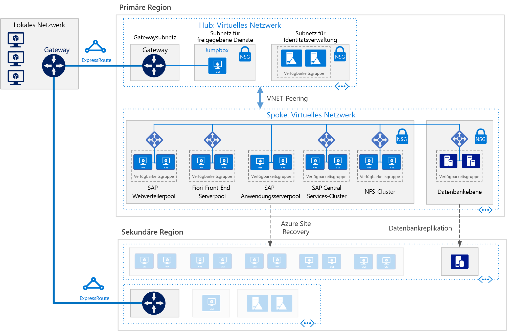

# SAP S/4HANA für virtuelle Linux-Computer in Azure

Anhand dieser Referenzarchitektur werden einige bewährte Methoden für die Ausführung von S/4HANA in einer Hochverfügbarkeitsumgebung veranschaulicht, die Notfallwiederherstellung in Azure unterstützt. Diese Architektur wird mit virtuellen Computern bestimmter Größen bereitgestellt, die an die Anforderungen Ihres Unternehmens angepasst werden können.

*Laden Sie eine [Visio-Datei][visio-download] mit dieser Architektur herunter.*

> [!NOTE]
> Zum Bereitstellen dieser Referenzarchitektur ist eine geeignete Lizenzierung von SAP-Produkten und anderen nicht von Microsoft stammenden Technologiekomponenten erforderlich.

## Architecture

Diese Referenzarchitektur beschreibt ein für Unternehmen konzipiertes einsatzfähiges System. Um Ihren Geschäftsanforderungen gerecht zu werden, kann diese Konfiguration bis hin zu einem einzigen virtuellen Computer reduziert werden. Die folgenden Komponenten sind jedoch erforderlich:

**Virtuelles Netzwerk**. Der [Azure Virtual Network](/azure/virtual-network/virtual-networks-overview)-Dienst verbindet Azure-Ressourcen sicher miteinander. In dieser Architektur wird das virtuelle Netzwerk über ein Gateway mit einer lokalen Umgebung verbunden, und dieses Gateway wird im Hub einer [Hub-Spoke-Topologie](../hybrid-networking/hub-spoke.md) bereitgestellt. Die Speiche (Spoke) ist das virtuelle Netzwerk, das für die SAP-Anwendungen verwendet wird.

**Subnetze:** Das virtuelle Netzwerk wird in separate [Subnetze](/azure/virtual-network/virtual-network-manage-subnet) für jede Schicht unterteilt: Gateway, Logik, Datenbank und gemeinsame Dienste.

**Virtuelle Computer:** In dieser Architektur werden virtuelle Computer mit Linux für die Logikschicht und die Datenbankschicht verwendet, die wie folgt gruppiert sind:

- **Logikschicht**. Umfasst den Fiori Front-End-Serverpool, den SAP Web Dispatcher-Pool, den Anwendungsserverpool und den SAP Central Services-Cluster. Für Hochverfügbarkeit von Central Services auf virtuellen Azure Linux-Computern ist ein hochverfügbarer NFS-Dienst (Network File System) erforderlich.
- **NFS-Cluster**. In dieser Architektur wird ein [NFS](/azure/virtual-machines/workloads/sap/high-availability-guide-suse-nfs)-Server, der in einem Linux-Cluster ausgeführt wird, zum Speichern von Daten verwendet, die von SAP-Systemen gemeinsam genutzt werden. Dieser zentrale Cluster kann für mehrere SAP-Systeme freigegeben werden. Um Hochverfügbarkeit des NFS-Diensts zu erreichen, wird die entsprechende Hochverfügbarkeitserweiterung für die ausgewählte Linux-Distribution verwendet.
- **SAP HANA**: Auf der Datenbankschicht werden mindestens zwei virtuelle Linux-Computer in einem Cluster verwendet, um Hochverfügbarkeit zu erreichen. HANA-Systemreplikation (HSR) wird verwendet, um Inhalte zwischen primären und sekundären HANA-Systemen zu replizieren. Linux-Clustering wird verwendet, um Systemfehler zu erkennen und automatisches Failover zu ermöglichen. Ein speicherbasierter oder cloudbasierter Umgrenzungsmechanismus kann verwendet werden, um sicherzustellen, dass das ausgefallene System isoliert oder heruntergefahren wird, um den Cluster-Split-Brain-Zustand zu vermeiden.
- **Jumpbox**: Wird auch als „geschützter Host“ bezeichnet. Dies ist ein geschützter virtueller Computer im Netzwerk, der von Administratoren zum Herstellen von Verbindungen mit anderen virtuellen Computern verwendet wird. Der Computer kann unter Windows oder Linux ausgeführt werden. Verwenden Sie eine Windows-Jumpbox für angenehmeres Websurfen, wenn Sie HANA Cockpit- oder HANA Studio-Verwaltungstools verwenden.

**Lastenausgleichsmodule**. Sowohl integrierte SAP Lastenausgleichsmodule als auch [Azure Load Balancer](/azure/load-balancer/load-balancer-overview) werden verwendet, um Hochverfügbarkeit zu erreichen. Azure Load Balancer-Instanzen werden dazu verwendet, Datenverkehr auf virtuelle Computer im Logikschichtsubnetz zu verteilen.

**Verfügbarkeitsgruppen**: Virtuelle Computer für alle Pools und Cluster (Web Dispatcher, SAP-Anwendungsserver, Central Services, NFS und HANA) werden in getrennten [Verfügbarkeitsgruppen](/azure/virtual-machines/windows/tutorial-availability-sets) gruppiert, und pro Rolle werden mindestens zwei virtuelle Computer bereitgestellt. Dies bewirkt, dass die virtuellen Computer für eine höhere [Vereinbarung zum Servicelevel](https://azure.microsoft.com/support/legal/sla/virtual-machines) (Service Level Agreement, SLA) auswählbar sind.

**NICs**. [Netzwerkschnittstellenkarten](/azure/virtual-network/virtual-network-network-interface) (NICs) ermöglichen die gesamte Kommunikation von virtuellen Computern in einem virtuellen Netzwerk.

**Netzwerksicherheitsgruppen**. Um eingehenden, ausgehenden und subnetzinternen Datenverkehr im virtuellen Netzwerk einzuschränken, werden [Netzwerksicherheitsgruppen](/azure/virtual-network/virtual-networks-nsg) (NSGs) verwendet.

**Gateway**: Über ein Gateway wird Ihr lokales Netzwerk in das virtuelle Azure-Netzwerk erweitert. [ExpressRoute](/azure/architecture/reference-architectures/hybrid-networking/expressroute) ist der empfohlene Azure-Dienst für das Erstellen von privaten Verbindungen, die nicht über das öffentliche Internet laufen, es kann aber auch eine [Standort-zu-Standort](/azure/vpn-gateway/vpn-gateway-howto-site-to-site-resource-manager-portal)-Verbindung verwendet werden.

**Azure Storage**. Soll permanenter Speicher einer virtuellen Festplatte (VHD) eines virtuellen Computers bereitgestellt werden, ist [Azure Storage](/azure/storage/) erforderlich.

## Empfehlungen

Diese Architektur beschreibt eine kleine einsatzfähige Unternehmensbereitstellung. Ihre Bereitstellung wird entsprechend Ihren Geschäftsanforderungen abweichen. Verwenden Sie diese Empfehlungen als Startpunkt.

### Virtuelle Computer

Passen Sie in Anwendungsserverpools und -clustern die Anzahl von virtuellen Computern anhand Ihrer Anforderungen an. Die [Anleitung zur Planung und Implementierung von virtuellen Azure-Computern](/azure/virtual-machines/workloads/sap/planning-guide) enthält Informationen über das Ausführen von SAP NetWeaver auf virtuellen Computern, die Informationen gelten aber auch für SAP S/4HANA.

Ausführliche Informationen zur SAP-Unterstützung für die Typen virtueller Azure-Computer und die Durchsatzmetriken (SAPS) finden Sie in der [SAP Note 1928533](https://launchpad.support.sap.com/#/notes/1928533).

### SAP Web Dispatcher-Pool

Die Web Dispatcher-Komponente wird als Lastenausgleichsmodul für SAP-Datenverkehr zwischen den SAP-Anwendungsservern verwendet. Um Hochverfügbarkeit für die Web Dispatcher-Komponente zu erreichen, wird Azure Load Balancer dazu verwendet, das parallele Web Dispatcher-Setup in einer Roundrobin-Konfiguration für HTTP(S)-Datenverkehrsverteilung zwischen den verfügbaren Web Dispatcher-Instanzen im Back-End-Pool der Ausgleichsmodule zu implementieren.

### Fiori-Front-End-Server

Der Fiori-Front-End-Server verwendet ein [NetWeaver-Gateway](https://help.sap.com/doc/saphelp_gateway20sp12/2.0/en-US/76/08828d832e4aa78748e9f82204a864/content.htm?no_cache=true). Für eine kleine Bereitstellung kann das Gateway auf dem Fiori-Server geladen werden. Bei einer großen Bereitstellung sollte ein separater Server für das NetWeaver-Gateway vor dem Fiori-Front-End-Server-Pool bereitgestellt werden.

### Anwendungsserverpool

Um Anmeldegruppen für ABAP-Anwendungsserver zu verwalten, wird die SMLG-Transaktion verwendet. In ihr wird die Lastenausgleichsfunktion im Nachrichtenserver der Central Services verwendet, um Arbeitslast im SAP-Anwendungsserverpool für SAPGUIs und RFC-Datenverkehr zu verteilen. Die Anwendungsserververbindung mit den hochverfügbaren Central Services erfolgt über den Namen des virtuellen Netzwerkclusters. Dadurch wird verhindert, dass nach einem lokalen Failover das Anwendungsserverprofil für Central Services-Verbindungen geändert werden muss.

### SAP Central Services-Cluster

Central Services kann auf einem einzelnen virtuellen Computer bereitgestellt werden, wenn keine Hochverfügbarkeit erforderlich ist. Allerdings wird der einzelne virtuelle Computer zu einem möglichen Single Point of Failure (SPOF) für die SAP-Umgebung. Für eine hochverfügbare Central Services-Bereitstellung werden ein hochverfügbarer NFS-Cluster und ein hochverfügbarer Central Services-Cluster verwendet.

### NFS-Cluster

DRBD (Distributed Replicated Block Device) wird für Replikation zwischen den Knoten des NFS-Clusters verwendet.

### Verfügbarkeitsgruppen

Verfügbarkeitsgruppen verteilen Server auf verschiedene physische Infrastruktur und aktualisieren Gruppen, um die Verfügbarkeit des Diensts zu verbessern. Ordnen Sie virtuelle Computer, die dieselbe Rolle ausführen, in einer Verfügbarkeitsgruppe an, um vor Ausfallzeiten aufgrund von Wartung der Azure-Infrastruktur zu schützen und [SLAs](https://azure.microsoft.com/support/legal/sla/virtual-machines) zu erfüllen. Es empfiehlt sich, mindestens zwei virtuelle Computer pro Verfügbarkeitsgruppe zu haben.

Alle virtuellen Computer in einer Gruppe müssen dieselbe Rolle ausführen. Mischen Sie keine Server mit unterschiedlichen Rollen in derselben Verfügbarkeitsgruppe. Ordnen Sie z. B. keinen ASCS-Knoten in derselben Verfügbarkeitsgruppe mit dem Anwendungsserver an.

### NICs

In herkömmlichen lokalen SAP-Landschaften sind mehrere Netzwerkschnittstellenkarten (NICs) pro Computer implementiert, um administrativen Datenverkehr von Geschäftsdatenverkehr zu trennen. In Azure ist das virtuelle Netzwerk eine softwaredefiniertes Netzwerk, in dem der gesamte Datenverkehr über dieselbe Netzwerkstruktur gesendet wird. Aus diesem Grund ist die Verwendung von mehreren NICs nicht erforderlich. Wenn Ihre Organisation den Datenverkehr jedoch aufteilen muss, können Sie mehrere NICs pro virtueller Maschine bereitstellen, jede NIC mit einem anderen Subnetz verbinden und dann Netzwerksicherheitsgruppen verwenden, um verschiedene Zugriffssteuerungsrichtlinien zu erzwingen.

### Subnetze und Netzwerksicherheitsgruppen

In dieser Architektur wird der Adressraum des virtuellen Netzwerks in Subnetze unterteilt. Jedes Subnetz kann einer Netzwerksicherheitsgruppe (NSG) zugeordnet werden, in der die Zugriffsrichtlinien für das Subnetz definiert sind. Platzieren Sie Anwendungsserver in einem separaten Subnetz, sodass Sie diese leichter schützen können, indem Sie die Sicherheitsrichtlinien des Subnetzes und nicht die einzelnen Server verwalten.

Wenn eine NSG einem Subnetz zugeordnet ist, gilt sie für alle Server im Subnetz. Weitere Informationen zur Verwendung von Netzwerksicherheitsgruppen für eine differenziertere Kontrolle über die Server in einem Subnetz finden Sie unter [Filtern des Netzwerkdatenverkehrs mit Netzwerksicherheitsgruppen](https://azure.microsoft.com/blog/multiple-vm-nics-and-network-virtual-appliances-in-azure/).

Weitere Informationen finden Sie außerdem unter [Planung und Entwurf für VPN-Gateway](/azure/vpn-gateway/vpn-gateway-plan-design).

### Load Balancer

[SAP Web Dispatcher](https://help.sap.com/doc/saphelp_nw73ehp1/7.31.19/en-US/48/8fe37933114e6fe10000000a421937/frameset.htm) verwaltet Lastenausgleich des HTTP(S)-Datenverkehrs, einschließlich Anwendungen im Fiori-Stil, in einem Pool von SAP-Anwendungsservern.

Für Datenverkehr von SAP GUI-Clients, die sich über DIAG oder RFC (Remote Function Calls) mit einem SAP-Server verbinden, verteilt der Central Services-Nachrichtenserver die Last über SAP-Anwendungsserver-[Anmeldungsgruppen](https://wiki.scn.sap.com/wiki/display/SI/ABAP+Logon+Group+based+Load+Balancing), sodass kein zusätzliches Lastenausgleichsmodul erforderlich ist.

### Azure Storage

Es empfiehlt sich, Azure Storage Premium für die virtuellen Computer zu verwenden, die als Datenbankserver fungieren. Storage Premium bietet gleichbleibende Lese-/Schreiblatenz. Einzelheiten zur Verwendung von Storage Premium für die Betriebssystemdatenträger und die Daten-Datenträger eines virtuellen Einzelinstanzcomputers finden Sie unter [SLA für virtuelle Computer](https://azure.microsoft.com/support/legal/sla/virtual-machines/).

Für alle Produktions-SAP-Systeme empfiehlt es sich, [Azure Managed Disks](/azure/storage/storage-managed-disks-overview) in der Variante Premium zu verwenden. Managed Disks wird verwendet, um die VHD-Dateien für die Datenträger zu verwalten, wodurch die Zuverlässigkeit erhöht wird. Außerdem stellt Managed Disks sicher, dass die Datenträger für virtuelle Computer in einer Verfügbarkeitsgruppe isoliert sind, um Single Points of Failure zu vermeiden.

Für SAP-Anwendungsserver, etwa die virtuellen Central Services-Computer, können Sie zur Kostensenkung Azure-Standardspeicher verwenden, da die Anwendung im Arbeitsspeicher ausgeführt wird und Datenträger nur für die Protokollierung verwendet werden. Allerdings ist Standardspeicher derzeit nur für nicht verwalteten Speicher zertifiziert. Da Anwendungsserver keine Daten hosten, können Sie auch die kleineren P4- und P6-Storage Premium-Datenträger verwenden, um die Kosten zu minimieren.

Für den Sicherungsdatenspeicher empfiehlt es sich, Azure-[Speicher des Typs „kalte Zugriffsebene“ und/oder „Archivzugriffsebene“](/azure/storage/storage-blob-storage-tiers) zu verwenden. Diese Speicherebenen sind kostengünstige Möglichkeiten, langlebige Daten zu speichern, auf die selten zugegriffen wird.

## Überlegungen zur Leistung

SAP-Anwendungsserver kommunizieren ständig mit den Datenbankservern. Für die virtuellen Computer für die HANA-Datenbank sollten Sie die [Schreibbeschleunigung](/azure/virtual-machines/linux/how-to-enable-write-accelerator) aktivieren, um die Latenz der Protokollschreibvorgänge zu verbessern. Um die serverübergreifende Kommunikation zu optimieren, verwenden Sie [Accelerated Networking](https://azure.microsoft.com/blog/linux-and-windows-networking-performance-enhancements-accelerated-networking/). Beachten Sie, dass diese Beschleunigungskomponenten nur für bestimmte VM-Serien verfügbar sind.

Zur Erreichung eines hohen Durchsatzes in Bezug auf IOPS und die Datenträger-Bandbreite gelten für das Azure-Speicherlayout die gängigen Vorgehensweisen zur [Leistungsoptimierung](/azure/virtual-machines/linux/premium-storage-performance) für Speichervolumes. Wenn beispielsweise mehrere Datenträger kombiniert werden, um ein Stripeset-Datenträgervolume zu erstellen, verbessert sich die E/A-Leistung. Eine Aktivierung des Lesecaches für Speicherinhalte, die sich in unregelmäßigen Abständen ändern, bewirkt eine höhere Geschwindigkeit beim Datenabruf. Ausführliche Informationen zu Leistungsanforderungen finden Sie unter [SAP Note 1943937 – Hardware Configuration Check Tool](https://launchpad.support.sap.com/#/notes/1943937) (für den Zugriff ist ein Konto für SAP Service Marketplace erforderlich).

## Überlegungen zur Skalierbarkeit

Auf der SAP-Anwendungsschicht sind in Azure viele verschiedene VM-Größen für zentrales Hochskalieren und horizontales Hochskalieren verfügbar. Eine umfassende Liste finden Sie im [SAP-Hinweis 1928533](https://launchpad.support.sap.com/#/notes/1928533): „SAP Applications on Azure: Supported Products and Azure VM Types“ (SAP-Hinweis 1928533 – SAP-Anwendungen in Azure: Unterstützte Produkte und Azure-VM-Typen). Da im Laufe der Zeit weitere VM-Typen zertifiziert werden, können Sie mit derselben Cloudbereitstellung zentral hochskalieren oder herunterskalieren.

Auf der Datenbankebene wird in dieser Architektur HANA auf virtuellen Computern ausgeführt. Wenn Ihre Workload die maximale Größe eines virtuellen Computers überschreitet, bietet Microsoft auch [Azure (große Instanzen)](/azure/virtual-machines/workloads/sap/hana-overview-architecture) für SAP HANA an. Diese physischen Server befinden sich zusammen in einem für Microsoft Azure zertifizierten Datencenter und bieten zum Zeitpunkt des Schreibens dieses Dokuments bis zu 20 TB Speicherkapazität für eine einzelne Instanz. Die Konfiguration von mehreren Knoten ist auch mit einer Gesamtkapazität des Arbeitsspeichers von bis zu 60 TB möglich.

## Überlegungen zur Verfügbarkeit

Ressourcenredundanz ist das allgemeine Thema bei hochverfügbaren Infrastrukturlösungen. Für Unternehmen, die über eine weniger strenge SLA verfügen, bieten virtuelle Azure-Computer mit einer einzigen Instanz eine Uptime-SLA. Weitere Informationen finden Sie unter [Vereinbarung zum Azure-Servicelevel](https://azure.microsoft.com/support/legal/sla/).

Bei dieser verteilten Installation der SAP-Anwendung wird die Basisinstallation repliziert, um Hochverfügbarkeit zu erzielen. Der Entwurf für die Hochverfügbarkeit variiert für jede Ebene der Architektur.

### Logikschicht

- Web Dispatcher. Hochverfügbarkeit wird über redundante Web Dispatcher-Instanzen erzielt. Informationen hierzu finden Sie in der SAP-Dokumentation unter [SAP Web Dispatcher](https://help.sap.com/doc/saphelp_nw70ehp2/7.02.16/en-us/48/8fe37933114e6fe10000000a421937/frameset.htm).
- Fiori-Server. Hochverfügbarkeit wird erzielt, indem für Datenverkehr in einem Pool mit Servern Lastenausgleich durchgeführt wird.
- Central Services. Für Hochverfügbarkeit von Central Services auf virtuellen Azure Linux-Computern wird die entsprechende Hochverfügbarkeitserweiterung für die ausgewählte Linux-Distribution verwendet, und der hochverfügbare NFS-Cluster hostet DRBD-Speicher.
- Anwendungsserver. Hochverfügbarkeit wird erzielt, indem für Datenverkehr in einem Pool mit Anwendungsservern ein Lastenausgleich durchgeführt wird.

### Datenbankschicht

Diese Referenzarchitektur beschreibt ein hochverfügbares SAP HANA-Datenbanksystem, das aus zwei virtuellen Azure-Computern besteht. Die native Systemreplikationsfunktion der Datenbankschicht bietet entweder manuelles oder automatisches Failover zwischen replizierten Knoten:

- Stellen Sie für manuelles Failover mehrere HANA-Instanz bereit, und verwenden Sie die HANA-Systemreplikation (HSR).
- Verwenden Sie für automatisches Failover sowohl HSR als auch Linux HAE (High Availability Extension. Hochverfügbarkeitserweiterung) für Ihre Linux-Distribution. Linux HAE stellt die Clusterdienste für die HANA-Ressourcen bereit, die Fehlerereignisse erkennen und das Failover von fehlerhaften Diensten auf den fehlerfreien Knoten organisieren.

Weitere Informationen finden Sie unter [SAP-Zertifizierungen und -Konfigurationen in Microsoft Azure](/azure/virtual-machines/workloads/sap/sap-certifications).

### Überlegungen zur Notfallwiederherstellung

Für jede Ebene wird eine andere Strategie genutzt, um per Notfallwiederherstellung für den erforderlichen Schutz zu sorgen.

- **Anwendungsserverschicht**. SAP-Anwendungsserver enthalten keine Geschäftsdaten. In Azure besteht eine einfache Strategie für die Notfallwiederherstellung darin, SAP-Anwendungsserver in der sekundären Region zu erstellen und die Server dann herunterzufahren. Bei Konfigurationsänderungen oder Kernel-Updates auf dem primären Anwendungsserver müssen die gleichen Änderungen auf den virtuellen Computern in der sekundären Region angewendet werden. Kopieren Sie z. B. die ausführbaren Dateien des SAP-Kernels auf die-virtuellen Computer für die Notfallwiederherstellung. Sollen Anwendungsserver automatisch in einer sekundären Region repliziert werden, ist [Azure Site Recovery](/azure/site-recovery/site-recovery-overview) die empfohlene Lösung. Zum Zeitpunkt des Verfassens dieses Dokuments unterstützt ASR noch nicht die Replikation der Konfigurationseinstellung für beschleunigtes Netzwerk (Accelerated Network) in virtuellen Azure-Computern.

- **Central Services**. Auch bei dieser Komponente des SAP-Anwendungsstapels werden keine Geschäftsdaten beibehalten. Sie können einen virtuellen Computer in der sekundären Region erstellen, um die Central Services-Rolle auszuführen. Der einzige Inhalt, der vom primären Central Services-Knoten synchronisiert wird, ist der Inhalt der Freigabe „/sapmnt“. Wenn Konfigurationsänderungen oder Kernel-Updates auf den primären Central Services-Servern stattfinden, müssen sie auf dem virtuellen Computer in der sekundären Region, auf dem Central Services ausgeführt wird, wiederholt werden. Um die beiden Server zu synchronisieren, können Sie entweder Azure Site Recovery verwenden, um die Clusterknoten zu replizieren, oder einfach einen regelmäßig geplanten Kopierauftrag verwenden, um „/sapmnt“ auf die Notfallwiederherstellungsseite zu kopieren. Ausführliche Informationen zum Erstellungs-, Kopier- und Testfailoverprozess erhalten Sie, indem Sie den Artikel [SAP NetWeaver: Building a Hyper-V and Microsoft Azure-based Disaster Recovery Solution](https://download.microsoft.com/download/9/5/6/956FEDC3-702D-4EFB-A7D3-2DB7505566B6/SAP%20NetWeaver%20-%20Building%20an%20Azure%20based%20Disaster%20Recovery%20Solution%20V1_5%20.docx) (SAP NetWeaver: Erstellen einer Lösung für die Notfallwiederherstellung auf Basis von Hyper-V und Microsoft Azure) herunterladen und den Abschnitt 4.3 „SAP SPOF layer (ASCS)“ (4.3. SAP-SPOF-Schicht (ASCS)) lesen. Dieses Dokument gilt für NetWeaver unter Windows, Sie können aber die gleiche Konfiguration für Linux erstellen. Für Central Services verwenden Sie [Azure Site Recovery](/en-us/azure/site-recovery/site-recovery-overview), um die Clusterknoten und den Speicher zu replizieren. Erstellen Sie für Linux mit einer Hochverfügbarkeitserweiterung einen Georeplikationscluster mit drei Knoten.

- **SAP-Datenbankschicht**. Verwenden Sie HSR für HANA-unterstützte Replikation. Zusätzlich zu einem lokalen Hochverfügbarkeitssetup mit zwei Knoten unterstützt HSR mehrstufige Replikation, wobei ein dritter Knoten in einer separaten Azure-Region als fremdes Element, nicht als Bestandteil des Clusters fungiert und sich beim sekundären Replikat des geclusterten HSR-Paars als dessen Replikationsziel registriert. Auf diese Weise entsteht eine Replikationsverkettung. Das Failover zum Notfallwiederherstellungsknoten ist ein manueller Prozess.

Um Azure Site Recovery zu verwenden, automatisch einen vollständig replizierten Produktionsstandort Ihres Originals zu erstellen, müssen Sie benutzerdefinierte [Bereitstellungsskripts](/azure/site-recovery/site-recovery-runbook-automation) ausführen. Site Recovery stellt zunächst die virtuellen Computer in Verfügbarkeitsgruppen bereit, und führt dann Skripts aus, um Ressourcen, z. B. Lastenausgleichsmodule, hinzuzufügen.

## Überlegungen zur Verwaltbarkeit

SAP HANA hat eine Sicherungsfunktion, in der die zugrunde liegende Azure-Infrastruktur genutzt wird. Zum Sichern der SAP HANA-Datenbank, die auf virtuellen Azure-Computern ausgeführt wird, werden sowohl die SAP HANA-Momentaufnahme als auch die Azure-Speichermomentaufnahme verwendet, um die Konsistenz der Sicherungsdateien sicherzustellen. Ausführliche Informationen finden Sie unter [Sicherungsanleitung für SAP HANA in Azure Virtual Machines](/azure/virtual-machines/workloads/sap/sap-hana-backup-guide) und [Fragen zum Azure Backup-Dienst](/azure/backup/backup-azure-backup-faq). Nur HANA-Einzelcontainer-Bereitstellungen unterstützen Azure-Speichermomentaufnahmen.

### Identitätsverwaltung

Steuern Sie den Zugriff auf Ressourcen, indem Sie ein zentrales Identitätsverwaltungssystem auf allen Ebenen verwenden:

- Gewähren Sie Zugriff auf Azure-Ressourcen über [rollenbasierte Zugriffssteuerung](/azure/active-directory/role-based-access-control-what-is).
- Erteilen Sie Zugriff auf virtuelle Azure-Computer über LDAP, Azure Active Directory, Kerberos oder ein anderes System.
- Ermöglichen Sie Zugriff in den Apps selbst über die Dienste, die SAP bereitstellt, oder verwenden Sie [OAuth 2.0 und Azure Active Directory](/azure/active-directory/develop/active-directory-protocols-oauth-code).

### Überwachung

In Azure sind mehrere Funktionen für die [Überwachung und Diagnose](/azure/architecture/best-practices/monitoring) der Gesamtstruktur enthalten. Außerdem wird die erweiterte Überwachung von virtuellen Azure-Computern (Linux oder Windows) von der Azure Operations Management Suite (OMS) durchgeführt.

Um SAP-basierte Überwachung von Ressourcen sowie der Leistung von Diensten der SAP-Infrastruktur bereitzustellen, wird die [Azure-Erweiterung zur verbesserten Überwachung für SAP](/azure/virtual-machines/workloads/sap/deployment-guide#d98edcd3-f2a1-49f7-b26a-07448ceb60ca) verwendet. Mit dieser Erweiterung werden statistische Daten zur Azure-Überwachung in die SAP-Anwendung eingespeist, damit die Betriebssystemüberwachung und DBA Cockpit-Funktionen ermöglicht werden. Die erweiterte Überwachung von SAP ist eine obligatorische Voraussetzung für die Ausführung von SAP in Azure. Ausführliche Informationen hierzu finden Sie im [SAP-Hinweis 2191498](https://launchpad.support.sap.com/#/notes/2191498): „SAP on Linux with Azure: Enhanced Monitoring“ (SAP unter Linux mit Azure: Erweiterte Überwachung).

## Sicherheitshinweise

SAP verfügt über ein eigenes Modul für die Benutzerverwaltung (Users Management Engine, UME), um den rollenbasierten Zugriff und die Autorisierung in der SAP-Anwendung zu steuern. Ausführliche Informationen hierzu finden Sie unter [SAP HANA Security – An Overview](https://archive.sap.com/documents/docs/DOC-62943) (für den Zugriff ist ein Konto für SAP Service Marketplace erforderlich).

Um zusätzliche Netzwerksicherheit zu erreichen, können Sie eine [Netzwerk-DMZ](/azure/architecture/reference-architectures/dmz/secure-vnet-hybrid) implementieren, für die ein virtuelles Netzwerkgerät verwendet wird, um eine Firewall vor dem Subnetz für Web Dispatcher und Fiori Front-End-Server-Pools zu erstellen.

Um die Sicherheit der Infrastruktur zu gewährleisten, sind die Daten während der Übertragung und im Ruhezustand verschlüsselt. Im Abschnitt „Sicherheitshinweise“ der Anleitung [Azure Virtual Machines – Planung und Implementierung für SAP NetWeaver](/azure/virtual-machines/workloads/sap/planning-guide) geht es um die Netzwerksicherheit, und die Informationen gelten für S/4HANA. In diesem Artikel sind auch die Netzwerkports angegeben, die Sie in den Firewalls öffnen müssen, um die Anwendungskommunikation zu ermöglichen.

Um Linux-IaaS-VM-Datenträger zu verschlüsseln, können Sie [Azure Disk Encryption](/azure/security/azure-security-disk-encryption) verwenden. Dieser Dienst verwendet das DM-Crypt-Feature von Linux, um die Volumeverschlüsselung für die Betriebssystem- und die Daten-Datenträger bereitzustellen. Die Lösung funktioniert auch für Azure Key Vault, damit Sie die Verschlüsselungsschlüssel und Geheimnisse für die Datenträgerverschlüsselung in Ihrem Key Vault-Abonnement steuern und verwalten können. Daten auf den VM-Datenträgern werden in Ihrem Azure-Speicher im ruhenden Zustand verschlüsselt.

Für die SAP HANA-Verschlüsselung von ruhenden Daten empfehlen wir die Verwendung der nativen SAP HANA-Verschlüsselungstechnologie.

> [!NOTE]
> Vermeiden Sie es, die HANA-Verschlüsselung von ruhenden Daten mit Azure Disk Encryption auf demselben Server zu verwenden. Verwenden Sie für HANA nur die HANA Datenverschlüsselung.

## Communitys

Communitys können Fragen beantworten und Sie beim Einrichten einer erfolgreichen Bereitstellung unterstützen. Beachten Sie Folgendes:

- [Running SAP Applications on the Microsoft Platform (Blog)](https://blogs.msdn.microsoft.com/saponsqlserver/2017/05/04/sap-on-azure-general-update-for-customers-partners-april-2017/)
- [Azure-Communitysupport](https://azure.microsoft.com/support/community/)
- [SAP Community](https://www.sap.com/community.html)
- [Stack Overflow](https://stackoverflow.com/tags/sap/)

## Zugehörige Ressourcen

Es wird empfohlen, sich das folgende [Azure-Beispielszenario](/azure/architecture/example-scenario) anzusehen. Darin wird veranschaulicht, wie einige dieser Technologien in spezifischen Lösungen verwendet werden:

- [Ausführen von SAP-Produktionsworkloads mit einer Oracle Database-Instanz in Azure](/azure/architecture/example-scenario/apps/sap-production)
- [Entwicklungs-/Testumgebungen für SAP-Workloads in Azure](/azure/architecture/example-scenario/apps/sap-dev-test)

<!-- links -->

[visio-download]: https://archcenter.blob.core.windows.net/cdn/sap-reference-architectures.vsdx
