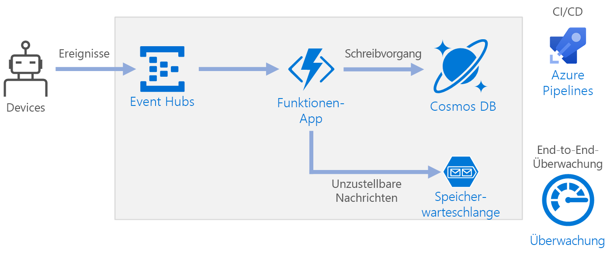

# <a name="serverless-event-processing-using-azure-functions"></a><span data-ttu-id="b0377-103">Serverlose Ereignisverarbeitung mit Azure Functions</span><span class="sxs-lookup"><span data-stu-id="b0377-103">Serverless event processing using Azure Functions</span></span>

<span data-ttu-id="b0377-104">Diese Referenzarchitektur zeigt eine [serverlose](https://azure.microsoft.com/solutions/serverless/), ereignisgesteuerte Architektur, die einen Datenstrom erfasst, die Daten verarbeitet und die Ergebnisse in eine Back-End-Datenbank schreibt.</span><span class="sxs-lookup"><span data-stu-id="b0377-104">This reference architecture shows a [serverless](https://azure.microsoft.com/solutions/serverless/), event-driven architecture that ingests a stream of data, processes the data, and writes the results to a back-end database.</span></span> <span data-ttu-id="b0377-105">Eine Referenzimplementierung für diese Architektur ist auf [GitHub][github] verfügbar.</span><span class="sxs-lookup"><span data-stu-id="b0377-105">A reference implementation for this architecture is available on [GitHub][github].</span></span>



## <a name="architecture"></a><span data-ttu-id="b0377-107">Architecture</span><span class="sxs-lookup"><span data-stu-id="b0377-107">Architecture</span></span>

<span data-ttu-id="b0377-108">Der Datenstrom wird mit **Event Hubs** erfasst.</span><span class="sxs-lookup"><span data-stu-id="b0377-108">**Event Hubs** ingests the data stream.</span></span> <span data-ttu-id="b0377-109">[Event Hubs][eh] ist für Datenstromszenarien mit hohem Durchsatz konzipiert.</span><span class="sxs-lookup"><span data-stu-id="b0377-109">[Event Hubs][eh] is designed for high-throughput data streaming scenarios.</span></span>

> [!NOTE]
> <span data-ttu-id="b0377-110">Für IoT-Szenarien empfehlen wir die Verwendung von IoT Hub.</span><span class="sxs-lookup"><span data-stu-id="b0377-110">For IoT scenarios, we recommend IoT Hub.</span></span> <span data-ttu-id="b0377-111">IoT Hub verfügt über einen integrierten Endpunkt, der mit der Azure Event Hubs-API kompatibel ist, sodass Sie beide Dienste in dieser Architektur ohne größere Änderungen bei der Back-End-Verarbeitung nutzen können.</span><span class="sxs-lookup"><span data-stu-id="b0377-111">IoT Hub has a built-in endpoint that’s compatible with the Azure Event Hubs API, so you can use either service in this architecture with no major changes in the backend processing.</span></span> <span data-ttu-id="b0377-112">Weitere Informationen finden Sie unter [Verbinden von IoT-Geräten mit Azure: IoT Hub und Event Hubs][iot].</span><span class="sxs-lookup"><span data-stu-id="b0377-112">For more information, see [Connecting IoT Devices to Azure: IoT Hub and Event Hubs][iot].</span></span>

<span data-ttu-id="b0377-113">**Funktions-App**.</span><span class="sxs-lookup"><span data-stu-id="b0377-113">**Function App**.</span></span> <span data-ttu-id="b0377-114">[Azure Functions][functions] ist eine serverlose Computeoption.</span><span class="sxs-lookup"><span data-stu-id="b0377-114">[Azure Functions][functions] is a serverless compute option.</span></span> <span data-ttu-id="b0377-115">Es wird ein ereignisgesteuertes Modell verwendet, bei dem ein Codeabschnitt (eine „Funktion“) durch einen Trigger aufgerufen wird.</span><span class="sxs-lookup"><span data-stu-id="b0377-115">It uses an event-driven model, where a piece of code (a “function”) is invoked by a trigger.</span></span> <span data-ttu-id="b0377-116">Wenn in dieser Architektur Ergebnisse auf einer Event Hubs-Instanz eingehen, lösen sie eine Funktion aus, mit der die Ereignisse verarbeitet und die Ergebnisse in den Speicher geschrieben werden.</span><span class="sxs-lookup"><span data-stu-id="b0377-116">In this architecture, when events arrive at Event Hubs, they trigger a function that processes the events and writes the results to storage.</span></span>

<span data-ttu-id="b0377-117">Funktions-Apps sind für die Verarbeitung einzelner Datensätze von Event Hubs geeignet.</span><span class="sxs-lookup"><span data-stu-id="b0377-117">Function Apps are suitable for processing individual records from Event Hubs.</span></span> <span data-ttu-id="b0377-118">Für komplexere Szenarien zur Verarbeitung von Datenströmen können Sie erwägen, Apache Spark mit Azure Databricks oder Azure Stream Analytics zu verwenden.</span><span class="sxs-lookup"><span data-stu-id="b0377-118">For more complex stream processing scenarios, consider Apache Spark using Azure Databricks, or Azure Stream Analytics.</span></span>

<span data-ttu-id="b0377-119">**Cosmos DB**:</span><span class="sxs-lookup"><span data-stu-id="b0377-119">**Cosmos DB**.</span></span> <span data-ttu-id="b0377-120">[Cosmos DB][cosmosdb] ist ein Datenbankdienst mit mehreren Modellen.</span><span class="sxs-lookup"><span data-stu-id="b0377-120">[Cosmos DB][cosmosdb] is a multi-model database service.</span></span> <span data-ttu-id="b0377-121">Für dieses Szenario speichert die Funktion für die Ereignisverarbeitung JSON-Datensätze mit der Cosmos DB-[SQL-API][cosmosdb-sql].</span><span class="sxs-lookup"><span data-stu-id="b0377-121">For this scenario, the event-processing function stores JSON records, using the Cosmos DB [SQL API][cosmosdb-sql].</span></span>

<span data-ttu-id="b0377-122">**Warteschlangenspeicher**.</span><span class="sxs-lookup"><span data-stu-id="b0377-122">**Queue storage**.</span></span> <span data-ttu-id="b0377-123">[Warteschlangenspeicher][queue] wird für unzustellbare Nachrichten verwendet.</span><span class="sxs-lookup"><span data-stu-id="b0377-123">[Queue storage][queue] is used for dead letter messages.</span></span> <span data-ttu-id="b0377-124">Wenn bei der Verarbeitung eines Ereignisses ein Fehler auftritt, speichert die Funktion die Ereignisdaten in einer Warteschlange für unzustellbare Nachrichten zur späteren Verarbeitung.</span><span class="sxs-lookup"><span data-stu-id="b0377-124">If an error occurs while processing an event, the function stores the event data in a dead letter queue for later processing.</span></span> <span data-ttu-id="b0377-125">Weitere Informationen finden Sie unter [Überlegungen zur Resilienz](#resiliency-considerations).</span><span class="sxs-lookup"><span data-stu-id="b0377-125">For more information, see [Resiliency Considerations](#resiliency-considerations).</span></span>

<span data-ttu-id="b0377-126">**Azure Monitor**:</span><span class="sxs-lookup"><span data-stu-id="b0377-126">**Azure Monitor**.</span></span> <span data-ttu-id="b0377-127">[Monitor][monitor] erfasst Leistungsmetriken zu den in der Lösung bereitgestellten Azure-Diensten.</span><span class="sxs-lookup"><span data-stu-id="b0377-127">[Monitor][monitor] collects performance metrics about the Azure services deployed in the solution.</span></span> <span data-ttu-id="b0377-128">Durch die Visualisierung dieser Metriken in einem Dashboard können Sie einen Einblick in die Integrität der Lösung gewinnen.</span><span class="sxs-lookup"><span data-stu-id="b0377-128">By visualizing these in a dashboard, you can get visibility  into the health of the solution.</span></span>

<span data-ttu-id="b0377-129">**Azure Pipelines**.</span><span class="sxs-lookup"><span data-stu-id="b0377-129">**Azure Pipelines**.</span></span> <span data-ttu-id="b0377-130">[Pipelines][pipelines] ist ein CI-/CD-Dienst (Continuous Integration/Continuous Delivery), mit dem die Anwendung erstellt, getestet und bereitgestellt wird.</span><span class="sxs-lookup"><span data-stu-id="b0377-130">[Pipelines][pipelines] is a continuous integration (CI) and continuous delivery (CD) service that builds, tests, and deploys the application.</span></span>

## <a name="scalability-considerations"></a><span data-ttu-id="b0377-131">Überlegungen zur Skalierbarkeit</span><span class="sxs-lookup"><span data-stu-id="b0377-131">Scalability considerations</span></span>

### <a name="event-hubs"></a><span data-ttu-id="b0377-132">Event Hubs</span><span class="sxs-lookup"><span data-stu-id="b0377-132">Event Hubs</span></span>

<span data-ttu-id="b0377-133">Die Durchsatzkapazität von Event Hubs wird in [Durchsatzeinheiten][eh-throughput] gemessen.</span><span class="sxs-lookup"><span data-stu-id="b0377-133">The throughput capacity of Event Hubs is measured in [throughput units][eh-throughput].</span></span> <span data-ttu-id="b0377-134">Sie können einen Event Hub automatisch skalieren, indem Sie die Funktion für [automatische Vergrößerung][eh-autoscale] aktivieren. Dadurch werden die Durchsatzeinheiten basierend auf dem Datenverkehr automatisch bis zu einem konfigurierten Höchstwert hochskaliert.</span><span class="sxs-lookup"><span data-stu-id="b0377-134">You can autoscale an event hub by enabling [auto-inflate][eh-autoscale], which automatically scales the throughput units based on traffic, up to a configured maximum.</span></span>

<span data-ttu-id="b0377-135">Der [Event Hub-Trigger][eh-trigger] in der Funktions-App wird gemäß der Anzahl von Partitionen im Event Hub skaliert.</span><span class="sxs-lookup"><span data-stu-id="b0377-135">The [Event Hub trigger][eh-trigger] in the function app scales according to the number of partitions in the event hub.</span></span> <span data-ttu-id="b0377-136">Jeder Partition wird jeweils eine Funktionsinstanz zugewiesen.</span><span class="sxs-lookup"><span data-stu-id="b0377-136">Each partition is assigned one function instance at a time.</span></span> <span data-ttu-id="b0377-137">Zur Erhöhung des Durchsatzes empfangen Sie die Ereignisse nicht einzeln nacheinander, sondern als Batch.</span><span class="sxs-lookup"><span data-stu-id="b0377-137">To maximize throughput, receive the events in a batch, instead of one at a time.</span></span>

### <a name="cosmos-db"></a><span data-ttu-id="b0377-138">Cosmos DB</span><span class="sxs-lookup"><span data-stu-id="b0377-138">Cosmos DB</span></span>

<span data-ttu-id="b0377-139">Die Durchsatzkapazität für Cosmos DB wird in [Anforderungseinheiten][ru] (RUs) gemessen.</span><span class="sxs-lookup"><span data-stu-id="b0377-139">Throughput capacity for Cosmos DB is measured in [Request Units][ru] (RU).</span></span> <span data-ttu-id="b0377-140">Um einen Cosmos DB-Container auf eine Kapazität von mehr als 10.000 RU zu skalieren, müssen Sie beim Erstellen des Containers einen [Partitionsschlüssel][partition-key] angeben und diesen in jedes von Ihnen erstellte Dokument einfügen.</span><span class="sxs-lookup"><span data-stu-id="b0377-140">In order to scale a Cosmos DB container past 10,000 RU, you must specify a [partition key][partition-key] when you create the container, and include the partition key in every document that you create.</span></span>

<span data-ttu-id="b0377-141">Hier sind einige Merkmale eines gut geeigneten Partitionsschlüssels aufgeführt:</span><span class="sxs-lookup"><span data-stu-id="b0377-141">Here are some characteristics of a good partition key:</span></span>

- <span data-ttu-id="b0377-142">Der Schlüsselwertbereich ist ausreichend groß.</span><span class="sxs-lookup"><span data-stu-id="b0377-142">The key value space is large.</span></span>
- <span data-ttu-id="b0377-143">Es erfolgt eine gleichmäßige Verteilung von Lese- und Schreibvorgängen pro Schlüsselwert, um eine Überlastung von Schlüsseln zu vermeiden.</span><span class="sxs-lookup"><span data-stu-id="b0377-143">There will be an even distribution of reads/writes per key value, avoiding hot keys.</span></span>
- <span data-ttu-id="b0377-144">Die maximale Datenmenge, die für einen Schlüsselwert gespeichert wird, übersteigt niemals die maximale Größe der physischen Partition (10 GB).</span><span class="sxs-lookup"><span data-stu-id="b0377-144">The maximum data stored for any single key value will not exceed the maximum physical partition size (10 GB).</span></span>
- <span data-ttu-id="b0377-145">Der Partitionsschlüssel für ein Dokument ändert sich nicht.</span><span class="sxs-lookup"><span data-stu-id="b0377-145">The partition key for a document won't change.</span></span> <span data-ttu-id="b0377-146">Sie können den Partitionsschlüssel für ein vorhandenes Dokument nicht aktualisieren.</span><span class="sxs-lookup"><span data-stu-id="b0377-146">You can't update the partition key on an existing document.</span></span>

<span data-ttu-id="b0377-147">Im Szenario für diese Referenzarchitektur speichert die Funktion genau ein Dokument pro Gerät, das Daten sendet.</span><span class="sxs-lookup"><span data-stu-id="b0377-147">In the scenario for this reference architecture, the function stores exactly one document per device that is sending data.</span></span> <span data-ttu-id="b0377-148">Die Funktion aktualisiert die Dokumente laufend mit dem aktuellen Gerätestatus, indem ein Upsert-Vorgang verwendet wird.</span><span class="sxs-lookup"><span data-stu-id="b0377-148">The function continually updates the documents with latest device status, using an upsert operation.</span></span> <span data-ttu-id="b0377-149">Die Geräte-ID ist ein guter Partitionsschlüssel für dieses Szenario, da Schreibvorgänge gleichmäßig auf die Schlüssel verteilt werden. Außerdem ist die Größe jeder Partition streng begrenzt, weil ein einzelnes Dokument für jeden Schlüsselwert vorhanden ist.</span><span class="sxs-lookup"><span data-stu-id="b0377-149">Device ID is a good partition key for this scenario, because writes will be evenly distributed across the keys, and the size of each partition will be strictly bounded, because there is a single document for each key value.</span></span> <span data-ttu-id="b0377-150">Weitere Informationen zu Partitionsschlüsseln finden Sie unter [Partitionieren und Skalieren in Azure Cosmos DB][cosmosdb-scale].</span><span class="sxs-lookup"><span data-stu-id="b0377-150">For more information about partition keys, see [Partition and scale in Azure Cosmos DB][cosmosdb-scale].</span></span>

## <a name="resiliency-considerations"></a><span data-ttu-id="b0377-151">Überlegungen zur Resilienz</span><span class="sxs-lookup"><span data-stu-id="b0377-151">Resiliency considerations</span></span>

<span data-ttu-id="b0377-152">Beim Verwenden des Event Hubs-Triggers mit Functions ist es ratsam, Ausnahmen in Ihrer Verarbeitungsschleife abzufangen.</span><span class="sxs-lookup"><span data-stu-id="b0377-152">When using the Event Hubs trigger with Functions, catch exceptions within your processing loop.</span></span> <span data-ttu-id="b0377-153">Wenn ein Ausnahmefehler auftritt, führt die Functions-Runtime keinen Wiederholungsversuch für die Nachrichten durch.</span><span class="sxs-lookup"><span data-stu-id="b0377-153">If an unhandled exception occurs, the Functions runtime does not retry the messages.</span></span> <span data-ttu-id="b0377-154">Wenn eine Nachricht nicht verarbeitet werden kann, sollte sie in eine Warteschlange für unzustellbare Nachrichten eingereiht werden.</span><span class="sxs-lookup"><span data-stu-id="b0377-154">If a message cannot be processed, put the message into a dead letter queue.</span></span> <span data-ttu-id="b0377-155">Verwenden Sie einen Out-of-band-Prozess, um die Nachrichten zu untersuchen und die Korrekturmaßnahmen zu bestimmen.</span><span class="sxs-lookup"><span data-stu-id="b0377-155">Use an out-of-band process to examine the messages and determine corrective action.</span></span>

<span data-ttu-id="b0377-156">Mit dem folgenden Code wird veranschaulicht, wie die Erfassungsfunktion Ausnahmen abfängt und nicht verarbeitete Nachrichten in eine Warteschlange für unzustellbare Nachrichten einreiht.</span><span class="sxs-lookup"><span data-stu-id="b0377-156">The following code shows how the ingestion function catches exceptions and puts unprocessed messages onto a dead letter queue.</span></span>

```csharp
[FunctionName("RawTelemetryFunction")]
[StorageAccount("DeadLetterStorage")]
public static async Task RunAsync(
    [EventHubTrigger("%EventHubName%", Connection = "EventHubConnection", ConsumerGroup ="%EventHubConsumerGroup%")]EventData[] messages,
    [Queue("deadletterqueue")] IAsyncCollector<DeadLetterMessage> deadLetterMessages,
    ILogger logger)
{
    foreach (var message in messages)
    {
        DeviceState deviceState = null;

        try
        {
            deviceState = telemetryProcessor.Deserialize(message.Body.Array, logger);
        }
        catch (Exception ex)
        {
            logger.LogError(ex, "Error deserializing message", message.SystemProperties.PartitionKey, message.SystemProperties.SequenceNumber);
            await deadLetterMessages.AddAsync(new DeadLetterMessage { Issue = ex.Message, EventData = message });
        }

        try
        {
            await stateChangeProcessor.UpdateState(deviceState, logger);
        }
        catch (Exception ex)
        {
            logger.LogError(ex, "Error updating status document", deviceState);
            await deadLetterMessages.AddAsync(new DeadLetterMessage { Issue = ex.Message, EventData = message, DeviceState = deviceState });
        }
    }
}
```

<span data-ttu-id="b0377-157">Beachten Sie, dass für die Funktion die [Queue Storage-Ausgabebindung][queue-binding] genutzt wird, um Elemente in die Warteschlange einzureihen.</span><span class="sxs-lookup"><span data-stu-id="b0377-157">Notice that the function uses the [Queue storage output binding][queue-binding] to put items in the queue.</span></span>

<span data-ttu-id="b0377-158">Mit dem obigen Code werden Ausnahmen auch in Application Insights protokolliert.</span><span class="sxs-lookup"><span data-stu-id="b0377-158">The code shown above also logs exceptions to Application Insights.</span></span> <span data-ttu-id="b0377-159">Sie können den Partitionsschlüssel und die Sequenznummer auch verwenden, um unzustellbare Nachrichten mit den Ausnahmen in den Protokollen zu korrelieren.</span><span class="sxs-lookup"><span data-stu-id="b0377-159">You can use the partition key and sequence number to correlate dead letter messages with the exceptions in the logs.</span></span>

<span data-ttu-id="b0377-160">Nachrichten in der Warteschlange für unzustellbare Nachrichten sollten über genügend Informationen verfügen, damit Sie den Kontext des Fehlers verstehen können.</span><span class="sxs-lookup"><span data-stu-id="b0377-160">Messages in the dead letter queue should have enough information so that you can understand the context of error.</span></span> <span data-ttu-id="b0377-161">In diesem Beispiel enthält die Klasse `DeadLetterMessage` die Ausnahmenachricht, die ursprünglichen Ereignisdaten und die deserialisierte Ereignisnachricht (falls verfügbar).</span><span class="sxs-lookup"><span data-stu-id="b0377-161">In this example, the `DeadLetterMessage` class contains the exception message, the original event data, and the deserialized event message (if available).</span></span>

```csharp
public class DeadLetterMessage
{
    public string Issue { get; set; }
    public EventData EventData { get; set; }
    public DeviceState DeviceState { get; set; }
}
```

<span data-ttu-id="b0377-162">Nutzen Sie [Azure Monitor][monitor], um den Event Hub zu überwachen.</span><span class="sxs-lookup"><span data-stu-id="b0377-162">Use [Azure Monitor][monitor] to monitor the event hub.</span></span> <span data-ttu-id="b0377-163">Wenn eine Eingabe vorhanden ist, aber keine Ausgabe, bedeutet dies, dass Nachrichten nicht verarbeitet werden.</span><span class="sxs-lookup"><span data-stu-id="b0377-163">If you see there is input but no output, it means that messages are not being processed.</span></span> <span data-ttu-id="b0377-164">Navigieren Sie in diesem Fall zu [Log Analytics][log-analytics], und suchen Sie nach Ausnahmen oder anderen Fehlern.</span><span class="sxs-lookup"><span data-stu-id="b0377-164">In that case, go into [Log Analytics][log-analytics] and look for exceptions or other errors.</span></span>

## <a name="disaster-recovery-considerations"></a><span data-ttu-id="b0377-165">Überlegungen zur Notfallwiederherstellung</span><span class="sxs-lookup"><span data-stu-id="b0377-165">Disaster recovery considerations</span></span>

<span data-ttu-id="b0377-166">Die hier dargestellte Bereitstellung befindet sich in nur einer Azure-Region.</span><span class="sxs-lookup"><span data-stu-id="b0377-166">The deployment shown here resides in a single Azure region.</span></span> <span data-ttu-id="b0377-167">Nutzen Sie die Features für die geografische Verteilung in den verschiedenen Diensten, um einen stabileren Ansatz für die Notfallwiederherstellung zu erzielen:</span><span class="sxs-lookup"><span data-stu-id="b0377-167">For a more resilient approach to disaster-recovery, take advantage of geo-distribution features in the various services:</span></span>

- <span data-ttu-id="b0377-168">**Event Hubs**.</span><span class="sxs-lookup"><span data-stu-id="b0377-168">**Event Hubs**.</span></span> <span data-ttu-id="b0377-169">Erstellen Sie zwei Event Hubs-Namespaces: einen primären (aktiven) Namespace und einen sekundären (passiven) Namespace.</span><span class="sxs-lookup"><span data-stu-id="b0377-169">Create two Event Hubs namespaces, a primary (active) namespace and a secondary (passive) namespace.</span></span> <span data-ttu-id="b0377-170">Nachrichten werden automatisch an den aktiven Namespace weitergeleitet, sofern Sie kein Failover zum sekundären Namespace ausführen.</span><span class="sxs-lookup"><span data-stu-id="b0377-170">Messages are automatically routed to the active namespace unless you fail over to the secondary namespace.</span></span> <span data-ttu-id="b0377-171">Weitere Informationen finden Sie unter [Georedundante Notfallwiederherstellung in Azure Event Hubs][eh-dr].</span><span class="sxs-lookup"><span data-stu-id="b0377-171">For more information, see [Azure Event Hubs Geo-disaster recovery][eh-dr].</span></span>

- <span data-ttu-id="b0377-172">**Funktions-App**.</span><span class="sxs-lookup"><span data-stu-id="b0377-172">**Function App**.</span></span> <span data-ttu-id="b0377-173">Stellen Sie eine zweite Funktions-App bereit, die darauf wartet, vom sekundären Event Hubs-Namespace zu lesen.</span><span class="sxs-lookup"><span data-stu-id="b0377-173">Deploy a second function app that is waiting to read from the secondary Event Hubs namespace.</span></span> <span data-ttu-id="b0377-174">Mit dieser Funktion werden Daten in ein sekundäres Speicherkonto für die Warteschlange für unzustellbare Nachrichten geschrieben.</span><span class="sxs-lookup"><span data-stu-id="b0377-174">This function writes to a secondary storage account for dead letter queue.</span></span>

- <span data-ttu-id="b0377-175">**Cosmos DB**:</span><span class="sxs-lookup"><span data-stu-id="b0377-175">**Cosmos DB**.</span></span> <span data-ttu-id="b0377-176">Cosmos DB unterstützt [mehrere Masterregionen][cosmosdb-geo], sodass Schreibvorgänge in alle Regionen möglich sind, die Sie Ihrem Cosmos DB-Konto hinzufügen.</span><span class="sxs-lookup"><span data-stu-id="b0377-176">Cosmos DB supports [multiple master regions][cosmosdb-geo], which enables writes to any region that you add to your Cosmos DB account.</span></span> <span data-ttu-id="b0377-177">Wenn Sie die Funktion für mehrere Master (Multimaster) nicht aktivieren, können Sie trotzdem ein Failover in die primäre Schreibregion ausführen.</span><span class="sxs-lookup"><span data-stu-id="b0377-177">If you don’t enable multi-master, you can still fail over the primary write region.</span></span> <span data-ttu-id="b0377-178">Die Cosmos DB-Client-SDKs und die Azure-Funktionsbindungen verarbeiten das Failover automatisch, sodass Sie keine Einstellungen für die Anwendungskonfiguration aktualisieren müssen.</span><span class="sxs-lookup"><span data-stu-id="b0377-178">The Cosmos DB client SDKs and the Azure Function bindings automatically handle the failover, so you don’t need to update any application configuration settings.</span></span>

- <span data-ttu-id="b0377-179">**Azure Storage**.</span><span class="sxs-lookup"><span data-stu-id="b0377-179">**Azure Storage**.</span></span> <span data-ttu-id="b0377-180">Verwenden Sie für die Warteschlange für unzustellbare Nachrichten Speicher vom Typ [RA-GRS][ra-grs] (georedundanter Speicher mit Lesezugriff).</span><span class="sxs-lookup"><span data-stu-id="b0377-180">Use [RA-GRS][ra-grs] storage for the dead letter queue.</span></span> <span data-ttu-id="b0377-181">Hierdurch wird ein schreibgeschütztes Replikat in einer anderen Region erstellt.</span><span class="sxs-lookup"><span data-stu-id="b0377-181">This creates a read-only replica in another region.</span></span> <span data-ttu-id="b0377-182">Wenn die primäre Region ausfällt, können Sie die derzeit in der Warteschlange befindlichen Elemente lesen.</span><span class="sxs-lookup"><span data-stu-id="b0377-182">If the primary region becomes unavailable, you can read the items currently in the queue.</span></span> <span data-ttu-id="b0377-183">Stellen Sie darüber hinaus ein weiteres Speicherkonto in der sekundären Region bereit, in das die Funktion nach einem Failover schreiben kann.</span><span class="sxs-lookup"><span data-stu-id="b0377-183">In addition, provision another storage account in the secondary region that the function can write to after a fail-over.</span></span>

## <a name="deploy-the-solution"></a><span data-ttu-id="b0377-184">Bereitstellen der Lösung</span><span class="sxs-lookup"><span data-stu-id="b0377-184">Deploy the solution</span></span>

<span data-ttu-id="b0377-185">Zeigen Sie zum Bereitstellen dieser Referenzarchitektur die [GitHub-Infodatei][readme] an.</span><span class="sxs-lookup"><span data-stu-id="b0377-185">To deploy this reference architecture, view the [GitHub readme][readme].</span></span>

<!-- links -->

[cosmosdb]: /azure/cosmos-db/introduction
[cosmosdb-geo]: /azure/cosmos-db/distribute-data-globally
[cosmosdb-scale]: /azure/cosmos-db/partition-data
[cosmosdb-sql]: /azure/cosmos-db/sql-api-introduction
[eh]: /azure/event-hubs/
[eh-autoscale]: /azure/event-hubs/event-hubs-auto-inflate
[eh-dr]: /azure/event-hubs/event-hubs-geo-dr
[eh-throughput]: /azure/event-hubs/event-hubs-features#throughput-units
[eh-trigger]: /azure/azure-functions/functions-bindings-event-hubs
[functions]: /azure/azure-functions/functions-overview
[iot]: /azure/iot-hub/iot-hub-compare-event-hubs
[log-analytics]: /azure/log-analytics/log-analytics-queries
[monitor]: /azure/azure-monitor/overview
[partition-key]: /azure/cosmos-db/partition-data
[pipelines]: /azure/devops/pipelines/index
[queue]: /azure/storage/queues/storage-queues-introduction
[queue-binding]: /azure/azure-functions/functions-bindings-storage-queue#output
[ra-grs]: /azure/storage/common/storage-redundancy-grs
[ru]: /azure/cosmos-db/request-units

[github]: https://github.com/mspnp/serverless-reference-implementation
[readme]: https://github.com/mspnp/serverless-reference-implementation/blob/master/README.md
