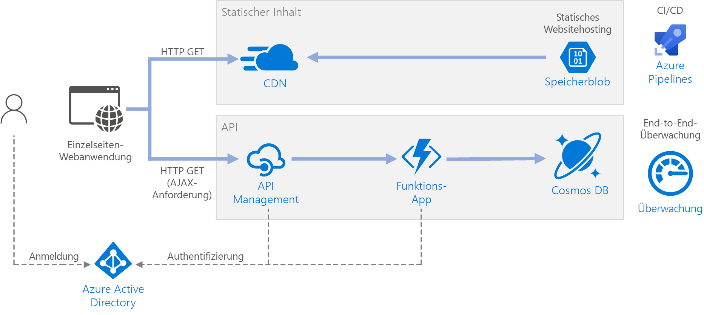

# <a name="serverless-web-application"></a>Serverlose Webanwendung 

Diese Referenzarchitektur zeigt eine serverlose Webanwendung. Die Anwendung stellt statische Inhalte aus Azure Blob Storage bereit und implementiert eine API mit Azure Functions. Die API liest Daten aus Cosmos DB und gibt die Ergebnisse für die Web-App zurück. Eine Referenzimplementierung für diese Architektur ist auf [GitHub][github] verfügbar.


 
Der Begriff „serverlos“ hat zwei separate Bedeutungen, die aber miteinander zusammenhängen:

- **Back-End-as-a-Service** (BaaS). Back-End-Clouddienste, z.B. Datenbanken und Speicher, stellen APIs bereit, mit denen Clientanwendungen eine direkte Verbindung mit diesen Diensten herstellen können. 
- **Functions-as-a-Service** (FaaS). Bei diesem Modell ist eine „Funktion“ ein Codeabschnitt, der in der Cloud bereitgestellt und in einer Hostumgebung ausgeführt wird, in der die Server für die Ausführung des Codes vollständig abstrahiert werden. 

Für beide Definitionen steckt die Idee dahinter, dass Entwickler und DevOps-Benutzer keine Server bereitstellen, konfigurieren oder verwalten müssen. Bei dieser Referenzarchitektur liegt der Schwerpunkt auf FaaS mit Azure Functions, aber die Bereitstellung von Webinhalten aus Azure Blob Storage ist ein Beispiel für BaaS. Hier sind einige wichtige Merkmale von FaaS angegeben:

1. Computeressourcen werden je nach den Anforderungen der Plattform dynamisch zugeordnet.
1. Nutzungsbasierte Preise: Ihnen werden nur die Computeressourcen berechnet, die zum Ausführen des Codes verwendet werden.
1. Die Computeressourcen werden bedarfsabhängig anhand des Datenverkehrs skaliert, ohne dass der Entwickler eine Konfiguration durchführen muss.

Die Funktionen werden ausgeführt, wenn ein externer Auslöser vorliegt, z.B. eine HTTP-Anforderung oder der Empfang einer Nachricht in einer Warteschlange. Daher ist ein [ereignisgesteuerter Architekturstil][event-driven] die natürliche Wahl für serverlose Architekturen. Für die Koordinierung der Arbeit zwischen den Komponenten der Architektur können Sie erwägen, Nachrichtenbroker oder Pub/Sub-Muster zu nutzen. Hilfe zur Wahl zwischen Messagingtechnologien in Azure finden Sie unter [Wählen zwischen Azure-Diensten für die Nachrichtenübermittlung][azure-messaging].

## <a name="architecture"></a>Architecture
Die Architektur umfasst die folgenden Komponenten.

**Blobspeicher**. Statische Webinhalte, z.B. HTML-, CSS- und JavaScript-Dateien, werden in Azure Blob Storage gespeichert und für Clients bereitgestellt, indem das [Hosten von statischen Websites][static-hosting] verwendet wird. Alle dynamischen Interaktionen erfolgen über JavaScript-Code, mit dem die Back-End-APIs aufgerufen werden. Es ist kein serverseitiger Code zum Rendern der Webseite vorhanden. Für das Hosten statischer Websites werden Indexdokumente und benutzerdefinierte 404-Fehlerseiten unterstützt.

> [!NOTE]
> Das Hosten statischer Websites befindet sich derzeit in der [Vorschauphase][static-hosting-preview].

**CDN**. Verwenden Sie [Azure Content Delivery Network][cdn] (CDN) zum Zwischenspeichern von Inhalten, um eine geringere Latenz und schnellere Bereitstellung eines HTTPS-Endpunkts zu erzielen.

**Funktions-Apps**. [Azure Functions][functions] ist eine serverlose Computeoption. Es wird ein ereignisgesteuertes Modell verwendet, bei dem ein Codeabschnitt (eine „Funktion“) durch einen Trigger aufgerufen wird. In dieser Architektur wird die Funktion aufgerufen, wenn ein Client eine HTTP-Anforderung sendet. Die Anforderung wird immer über ein API-Gateway geleitet, wie unten beschrieben.

**API Management**. Bei [API Management][apim] wird ein API-Gateway bereitgestellt, das vor der HTTP-Funktion angeordnet ist. Sie können API Management nutzen, um von Clientanwendungen verwendete APIs zu veröffentlichen und zu verwalten. Mit der Verwendung eines Gateways wird die Entkopplung der Front-End-Anwendung von den Back-End-APIs unterstützt. Beispielsweise kann API Management URLs umschreiben, Anforderungen vor dem Erreichen des Back-Ends transformieren, Anforderungs- oder Antwortheader festlegen usw.

API Management kann auch verwendet werden, um übergreifende Aspekte zu implementieren, z.B.:

- Erzwingen von Nutzungskontingenten und Ratenbegrenzungen
- Überprüfen von OAuth-Token für die Authentifizierung
- Aktivieren von ursprungsübergreifenden Anforderungen (Cross-Origin Requests, CORS)
- Zwischenspeichern von Antworten
- Überwachen und Protokollieren von Anforderungen  

Falls Sie nicht die gesamte Funktionalität benötigen, die von API Management bereitgestellt wird, ist die Nutzung von [Funktionsproxys][functions-proxy] eine Alternative. Mit diesem Feature von Azure Functions können Sie eine einzelne API-Oberfläche für mehrere Funktions-Apps definieren, indem Sie Routen zu Back-End-Funktionen erstellen. Außerdem können mit Funktionsproxys eingeschränkte Transformationen für die HTTP-Anforderung und -Antwort durchgeführt werden. Sie ermöglichen aber nicht die gleichen umfassenden richtlinienbasierten Funktionen wie API Management.

**Cosmos DB**: [Cosmos DB][cosmosdb] ist ein Datenbankdienst mit mehreren Modellen. Für dieses Szenario ruft die Funktionsanwendung Dokumente aus Cosmos DB als Antwort auf HTTP GET-Anforderungen vom Client ab.

**Azure Active Directory** (Azure AD). Benutzer melden sich mit ihren Azure AD-Anmeldeinformationen an der Webanwendung an. Azure AD gibt ein Zugriffstoken für die API zurück, das von der Webanwendung genutzt wird, um API-Anforderungen zu authentifizieren (siehe [Authentifizierung](#authentication)).

**Azure Monitor**: [Monitor][monitor] erfasst Leistungsmetriken zu den in der Lösung bereitgestellten Azure-Diensten. Durch die Visualisierung dieser Metriken in einem Dashboard können Sie einen Einblick in die Integrität der Lösung gewinnen. Außerdem werden Anwendungsprotokolle erfasst.

**Azure Pipelines**. [Pipelines][pipelines] ist ein CI-/CD-Dienst (Continuous Integration/Continuous Delivery), mit dem die Anwendung erstellt, getestet und bereitgestellt wird.

## <a name="recommendations"></a>Empfehlungen

### <a name="function-app-plans"></a>Funktions-App-Pläne

Azure Functions unterstützt zwei Hostingmodelle. Beim **Verbrauchstarif** wird automatisch Computeleistung zugeordnet, wenn Ihr Code ausgeführt wird.  Beim **App Service**-Plan wird eine Gruppe von VMs für Ihren Code zugeordnet. Mit dem App Service-Plan wird die Anzahl von VMs und die VM-Größe definiert. 

Beachten Sie, dass der App Service-Plan nicht *serverlos* im strengeren Sinne gemäß der obigen Definition ist. Das Programmiermodell ist aber identisch: Sowohl unter einem Verbrauchstarif als auch unter einem App Service-Plan kann der gleiche Funktionscode ausgeführt werden.

Hierbei müssen einige Faktoren berücksichtigt werden, wenn ausgewählt wird, welche Art von Plan verwendet werden soll:

- **Kaltstart**. Beim Verbrauchstarif führt eine Funktion, die nicht kürzlich aufgerufen wurde, bei der nächsten Ausführung zu zusätzlicher Latenz. Der Grund für diese zusätzliche Latenz ist die Zuordnung und Vorbereitung der Laufzeitumgebung. Dies bewegt sich normalerweise im Sekundenbereich, ist aber von mehreren Faktoren abhängig, z.B. der Anzahl von Abhängigkeiten, die geladen werden müssen. Weitere Informationen finden Sie unter [Understanding Serverless Cold Start][functions-cold-start] (Grundlegendes zum serverlosen Kaltstart). Der Kaltstart ist normalerweise eher ein Problem bei interaktiven Workloads (HTTP-Trigger) als bei asynchronen nachrichtengesteuerten Workloads (Warteschlangen- oder Event Hubs-Trigger), da die zusätzliche Latenz von den Benutzern direkt erkannt wird.
- **Zeitlimit**.  Beim Verbrauchstarif tritt für eine Funktionsausführung nach einem [konfigurierbaren][functions-timeout] Zeitraum ein Timeout auf (maximal zehn Minuten).
- **Isolation virtueller Netzwerke**. Bei der Nutzung eines App Service-Plans können Funktionen in einer [App Service-Umgebung][ase] ausgeführt werden, bei der es sich um eine dedizierte und isolierte Hostingumgebung handelt.
- **Preismodell**. Die Abrechnung für den Verbrauchstarif erfolgt anhand der Anzahl von Ausführungen und des Ressourcenverbrauchs (Arbeitsspeicher &times; Ausführungszeit). Beim App Service-Plan erfolgt die Abrechnung stündlich basierend auf der VM-Instanz-SKU. Der Verbrauchstarif kann häufig kostengünstiger als ein App Service-Plan sein, da Sie nur für die genutzten Computeressourcen zahlen. Dies gilt besonders, wenn Ihr Datenverkehr Spitzen und Täler aufweist. Falls eine Anwendung aber über einen konstant hohen Datendurchsatz verfügt, sind die Kosten für einen App Service-Plan unter Umständen aber geringer als beim Verbrauchstarif.
- **Skalierung**. Ein großer Vorteil des Verbrauchsmodells ist, dass basierend auf dem eingehenden Datenverkehr bedarfsabhängig dynamisch skaliert wird. Diese Skalierung kann zwar schnell durchgeführt werden, aber es ist eine Vorlaufzeit erforderlich. Für einige Workloads kann es ratsam sein, absichtlich zu viele VMs bereitzustellen, damit Datenverkehrsspitzen ohne Vorlaufzeit verarbeitet werden können. In diesem Fall sollten Sie erwägen, einen App Service-Plan zu nutzen.

### <a name="function-app-boundaries"></a>Grenzen von Funktions-Apps

Eine *Funktions-App* hostet die Ausführung von einer oder mehreren *Funktionen*. Sie können eine Funktions-App nutzen, um mehrere Funktionen als logische Einheit zu gruppieren. Innerhalb einer Funktions-App sind für die Funktionen die Anwendungseinstellungen, der Hostingplan und der Entwicklungslebenszyklus jeweils gleich. Jede Funktions-App verfügt über einen eigenen Hostnamen.  

Verwenden Sie Funktions-Apps zum Gruppieren von Funktionen, die den gleichen Lebenszyklus und die gleichen Einstellungen aufweisen. Funktionen, die nicht über den gleichen Lebenszyklus verfügen, sollten in anderen Funktions-Apps gehostet werden. 

Erwägen Sie, einen Ansatz mit Microservices zu nutzen, bei dem jede Funktions-App einen Microservice darstellt, der unter Umständen aus mehreren verwandten Funktionen besteht. In einer Architektur mit Microservices sollten Dienste eine lose Kopplung und eine hohe funktionale Kohäsion aufweisen. *Lose gekoppelt* bedeutet, dass Sie einen Dienst ändern können, ohne gleichzeitig andere Dienste aktualisieren zu müssen. Mit *Kohäsion* ist gemeint, dass ein Dienst einem einzelnen, klar definierten Zweck dient. Weitere Informationen zu diesen Aspekten finden Sie unter [Entwerfen von Microservices: Domänenanalyse][microservices-domain-analysis].

### <a name="function-bindings"></a>Funktionsbindungen

Nutzen Sie [Funktionsbindungen][functions-bindings], wann immer dies möglich ist. Bindungen stellen eine deklarative Möglichkeit dar, Ihren Code mit Daten zu verbinden und in andere Azure-Dienste zu integrieren. Mit einer Eingabebindung wird ein Eingabeparameter aus einer externen Datenquelle aufgefüllt. Eine Ausgabebindung sendet den Rückgabewert der Funktion an eine Datensenke, z.B. eine Warteschlange oder Datenbank.

Für die Funktion `GetStatus` in der Referenzimplementierung wird die Cosmos DB-[Eingabebindung][cosmosdb-input-binding] verwendet. Diese Bindung ist so konfiguriert, dass nach einem Dokument in Cosmos DB gesucht wird. Hierzu werden Abfrageparameter verwendet, die aus der Abfragezeichenfolge in der HTTP-Anforderung stammen. Wenn das Dokument gefunden wird, wird es als Parameter an die Funktion übergeben.

```csharp
[FunctionName("GetStatusFunction")]
public static Task<IActionResult> Run(
    [HttpTrigger(AuthorizationLevel.Function, "get", Route = null)] HttpRequest req, 
    [CosmosDB(
        databaseName: "%COSMOSDB_DATABASE_NAME%",
        collectionName: "%COSMOSDB_DATABASE_COL%",
        ConnectionStringSetting = "COSMOSDB_CONNECTION_STRING",
        Id = "{Query.deviceId}",
        PartitionKey = "{Query.deviceId}")] dynamic deviceStatus, 
    ILogger log)
{
    ...
}
```

Aufgrund der Nutzung von Bindungen müssen Sie keinen Code schreiben, der direkt mit dem Dienst kommuniziert. Hierdurch wird der Funktionscode vereinfacht, und außerdem werden die Details der Datenquelle bzw. -senke abstrahiert. In einigen Fällen benötigen Sie aber unter Umständen eine komplexere Logik als die von der Bindung bereitgestellte Logik. Verwenden Sie in diesem Fall direkt die Azure-Client-SDKs.

## <a name="scalability-considerations"></a>Überlegungen zur Skalierbarkeit

**Funktionen**. Für den Verbrauchstarif wird der HTTP-Trigger basierend auf dem Datenverkehr skaliert. Es gilt ein Limit für die Anzahl von gleichzeitigen Funktionsinstanzen, aber jede Instanz kann mehr als eine Anforderung gleichzeitig verarbeiten. Für einen App Service-Plan wird der HTTP-Trigger gemäß der Anzahl von VM-Instanzen skaliert. Dies kann ein fester Wert sein, oder es kann eine automatische Skalierung basierend auf einem Satz mit entsprechenden Regeln durchgeführt werden. Informationen hierzu finden Sie unter [Skalierung und Hosting von Azure Functions][functions-scale]. 

**Cosmos DB**: Die Durchsatzkapazität für Cosmos DB wird in [Anforderungseinheiten][ru] (RUs) gemessen. Ein Durchsatz von einer Anforderungseinheit (1 RU) entspricht dem Durchsatz für das Abrufen eines 1-KB-Dokuments per GET-Anforderung. Um einen Cosmos DB-Container auf eine Kapazität von mehr als 10.000 RU zu skalieren, müssen Sie beim Erstellen des Containers einen [Partitionsschlüssel][partition-key] angeben und diesen in jedes von Ihnen erstellte Dokument einfügen. Weitere Informationen zu Partitionsschlüsseln finden Sie unter [Partitionieren und Skalieren in Azure Cosmos DB][cosmosdb-scale].

**API Management**. API Management ermöglicht das horizontale Hochskalieren und unterstützt die regelbasierte automatische Skalierung. Beachten Sie, dass der Skalierungsvorgang mindestens 20 Minuten dauert. Wenn Ihr Datenverkehr Spitzen („Bursts“) aufweist, sollten Sie entsprechende Ressourcen bereitstellen, um den erwarteten maximalen Burstdatenverkehr abzudecken. Die automatische Skalierung ist aber für die Verarbeitung von stündlichen oder täglichen Schwankungen beim Datenverkehr nützlich. Weitere Informationen finden Sie unter [Automatisches Skalieren einer Azure API Management-Instanz][apim-scale].

## <a name="disaster-recovery-considerations"></a>Überlegungen zur Notfallwiederherstellung

Die hier dargestellte Bereitstellung befindet sich in nur einer Azure-Region. Nutzen Sie die Features für die geografische Verteilung in den verschiedenen Diensten, um einen stabileren Ansatz für die Notfallwiederherstellung zu erzielen:

- API Management unterstützt eine Bereitstellung für mehrere Regionen. Dies kann genutzt werden, um einen einzelnen API Management-Dienst in einer beliebigen Anzahl von Azure-Regionen zur Verfügung zu stellen. Weitere Informationen finden Sie unter [Bereitstellen einer Azure API Management-Dienstinstanz für mehrere Azure-Regionen][api-geo].

- Verwenden Sie [Traffic Manager][tm], um HTTP-Anforderungen an die primäre Region zu leiten. Wenn die Funktions-App, die in dieser Region ausgeführt wird, nicht verfügbar ist, kann Traffic Manager ein Failover in eine sekundäre Region ausführen.

- Cosmos DB unterstützt [mehrere Masterregionen][cosmosdb-geo], sodass Schreibvorgänge in alle Regionen möglich sind, die Sie Ihrem Cosmos DB-Konto hinzufügen. Wenn Sie die Funktion für mehrere Master (Multimaster) nicht aktivieren, können Sie trotzdem ein Failover in die primäre Schreibregion ausführen. Die Cosmos DB-Client-SDKs und die Azure-Funktionsbindungen verarbeiten das Failover automatisch, sodass Sie keine Einstellungen für die Anwendungskonfiguration aktualisieren müssen.

## <a name="security-considerations"></a>Sicherheitshinweise

### <a name="authentication"></a>Authentifizierung

Für die `GetStatus`-API in der Referenzimplementierung wird Azure AD zum Authentifizieren von Anforderungen verwendet. Azure AD unterstützt das Open ID Connect-Protokoll, bei dem es sich um ein Authentifizierungsprotokoll handelt, das auf dem OAuth 2-Protokoll basiert.

In dieser Architektur ist die Clientanwendung eine Single-Page-Anwendung (SPA), die im Browser ausgeführt wird. Da bei dieser Art von Clientanwendung der geheime Clientschlüssel oder der Autorisierungscode nicht ausgeblendet werden können, ist die implizite Genehmigung hierfür der geeignete Ablauf. (Siehe [Which OAuth 2.0 flow should I use?][oauth-flow] (Welchen OAuth 2.0-Ablauf soll ich verwenden?).) Hier ist der allgemeine Ablauf angegeben:

1. Der Benutzer klickt in der Webanwendung auf den Link „Anmelden“.
1. Der Browser wird auf die Azure AD-Anmeldeseite umgeleitet. 
1. Der Benutzer meldet sich an.
1. Azure AD führt die Umleitung zurück zur Clientanwendung durch, einschließlich eines Zugriffstokens im URL-Fragment.
1. Wenn die Webanwendung die API aufruft, fügt sie das Zugriffstoken in den Authentifizierungsheader ein. Die Anwendungs-ID wird im Zugriffstoken als „Audience“-Anspruch („aud“) gesendet. 
1. Die Back-End-API überprüft das Zugriffstoken.

Konfigurieren Sie die Authentifizierung wie folgt:

- Registrieren Sie eine Anwendung in Ihrem Azure AD-Mandanten. Es wird eine Anwendungs-ID generiert, die vom Client in die Anmelde-URL eingefügt wird.

- Aktivieren Sie die Azure AD-Authentifizierung in der Funktions-App. Weitere Informationen finden Sie unter [Authentifizierung und Autorisierung in Azure App Service][app-service-auth].

- Fügen Sie API Management die [Richtlinie „validate-jwt“][apim-validate-jwt] hinzu, um die Anforderung durch Überprüfung des Zugriffstokens vorab zu autorisieren.

Weitere Informationen finden Sie in der [GitHub-Infodatei][readme].

Es wird empfohlen, für die Clientanwendung und die Back-End-API separate App-Registrierungen in Azure AD zu erstellen. Erteilen Sie der Clientanwendung Berechtigungen zum Aufrufen der API. Bei diesem Ansatz können Sie ganz flexibel mehrere APIs und Clients definieren und die einzelnen Berechtigungen dafür steuern. 

Verwenden Sie innerhalb einer API [Bereiche][scopes], damit Anwendungen präzise steuern können, welche Berechtigungen sie bei einem Benutzer voraussetzen. So kann eine API beispielsweise über die Bereiche `Read` und `Write` verfügen und eine bestimmte Client-App den Benutzer lediglich zur Autorisierung von Berechtigungen des Typs `Read` auffordern.

### <a name="authorization"></a>Autorisierung

In vielen Anwendungen muss die Back-End-API überprüfen, wann ein Benutzer über die Berechtigung zum Durchführen einer bestimmten Aktion verfügt. Es wird empfohlen, die [anspruchsbasierte Autorisierung][claims] zu verwenden. Hierbei werden Informationen zum Benutzer vom Identitätsanbieter (hier: Azure AD) übermittelt und zum Treffen von Autorisierungsentscheidungen genutzt. 

Einige Ansprüche werden in dem ID-Token bereitgestellt, das von Azure AD an den Client zurückgegeben wird. Sie können diese Ansprüche über die Funktions-App erhalten, indem Sie in der Anforderung den X-MS-CLIENT-PRINCIPAL-Header untersuchen. Verwenden Sie für andere Ansprüche [Microsoft Graph][graph], um Azure AD abzufragen (Zustimmung des Benutzers während der Anmeldung erforderlich). 

Wenn Sie eine Anwendung in Azure AD registrieren, können Sie im Registrierungsmanifest der Anwendung eine Gruppe von Anwendungsrollen definieren. Wenn sich ein Benutzer an der Anwendung anmeldet, enthält Azure AD einen Rollenanspruch („Roles“) für jede Rolle, die dem Benutzer gewährt wurde (einschließlich Rollen, die per Gruppenmitgliedschaft vererbt werden). 

In der Referenzimplementierung überprüft die Funktion, ob der authentifizierte Benutzer ein Mitglied der Anwendungsrolle `GetStatus` ist. Wenn nicht, gibt die Funktion die HTTP-Antwort „Nicht autorisiert (401)“ zurück. 

```csharp
[FunctionName("GetStatusFunction")]
public static Task<IActionResult> Run(
    [HttpTrigger(AuthorizationLevel.Function, "get", "post", Route = null)] HttpRequest req, 
    [CosmosDB(
        databaseName: "%COSMOSDB_DATABASE_NAME%",
        collectionName: "%COSMOSDB_DATABASE_COL%",
        ConnectionStringSetting = "COSMOSDB_CONNECTION_STRING",
        Id = "{Query.deviceId}",
        PartitionKey = "{Query.deviceId}")] dynamic deviceStatus, 
    ILogger log)
{
    log.LogInformation("Processing GetStatus request.");

    return req.HandleIfAuthorizedForRoles(new[] { GetDeviceStatusRoleName },
        async () =>
        {
            string deviceId = req.Query["deviceId"];
            if (deviceId == null)
            {
                return new BadRequestObjectResult("Missing DeviceId");
            }

            return await Task.FromResult<IActionResult>(deviceStatus != null
                    ? (ActionResult)new OkObjectResult(deviceStatus)
                    : new NotFoundResult());
        },
        log);
}
```

In diesem Codebeispiel ist `HandleIfAuthorizedForRoles` eine Erweiterungsmethode, mit der eine Prüfung auf den Rollenanspruch durchgeführt und HTTP 401 zurückgegeben wird, wenn der Anspruch nicht gefunden wird. Sie finden die Quelldatei [hier][HttpRequestAuthorizationExtensions]. Beachten Sie, dass für `HandleIfAuthorizedForRoles` der Parameter `ILogger` verwendet wird. Es ist ratsam, nicht autorisierte Anforderungen zu protokollieren, damit Sie über einen Überwachungspfad verfügen und bei Bedarf Probleme diagnostizieren können. Gleichzeitig sollte verhindert werden, dass in der HTTP 401-Antwort detaillierte Informationen offengelegt werden.

### <a name="cors"></a>CORS

In dieser Referenzarchitektur weisen die Webanwendung und die API nicht denselben Ursprung auf. Dies bedeutet, dass es sich um eine ursprungsübergreifende Anforderung handelt, wenn die Anwendung die API aufruft. Die Browsersicherheit verhindert, dass eine Webseite AJAX-Anforderungen an eine andere Domäne richtet. Diese Einschränkung wird als *Richtlinie des gleichen Ursprungs* bezeichnet und verhindert, dass eine schädliche Website sensible Daten von einer anderen Website liest. Sie können eine ursprungsübergreifende Anforderung aktivieren, indem Sie dem API Management-Gateway eine [Richtlinie][cors-policy] vom Typ CORS (Cross-Origin Resource Sharing, Ressourcenfreigabe zwischen verschiedenen Ursprüngen) hinzufügen:

```xml
<cors allow-credentials="true">
    <allowed-origins>
        <origin>[Website URL]</origin>
    </allowed-origins>
    <allowed-methods>
        <method>GET</method>
    </allowed-methods>
    <allowed-headers>
        <header>*</header>
    </allowed-headers>
</cors>
```

In diesem Beispiel ist das Attribut **allow-credentials** auf **true** festgelegt. Hiermit wird für den Browser das Senden von Anmeldeinformationen (einschließlich Cookies) mit der Anforderung autorisiert. Andernfalls sendet der Browser standardmäßig keine Anmeldeinformationen mit einer ursprungsübergreifenden Anforderung.

> [!NOTE] 
> Gehen Sie beim Festlegen von **allow-credentials** auf **true** mit Bedacht vor, da eine Website die Benutzeranmeldeinformationen dann im Namen des Benutzers an Ihre API senden kann, ohne dass der Benutzer darüber informiert ist. Sie müssen den zugelassenen Ursprung als vertrauenswürdig festlegen.

### <a name="enforce-https"></a>Erzwingen von HTTPS

Sie können maximale Sicherheit erzielen, indem Sie HTTPS für die gesamte Anforderungspipeline erzwingen:

- **CDN**. Azure CDN unterstützt HTTPS standardmäßig für die Unterdomäne `*.azureedge.net`. Informationen zur Aktivierung von HTTPS im CDN für benutzerdefinierte Domänennamen finden Sie unter [Tutorial: Konfigurieren von HTTPS in einer benutzerdefinierten Azure CDN-Domäne][cdn-https]. 

- **Hosten von statischen Websites**. Aktivieren Sie die Option „[Sichere Übertragung erforderlich][storage-https]“ im Speicherkonto. Wenn diese Option aktiviert ist, lässt das Speicherkonto nur Anforderungen von sicheren HTTPS-Verbindungen zu. 

- **API Management**. Konfigurieren Sie die APIs so, das nur das HTTPS-Protokoll verwendet werden kann. Sie können dies im Azure-Portal oder über eine Resource Manager-Vorlage konfigurieren:

    ```json
    {
        "apiVersion": "2018-01-01",
        "type": "apis",
        "name": "dronedeliveryapi",
        "dependsOn": [
            "[concat('Microsoft.ApiManagement/service/', variables('apiManagementServiceName'))]"
        ],
        "properties": {
            "displayName": "Drone Delivery API",
            "description": "Drone Delivery API",
            "path": "api",
            "protocols": [ "HTTPS" ]
        },
        ...
    }
    ```

- **Azure Functions**. Aktivieren Sie die Einstellung „[Nur HTTPS][functions-https]“. 

### <a name="lock-down-the-function-app"></a>Sperren der Funktions-App

Alle Aufrufe der Funktion sollten über das API-Gateway verlaufen. Sie können dies wie folgt erreichen:

- Konfigurieren Sie die Funktions-App so, dass ein Funktionsschlüssel verwendet werden muss. Das API Management-Gateway enthält den Funktionsschlüssel, wenn es die Funktions-App aufruft. So wird verhindert, dass Clients die Funktion direkt aufrufen, indem sie das Gateway umgehen. 

- Das API Management-Gateway hat eine [statische IP-Adresse][apim-ip]. Beschränken Sie die Azure-Funktion, damit nur Aufrufe über diese statische IP-Adresse zulässig sind. Weitere Informationen finden Sie unter [Statische Azure App Service-IP-Einschränkungen][app-service-ip-restrictions]. (Dieses Feature ist nur für Dienste mit dem Standard-Tarif verfügbar.) 

### <a name="protect-application-secrets"></a>Schützen von Anwendungsgeheimnissen

Speichern Sie Anwendungsgeheimnisse, z.B. Datenbank-Anmeldeinformationen, nicht in Ihrem Code oder in Konfigurationsdateien. Verwenden Sie stattdessen App-Einstellungen, die in Azure verschlüsselt gespeichert werden. Weitere Informationen finden Sie unter [Sicherheit in Azure App Service und Azure Functions][app-service-security].

Alternativ hierzu können Sie Anwendungsgeheimnisse in Key Vault speichern. Dies ermöglicht Ihnen die Zentralisierung der Speicherung von Geheimnissen, die Steuerung ihrer Verteilung und die Überwachung, wie und wann auf Geheimnisse zugegriffen wird. Weitere Informationen finden Sie unter [Konfigurieren einer Azure-Webanwendung zum Lesen eines Geheimnisses aus Key Vault][key-vault-web-app]. Beachten Sie aber, dass Functions-Trigger und -Bindungen ihre Konfigurationseinstellungen aus App-Einstellungen laden. Es gibt keine integrierte Möglichkeit, für die Trigger und Bindungen die Verwendung von Key Vault-Geheimnissen zu konfigurieren.

## <a name="devops-considerations"></a>Überlegungen zu DevOps

### <a name="deployment"></a>Bereitstellung

Für die Bereitstellung der Funktions-App wird die Verwendung von [Paketdateien][functions-run-from-package] („Aus Paket ausführen“) empfohlen. Bei diesem Ansatz laden Sie eine ZIP-Datei in einen Blob Storage-Container hoch, und die Functions-Runtime bindet die ZIP-Datei als schreibgeschütztes Dateisystem ein. Dieser atomische Vorgang verringert die Wahrscheinlichkeit, dass die Anwendung aufgrund einer fehlerhaften Bereitstellung in einem inkonsistenten Zustand verbleibt. Er kann darüber hinaus Kaltstartzeiten verbessern (insbesondere für Node.js-Apps), da alle Dateien auf einmal ausgetauscht werden.

### <a name="api-versioning"></a>API-Versionsverwaltung

Eine API ist ein Vertrag zwischen einem Dienst und Clients. In dieser Architektur wird der API-Vertrag auf API Management-Ebene festgelegt. API Management unterstützt zwei unterschiedliche, sich jedoch ergänzende [Versionierungskonzepte][apim-versioning]:

- *Versionen* bieten API-Consumern die Möglichkeit, eine API-Version basierend auf ihren Anforderungen zu wählen, z.B. v1 oder v2. 

- *Revisionen* ermöglichen API-Administratoren das Vornehmen geringfügiger Änderungen in einer API und das Bereitstellen dieser Änderungen zusammen mit einem Änderungsprotokoll, um API-Benutzer über die Änderungen zu informieren.

Wenn Sie eine grundlegende Änderung in einer API vornehmen, veröffentlichen Sie eine neue Version in API Management. Stellen Sie die neue Version parallel zur Originalversion in einer separaten Funktions-App bereit. So können Sie vorhandene Clients zur neuen API migrieren, ohne die Funktion von Clientanwendungen zu beeinträchtigen. Letztendlich können Sie die frühere Version dann als veraltet deklarieren. API Management unterstützt mehrere [Versionsverwaltungsschemas][apim-versioning-schemes]: URL-Pfad, HTTP-Header oder Abfragezeichenfolge. Weitere Informationen zur API-Versionsverwaltung im Allgemeinen finden Sie unter [Versionsverwaltung einer RESTful-Web-API][api-versioning].

Stellen Sie für Updates, die keine grundlegenden API-Änderungen darstellen, die neue Version in einem Stagingslot in der derselben Funktions-App bereit. Überprüfen Sie, ob die Bereitstellung erfolgreich war, und ersetzen Sie dann die bereitgestellte Version durch die Produktionsversion. Veröffentlichen Sie eine Revision in API Management.

## <a name="deploy-the-solution"></a>Bereitstellen der Lösung

Zeigen Sie zum Bereitstellen dieser Referenzarchitektur die [GitHub-Infodatei][readme] an. 

<!-- links -->

[api-versioning]: ../../best-practices/api-design.md#versioning-a-restful-web-api
[apim]: /azure/api-management/api-management-key-concepts
[apim-ip]: /azure/api-management/api-management-faq#is-the-api-management-gateway-ip-address-constant-can-i-use-it-in-firewall-rules
[api-geo]: /azure/api-management/api-management-howto-deploy-multi-region
[apim-scale]: /azure/api-management/api-management-howto-autoscale
[apim-validate-jwt]: /azure/api-management/api-management-access-restriction-policies#ValidateJWT
[apim-versioning]: /azure/api-management/api-management-get-started-publish-versions
[apim-versioning-schemes]: /azure/api-management/api-management-get-started-publish-versions#choose-a-versioning-scheme
[app-service-auth]: /azure/app-service/app-service-authentication-overview
[app-service-ip-restrictions]: /azure/app-service/app-service-ip-restrictions
[app-service-security]: /azure/app-service/app-service-security
[ase]: /azure/app-service/environment/intro
[azure-messaging]: /azure/event-grid/compare-messaging-services
[claims]: https://en.wikipedia.org/wiki/Claims-based_identity
[cdn]: https://azure.microsoft.com/services/cdn/
[cdn-https]: /azure/cdn/cdn-custom-ssl
[cors-policy]: /azure/api-management/api-management-cross-domain-policies
[cosmosdb]: /azure/cosmos-db/introduction
[cosmosdb-geo]: /azure/cosmos-db/distribute-data-globally
[cosmosdb-input-binding]: /azure/azure-functions/functions-bindings-cosmosdb-v2#input
[cosmosdb-scale]: /azure/cosmos-db/partition-data
[event-driven]: ../../guide/architecture-styles/event-driven.md
[functions]: /azure/azure-functions/functions-overview
[functions-bindings]: /azure/azure-functions/functions-triggers-bindings
[functions-cold-start]: https://blogs.msdn.microsoft.com/appserviceteam/2018/02/07/understanding-serverless-cold-start/
[functions-https]: /azure/app-service/app-service-web-tutorial-custom-ssl#enforce-https
[functions-proxy]: /azure-functions/functions-proxies
[functions-run-from-package]: /azure/azure-functions/run-functions-from-deployment-package
[functions-scale]: /azure/azure-functions/functions-scale
[functions-timeout]: /azure/azure-functions/functions-scale#consumption-plan
[functions-zip-deploy]: /azure/azure-functions/deployment-zip-push
[graph]: https://developer.microsoft.com/graph/docs/concepts/overview
[key-vault-web-app]: /azure/key-vault/tutorial-web-application-keyvault
[microservices-domain-analysis]: ../../microservices/domain-analysis.md
[monitor]: /azure/azure-monitor/overview
[oauth-flow]: https://auth0.com/docs/api-auth/which-oauth-flow-to-use
[partition-key]: /azure/cosmos-db/partition-data
[pipelines]: /azure/devops/pipelines/index
[ru]: /azure/cosmos-db/request-units
[scopes]: /azure/active-directory/develop/v2-permissions-and-consent
[static-hosting]: /azure/storage/blobs/storage-blob-static-website
[static-hosting-preview]: https://azure.microsoft.com/blog/azure-storage-static-web-hosting-public-preview/
[storage-https]: /azure/storage/common/storage-require-secure-transfer
[tm]: /azure/traffic-manager/traffic-manager-overview

[github]: https://github.com/mspnp/serverless-reference-implementation
[HttpRequestAuthorizationExtensions]: https://github.com/mspnp/serverless-reference-implementation/blob/master/src/DroneStatus/dotnet/DroneStatusFunctionApp/HttpRequestAuthorizationExtensions.cs
[readme]: https://github.com/mspnp/serverless-reference-implementation/blob/master/README.md