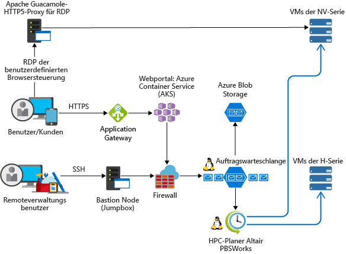

<!-- markdownlint-disable MD033 -->
<!-- markdownlint-disable MD026 -->

# High Performance Computing (HPC) in Azure

## Einführung in HPC

<!-- markdownlint-disable MD034 -->

> [!VIDEO https://www.youtube.com/embed/rKURT32faJk]

<!-- markdownlint-enable MD034 -->

High Performance Computing (HPC) wird auch „Big Compute“ genannt und nutzt zahlreiche CPU- oder GPU-basierte Computer, um komplexe mathematische Aufgaben zu lösen.

HPC wird in vielen Branchen zur Lösung besonders anspruchsvoller Aufgabenstellungen eingesetzt.  Beispiele für Workloads wären etwa:

- Genomics
- Simulationen für Öl- und Gasunternehmen
- Finanzen
- Halbleiterdesign
- Entwicklung
- Wettermodelle

### Was zeichnet HPC in der Cloud aus?

Einer der Hauptunterschiede zwischen einem lokalen HPC-System und einem HPC-System in der Cloud besteht darin, dass Ressourcen dynamisch nach Bedarf hinzugefügt und entfernt werden können.  Dank der dynamischen Skalierung ist die Computekapazität kein Engpass mehr, und Kunden können ihre Infrastruktur optimal auf die Anforderungen ihrer jeweiligen Aufgaben abstimmen.

Weitere Informationen zur dynamischen Skalierung finden Sie in den folgenden Artikeln:

- [Big Compute-Architekturstil](/azure/architecture/guide/architecture-styles/big-compute?context=/azure/architecture/topics/high-performance-computing/context/hpc-context)
- [Automatische Skalierung](/azure/architecture/best-practices/auto-scaling?context=/azure/architecture/topics/high-performance-computing/context/hpc-context)

## Checkliste für die Implementierung

Beschäftigen Sie sich zunächst mit folgenden Aspekten, bevor Sie Ihre eigene HPC-Lösung in Azure implementieren:

<!-- markdownlint-disable MD032 -->

> [!div class="checklist"]
> - Wählen Sie eine geeignete [Architektur](#infrastructure) für Ihre Anforderungen.
> - Informieren Sie sich darüber, welche [Computeoptionen](#compute) für Ihre Workload geeignet sind.
> - Ermitteln Sie die passende [Speicherlösung](#storage) für Ihre Anforderungen.
> - Entscheiden Sie, wie Sie alle Ihre Ressourcen [verwalten](#management) möchten.
> - Optimieren Sie Ihre [Anwendung](#hpc-applications) für die Cloud.
> - [Schützen](#security) Sie Ihre Infrastruktur.

<!-- markdownlint-enable MD032 -->

## Infrastruktur

Ein HPC-System basiert auf einer Reihe von Infrastrukturkomponenten.  Compute, Speicher und Netzwerk werden immer benötigt – ganz gleich, für welche HPC-Workloadverwaltung Sie sich entscheiden.

### HPC-Beispielarchitekturen

Für eine HPC-Architektur in Azure gibt es zahlreiche Gestaltungs- und Implementierungsmöglichkeiten.  HPC-Anwendungen können auf Tausende von Computekernen skaliert werden, lokale Cluster erweitern oder als vollständig cloudbasierte Lösung ausgeführt werden.

In den folgenden Szenarien werden einige gängige Ansätze für HPC-Lösungen beschrieben.

<ul class="columns is-multiline has-margin-left-none has-margin-bottom-none has-padding-top-medium">
    <li class="column is-one-third has-padding-top-small-mobile has-padding-bottom-small">
        <a class="is-undecorated is-full-height is-block"
            href="/azure/architecture/example-scenario/apps/hpc-saas?context=/azure/architecture/topics/high-performance-computing/context/hpc-context">
            <article class="card has-outline-hover is-relative is-fullheight">
                    <figure class="image has-margin-right-none has-margin-left-none has-margin-top-none has-margin-bottom-none">
                        
                    </figure>
                

                    

                        <h3 class="is-size-4 has-margin-top-none has-margin-bottom-none has-text-primary">CAE-Dienste (Computer-Aided Engineering; computergestützte Entwicklung) in Azure</h3>
                    

                    

                        
Stellen Sie eine SaaS-Plattform (Software-as-a-Service) für computergestützte Entwicklung (Computer-Aided Engineering) in Azure bereit.

                    

                

            </article>
        </a>
    </li>
    <li class="column is-one-third has-padding-top-small-mobile has-padding-bottom-small">
        <a class="is-undecorated is-full-height is-block"
            href="/azure/architecture/example-scenario/infrastructure/hpc-cfd?context=/azure/architecture/topics/high-performance-computing/context/hpc-context">
            <article class="card has-outline-hover is-relative is-fullheight">
                    <figure class="image has-margin-right-none has-margin-left-none has-margin-top-none has-margin-bottom-none">
                        
                    </figure>
                

                    

                        <h3 class="is-size-4 has-margin-top-none has-margin-bottom-none has-text-primary">CFD-Simulationen (Computational Fluid Dynamics; numerische Strömungsmechanik) in Azure</h3>
                    

                    

                        
Führen Sie Simulationen numerischer Strömungsmechaniken (Computational Fluid Dynamics, CFD) in Azure aus.

                    

                

            </article>
        </a>
    </li>
    <li class="column is-one-third has-padding-top-small-mobile has-padding-bottom-small">
        <a class="is-undecorated is-full-height is-block"
            href="/azure/architecture/example-scenario/infrastructure/video-rendering?context=/azure/architecture/topics/high-performance-computing/context/hpc-context">
            <article class="card has-outline-hover is-relative is-fullheight">
                    <figure class="image has-margin-right-none has-margin-left-none has-margin-top-none has-margin-bottom-none">
                        
                    </figure>
                

                    

                        <h3 class="is-size-4 has-margin-top-none has-margin-bottom-none has-text-primary">3D-Videorendering in Azure</h3>
                    

                    

                        
Ausführen nativer HPC-Workloads in Azure mithilfe des Azure Batch-Diensts

                    

                

            </article>
        </a>
    </li>
</ul>

### Compute

Azure bietet eine Reihe von Größen, die sowohl für CPU- als auch für GPU-intensive Workloads optimiert sind.

#### CPU-basierte virtuelle Computer

- [Virtuelle Linux-Computer](/azure/virtual-machines/linux/sizes-hpc?context=/azure/architecture/topics/high-performance-computing/context/hpc-context)
- [Virtuelle Windows-Computer](/azure/virtual-machines/windows/sizes-hpc?context=/azure/architecture/topics/high-performance-computing/context/hpc-context)
  
#### GPU-fähige virtuelle Computer

Virtuelle Computer der N-Serie verfügen über NVIDIA-GPUs für rechen- oder grafikintensive Anwendungen wie KI-Lernen und Visualisierung.

- [Virtuelle Linux-Computer](/azure/virtual-machines/linux/sizes-gpu?context=/azure/architecture/topics/high-performance-computing/context/hpc-context)
- [Virtuelle Windows-Computer](/azure/virtual-machines/windows/sizes-gpu?context=/azure/architecture/topics/high-performance-computing/context/hpc-context)

### Storage

Herkömmliche Clouddateisysteme sind den Anforderungen, die umfangreiche Batch- und HPC-Workloads in puncto Datenspeicherung und -zugriff haben, nicht gewachsen.  Es gibt eine Reihe von Lösungen, um den Geschwindigkeits- und Kapazitätsbedarf von HPC-Anwendungen in Azure zu verwalten.

- [Avere vFXT](https://azure.microsoft.com/services/storage/avere-vfxt/) zur schnelleren und zugänglicheren Datenspeicherung für High Performance Computing im Edgebereich
- [BeeGFS](https://azure.microsoft.com/resources/implement-glusterfs-on-azure/)
- [Speicheroptimierte virtuelle Computer](/azure/virtual-machines/windows/sizes-storage?context=/azure/architecture/topics/high-performance-computing/context/hpc-context)
- [Blob, Table und Queue Storage](/azure/storage/storage-introduction?context=/azure/architecture/topics/high-performance-computing/context/hpc-context)
- [Azure-SMB-Dateispeicher](/azure/storage/files/storage-files-introduction?context=/azure/architecture/topics/high-performance-computing/context/hpc-context)
- [Intel Cloud Edition Lustre](https://azuremarketplace.microsoft.com/marketplace/apps/intel.intel-cloud-edition-gs)

Weitere Informationen sowie einen Vergleich von Lustre, GlusterFS und BeeGFS in Azure finden Sie im E-Book [Parallel Files Systems on Azure](https://blogs.msdn.microsoft.com/azurecat/2018/06/11/azurecat-ebook-parallel-virtual-file-systems-on-microsoft-azure/) (Parallele Dateisysteme in Azure).

### Netzwerk

Virtuelle Computer vom Typ „H16r“, „H16mr“, „A8“ und „A9“ können beispielsweise eine Verbindung mit einem Back-End-RDMA-Netzwerk mit hohem Durchsatz herstellen. Dieses Netzwerk kann die Leistung eng gekoppelter paralleler Anwendungen unter Microsoft MPI oder Intel MPI verbessern.

- [RDMA-fähige Instanzen](/azure/virtual-machines/windows/sizes-hpc?context=/azure/architecture/topics/high-performance-computing/context/hpc-context#rdma-capable-instances)
- [Virtual Network](/azure/virtual-network/virtual-networks-overview?context=/azure/architecture/topics/high-performance-computing/context/hpc-context)
- [ExpressRoute](/azure/expressroute/expressroute-introduction?context=/azure/architecture/topics/high-performance-computing/context/hpc-context)

## Verwaltung

### Eigenständig

Ein von Grund auf neu erstelltes HPC-System in Azure bietet zwar ein hohes Maß an Flexibilität, ist aber häufig sehr wartungsintensiv.  

1. Richten Sie auf virtuellen Azure-Computern oder in [VM-Skalierungsgruppen](/azure/virtual-machine-scale-sets/overview?context=/azure/architecture/topics/high-performance-computing/context/hpc-context) Ihre eigene Clusterumgebung ein.
2. Verwenden Sie Azure Resource Manager-Vorlagen, um führende [Workload-Manager](#workload-managers), Infrastruktur und [Anwendungen](#hpc-applications) bereitzustellen.
3. Wählen Sie [HPC- und GPU-VM-Größen](#compute) aus, die spezielle Hardware und Netzwerkverbindungen für MPI- oder GPU-Workloads enthalten.
4. Fügen Sie [Hochleistungsspeicher](#storage) für Workloads mit hoher E/A-Intensität hinzu.

### Hybridlösung und Cloudbursting

Falls Sie bereits über ein lokales HPC-System verfügen, das Sie mit Azure verknüpfen möchten, steht Ihnen eine Reihe von Ressourcen zur Verfügung, die Sie bei den ersten Schritten unterstützen.

Lesen Sie zunächst den Artikel [Auswählen einer Lösung zum Herstellen einer Verbindung zwischen einem lokalen Netzwerk und Azure](/azure/architecture/reference-architectures/hybrid-networking/?context=/azure/architecture/topics/high-performance-computing/context/hpc-context) in der Dokumentation.  Anschließend können Sie sich mit den folgenden Konnektivitätsoptionen beschäftigen:

<ul class="columns is-multiline has-margin-left-none has-margin-bottom-none has-padding-top-medium">
    <li class="column is-one-third has-padding-top-small-mobile has-padding-bottom-small">
        <a class="is-undecorated is-full-height is-block"
            href="/azure/architecture/reference-architectures/hybrid-networking/vpn?context=/azure/architecture/topics/high-performance-computing/context/hpc-context">
            <article class="card has-outline-hover is-relative is-fullheight">
                    <figure class="image has-margin-right-none has-margin-left-none has-margin-top-none has-margin-bottom-none">
                        
                    </figure>
                

                    

                        <h3 class="is-size-4 has-margin-top-none has-margin-bottom-none has-text-primary">Verbinden eines lokalen Netzwerks mit Azure über ein VPN-Gateway</h3>
                    

                    

                        
Diese Referenzarchitektur zeigt, wie Sie ein lokales Netzwerk auf Azure ausdehnen, indem Sie ein VPN (virtuelles privates Netzwerk) zwischen Standorten verwenden.

                    

                

            </article>
        </a>
    </li>
    <li class="column is-one-third has-padding-top-small-mobile has-padding-bottom-small">
        <a class="is-undecorated is-full-height is-block"
            href="/azure/architecture/reference-architectures/hybrid-networking/expressroute?context=/azure/architecture/topics/high-performance-computing/context/hpc-context">
            <article class="card has-outline-hover is-relative is-fullheight">
                    <figure class="image has-margin-right-none has-margin-left-none has-margin-top-none has-margin-bottom-none">
                        
                    </figure>
                

                    

                        <h3 class="is-size-4 has-margin-top-none has-margin-bottom-none has-text-primary">Verbinden eines lokalen Netzwerks mit Azure über ExpressRoute</h3>
                    

                    

                        
ExpressRoute-Verbindungen nutzen eine dedizierte private Verbindung über einen Drittanbieter für die Konnektivität. Die private Verbindung erweitert Ihr lokales Netzwerk auf Azure.

                    

                

            </article>
        </a>
    </li>
    <li class="column is-one-third has-padding-top-small-mobile has-padding-bottom-small">
        <a class="is-undecorated is-full-height is-block"
            href="/azure/architecture/reference-architectures/hybrid-networking/expressroute-vpn-failover?context=/azure/architecture/topics/high-performance-computing/context/hpc-context">
            <article class="card has-outline-hover is-relative is-fullheight">
                    <figure class="image has-margin-right-none has-margin-left-none has-margin-top-none has-margin-bottom-none">
                        
                    </figure>
                

                    

                        <h3 class="is-size-4 has-margin-top-none has-margin-bottom-none has-text-primary">Verbinden eines lokalen Netzwerks mit Azure unter Verwendung von ExpressRoute mit VPN-Failover</h3>
                    

                    

                        
Implementieren Sie eine hochverfügbare und sichere Site-to-Site-Netzwerkarchitektur, die ein virtuelles Azure-Netzwerk und ein lokales Netzwerk mit ExpressRoute-Verbindung und VPN-Gatewayfailover umfasst.

                    

                

            </article>
        </a>
    </li>
</ul>

Nachdem Sie eine zuverlässige Netzwerkverbindung hergestellt haben, können Sie mit den Burstfunktionen Ihres bereits vorhandenen [Workload-Managers](#workload-managers) mit der bedarfsabhängigen Nutzung von Cloud Computing-Ressourcen beginnen.

### Marketplace-Lösungen

Im [Azure Marketplace](https://azuremarketplace.microsoft.com/marketplace/) wird eine Reihe von Workload-Managern angeboten.

- [CentOS-basiertes HPC von RogueWave](https://azuremarketplace.microsoft.com/marketplace/apps/RogueWave.CentOSbased73HPC?tab=Overview)
- [SUSE Linux Enterprise Server für HPC](https://azure.microsoft.com/marketplace/partners/suse/suselinuxenterpriseserver12optimizedforhighperformancecompute/)
- [TIBCO Grid Server Engine](https://azuremarketplace.microsoft.com/marketplace/apps/tibco-software.gridserverlinuxengine?tab=Overview)
- [Virtueller Computer für Data Science für Linux und Windows](/azure/machine-learning/data-science-virtual-machine/overview?context=/azure/architecture/topics/high-performance-computing/context/hpc-context)
- [D3View](https://azuremarketplace.microsoft.com/marketplace/apps/xfinityinc.d3view-v5?tab=Overview)
- [UberCloud](https://azure.microsoft.com/search/marketplace/?q=ubercloud)

### Azure Batch

Bei [Azure Batch](/azure/batch/batch-technical-overview?context=/azure/architecture/topics/high-performance-computing/context/hpc-context) handelt es sich um eine Plattform zur Ausführung umfangreicher paralleler und leistungsstarker Anwendungen (High Performance Computing, HPC) in der Cloud. Azure Batch plant die Ausführung rechenintensiver Aufgaben mit einem verwalteten Pool virtueller Computer und kann Computeressourcen automatisch skalieren, um den Anforderungen Ihrer Aufträge gerecht zu werden.

SaaS-Anbieter oder Entwickler können die Batch-SDKs und -Tools verwenden, um HPC-Anwendungen oder Containerworkloads in Azure zu integrieren, Daten in Azure bereitzustellen und Pipelines für die Auftragsausführung zu erstellen.

### Azure CycleCloud

[Azure CycleCloud](/azure/cyclecloud/?context=/azure/architecture/topics/high-performance-computing/context/hpc-context) ist die einfachste Möglichkeit, HPC-Workloads mit einem beliebigen Planer (etwa Slurm, Grid Engine, HPC Pack, HTCondor, LSF, PBS Pro oder Symphony) in Azure zu verwalten.

CycleCloud ermöglicht Folgendes:

- Stellen Sie vollständige Cluster und andere Ressourcen bereit (einschließlich Planer, Compute-VMs, Speicher, Netzwerk und Cache).
- Orchestrieren Sie Workflows für Aufträge, Daten und die Cloud.
- Geben Sie Administratoren die vollständige Kontrolle darüber, wer wann und zu welchem Preis Aufträge ausführen darf.
- Nutzen Sie erweiterte Richtlinien- und Governancefeatures (einschließlich Kostenkontrolle, Active Directory-Integration, Überwachung und Berichterstellung), um Cluster anzupassen und zu optimieren.
- Verwenden Sie Ihren aktuellen Aufgabenplaner und Ihre vertrauten Anwendungen, ohne diese anpassen zu müssen.
- Profitieren Sie von der integrierten automatischen Skalierung sowie von bewährten Referenzarchitekturen für unterschiedlichste HPC-Workloads und Branchen.

### Workload-Manager

Unten sind Beispiele für Cluster- und Workload-Manager angegeben, die in der Azure-Infrastruktur ausgeführt werden können. Erstellen Sie eigenständige Cluster auf Azure-VMs, oder führen Sie aus einem lokalen Cluster einen Burst-Vorgang auf Azure-VMs durch.

- [Alces Flight Compute](https://azuremarketplace.microsoft.com/marketplace/apps/alces-flight-limited.alces-flight-compute-solo?tab=Overview)
- [TIBCO DataSynapse GridServer](https://azure.microsoft.com/blog/tibco-datasynapse-comes-to-the-azure-marketplace/)
- [Bright Cluster Manager](http://www.brightcomputing.com/technology-partners/microsoft)
- [IBM Spectrum Symphony und Symphony LSF](https://azure.microsoft.com/blog/ibm-and-microsoft-azure-support-spectrum-symphony-and-spectrum-lsf/)
- [PBS Pro](http://pbspro.org)
- [Altair](http://www.altair.com/)
- [Rescale](https://www.rescale.com/azure/)
- [Microsoft HPC Pack](https://technet.microsoft.com/library/mt744885.aspx)
  - [HPC Pack für Windows](/azure/virtual-machines/windows/hpcpack-cluster-options?context=/azure/architecture/topics/high-performance-computing/context/hpc-context)
  - [HPC Pack für Linux](/azure/virtual-machines/linux/hpcpack-cluster-options?context=/azure/architecture/topics/high-performance-computing/context/hpc-context)

#### Container

Einige HPC-Workloads können auch mithilfe von Containern verwaltet werden.  Mit Diensten wie Azure Kubernetes Service (AKS) können Sie ganz einfach einen verwalteten Kubernetes-Cluster in Azure bereitstellen.

- [Azure Kubernetes Service (AKS)](/azure/aks/intro-kubernetes?context=/azure/architecture/topics/high-performance-computing/context/hpc-context)
- [Containerregistrierung](/azure/container-registry/container-registry-intro?context=/azure/architecture/topics/high-performance-computing/context/hpc-context)

## Kostenverwaltung

Für die Verwaltung Ihrer HPC-Kosten in Azure gibt es mehrere Möglichkeiten.  Ermitteln Sie anhand der [Azure-Kaufoptionen](https://azure.microsoft.com/pricing/purchase-options/) die Methode, die am besten für Ihre Organisation geeignet ist.

Mithilfe von [VMs mit niedriger Priorität](/azure/virtual-machine-scale-sets/virtual-machine-scale-sets-use-low-priority?context=/azure/architecture/topics/high-performance-computing/context/hpc-context) können Sie unsere ungenutzte Kapazität mit signifikanten Kosteneinsparungen nutzen.

## Sicherheit

Eine Übersicht über bewährte Sicherheitsmethoden in Azure finden Sie in der [Dokumentation zur Azure-Sicherheit](/azure/security/azure-security?context=/azure/architecture/topics/high-performance-computing/context/hpc-context).  

Neben den im [Cloudbursting-Abschnitt](#hybrid-and-cloud-bursting) verfügbaren Netzwerkkonfigurationen können Sie bei Bedarf auch eine Hub-Spoke-Konfiguration implementieren, um Ihre Computeressourcen zu isolieren:

<ul class="columns is-multiline has-margin-left-none has-margin-bottom-none has-padding-top-medium">
    <li class="column is-one-third has-padding-top-small-mobile has-padding-bottom-small">
        <a class="is-undecorated is-full-height is-block"
            href="/azure/architecture/reference-architectures/hybrid-networking/hub-spoke?context=/azure/architecture/topics/high-performance-computing/context/hpc-context">
            <article class="card has-outline-hover is-relative is-fullheight">
                    <figure class="image has-margin-right-none has-margin-left-none has-margin-top-none has-margin-bottom-none">
                        
                    </figure>
                

                    

                        <h3 class="is-size-4 has-margin-top-none has-margin-bottom-none has-text-primary">Implementieren einer Hub-Spoke-Netzwerktopologie in Azure</h3>
                    

                    

                        
Bei einem Hub handelt es sich um ein virtuelles Netzwerk (VNET) in Azure, das als zentraler Konnektivitätspunkt für Ihr lokales Netzwerk fungiert. Bei Speichen handelt es sich um VNETs, die eine Peerverbindung mit dem Hub herstellen und zur Isolierung von Workloads verwendet werden können.

                    

                

            </article>
        </a>
    </li>
    <li class="column is-one-third has-padding-top-small-mobile has-padding-bottom-small">
        <a class="is-undecorated is-full-height is-block"
            href="/azure/architecture/reference-architectures/hybrid-networking/shared-services?context=/azure/architecture/topics/high-performance-computing/context/hpc-context">
            <article class="card has-outline-hover is-relative is-fullheight">
                    <figure class="image has-margin-right-none has-margin-left-none has-margin-top-none has-margin-bottom-none">
                        
                    </figure>
                

                    

                        <h3 class="is-size-4 has-margin-top-none has-margin-bottom-none has-text-primary">Implementieren einer Hub-Spoke-Netzwerktopologie mit gemeinsamen Diensten in Azure</h3>
                    

                    

                        
Diese Referenzarchitektur basiert auf der Hub-Spoke-Referenzarchitektur, um gemeinsame Dienste in den Hub einzubinden, die von allen Spokes genutzt werden können.

                    

                

            </article>
        </a>
    </li>
</ul>

## HPC-Anwendungen

Führen Sie benutzerdefinierte oder kommerzielle HPC-Anwendungen in Azure aus. Für mehrere Beispiele in diesem Abschnitt wurden Benchmarks erstellt, um eine effiziente Skalierung mit zusätzlichen virtuellen Computern oder Computekernen zu ermöglichen. Besuchen Sie den [Azure Marketplace](https://azuremarketplace.microsoft.com/marketplace), um auf Lösungen zuzugreifen, die sofort bereitgestellt werden können.

> [!NOTE]
> Informieren Sie sich bei Verwendung kommerzieller Anwendungen beim jeweiligen Hersteller über lizenzbedingte oder anderweitige Einschränkungen für die Ausführung in der Cloud. Nicht alle Hersteller bieten ein nutzungsbasiertes Lizenzmodell an. Unter Umständen benötigen Sie für Ihre Lösung einen Lizenzserver in der Cloud oder eine Verbindung mit einem lokalen Lizenzserver.

### Technische Anwendungen

- [Altair RADIOSS](https://azure.microsoft.com/blog/availability-of-altair-radioss-rdma-on-microsoft-azure/)
- [ANSYS CFD](https://azure.microsoft.com/blog/ansys-cfd-and-microsoft-azure-perform-the-best-hpc-scalability-in-the-cloud/)
- [MATLAB Distributed Computing Server](/azure/virtual-machines/windows/matlab-mdcs-cluster?context=/azure/architecture/topics/high-performance-computing/context/hpc-context)
- [StarCCM+](https://blogs.msdn.microsoft.com/azurecat/2017/07/07/run-star-ccm-in-an-azure-hpc-cluster/)
- [OpenFOAM](https://simulation.azure.com/casestudies/Team-182-ABB-UC-Final.pdf)

### Grafik und Rendering

- [Autodesk Maya, 3ds Max und Arnold](/azure/batch/batch-rendering-service?context=/azure/architecture/topics/high-performance-computing/context/hpc-context) unter Azure Batch

### KI und Deep Learning

- [Microsoft Cognitive Toolkit](/cognitive-toolkit/cntk-on-azure)
- [Virtueller Deep Learning-Computer](https://azuremarketplace.microsoft.com/marketplace/apps/microsoft-ads.dsvm-deep-learning)
- [Batch Shipyard-Rezepte für Deep Learning](https://github.com/Azure/batch-shipyard/tree/master/recipes#deeplearning)

### MPI-Anbieter

- [Microsoft MPI](/message-passing-interface/microsoft-mpi)

## Remotevisualisierung

<ul class="columns is-multiline has-margin-left-none has-margin-bottom-none has-padding-top-medium">
    <li class="column is-one-third has-padding-top-small-mobile has-padding-bottom-small">
        <a class="is-undecorated is-full-height is-block"
            href="/azure/architecture/example-scenario/infrastructure/linux-vdi-citrix?context=/azure/architecture/topics/high-performance-computing/context/hpc-context">
            <article class="card has-outline-hover is-relative is-fullheight">
                    <figure class="image has-margin-right-none has-margin-left-none has-margin-top-none has-margin-bottom-none">
                        
                    </figure>
                

                    

                        <h3 class="is-size-4 has-margin-top-none has-margin-bottom-none has-text-primary">Virtuelle Linux-Desktops mit Citrix</h3>
                    

                    

                        
Erstellen Sie mithilfe von Citrix eine VDI-Umgebung für Linux-Desktops in Azure.

                    

                

            </article>
        </a>
    </li>
</ul>

## Leistungsbenchmarks

- [Compute-Benchmarkergebnisse](/azure/virtual-machines/windows/compute-benchmark-scores?context=/azure/architecture/topics/high-performance-computing/context/hpc-context)

## Kundenstimmen

Azure wird bereits von zahlreichen Kunden mit großem Erfolg für HPC-Workloads genutzt.  Im Anschluss finden Sie einige Kundenreferenzen:

- [ANEO](https://customers.microsoft.com/story/it-provider-finds-highly-scalable-cloud-based-hpc-redu)
- [AXA Global P&amp;C](https://customers.microsoft.com/story/axa-global-p-and-c)
- [Axioma](https://customers.microsoft.com/story/axioma-delivers-fintechs-first-born-in-the-cloud-multi-asset-class-enterprise-risk-solution)
- [d3View](https://customers.microsoft.com/story/big-data-solution-provider-adopts-new-cloud-gains-thou)
- [EFS](https://customers.microsoft.com/story/efs-professionalservices-azure)
- [Hymans Robertson](https://customers.microsoft.com/story/hymans-robertson)
- [MetLife](https://enterprise.microsoft.com/customer-story/industries/insurance/metlife/)
- [Microsoft Research](https://customers.microsoft.com/doclink/fast-lmm-and-windows-azure-put-genetics-research-on-fa)
- [Milliman](https://customers.microsoft.com/story/actuarial-firm-works-to-transform-insurance-industry-w)
- [Mitsubishi UFJ Securities International](https://customers.microsoft.com/story/powering-risk-compute-grids-in-the-cloud)
- [NeuroInitiative](https://customers.microsoft.com/story/neuroinitiative-health-provider-azure)
- [Schlumberger](https://azure.microsoft.com/blog/big-compute-for-large-engineering-simulations)
- [Towers Watson](https://customers.microsoft.com/story/insurance-tech-provider-delivers-disruptive-solutions)

## Weitere wichtige Informationen

- Achten Sie vor dem Ausführen umfangreicher Workloads darauf, dass Ihr [vCPU-Kontingent](/azure/virtual-machines/linux/quotas?context=/azure/architecture/topics/high-performance-computing/context/hpc-context) erhöht wurde.

## Nächste Schritte

Die neuesten Ankündigungen finden Sie hier:

- [Blog des HPC- und Batch-Teams von Microsoft](http://blogs.technet.com/b/windowshpc/)
- [Azure-Blog](https://azure.microsoft.com/blog/tag/hpc/)

### Microsoft Batch-Beispiele

Die folgenden Tutorials enthalten ausführliche Informationen zum Ausführen von Anwendungen in Microsoft-Batch:

- [Erste Schritte beim Entwickeln mit Batch](/azure/batch/quick-run-dotnet?context=/azure/architecture/topics/high-performance-computing/context/hpc-context)
- [Verwenden von Codebeispielen für Azure Batch](https://github.com/Azure/azure-batch-samples)
- [Verwenden von VMs mit niedriger Priorität mit Batch](/azure/batch/batch-low-pri-vms?context=/azure/architecture/topics/high-performance-computing/context/hpc-context)
- [Ausführen von HPC-Workloads in Containern mit Batch Shipyard](https://github.com/Azure/batch-shipyard)
- [Ausführen gleichzeitiger R-Workloads in Batch](https://github.com/Azure/doAzureParallel)
- [Ausführen bedarfsorientierter Spark-Aufträge in Batch](https://github.com/Azure/aztk)
- [Verwenden rechenintensiver virtueller Computer in Batch-Pools](/azure/batch/batch-pool-compute-intensive-sizes?context=/azure/architecture/topics/high-performance-computing/context/hpc-context)